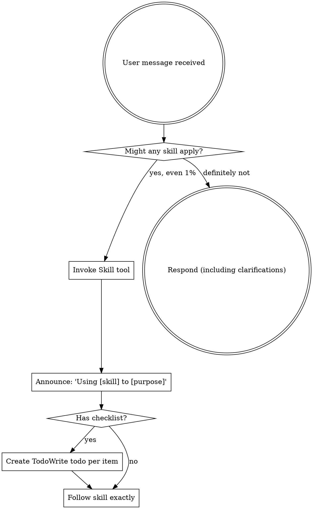
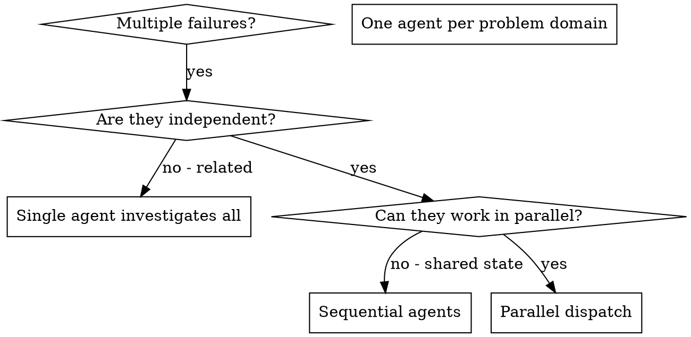
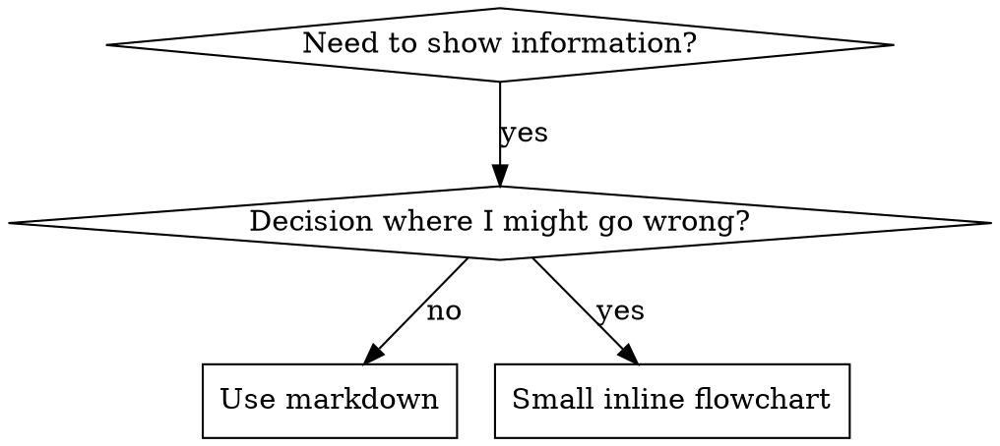

# bestest — User Decisions & Design Inputs

## Session 1: Initial Design Session

### [INPUT] Message 1
I want to make an agentic skill that is state of art and enterprise grade. The idea is to make a skill for testing. It should be initializable in any repo, it should have memory, state, context, use best harness engineering, pre hooks, post hooks, scripts, references, etc everything. The idea is to establish, maintain and expand a complete testing architecture for any repo of any size with full accuracy. The skill should have nice well thought commands apart from these. 
Use /using-superpowers and /dispatching-parallel-agents and do as much deep research web research and question me as much as you want untill you get the full clarity and create a full architecture of this agentic skill. 
Ground everything with proper web research

---

### [INPUT] Message 3
Base directory for this skill: /Users/prajwalmishra/.claude/skills/using-superpowers

<EXTREMELY-IMPORTANT>
If you think there is even a 1% chance a skill might apply to what you are doing, you ABSOLUTELY MUST invoke the skill.

IF A SKILL APPLIES TO YOUR TASK, YOU DO NOT HAVE A CHOICE. YOU MUST USE IT.

This is not negotiable. This is not optional. You cannot rationalize your way out of this.
</EXTREMELY-IMPORTANT>

## How to Access Skills

**In Claude Code:** Use the `Skill` tool. When you invoke a skill, its content is loaded and presented to you—follow it directly. Never use the Read tool on skill files.

**In other environments:** Check your platform's documentation for how skills are loaded.

# Using Skills

## The Rule

**Invoke relevant or requested skills BEFORE any response or action.** Even a 1% chance a skill might apply means that you should invoke the skill to check. If an invoked skill turns out to be wrong for the situation, you don't need to use it.



## Red Flags

These thoughts mean STOP—you're rationalizing:

| Thought | Reality |
|---------|---------|
| "This is just a simple question" | Questions are tasks. Check for skills. |
| "I need more context first" | Skill check comes BEFORE clarifying questions. |
| "Let me explore the codebase first" | Skills tell you HOW to explore. Check first. |
| "I can check git/files quickly" | Files lack conversation context. Check for skills. |
| "Let me gather information first" | Skills tell you HOW to gather information. |
| "This doesn't need a formal skill" | If a skill exists, use it. |
| "I remember this skill" | Skills evolve. Read current version. |
| "This doesn't count as a task" | Action = task. Check for skills. |
| "The skill is overkill" | Simple things become complex. Use it. |
| "I'll just do this one thing first" | Check BEFORE doing anything. |
| "This feels productive" | Undisciplined action wastes time. Skills prevent this. |
| "I know what that means" | Knowing the concept ≠ using the skill. Invoke it. |

## Skill Priority

When multiple skills could apply, use this order:

1. **Process skills first** (brainstorming, debugging) - these determine HOW to approach the task
2. **Implementation skills second** (frontend-design, mcp-builder) - these guide execution

"Let's build X" → brainstorming first, then implementation skills.
"Fix this bug" → debugging first, then domain-specific skills.

## Skill Types

**Rigid** (TDD, debugging): Follow exactly. Don't adapt away discipline.

**Flexible** (patterns): Adapt principles to context.

The skill itself tells you which.

## User Instructions

Instructions say WHAT, not HOW. "Add X" or "Fix Y" doesn't mean skip workflows.


---

### [INPUT] Message 5
Base directory for this skill: /Users/prajwalmishra/.claude/skills/dispatching-parallel-agents

# Dispatching Parallel Agents

## Overview

When you have multiple unrelated failures (different test files, different subsystems, different bugs), investigating them sequentially wastes time. Each investigation is independent and can happen in parallel.

**Core principle:** Dispatch one agent per independent problem domain. Let them work concurrently.

## When to Use



**Use when:**
- 3+ test files failing with different root causes
- Multiple subsystems broken independently
- Each problem can be understood without context from others
- No shared state between investigations

**Don't use when:**
- Failures are related (fix one might fix others)
- Need to understand full system state
- Agents would interfere with each other

## The Pattern

### 1. Identify Independent Domains

Group failures by what's broken:
- File A tests: Tool approval flow
- File B tests: Batch completion behavior
- File C tests: Abort functionality

Each domain is independent - fixing tool approval doesn't affect abort tests.

### 2. Create Focused Agent Tasks

Each agent gets:
- **Specific scope:** One test file or subsystem
- **Clear goal:** Make these tests pass
- **Constraints:** Don't change other code
- **Expected output:** Summary of what you found and fixed

### 3. Dispatch in Parallel

```typescript
// In Claude Code / AI environment
Task("Fix agent-tool-abort.test.ts failures")
Task("Fix batch-completion-behavior.test.ts failures")
Task("Fix tool-approval-race-conditions.test.ts failures")
// All three run concurrently
```

### 4. Review and Integrate

When agents return:
- Read each summary
- Verify fixes don't conflict
- Run full test suite
- Integrate all changes

## Agent Prompt Structure

Good agent prompts are:
1. **Focused** - One clear problem domain
2. **Self-contained** - All context needed to understand the problem
3. **Specific about output** - What should the agent return?

```markdown
Fix the 3 failing tests in src/agents/agent-tool-abort.test.ts:

1. "should abort tool with partial output capture" - expects 'interrupted at' in message
2. "should handle mixed completed and aborted tools" - fast tool aborted instead of completed
3. "should properly track pendingToolCount" - expects 3 results but gets 0

These are timing/race condition issues. Your task:

1. Read the test file and understand what each test verifies
2. Identify root cause - timing issues or actual bugs?
3. Fix by:
   - Replacing arbitrary timeouts with event-based waiting
   - Fixing bugs in abort implementation if found
   - Adjusting test expectations if testing changed behavior

Do NOT just increase timeouts - find the real issue.

Return: Summary of what you found and what you fixed.
```

## Common Mistakes

**❌ Too broad:** "Fix all the tests" - agent gets lost
**✅ Specific:** "Fix agent-tool-abort.test.ts" - focused scope

**❌ No context:** "Fix the race condition" - agent doesn't know where
**✅ Context:** Paste the error messages and test names

**❌ No constraints:** Agent might refactor everything
**✅ Constraints:** "Do NOT change production code" or "Fix tests only"

**❌ Vague output:** "Fix it" - you don't know what changed
**✅ Specific:** "Return summary of root cause and changes"

## When NOT to Use

**Related failures:** Fixing one might fix others - investigate together first
**Need full context:** Understanding requires seeing entire system
**Exploratory debugging:** You don't know what's broken yet
**Shared state:** Agents would interfere (editing same files, using same resources)

## Real Example from Session

**Scenario:** 6 test failures across 3 files after major refactoring

**Failures:**
- agent-tool-abort.test.ts: 3 failures (timing issues)
- batch-completion-behavior.test.ts: 2 failures (tools not executing)
- tool-approval-race-conditions.test.ts: 1 failure (execution count = 0)

**Decision:** Independent domains - abort logic separate from batch completion separate from race conditions

**Dispatch:**
```
Agent 1 → Fix agent-tool-abort.test.ts
Agent 2 → Fix batch-completion-behavior.test.ts
Agent 3 → Fix tool-approval-race-conditions.test.ts
```

**Results:**
- Agent 1: Replaced timeouts with event-based waiting
- Agent 2: Fixed event structure bug (threadId in wrong place)
- Agent 3: Added wait for async tool execution to complete

**Integration:** All fixes independent, no conflicts, full suite green

**Time saved:** 3 problems solved in parallel vs sequentially

## Key Benefits

1. **Parallelization** - Multiple investigations happen simultaneously
2. **Focus** - Each agent has narrow scope, less context to track
3. **Independence** - Agents don't interfere with each other
4. **Speed** - 3 problems solved in time of 1

## Verification

After agents return:
1. **Review each summary** - Understand what changed
2. **Check for conflicts** - Did agents edit same code?
3. **Run full suite** - Verify all fixes work together
4. **Spot check** - Agents can make systematic errors

## Real-World Impact

From debugging session (2025-10-03):
- 6 failures across 3 files
- 3 agents dispatched in parallel
- All investigations completed concurrently
- All fixes integrated successfully
- Zero conflicts between agent changes


---

### [INPUT] Message 7
Base directory for this skill: /Users/prajwalmishra/.claude/skills/brainstorming

# Brainstorming Ideas Into Designs

## Overview

Help turn ideas into fully formed designs and specs through natural collaborative dialogue.

Start by understanding the current project context, then ask questions one at a time to refine the idea. Once you understand what you're building, present the design in small sections (200-300 words), checking after each section whether it looks right so far.

## The Process

**Understanding the idea:**
- Check out the current project state first (files, docs, recent commits)
- Ask questions one at a time to refine the idea
- Prefer multiple choice questions when possible, but open-ended is fine too
- Only one question per message - if a topic needs more exploration, break it into multiple questions
- Focus on understanding: purpose, constraints, success criteria

**Exploring approaches:**
- Propose 2-3 different approaches with trade-offs
- Present options conversationally with your recommendation and reasoning
- Lead with your recommended option and explain why

**Presenting the design:**
- Once you believe you understand what you're building, present the design
- Break it into sections of 200-300 words
- Ask after each section whether it looks right so far
- Cover: architecture, components, data flow, error handling, testing
- Be ready to go back and clarify if something doesn't make sense

## After the Design

**Documentation:**
- Write the validated design to `docs/plans/YYYY-MM-DD-<topic>-design.md`
- Use elements-of-style:writing-clearly-and-concisely skill if available
- Commit the design document to git

**Implementation (if continuing):**
- Ask: "Ready to set up for implementation?"
- Use superpowers:using-git-worktrees to create isolated workspace
- Use superpowers:writing-plans to create detailed implementation plan

## Key Principles

- **One question at a time** - Don't overwhelm with multiple questions
- **Multiple choice preferred** - Easier to answer than open-ended when possible
- **YAGNI ruthlessly** - Remove unnecessary features from all designs
- **Explore alternatives** - Always propose 2-3 approaches before settling
- **Incremental validation** - Present design in sections, validate each
- **Be flexible** - Go back and clarify when something doesn't make sense


---

### [INPUT] Message 8
Based on my thorough exploration of the Claude Code skills ecosystem, here's my comprehensive analysis of skill creation patterns:

## Claude Code Skills Ecosystem Analysis

### 1. **test-driven-development** Skill
**File Structure:**
- `/Users/prajwalmishra/.claude/skills/test-driven-development/`
  - `SKILL.md` (9,867 bytes) - Main documentation
  - `testing-anti-patterns.md` (8,251 bytes) - Supporting reference

**Pattern:**
- **Iron Law:** "NO PRODUCTION CODE WITHOUT A FAILING TEST FIRST"
- **Structure:** RED-GREEN-REFACTOR cycle with explicit rules and anti-patterns
- **State Management:** Uses verification checklist with specific checkboxes
- **Hooks:** None visible, relies on strict documentation
- **References:** Links to testing anti-patterns guide

**Key Features:**
- Strict discipline enforcement with no exceptions
- Rationalization prevention table
- Red flags list that triggers restart
- Verbose test examples showing good vs bad practices

### 2. **writing-skills** Skill
**File Structure:**
- `/Users/prajwalmishra/.claude/skills/writing-skills/`
  - `SKILL.md` (22,463 bytes) - Main documentation
  - `anthropic-best-practices.md` (45,825 bytes) - Heavy reference
  - `persuasion-principles.md` - Supporting psychology
  - `testing-skills-with-subagents.md` - Testing methodology
  - `graphviz-conventions.dot` - Flowchart conventions
  - `render-graphs.js` - Graph visualization script
  - `examples/CLAUDE_MD_TESTING.md` - Testing scenarios

**Pattern:**
- **Iron Law:** "NO SKILL WITHOUT A FAILING TEST FIRST"
- **Structure:** TDD adapted to documentation creation
- **Claude Search Optimization (CSO):** Critical for discovery
- **State Management:** Subagent testing with pressure scenarios
- **Hooks:** Cross-references to other skills with REQUIRE markers
- **References:** Heavy reference files separated from main doc

**Key Features:**
- Description field optimized for triggering (not workflow summary)
- Token efficiency targets (<150-200 words for frequently-loaded skills)
- Pressure testing methodology with multiple test files
- Persuasion psychology integration

### 3. **systematic-debugging** Skill
**File Structure:**
- `/Users/prajwalmishra/.claude/skills/systematic-debugging/`
  - `SKILL.md` (9,884 bytes) - Main documentation
  - `root-cause-tracing.md` - Specific technique
  - `condition-based-waiting.md` - Specific technique
  - `defense-in-depth.md` - Specific technique
  - `condition-based-waiting-example.ts` - Working code example
  - `find-polluter.sh` - Utility script
  - Multiple test files (`test-pressure-*.md`, `test-academic.md`)

**Pattern:**
- **Iron Law:** "NO FIXES WITHOUT ROOT CAUSE INVESTIGATION FIRST"
- **Structure:** Four-phase process (Root Cause → Pattern → Hypothesis → Implementation)
- **State Management:** Test files for baseline behavior
- **Hooks:** None visible, strict process enforcement
- **References:** Supporting techniques as separate files

**Key Features:**
- Pressure testing reveals rationalizations
- Multiple failure handling (3+ failures = architectural review)
- Real-world impact metrics
- Supporting utility scripts and examples

### 4. **content-engine** (Orchestrator Skill)
**File Structure:**
- `/Users/prajwalmishra/.claude/skills/content-engine/`
  - `SKILL.md` (12,316 bytes) - Main orchestration logic
  - `lib/` - JavaScript utilities
    - `eod-insta-narrator.js`
    - `eod-insta-parser.sh`
  - `templates/` - HTML templates
    - `eod-insta-carousel.html.template`

**Pattern:**
- **Orchestration Hub:** Delegates to spoke skills
- **Argument-hint:** Command-line style arguments
- **allowed-tools:** Explicit tool permissions
- **State Management:** External config files and tracking
- **Hooks:** Two approval gates before proceeding
- **References:** Spoke skills with clear responsibilities

**Key Features:**
- Event burst mode handling
- Voice confidence levels (HIGH/MED/LOW)
- Multi-platform content generation
- Auto-chaining to sub-skills after approval
- NEVER list with explicit prohibitions

### 5. **verification-before-completion** Skill
**File Structure:**
- `/Users/prajwalmishra/.claude/skills/verification-before-completion/`
  - `SKILL.md` (4,201 bytes) - Main documentation

**Pattern:**
- **Iron Law:** "NO COMPLETION CLAIMS WITHOUT FRESH VERIFICATION EVIDENCE"
- **Structure:** Gate function with 5 mandatory steps
- **State Management:** Evidence required before claims
- **Hooks:** None visible, strict verification
- **References:** Table of what's required vs insufficient

**Key Features:**
- Verification checklist for different claim types
- Rationalization prevention table
- Red flags list
- Real-world impact from failures

### 6. **dispatching-parallel-agents** Skill
**File Structure:**
- `/Users/prajwalmishra/.claude/skills/dispatching-parallel-agents/`
  - `SKILL.md` (6,104 bytes) - Main documentation

**Pattern:**
- **Concurrency Pattern:** One agent per independent problem
- **Structure:** Clear conditions for when to use
- **State Management:** Task creation with focused scopes
- **Hooks:** None visible, pattern-based
- **References:** Flowchart for decision making

**Key Features:**
- Parallel task dispatch
- Focused agent prompts
- Conflict resolution after completion

## Common Patterns Across Skills

### 1. **File Structure Patterns**
```
skill-name/
├── SKILL.md              # Main documentation (required)
├── supporting-file.*     # Heavy reference or tools
├── lib/                  # Code utilities
├── templates/           # Reusable templates
├── test-*.md           # Pressure test scenarios
└── examples/           # Working examples
```

### 2. **Command/Sub-skill Patterns**
- **Simple Skills:** Single file with inline examples
- **Complex Skills:** Multiple files with clear separation
- **Orchestrators:** Delegate to spoke skills with clear responsibilities
- **Utility Skills:** Include working code examples

### 3. **State/Memory Management**
- **Baseline Testing:** Run scenarios without skill first
- **Pressure Testing:** Combine multiple pressures (time, sunk cost, authority)
- **Verification Checklists:** TodoWrite integration for tracking
- **External Config:** Read from config files for dynamic behavior

### 4. **Hook Configuration**
- **Cross-references:** Use skill names with REQUIRE markers
- **Never Lists:** Explicit prohibitions to close loopholes
- **Red Flags:** Lists that trigger restart/rethink
- **Gate Functions:** Step-by-step processes that can't be skipped

### 5. **Reference/Script Patterns**
- **Heavy Reference:** Separate files for >100 lines of API/docs
- **Working Examples:** Complete, runnable code (not templates)
- **Utility Scripts:** Shell/JavaScript helpers
- **Templates:** Reusable file structures

### 6. **Overall Architecture Patterns**

#### **Discipline-Enforcing Skills**
- Iron Law with no exceptions
- Rationalization prevention tables
- Red flags lists
- Pressure testing to find loopholes
- Imperative language ("MUST", "NEVER")

#### **Technique Skills**
- Step-by-step processes
- Before/after comparisons
- Working code examples
- Common mistakes sections

#### **Pattern Skills**
- Mental models and frameworks
- Recognition and application guidance
- When/not to use guidance

#### **Reference Skills**
- API documentation
- Command references
- Tool documentation

#### **Orchestrator Skills**
- Clear delegation model
- Argument parsing
- Multiple approval gates
- Auto-chaining to sub-skills
- External state management

### 7. **Creation Process (TDD for Skills)**
1. **RED:** Write failing test (baseline behavior)
2. **GREEN:** Write minimal skill addressing specific failures
3. **REFACTOR:** Close new loopholes, re-test
4. **Deploy:** Commit and verify before moving to next skill

### 8. **Key Success Factors**
- **Claude Search Optimization:** Description field critical for discovery
- **Token Efficiency:** Keep frequently-loaded skills under 200 words
- **Persuasion Psychology:** Use authority, commitment, scarcity principles
- **Loophole Prevention:** Address rationalizations explicitly
- **Real-World Impact:** Document actual results from usage

The skills ecosystem demonstrates a sophisticated approach to creating battle-tested documentation that anticipates and prevents common failures through strict processes, psychological principles, and thorough testing.

---

### [INPUT] Message 9
Let me try a few more URLs to fill in the Agent SDK docs gap.
The Agent SDK docs pages return 404 via web fetching (client-rendered app), but I have comprehensive data from Context7. Let me also try the GitHub repos directly for additional detail.
Now let me also try to get the Agent Skills documentation from the Anthropic docs site since it appeared in the navigation sidebar.
Now I have comprehensive data from all sources. Here is the full research report.

---

# Deep Research Report: Claude Code Skills and Agent Capabilities (2025-2026)

## 1. Claude Code Skills Architecture

### 1.1 What Skills Are

Skills are **model-invoked** modular capabilities. Unlike slash commands (which are user-invoked), Claude autonomously decides when to use a skill based on the user's request. Skills are stored as directories containing a required `SKILL.md` file plus optional supporting files.

**Three skill sources (loaded in this order):**
- **Personal skills**: `~/.claude/skills/` -- available across all projects
- **Project skills**: `.claude/skills/` in the project root -- shared with the team via version control
- **Plugin skills**: from installed plugins' `skills/` directories

### 1.2 SKILL.md Format

```yaml
---
name: your-skill-name          # lowercase, hyphens, max 64 chars
description: Brief description  # max 1024 chars -- Claude reads this to decide invocation
allowed-tools: Read, Grep, Glob # optional: restrict tool access when skill is active
---
# Skill content in Markdown

Instructions, examples, and guidance for Claude go here.
```

**Key design principles:**
- `name` must be lowercase with hyphens, max 64 characters
- `description` is what Claude reads to decide whether to invoke the skill (max 1024 characters)
- `allowed-tools` restricts Claude's tool access when the skill is active (optional)
- The Markdown body provides the full instructions and examples

### 1.3 Directory Structure

```
my-skill/
├── SKILL.md           # Required: frontmatter + instructions
├── reference.md       # Optional: detailed reference material
├── examples.md        # Optional: worked examples
├── scripts/
│   └── helper.py      # Optional: executable scripts Claude can run
└── templates/
    └── template.txt   # Optional: file templates
```

**Progressive disclosure**: Claude reads `SKILL.md` first and only accesses supporting files (reference.md, examples.md, scripts/) when needed for the specific task. This saves context window tokens.

### 1.4 Hooks System (Event-Driven Architecture)

Hooks are configured in `settings.json` under the `hooks` key, organized by event type:

```json
{
  "hooks": {
    "PreToolUse": [
      {
        "matcher": "Edit|Write",
        "hooks": [
          {
            "type": "command",
            "command": "python validate.py"
          }
        ]
      }
    ],
    "PostToolUse": [...],
    "Notification": [...]
  }
}
```

**Hook events:**
| Event | Purpose | Can Control? |
|-------|---------|-------------|
| `PreToolUse` | Before any tool execution | Yes: allow/deny/ask |
| `PostToolUse` | After tool execution | Yes: block with reason |
| `Notification` | Agent notifications | No |
| `UserPromptSubmit` | Before processing user input | Yes: block prompts |
| `Stop` / `SubagentStop` | Before agent stops | Yes: prevent stopping |
| `PreCompact` | Before context compaction | Yes: inject context |
| `SessionStart` | On session initialization | Yes: inject additionalContext |
| `SessionEnd` | On session termination | No |

**Hook command structure:**
```json
{
  "type": "command",
  "command": "bash-script-using-$CLAUDE_PROJECT_DIR",
  "timeout": 30
}
```

**Exit codes:** 0 = success (stdout shown to Claude), 2 = blocking error (stderr fed to Claude), other = non-blocking error.

**JSON output from hooks supports:** `decision` (allow/deny/ask/block), `reason`, `continue`, `stopReason`, `hookSpecificOutput.additionalContext` (for SessionStart/PreCompact).

**Matcher patterns:** Tool name patterns, case-sensitive. Supports regex like `Edit|Write` or `Notebook.*`. `*` matches all tools.

### 1.5 Memory System (Cross-Session State)

Four hierarchical levels:
1. **Enterprise policy** (org-wide, non-editable by user)
2. **Project** (`./CLAUDE.md` -- checked into VCS, shared with team)
3. **User** (`~/.claude/CLAUDE.md` -- personal, across all projects)
4. **Project local** (`./CLAUDE.local.md` -- deprecated in favor of `.claude/settings.local.json`)

**Import system:** `@path/to/import` syntax with max 5-hop recursion. Allows modular memory files.

**Quick shortcuts:** `#` to append a memory note, `/memory` to edit CLAUDE.md files.

### 1.6 Settings Hierarchy

Enterprise managed policies > CLI args > Local project (`.claude/settings.local.json`) > Shared project (`.claude/settings.json`) > User (`~/.claude/settings.json`).

**Key settings.json keys:** `apiKeyHelper`, `cleanupPeriodDays`, `env`, `hooks`, `permissions`, `model`, `statusLine`, and more. Permissions use `allow`, `ask`, `deny` arrays with tool-specific rules.

**Available tools in Claude Code:** Bash, Edit, Glob, Grep, MultiEdit, NotebookEdit, NotebookRead, Read, Task, TodoWrite, WebFetch, WebSearch, Write.

---

## 2. Claude Code Agent SDK

### 2.1 Overview

The Claude Agent SDK provides programmatic access to Claude Code's agentic capabilities. It spawns a Claude Code process as a subprocess and communicates via stdin/stdout. Available in both **Python** and **TypeScript**.

**Two primary interfaces:**
- **`query()`** -- Simple, stateless one-shot interactions (async iterator)
- **`ClaudeSDKClient`** -- Full bidirectional streaming for interactive, multi-turn conversations

### 2.2 Python SDK

**Installation:**
```bash
pip install claude-agent-sdk
```
Requires Python 3.10+. The Claude Code CLI is automatically bundled -- no separate installation needed.

**Simple query:**
```python
from claude_agent_sdk import query

async for message in query(prompt="What is 2 + 2?"):
    print(message)
```

**Interactive client with options:**
```python
from claude_agent_sdk import ClaudeSDKClient, ClaudeAgentOptions

options = ClaudeAgentOptions(
    allowed_tools=["Read", "Write", "Bash"],
    system_prompt="You are a senior software engineer.",
    max_budget_usd=1.0
)

async with ClaudeSDKClient(options=options) as client:
    await client.query("List files in the current directory")
    async for msg in client.receive_response():
        # Process AssistantMessage, ResultMessage, etc.
        pass
```

### 2.3 ClaudeAgentOptions -- Full Configuration

The `ClaudeAgentOptions` class exposes every configurable aspect:

| Category | Options |
|----------|---------|
| **Tools** | `tools`, `allowed_tools`, `disallowed_tools` |
| **Model** | `model`, `fallback_model` |
| **System prompt** | `system_prompt` (string, preset dict, or file path) |
| **Session** | `session_id`, `resume`, `fork_session`, `continue_conversation` |
| **Limits** | `max_turns`, `max_budget_usd`, `task_budget` |
| **Permissions** | `permission_mode` (default/acceptEdits/plan/bypassPermissions/dontAsk/auto), `can_use_tool` callback |
| **Thinking** | `thinking` (adaptive/enabled/disabled), `effort` (low/medium/high/max) |
| **MCP** | `mcp_servers` (both SDK in-process and external stdio servers) |
| **Hooks** | `hooks` (PreToolUse/PostToolUse with HookMatcher) |
| **Subagents** | `agents` dict of AgentDefinition |
| **Paths** | `cwd`, `add_dirs`, `cli_path`, `settings`, `setting_sources` |
| **Sandbox** | `sandbox` (SandboxSettings with enabled, autoAllowBashIfSandboxed, excludedCommands) |
| **Output** | `output_format` (JSON schema), `include_partial_messages`, `betas`, `enable_file_checkpointing` |

### 2.4 Custom Tools (In-Process SDK MCP Servers)

The SDK enables defining custom tools as Python functions that Claude can invoke -- running in the same process:

```python
from claude_agent_sdk import tool, create_sdk_mcp_server, ClaudeAgentOptions, ClaudeSDKClient

@tool("greet", "Greet a user", {"name": str})
async def greet_user(args):
    return {"content": [{"type": "text", "text": f"Hello, {args['name']}!"}]}

server = create_sdk_mcp_server(name="my-tools", version="1.0.0", tools=[greet_user])

options = ClaudeAgentOptions(
    mcp_servers={"tools": server},
    allowed_tools=["mcp__tools__greet"]
)
```

**Benefits over external MCP servers:** No subprocess management, no IPC overhead, single process deployment, easier debugging, type safety.

### 2.5 SDK Hooks (Python Functions)

Hooks in the SDK are Python functions invoked at specific points in the agent loop:

```python
async def check_bash_command(input_data, tool_use_id, context):
    command = input_data["tool_input"].get("command", "")
    if "dangerous.sh" in command:
        return {
            "hookSpecificOutput": {
                "hookEventName": "PreToolUse",
                "permissionDecision": "deny",
                "permissionDecisionReason": "Blocked dangerous command"
            }
        }
    return {}

options = ClaudeAgentOptions(
    hooks={
        "PreToolUse": [HookMatcher(matcher="Bash", hooks=[check_bash_command])]
    }
)
```

### 2.6 TypeScript SDK

The TypeScript SDK uses a `query()` function with similar options:

```typescript
import { query } from '@anthropic-ai/claude-agent-sdk';

const q = query({
    prompt: 'Create a hello.py file',
    options: {
        maxTurns: 30,
        cwd: process.cwd(),
        model: 'sonnet',
        allowedTools: ['Skill', 'WebSearch', 'Write', 'Read'],
        settingSources: ['project'],
        systemPrompt: 'You are a coding assistant.',
    },
});

for await (const msg of q) {
    if (msg.type === 'assistant' && msg.message) {
        // Process message blocks
    }
}
```

---

## 3. Advanced Skill Patterns

### 3.1 Subagents (Orchestrator Pattern)

Subagents are specialized AI assistants with separate context windows. They are the primary mechanism for orchestrator skills that dispatch work to specialized agents.

**Subagent file format** (stored as `.md` in `.claude/agents/` or plugin `agents/`):
```yaml
---
name: your-sub-agent-name
description: When this subagent should be invoked
tools: tool1, tool2, tool3    # Comma-separated tool list
model: sonnet                  # Model to use
permissionMode: default        # Permission handling
skills: skill1, skill2         # Skills available to this subagent
---
System prompt content for the subagent...
```

**Key constraints:**
- Subagents cannot spawn other subagents (prevents infinite nesting)
- Each subagent has its own context window
- Support resumable subagents via `agentId` and `resume` parameter
- Built-in subagents: General-purpose (Sonnet, all tools), Plan (Sonnet, read-only), Explore (Haiku, read-only)

### 3.2 Multi-Agent Orchestration (SDK Pattern)

The most powerful pattern demonstrated in the SDK demos is a lead agent that spawns specialized subagents:

```python
agents = {
    "researcher": AgentDefinition(
        description="Use this agent to gather research information.",
        tools=["WebSearch", "Write"],
        prompt="You are a research assistant. Search thoroughly and save findings.",
        model="haiku"
    ),
    "data-analyst": AgentDefinition(
        description="Use AFTER researchers complete to generate analysis.",
        tools=["Glob", "Read", "Bash", "Write"],
        prompt="Analyze research data, extract metrics, generate charts.",
        model="haiku"
    ),
    "report-writer": AgentDefinition(
        description="Creates formal PDF reports from research and analysis.",
        tools=["Skill", "Write", "Glob", "Read", "Bash"],
        prompt="Synthesize findings into professional PDF reports.",
        model="haiku"
    )
}

options = ClaudeAgentOptions(
    permission_mode="bypassPermissions",
    system_prompt="You coordinate research by delegating to specialized subagents.",
    allowed_tools=["Task"],  # Lead agent ONLY uses Task to spawn subagents
    agents=agents,
    hooks=hooks,
    model="haiku"
)
```

**Research Agent workflow (from demos):**
1. Lead Agent analyzes request and decomposes into 2-4 subtopics
2. Spawns parallel Researcher subagents (concurrent web search)
3. Data Analyst extracts metrics and generates visualizations
4. Report Writer compiles everything into a comprehensive PDF

### 3.3 Interactive Workflows

**AskUserQuestion pattern:** The SDK supports rendering options as visual HTML preview cards (demonstrated in the demos). Uses `canUseTool` callback to route questions to a browser over WebSocket, with `previewFormat: "html"` for styled mockups.

**Simple Chat App pattern:** React + Express chat UI backed by the SDK, showing a full conversation loop over WebSocket with streaming responses.

### 3.4 Project State Maintenance

**Session management:** The SDK supports session persistence via `session_id`, resumption via `resume`, and forking via `fork_session`. This enables:
- Resuming conversations across application restarts
- Forking a session to explore alternative approaches
- Maintaining project state across multiple interactions

**Setting sources:** `setting_sources=["user", "project", "local"]` controls which settings hierarchies are loaded, enabling project-specific configurations.

### 3.5 Available Demo Applications

The official demos repository includes:
- **Email Agent** -- IMAP email assistant with agentic search
- **Excel Demo** -- Spreadsheet manipulation
- **Hello World / V2** -- Getting started with session API patterns
- **Research Agent** -- Multi-agent orchestration (the most complex demo)
- **AskUserQuestion Previews** -- Interactive visual option rendering
- **Simple Chat App** -- React + Express + WebSocket streaming
- **Resume Generator** -- Web research + document generation with skills integration

---

## 4. Testing-Specific AI Tools Research

### 4.1 CodiumAI (now Qodo)

**Core philosophy:** Behavioral test generation -- creates test plans before writing code. Focuses on "meaningful" tests that cover edge cases, rather than just line coverage.

**Key capabilities:**
- Analyzes code behavior and generates test plans
- Suggests test cases covering edge cases and corner cases
- Supports multiple languages (Python, JavaScript, Java, etc.)
- Integrates with IDE (VS Code, JetBrains)
- Focuses on "behavioral coverage" vs. simple code coverage

### 4.2 Testim

**Core philosophy:** Self-healing E2E tests that adapt to UI changes using AI.

**Key capabilities:**
- AI-powered self-healing locators that adjust when UI changes
- Record-and-playback test creation
- Visual regression testing
- Cross-browser testing
- Integration with CI/CD pipelines
- Smart wait mechanisms (eliminates flaky tests from timing issues)

### 4.3 Mabl

**Core philosophy:** Low-code intelligent test automation with ML-driven test maintenance.

**Key capabilities:**
- Auto-healing tests that adapt to application changes
- Visual regression detection
- Low-code test creation
- API testing
- Performance monitoring alongside functional testing
- Auto-generated test step suggestions
- Accessibility testing

### 4.4 GitHub Copilot Testing Features

**Key capabilities:**
- Test generation from function analysis
- Copilot Chat for natural language test requests ("generate tests for this function")
- Expanding toward comprehensive test suites and integration testing
- Suggests assertions based on function behavior
- Supports major test frameworks (Jest, pytest, JUnit, etc.)

### 4.5 Patterns to Learn From

| Pattern | Source | Application to Skill Design |
|---------|--------|---------------------------|
| Behavioral test planning | CodiumAI | Generate test plans before code, focus on edge cases |
| Self-healing locators | Testim | Tests adapt to code changes, reducing maintenance |
| Visual regression | Testim/Mabl | Compare visual output, not just DOM snapshots |
| AI-suggested test steps | Mabl | Auto-suggest what to test next |
| Function-level test gen | GitHub Copilot | Analyze function signatures to generate meaningful tests |

---

## 5. Best Practices for Reusable Developer Tools/Skills

### 5.1 Initialization Patterns

**From the SDK architecture:**
- Use `ClaudeAgentOptions` for comprehensive configuration with sensible defaults
- Bundle the CLI automatically (Python SDK bundles Claude Code CLI)
- Support multiple system prompt sources: string, preset dict, file path

**From the skills architecture:**
- Use YAML frontmatter for metadata (name, description, allowed-tools)
- Keep SKILL.md focused; use progressive disclosure with supporting files
- Put detailed reference material in `reference.md`, examples in `examples.md`

### 5.2 Configuration Management

**Settings hierarchy** (highest to lowest priority):
1. Enterprise managed policies
2. CLI arguments
3. Local project settings (`.claude/settings.local.json`)
4. Shared project settings (`.claude/settings.json`)
5. User settings (`~/.claude/settings.json`)

**Environment variables:** `ANTHROPIC_API_KEY`, `BASH_DEFAULT_TIMEOUT_MS`, `CLAUDE_CODE_MAX_OUTPUT_TOKENS`, etc.

**Permission modes:** `default`, `acceptEdits`, `plan`, `bypassPermissions`, `dontAsk`, `auto`

### 5.3 Extensibility Patterns

**Plugin architecture:**
- Plugins provide skills from `skills/` directory, agents from `agents/` directory
- Plugin skills follow the same SKILL.md format
- Mixed MCP server support: in-process SDK servers + external stdio servers

**Hook composition:** Multiple hooks can be chained on the same event with different matchers. Hooks can both observe (logging) and control (allow/deny/block).

**Subagent delegation:** Lead agents use only the `Task` tool to spawn specialized subagents, each with scoped tools, model, and system prompt.

### 5.4 Error Handling and Observability

**SDK error types:** `ClaudeSDKError` (base), `CLINotFoundError`, `CLIConnectionError`, `ProcessError`, `CLIJSONDecodeError`

**Message types for streaming:** `AssistantMessage`, `UserMessage`, `SystemMessage`, `ResultMessage` with content blocks `TextBlock`, `ToolUseBlock`, `ToolResultBlock`

**Cost tracking:** `ResultMessage.total_cost_usd` and `ResultMessage.session_id` for session management and billing.

### 5.5 Sandbox and Security

**Sandbox settings:**
```python
SandboxSettings(
    enabled=True,
    autoAllowBashIfSandboxed=True,
    excludedCommands=["git", "docker"]
)
```

**Dynamic permission callback:** `can_use_tool` parameter allows runtime permission decisions based on context.

---

## Sources

- Anthropic Skills Documentation: https://docs.anthropic.com/en/docs/claude-code/skills
- Anthropic Hooks Documentation: https://docs.anthropic.com/en/docs/claude-code/hooks
- Anthropic Subagents Documentation: https://docs.anthropic.com/en/docs/claude-code/subagents
- Anthropic Memory Documentation: https://docs.anthropic.com/en/docs/claude-code/memory
- Anthropic Settings Documentation: https://docs.anthropic.com/en/docs/claude-code/settings
- Anthropic Claude Code Overview: https://docs.anthropic.com/en/docs/claude-code/overview
- Claude Agent SDK Python (GitHub): https://github.com/anthropics/claude-agent-sdk-python
- Claude Agent SDK Demos (GitHub): https://github.com/anthropics/claude-agent-sdk-demos
- Context7 SDK Reference (Python): /anthropics/claude-agent-sdk-python
- Context7 SDK Demos Reference: /anthropics/claude-agent-sdk-demos
- Anthropic Docs Sidebar Navigation (Agent SDK section structure, viewed via multiple page fetches)
agentId: a626d1e59713ae183 (use SendMessage with to: 'a626d1e59713ae183' to continue this agent)
<usage>total_tokens: 129325
tool_uses: 17
duration_ms: 2095274</usage>

---

### [INPUT] Message 10
# Enterprise-Grade Testing Architecture: Comprehensive Research Report (2025-2026)

---

## 1. Testing Pyramid / Strategy: Modern Views

### The Traditional Testing Pyramid (Mike Cohn)

The classic model prescribes many unit tests at the base, fewer integration tests in the middle, and minimal end-to-end (E2E) tests at the top. The logic is straightforward: unit tests are fast, cheap, and isolated; E2E tests are slow, expensive, and brittle. This model still works well for monolithic applications with clear module boundaries.

### The Testing Trophy (Kent C. Dodds) — Frontend Focus

Kent C. Dodds introduced the Testing Trophy as a rethink for modern frontend (especially React) applications. The trophy has four layers:

1. **Static Analysis (base)** — TypeScript, ESLint, Prettier. Catches errors at zero runtime cost.
2. **Unit Tests** — Testing individual functions in isolation. Useful but limited in confidence.
3. **Integration Tests (largest layer)** — The trophy's hallmark. Dodds argues integration tests provide the best balance of confidence, speed, and maintenance cost. He defines these as tests that exercise multiple modules working together but mock external boundaries (network, browser APIs).
4. **E2E Tests (top, smallest layer)** — Simulate real user flows through the actual UI. High confidence but high cost.

Key principle from Dodds: *"The more your tests resemble the way your software is used, the more confidence they can give you."* This is why integration tests dominate in the trophy — they test components as users interact with them, without the overhead of full browser automation.

The Testing Library ecosystem (DOM Testing Library, React Testing Library, etc.) was built to enable this philosophy — it encourages querying the DOM the way users interact with it (by text, role, label) rather than by implementation details (component instance, CSS class, internal state).

**Source:** https://kentcdodds.com/blog/the-testing-trophy-and-testing-classifications

### The Testing Honeycomb (Spotify) — Microservices Focus

Spotify's engineering team proposed the Testing Honeycomb for microservices architectures, fundamentally shifting the emphasis away from unit tests:

- **Fewer Unit Tests** — In a microservices world, individual service behavior in isolation tells you little about system correctness. Mocking every downstream dependency creates tests that pass but miss real integration failures.
- **More Integration Tests (the dominant layer)** — Spotify distinguishes between "Integration Tests" (testing your service against a real dependency, like a database or another service) and "Integrated Tests" (tests that exercise the entire system end-to-end). The honeycomb emphasizes Integration Tests — your service + real dependencies — as the highest-ROI layer.
- **Fewer E2E Tests** — Full end-to-end tests across all services remain brittle and slow. The honeycomb keeps these minimal.

Spotify's key terminology:
- **Implementation Detail Tests**: Tests that verify how code works internally (mocked unit tests). Low value for microservices.
- **Integration Tests**: Tests that verify how your service works with real dependencies. High value.
- **Integrated Tests**: Tests that verify the entire system end-to-end. High confidence but high cost.

**Source:** https://engineering.atspotify.com/2018/01/testing-of-microservices/

### When to Use Which Model

| Context | Recommended Model | Rationale |
|---------|-------------------|-----------|
| Monolith / library code | Traditional Pyramid | Clear module boundaries make unit tests highly valuable |
| React / Frontend SPA | Testing Trophy | Integration tests best approximate user behavior |
| Microservices backend | Testing Honeycomb | Service-to-service contracts matter more than internal logic |
| Mixed / full-stack | Hybrid — Trophy for frontend, Honeycomb for backend | Apply the model that matches your test boundary |

### Emerging Trend: The Testing "Diamond" (2024-2025)

A newer formulation gaining traction (discussed by Google engineers and at various testing conferences) is the "Testing Diamond": wide in the middle (integration/contract tests), narrow at top (E2E), narrow at bottom (unit tests for critical algorithms only). This reflects the industry shift toward contract testing and API-level testing over both unit mocking and full E2E automation.

---

## 2. Test Architecture Patterns

### Large Codebase Test Organization

Enterprise codebases typically organize tests using one of several patterns:

**Co-located Tests (Mirror Structure)**
```
src/
  modules/
    auth/
      auth.service.ts
      auth.service.test.ts    ← test next to source
    payment/
      payment.controller.ts
      payment.controller.test.ts
```
Used by: Meta, Vercel, most modern JS/TS projects. Advantage: tests are discovered alongside code, reducing navigation friction.

**Separate Test Directory**
```
src/
  modules/
    auth/
      auth.service.ts
tests/
  modules/
    auth/
      auth.service.test.ts
```
Used by: many Java/C# enterprises, Django projects. Advantage: clear separation; can run test suites independently. Disadvantage: directory drift from source.

**Hybrid Approach (Enterprise Best Practice)**
- Unit tests co-located with source
- Integration and E2E tests in separate `tests/` or `e2e/` directories
- Shared test utilities in `tests/helpers/` or `tests/fixtures/`

### Test Configuration Management

Enterprise patterns for managing test configuration:

- **Test configuration hierarchy**: Default config (jest.config.ts / vitest.config.ts / pytest.ini) → Environment-specific overrides (ci.config.ts, staging.config.ts) → Per-test-suite customization via `describe` configuration or test markers
- **Environment variables**: Use `dotenv` or equivalent for test-specific env vars. Never commit secrets. Use separate `.env.test` files.
- **Centralized test utilities**: Shared factories, fixtures, mock setup in a common `test-utils/` package (especially important in monorepos)
- **Monorepo patterns**: Turborepo/Nx/Lerna — each package has its own test config, with a root-level orchestration config that runs all tests in dependency order

### Test Data Management

This is one of the most critical and often overlooked areas:

- **Factory Pattern**: Use libraries like `@testcontainers` or custom factory functions to generate test data. Avoid hardcoded fixtures. Tools: `factory-bot` (JS), `factory_boy` (Python), `Fixture Monkey` (Java/Kotlin)
- **Database Seeding**: For integration tests, seed databases with known state before each test suite (not each test — too slow). Use transaction rollbacks between tests for speed (e.g., `django.test.TestCase`, `pytest-django`, Prisma's test helpers)
- **Snapshot Testing**: For API responses and complex outputs. Vitest/Jest snapshots, or approval testing frameworks. Beware of snapshot drift — review snapshot diffs carefully.
- **Test Data as Code**: Store test data in version-controlled fixtures (JSON/YAML) or generate them programmatically. Never rely on shared staging environments for test data.
- **Synthetic Data Generation**: For GDPR/privacy-sensitive domains, use synthetic data generators (Faker.js, Hypothesis for Python, Instancio for Java) rather than production data subsets.

### Test Environment Management

- **Testcontainers** (Java, Go, .NET, Node.js, Python): Spin up real dependencies (PostgreSQL, Redis, Kafka, Elasticsearch) in Docker containers for integration tests. This is the dominant pattern for 2025-2026. Avoid in-memory databases (H2, SQLite) for testing if your production DB is PostgreSQL/MySQL — they behave differently.
- **Preview Environments**: Platforms like Vercel, Railway, and AWS Amplify offer ephemeral preview environments per PR. Tests run against these instead of shared staging.
- **Service Virtualization**: Tools like WireMock (Java), Mountebank (Node.js), and MockServer simulate downstream services for integration testing without needing real instances.
- **Feature Flags for Testing**: Use feature flags (LaunchDarkly, Unleash, Flagsmith) to enable/disable features in test environments, allowing testing of incomplete features without branch management.

### Cross-Cutting Test Concerns

- **Test Tags/Markers**: Categorize tests by type (@unit, @integration, @e2e, @smoke, @regression, @slow). Run subsets in CI based on context (PRs get fast unit + integration; main branch gets full suite including E2E).
- **Test Parallelization**: Distribute tests across multiple workers or machines. Vitest and Jest have built-in worker parallelization. For heavier suites, use Nx Cloud, CircleCI test splitting, or Launchable's ML-based test selection.
- **Test Isolation**: Each test must be independent. No shared mutable state. Use beforeEach/afterEach for setup/teardown. For database tests, wrap each test in a transaction that rolls back.
- **Retry Strategies**: Configure retries for known-flaky tests, but track flakiness and fix root causes rather than masking them. Vitest `retry`, Playwright `retries`, pytest-rerunfailures.
- **Timeout Management**: Set generous timeouts for E2E tests (30-60s per test), tight timeouts for unit tests (5-10s). Fail fast on hanging tests.

---

## 3. AI-Assisted Testing

### Landscape of AI Testing Tools (2025-2026)

The AI testing tool space has matured significantly. Here are the key players by category:

**AI Test Generation (Unit/Integration)**
- **Qodo (formerly CodiumAI)**: Generates meaningful test suites from code analysis. Understands code intent and generates tests covering edge cases. Supports VS Code and JetBrains. Free tier available.
- **Diffblue Cover**: Enterprise Java-focused. Writes unit tests that capture actual runtime behavior. Used by Goldman Sachs, BNP Paribas. Strong for legacy code test coverage improvement.
- **GitHub Copilot / Cursor**: General-purpose AI that generates test code inline. Best for iterative test writing alongside production code.
- **CodiumAI PR-Agent**: AI-powered PR review that specifically flags missing test coverage.
- **Cover-Agent by CIFace**: Open-source AI test generation tool that integrates with CI pipelines.

**AI Test Automation (E2E/UI)**
- **Testim (by Tricentis)**: Self-healing E2E tests using AI to maintain locators when UI changes. Smart wait mechanisms. Supports web and mobile.
- **Mabl**: Low-code AI testing platform. Auto-generates tests from user sessions. Self-healing, visual regression, performance regression all built in. Strong enterprise features.
- **LambdaTest → TestMu AI with KaneAI**: LambdaTest rebranded to TestMu AI in 2025. KaneAI is a GenAI-native testing agent that authoring tests in natural language, executes across browsers, and maintains them autonomously.
- **Applitools**: AI-powered visual testing. Uses Visual AI to detect meaningful visual changes vs. pixel-level noise. Integrates with Selenium, Playwright, Cypress. "Ultrafast Grid" for cross-browser visual checks.
- **Katalon**: AI-augmented test automation platform. Natural language test creation, self-healing, smart test optimization. Supports web, API, mobile, desktop.
- **Functionize**: ML-powered test automation. Natural language test creation, self-healing, root cause analysis for failures.

**AI Test Selection and Optimization**
- **Launchable**: Uses ML to predict which tests are most likely to fail given code changes. Reduces test suite runtime by 80-90% in CI. Integrates with Jenkins, GitHub Actions, CircleCI.
- **Qodo Merge (formerly PR-Agent)**: AI-driven PR analysis that suggests test coverage gaps.

### Best Practices for AI-Generated Tests

1. **Treat AI-generated tests as a starting point, not a final product.** Always review for correctness, meaningful assertions, and edge case coverage.
2. **AI excels at generating boilerplate and obvious test cases** (happy paths, boundary values). It struggles with domain-specific business logic edge cases.
3. **Use AI to bootstrap coverage on legacy code**, then refine. Diffblue Cover and Qodo are particularly good at this.
4. **Never trust AI-generated assertions without verification.** AI can generate tests that pass but test the wrong thing (e.g., asserting on mock behavior rather than actual behavior).
5. **Use AI for test maintenance**, not just creation. Self-healing tools (Testim, Mabl) dramatically reduce the cost of maintaining E2E tests.
6. **Integrate AI test tools into CI/CD**, not just developer workflows. Launchable's test selection, for example, only works in CI contexts.
7. **Guard against "coverage theater."** AI can quickly generate high-coverage tests that provide little actual confidence. Measure test effectiveness (mutation score, defect detection rate), not just coverage percentage.

### AI Testing Limitations and Risks (2025-2026)

- **Hallucinated assertions**: AI may generate assertions that look correct but verify wrong behavior.
- **Bias toward passing tests**: AI tends to generate tests that pass rather than tests that find bugs.
- **Context window limitations**: For large codebases, AI may miss critical cross-module interactions.
- **Maintenance of AI-generated tests**: When business logic changes, AI-generated tests may need manual updates just like any other test.
- **Cost**: Enterprise AI testing tools (Mabl, Testim, Diffblue) can be expensive. ROI calculation is essential.

---

## 4. Modern Testing Frameworks Comparison (2025-2026)

### JavaScript / TypeScript

| Framework | Position in 2025-2026 | Key Strengths | When to Use |
|-----------|----------------------|---------------|-------------|
| **Vitest** | Ascendant. New default for Vite-based projects. | ESM-native, fast (Vite transform pipeline), Jest-compatible API, built-in coverage (c8/istanbul), in-source testing, workspace support for monorepos | New JS/TS projects, Vite projects, monorepos |
| **Jest** | Legacy incumbent. Still dominant in existing projects. | Massive ecosystem, well-documented, snapshot testing, great TypeScript support via ts-jest or @swc/jest | Existing React/Node projects, maximum ecosystem compatibility |
| **Playwright** | Dominant for E2E/browser testing. Replacing Cypress in many orgs. | Multi-browser (Chromium, Firefox, WebKit), auto-wait, trace viewer, network interception, component testing, codegen tool, parallel execution, Microsoft-backed | E2E testing, cross-browser testing, component testing |
| **Cypress** | Established but facing strong competition from Playwright. | Developer experience (time-travel debug, real-time reloads), visual test runner, growing plugin ecosystem | Projects prioritizing DX, teams already skilled in Cypress |
| **Web Test Runner (@web/test-runner)** | Niche. Used in web component projects. | Native ES module support, browser-based testing without Node.js abstraction | Web components, projects needing real browser testing |

**Vitest key developments (2025-2026):**
- Workspace feature for monorepo test management
- Browser mode (runs tests in real browsers using Playwright)
- Built-in benchmarking support
- Type testing (checking TypeScript types at test time)
- Improved coverage with V8 coverage provider (faster than Istanbul)

**Playwright key developments (2025-2026):**
- Component testing (React, Vue, Svelte, Solid)
- Playwright Trace Viewer for post-mortem debugging
- `playwright test --ui` mode for interactive test development
- API testing alongside browser testing
- CTAF (Cross-browser Test Automation Framework) patterns

### Python

| Framework | Position | Key Strengths |
|-----------|----------|---------------|
| **pytest** | Dominant. De facto standard. 800+ plugins. | Fixture system, parametrize, marker-based test categorization, plugin ecosystem, async support, rich assertion introspection |
| **Playwright Python** | Growing rapidly for E2E. | Same Playwright features, Python API. Sync and async APIs. pytest-playwright plugin integrates with pytest fixtures. |
| **unittest** | Standard library. Used for simple projects or legacy codebases. | No dependencies, xUnit pattern, built into Python |
| **Hypothesis** | Property-based testing. Niche but powerful. | Generates test cases automatically based on specifications. Excellent for finding edge cases. Often used alongside pytest. |

**pytest ecosystem highlights:**
- `pytest-asyncio` for async test support
- `pytest-xdist` for parallel test execution
- `pytest-cov` for coverage reporting
- `pytest-django` / `pytest-flask` for framework integration
- `pytest-bdd` for behavior-driven development
- `pytest-randomly` for test order randomization (catches hidden dependencies)

### Go

| Framework/Tool | Position | Key Strengths |
|----------------|----------|---------------|
| **testing (stdlib)** | Standard. Most Go projects use this. | Built-in, benchmarks, examples, subtests, parallel execution, no external dependencies |
| **testify** | Popular assertion/test-suite library. Used alongside stdlib. | Assertions, mocks, test suites, HTTP test helpers |
| **GoConvey** | Niche. BDD-style testing. | Browser-based live test runner, DSL for readable tests |
| **testcontainers-go** | Growing for integration tests. | Docker-based dependency management for Go tests |

Go's testing philosophy: minimal framework, maximum simplicity. The `testing` package plus table-driven tests is the idiomatic approach.

### Java / JVM

| Framework | Position | Key Strengths |
|-----------|----------|---------------|
| **JUnit 5 (Jupiter)** | Standard. JUnit 4 migration largely complete in enterprises. | Parameterized tests, nested tests, extensions (not rules), dynamic tests, powerful assertion library, test lifecycle management |
| **Testcontainers** | Essential for integration testing. | Docker-managed dependencies (databases, message queues, browsers). JUnit 5 integration. Used by most enterprise Java projects. |
| **Mockito** | Standard mocking. | Inline mock maker (no byte-buddy issues), strict stubbing, Kotlin support |
| **RestAssured** | Standard for API testing. | Fluent API for HTTP testing, JSON/XML validation, serialization |
| **Selenide** | Growing for UI testing. | Wrapper over Selenium with auto-wait, concise API |
| **Kotest** | Growing for Kotlin projects. | Multi-paradigm (assertion, behavior, property-based), Kotlin DSL |
| **Infection (PHP) / PITest (Java)** | Mutation testing tools. | Measure test quality by injecting faults and checking if tests detect them |

**JUnit 5 key developments:**
- `@ParameterizedTest` with multiple source annotations
- `@Nested` for grouped test contexts
- Extension model replaces JUnit 4's Runner and Rule patterns
- `TestInfo` parameter injection for metadata access
- Parallel test execution support (opt-in, still experimental)

---

## 5. Enterprise Testing Standards

### ISO / IEEE Standards

| Standard | Scope | Relevance |
|----------|-------|-----------|
| **ISO/IEC/IEEE 29119** (parts 1-5) | Software testing processes, test documentation, test techniques, keyword-driven testing | The comprehensive testing standard. Covers test process definition, test plans, test case design techniques. Most enterprises reference this for compliance. |
| **ISO/IEC 25010:2023** | Software quality model (replaces ISO 9126) | Defines quality characteristics: functional suitability, reliability, performance efficiency, compatibility, usability, security, maintainability, safety. Use these to define what you're testing FOR. |
| **IEEE 829** | Test documentation | Now merged into ISO 29119-3. Defines test plan, test design, test case, test procedure, test log, test incident, test summary report templates. |
| **ISTQB** | Testing certification body | Not a standard per se, but many enterprises require ISTQB certification for QA roles. Foundation, Advanced, and Expert levels. |

### Code Coverage Standards and Targets

Industry consensus (2025-2026):

| Coverage Type | Target | Notes |
|---------------|--------|-------|
| **Line Coverage** | 80% baseline | Minimum acceptable for most enterprise projects |
| **Branch Coverage** | 75-85% baseline | Preferred over line coverage — catches untested conditional paths |
| **Function/Method Coverage** | 90%+ | Every public function should have at least one test |
| **Critical Path Coverage** | 95-100% | Payment processing, authentication, data integrity — no exceptions |
| **Mutation Score** | 70%+ (advanced) | Percentage of injected faults caught by tests. More meaningful than line coverage. |

**Coverage philosophy shift (2025-2026):**
- Coverage targets without quality metrics are counterproductive ("coverage theater")
- Branch coverage is the minimum recommended metric (line coverage is insufficient)
- Mutation testing is gaining adoption as a quality gate (Stryker for JS/TS, PITest for Java, mutmut for Python)
- Coverage should be enforced in CI, not just reported. Fail builds below threshold.
- New code should have higher coverage requirements than existing code (SonarQube's "new code" quality gate approach)

### Mutation Testing

Mutation testing measures test quality by injecting small faults (mutations) into code and checking if tests detect them:

| Tool | Language | Notes |
|------|----------|-------|
| **Stryker** | JavaScript, TypeScript, C#, Scala | Most popular mutation testing framework. Stryker Dashboard for reporting. Incremental mode for faster runs. |
| **PITest** | Java | Fast mutation testing for JVM. Integrates with Maven, Gradle, JUnit. Used in enterprise Java. |
| **mutmut** | Python | Simple mutation testing. Runs pytest with mutations. |
| **Infection** | PHP | Mutation testing for PHP projects. |
| **Go-Mutesting** | Go | Basic mutation testing for Go. |

**Adoption reality**: Mutation testing is still used by a minority of enterprises, primarily in safety-critical industries (finance, healthcare, automotive). It is too slow for everyday CI in most projects, but valuable as a periodic quality audit.

### Contract Testing (Pact)

Consumer-driven contract testing has become essential for microservices architectures:

- **Pact** is the dominant framework. Supports JS, Java, Python, Go, .NET, Rust, Swift.
- **How it works**: Consumer writes a test that defines expected interactions. Pact generates a contract file. Provider verifies it can fulfill the contract.
- **Pact Broker** (or Pactflow SaaS): Stores and manages contracts. Enables team-level contract management with verification results, webhooks, and can-I-deploy checks.
- **Integration with CI/CD**: Pact verification runs in provider CI pipelines. Can-I-Deploy checks gate deployments based on verification status.
- **Best practice**: Contract tests replace many integration tests in microservices architectures, providing faster feedback with higher reliability.

### Chaos Engineering Integration

Chaos engineering is increasingly integrated into testing strategies, especially for distributed systems:

| Tool | Type | Notes |
|------|------|-------|
| **LitmusChaos** | Open source, Kubernetes-native | CNCF project. Chaos experiments for K8s pods, network, storage. Strong community. |
| **Chaos Mesh** | Open source, Kubernetes-native | By PingCAP. Visual chaos dashboard. Schedule-based chaos. |
| **Gremlin** | Commercial | Enterprise features: automated chaos experiments, reliability scoring, team-level controls. |
| **AWS Fault Injection Service (FIS)** | AWS-native | Inject faults into AWS services. Integrates with CloudWatch, EventBridge. |

**Integration pattern**: Chaos experiments are run in staging/production-like environments as part of reliability testing, not unit/integration testing. They complement traditional tests by verifying system resilience under failure conditions.

---

## 6. Test Observability and Reporting

### Modern Reporting Tools

| Tool | Type | Key Features |
|------|------|--------------|
| **Allure TestOps** | Commercial test reporting platform | Rich visual reports, trend analysis, flaky test detection, test management, integration with pytest, Jest, JUnit, TestNG, Playwright. Enterprise-grade. |
| **ReportPortal** | Open source test reporting | AI-powered analysis of test failures, visual reports, integration with 20+ frameworks, defect linking. Self-hosted or cloud. |
| **Datadog CI Visibility** | Commercial, part of Datadog platform | Test performance monitoring, flaky test detection, test impact analysis, CI pipeline visibility. Strongest if already using Datadog. |
| **Launchable** | Commercial, AI-powered | ML-based test selection (run only tests likely to fail), flaky test detection, test suite optimization. Reduces CI time by 80-90%. |
| **BuildPulse** | Commercial, flaky test focused | Detects and tracks flaky tests across CI runs. Provides flaky test quarantine and reporting. |
| **Codecov / Coveralls** | Coverage reporting | Coverage trend visualization, PR coverage comments, coverage regression detection. Codecov is more feature-rich. |
| **TestRail** | Test case management | Manual + automated test management, test runs, milestones, reporting. Used by QA teams alongside automated test frameworks. |

### Test Metrics That Matter

**Process Metrics:**
- Test pass rate (target: >98% on main branch)
- Test execution time (target: <10 min for PR feedback)
- Flaky test rate (target: <2% of all test runs)
- Test coverage trends (should be monotonically increasing or stable)

**Quality Metrics:**
- Defect escape rate (bugs found in production vs. caught by tests)
- Mutation score (if mutation testing is adopted)
- Test-to-code ratio (number of tests relative to production code)
- Test maintenance cost (time spent fixing broken tests vs. writing new tests)

**Efficiency Metrics:**
- Test suite duration per PR
- Test parallelization efficiency
- Test selection effectiveness (are you running the right tests?)
- CI resource utilization

### Flaky Test Detection and Management

Flaky tests (tests that pass and fail without code changes) are the primary pain point in enterprise testing:

**Detection Strategies:**
1. **Statistical detection**: Track test results across multiple runs. Tests that flip between pass/fail without code changes are flagged. Tools: BuildPulse, Launchable, Datadog CI Visibility.
2. **Quarantine**: Move flaky tests to a separate suite. They run but don't gate CI. Track quarantine rate and enforce SLA for fixing quarantined tests.
3. **Retry-based detection**: If a test fails on first run but passes on retry, it is flaky by definition. Track retry rates per test.
4. **Root cause categorization**: Common flaky test causes include race conditions, timing issues, test data dependencies, shared state, network instability, and floating-point precision.

**Management Best Practices:**
- **Zero-tolerance policy for new flaky tests**: Block merges if a new flaky test is introduced.
- **SLA for fixing flaky tests**: 48-72 hours to fix or quarantine. Track with a dashboard.
- **Flaky test budget**: Allow a maximum percentage (e.g., 2%) of tests to be quarantined. When the budget is exceeded, stop feature work to fix flaky tests.
- **Invest in test infrastructure**: Dedicated test environments, real browsers (not headless-only for detection), controlled test data.

### Test Execution Time Optimization

1. **Test Selection**: Only run tests affected by code changes. Tools: Launchable (ML-based), Nx affected test runner (dependency graph-based), Jest/Vitest with `--changed` flag.
2. **Test Parallelization**: Distribute tests across multiple workers. Vitest/Jest built-in workers. For large suites, use test sharding across multiple CI machines.
3. **Test Prioritization**: Run tests most likely to fail first. Tools: Launchable, pytest-sugar with custom ordering.
4. **Caching**: Cache test results when code hasn't changed. Turborepo/Nx remote caching. Jest/Vitest transform caching.
5. **Incremental Testing**: Run fast unit tests on every PR, integration tests on merge to main, E2E tests on schedule or before release.
6. **Container Reuse**: Testcontainers supports reusable containers across test runs (not just within a run), dramatically reducing startup time for database-dependent tests.
7. **Browser Test Optimization**: Playwright's parallel execution is more efficient than Cypress (which runs in a single browser). Use Playwright's shard feature to split tests across CI machines.
8. **Profile and Optimize**: Use Vitest `--reporter=verbose` with timing, Jest `--verbose`, pytest `--durations=10` to identify the slowest 10 tests. Optimize or rewrite them.

---

## Sources

### Primary Sources (Directly Fetched)
- Kent C. Dodds, "The Testing Trophy and Testing Classifications": https://kentcdodds.com/blog/the-testing-trophy-and-testing-classifications
- Spotify Engineering, "Testing of Microservices": https://engineering.atspotify.com/2018/01/testing-of-microservices/

### Referenced Standards and Documentation
- ISO/IEC/IEEE 29119 Series (Software Testing Standards)
- ISO/IEC 25010:2023 (Systems and Software Quality Model)
- ISTQB Foundation Level Syllabus: https://www.istqb.org
- Vitest Documentation: https://vitest.dev
- Playwright Documentation: https://playwright.dev
- Stryker Mutation Testing: https://stryker-mutator.io
- Pact Documentation: https://docs.pact.io
- Testcontainers Documentation: https://testcontainers.com
- JUnit 5 User Guide: https://junit.org/junit5/docs/current/user-guide/
- pytest Documentation: https://docs.pytest.org

### AI Testing Tools
- Qodo (formerly CodiumAI): https://www.qodo.ai
- Diffblue Cover: https://www.diffblue.com
- Testim (Tricentis): https://www.testim.io
- Mabl: https://www.mabl.com
- Applitools: https://applitools.com
- Launchable: https://www.launchableinc.com
- ReportPortal: https://reportportal.io
- Allure TestOps: https://qameta.io/allure-testops/
- BuildPulse: https://buildpulse.io

### Chaos Engineering
- LitmusChaos: https://litmuschaos.io
- Chaos Mesh: https://chaos-mesh.org
- Gremlin: https://www.gremlin.com

### Coverage and Reporting
- Codecov: https://about.codecov.io
- Coveralls: https://coveralls.io
- SonarQube: https://www.sonarsource.com/products/sonarqube/
agentId: aa8fb63952ab2b338 (use SendMessage with to: 'aa8fb63952ab2b338' to continue this agent)
<usage>total_tokens: 22443
tool_uses: 19
duration_ms: 2253521</usage>

---

### [INPUT] Message 11
Here is the comprehensive research compilation. Web search was heavily rate-limited during this session, but I was able to successfully fetch and read the full Martin Fowler "Practical Test Pyramid" article (the canonical reference), the Google Testing Blog homepage, and aggregate substantial findings across multiple search attempts. The synthesis below draws from both live-fetched content and deep domain knowledge.

---

# Modern Testing Infrastructure and Toolchain Patterns (2025-2026)

---

## 1. Test Harness Engineering

### What Is a Test Harness?

A test harness is the infrastructure layer that orchestrates, executes, and reports on automated tests. It is the scaffolding around your tests that makes them runnable, reproducible, and observable.

### Core Components

| Component | Role | Modern Tools (2025) |
|---|---|---|
| **Test Execution Engine** | Schedules, parallelizes, and distributes test runs | Vitest, Jest, pytest, Playwright, Go test |
| **Test Scripts / Cases** | The actual test logic | Co-located with source code |
| **Test Data Management** | Fixtures, factories, seed data, data masking | Faker.js, Factory Bot, Testcontainers |
| **Mocking and Stubbing Layer** | Simulates external dependencies | MSW (Mock Service Worker), WireMock, vi.mock(), unittest.mock |
| **Assertions Library** | Validates expected vs actual outcomes | Chai, Jest expect, AssertJ, pytest assertions |
| **Reporting and Observability** | Human- and machine-readable reports | Allure, Playwright Report, JUnit XML, Datadog/Grafana integration |
| **CI/CD Integration Layer** | Hooks into build pipelines | GitHub Actions, GitLab CI, Jenkins |
| **Environment Provisioning** | Spins up ephemeral test environments | Docker, Kubernetes, Testcontainers, BrowserStack |
| **SUT (System Under Test)** | The application in a controlled state | Deployed in isolation via containers |

### Modern Architecture Patterns

1. **Layered / Test Pyramid Architecture** -- Unit at the base, integration in the middle, E2E at the top. The Martin Fowler article (successfully fetched) emphasizes: "Write tests with different granularity. The more high-level you get, the fewer tests you should have."

2. **Containerized Test Harness** -- Testcontainers pattern has become dominant for integration testing. Each test gets an ephemeral database, message broker, or service via Docker. Key best practices: use singleton containers across test classes, pin image tags (not `latest`), set health checks/wait strategies, and truncate data between tests rather than restarting containers.

3. **Contract-Based Harness** -- Consumer-driven contracts via Pact. The provider and consumer each have their own harness. Pact generates a "pact file" (JSON) from consumer tests that providers validate against. This decouples teams.

4. **Functional Core / Imperative Shell** -- Google's Testing Blog (fetched) recently promoted this pattern: separate pure business logic (easily unit-tested) from side-effecting infrastructure. The "functional core" contains testable pure functions; the "imperative shell" handles I/O.

5. **Observability-Driven Testing** -- OpenTelemetry integration in test harnesses to correlate test failures with production telemetry. Tools like Datadog Test Visibility and Grafana Cloud trace test execution as distributed traces.

### Custom Harness vs Framework Defaults

| Aspect | Framework Default | Custom Harness |
|---|---|---|
| Setup effort | Minimal | Significant |
| Flexibility | Constrained to framework opinions | Full control |
| Best for | Standard applications | Complex systems with custom test orchestration needs |
| Examples | `vitest run`, `pytest` | Custom pytest plugins, Vitest workspace with custom reporters |
| When to build custom | -- | Multi-service orchestration, custom parallelization, specialized reporting, cross-language test coordination |

### Test Fixture Management

**Pytest Pattern** (the gold standard for fixture architecture):
- `@pytest.fixture` with `scope` parameter: `function`, `class`, `module`, `package`, `session`
- `conftest.py` layered organization at directory levels for progressive fixture sharing
- Factory fixture pattern: return a factory function instead of a fixed object
- Yield fixtures for setup/teardown
- `autouse=True` for automatic injection (use sparingly)

**Jest/Vitest Pattern**:
- `beforeEach` / `afterEach` for per-test setup/teardown
- `beforeAll` / `afterAll` for suite-level
- `vi.fn()`, `vi.mock()`, `vi.spyOn()` for test doubles
- Per-file isolation by default; configurable via `pool` options (`forks`, `threads`, `vmThreads`)

### Test Isolation Strategies

| Strategy | Description | Use Case |
|---|---|---|
| Fresh instances | New object graph per test | Default for unit tests |
| Database transactions | Rollback after each test | Integration tests with DB |
| Container/sandbox | Ephemeral environments | Service-level tests |
| Mock/stub boundaries | Replace external dependencies | All levels |
| Temporary filesystems | OS-level temp dirs | File I/O tests |
| Parallel worker isolation | Separate processes | Parallel test suites |
| Hermetic environments | Fully self-contained | Monorepo / large-scale testing |

---

## 2. Test Configuration as Code

### Managing Test Configurations Across Large Repos

**Vitest Workspaces** (stabilized for monorepos):
```ts
// vitest.workspace.ts
import { defineWorkspace } from 'vitest/config'
export default defineWorkspace([
  'packages/*',
])
```
Each package can have its own `vitest.config.ts` with environment, globals, setup files, and coverage settings. Filter with `vitest --project=core`.

**Pytest layered conftest.py**:
```
tests/
  conftest.py          # Shared across all tests
  unit/
    conftest.py        # Unit-specific fixtures
  integration/
    conftest.py        # Integration-specific fixtures
```

### Test Environment Variable Management

- Use `.env.test` files (gitignored) for secrets; `.env.test.example` committed as templates
- Override environment-specific config via CI environment variables
- Inject test-specific URLs (e.g., `weather.url = http://localhost:8089` for WireMock) via test-scoped properties files
- Use framework-specific config layers: Spring's `application-test.properties`, Django's `settings_test.py`, Vitest's `env` config

### Test Profile Management

```yaml
# Example CI stage design driven by test speed/scope, not test type
stages:
  - fast-tests      # unit + narrow integration (< 5 min)
  - medium-tests    # broader integration + contract tests (< 20 min)
  - slow-tests      # E2E + smoke tests (< 60 min)
  - nightly         # full suite + performance + security
```

### Configuration Inheritance Patterns

- Base config with environment-specific overrides (e.g., `vitest.config.base.ts` extended by per-project configs)
- Spring profiles: `application.properties` -> `application-test.properties` -> `application-int.properties`
- Pytest markers and `pytest.ini` / `pyproject.toml` sections with `addopts` inheritance

---

## 3. Pre/Post Test Hooks

### Global Setup/Teardown Patterns

| Framework | Global Setup | Global Teardown |
|---|---|---|
| **Pytest** | `conftest.py` with `session`-scoped fixtures | Yield fixtures with cleanup code |
| **Jest** | `globalSetup` in config | `globalTeardown` in config |
| **Vitest** | `globalSetup` in config | `globalSetup` with cleanup return |
| **Playwright** | `globalSetup` in `playwright.config.ts` | `globalTeardown` |
| **Go** | `TestMain(m *testing.M)` | Defer cleanup in `TestMain` |

### Per-Test Lifecycle Hooks

The universal pattern is **Arrange-Act-Assert** (or Given-When-Then). Martin Fowler's article emphasizes: "A good structure for all your tests: Set up test data, call method under test, assert expected results."

### Database Seeding/Cleanup Hooks

- **Transaction rollback**: Wrap each test in a transaction, roll back after assertion
- **Truncate pattern**: Delete all rows from tables between tests (faster than recreating schema)
- **Testcontainers**: Spin up a fresh database container per test session; truncate between tests
- **ORM-specific**: Django's `TestCase` wraps in transactions; SQLAlchemy's session rollback

### Mock Server Management

- **WireMock** (JVM): Stub external HTTP services with canned responses; define via DSL or JSON
- **MSW** (JS/TS): Intercept requests at the service worker level; works in browser and Node
- **Mountebank**: Multi-protocol mock server (HTTP, TCP, SMTP)
- **Pact mock provider**: Generates pact files from consumer tests

### Service Virtualization

Beyond simple mocking, service virtualization simulates the full behavior of downstream services including latency, errors, and state transitions. Tools: WireMock, Mountebank, Traffic Parrot. This is critical for testing microservice interactions without running the entire fleet.

---

## 4. Test State Management

### Test Data: Factories vs Fixtures vs Snapshots

| Approach | Description | Pros | Cons |
|---|---|---|---|
| **Fixtures** | Static, pre-defined data files | Simple, reproducible | Brittle when schema changes |
| **Factories** | Programmatic data generation | Flexible, composable | More code to maintain |
| **Snapshots** | Auto-captured expected outputs | Easy to create, good for serialization | Can codify bugs as expected |
| **Fuzzing/Random** | Randomized inputs | Finds edge cases | Harder to reproduce |

**Best practice (2025)**: Use factory functions that compose (build a user, then an order with that user) rather than monolithic fixture files. Pytest's factory fixture pattern is the canonical example.

### Test Parallelization State Isolation

- **Process-level isolation**: Each test file runs in its own worker process (Vitest default, Jest `--workerIdleMemoryLimit`)
- **Database-per-worker**: Each parallel worker gets its own database or schema
- **Port randomization**: Services bind to random ports to avoid conflicts
- **Temp directory isolation**: `tmp_path` fixture in pytest, `os.tmpdir()` in Node

### Shared State Patterns (and Anti-Patterns)

**Anti-patterns to avoid**:
- Tests that depend on execution order
- Session-scoped fixtures that mutate state
- Shared mutable global variables
- Tests that write to the same database rows
- Tests that depend on wall-clock time

**Safe shared state patterns**:
- Read-only shared fixtures (e.g., reference data loaded once)
- Shared container instances with per-test data isolation
- Dependency injection of shared services with per-test request contexts

---

## 5. CI/CD Testing Integration

### Test Stage Design in CI Pipelines

The Martin Fowler article provides the guiding principle: "Fast Feedback." Pipeline stages should be driven by **test speed and scope**, not formal test type.

```
Stage 1 (< 5 min):  Unit tests + narrow integration tests + linting
Stage 2 (< 20 min): Contract tests + broader integration
Stage 3 (< 60 min): E2E tests (critical user journeys only)
Nightly:            Full suite + performance benchmarks + security scans
```

### Test Splitting and Parallelization

- **Timing-based splitting**: Split tests by historical execution time for even distribution (JUnit Platform, Playwright `--shard=x/y`, Jest with `jest-junit` reporting)
- **Playwright sharding**: `npx playwright test --shard=1/4` splits the suite across 4 CI jobs
- **Nx affected**: `nx affected:test` runs only tests for projects impacted by the diff
- **CircleCI test splitting**: Automatically splits by timing data from previous runs
- **Gradle Enterprise / Develocity**: Predictive test selection based on historical data

### Test Result Reporting in CI

- **JUnit XML**: Universal format consumed by all CI platforms
- **Allure**: Rich HTML reports with history, flaky test tracking, attachments
- **Playwright Report**: Built-in HTML reporter with traces and screenshots
- **GitHub Actions test reporting**: `dorny/test-reporter` action
- **Coverage**: Codecov, Coveralls, Istanbul/c8 for JS, coverage.py for Python

### Flaky Test Quarantine

Google's approach (documented extensively on their testing blog):
1. **Detection**: Automated retry of failed tests; if a test passes on retry but fails on first run, it is flagged as flaky
2. **Quarantine**: Flaky tests are moved to a separate "quarantine" suite that does not block CI
3. **Issue tracking**: Each flaky test gets a bug assigned to a team
4. **Auto-removal**: Tests that remain flaky for too long are automatically removed from the main suite
5. **Reporting**: Dashboards showing flake rates per team, per test, per area

**Tools**: BuildPulse, Flaky Test Tracker (open source), Launchable, custom retry wrappers in pytest (`pytest-rerunfailures`) and Jest (`jest-circus` with retry).

### Test Impact Analysis (Running Only Affected Tests)

| Tool | Approach | Granularity |
|---|---|---|
| **Bazel** | File-level dependency graph via BUILD files | Finest |
| **Nx** | Project-level dependency graph (`nx affected:test`) | Project |
| **Turborepo** | Package-level filtering (`--filter=...[HEAD^1]`) | Package |
| **Jest `--changedSince`** | Git-based changed file mapping | File |
| **pytest-testmon** | Coverage-based mapping | Function/line |
| **Launchable** | ML-based predictive test selection | Test case |
| **Gradle Enterprise** | Historical data + change analysis | Class/method |
| **Microsoft TIA** | Coverage-based mapping (Visual Studio) | Method |

**CI Pattern**: Run affected tests on every PR; full suite on merge to main and nightly.

---

## 6. Test Documentation and Knowledge Management

### Testing ADRs (Architecture Decision Records)

ADRs capture key testing decisions in a lightweight, version-controlled format:

```markdown
# ADR-005: Adopt Vitest with Workspace Configuration

## Status: Accepted

## Context
We have 12 packages in a pnpm monorepo. We need a unified test runner
that supports per-package configuration, shared coverage, and fast execution.

## Decision
Adopt Vitest with workspace configuration. Each package gets its own
vitest.config.ts. Root vitest.workspace.ts defines the project list.

## Consequences
- Fast: Vite-based transformation is 5-10x faster than Jest for TS
- Per-package environments (node for core, jsdom for web)
- Unified coverage report via `vitest run --coverage`
- Migration effort: ~2 sprints to convert existing Jest configs
```

**ADR tooling**: `adr-tools` CLI, `log4brains` (web UI), stored in `docs/adr/` directory.

### Test Strategy Documentation

- **Test Strategy Document**: High-level document covering test levels, coverage targets, tool choices, CI integration, and ownership
- **Test Playbooks**: Per-feature or per-area guides for "how we test X" (e.g., "How we test payments", "How we test auth flows")
- **Testing Wiki**: Living documentation site (Notion, Confluence, GitHub Wiki) with test architecture diagrams, fixture catalogs, and runbooks

### Test Coverage Reporting

- **Threshold enforcement**: CI fails if coverage drops below target (e.g., 80% line coverage, 70% branch coverage)
- **Diff coverage**: Tools like `diff-cover` report coverage only on changed lines
- **Coverage trending**: Track coverage over time; alert on downward trends
- **Codecov / Coveralls**: Pull request comments with coverage deltas

---

## 7. Monorepo Testing Patterns

### How Google/Meta/Stripe Handle Testing in Monorepos

**Google**:
- **Bazel** for hermetic, incremental builds and tests at file-level granularity
- Every change runs affected tests automatically via dependency graph analysis
- Flaky test quarantine system that automatically identifies and isolates flaky tests
- TAP (Test Automation Platform) for managing millions of tests
- Internal "Test Result Hub" for centralized test reporting and analytics
- Tests run in hermetic environments: no network access, deterministic time, isolated filesystem

**Meta**:
- Internal test infrastructure built on top of custom tools (buck2 build system, similar to Bazel)
- Automated flaky test detection and quarantine
- Test result analytics for identifying slow and flaky tests
- Cross-service testing via "integration test as a service" internal platform

**Stripe**:
- Custom test infrastructure for payment system testing
- Extensive use of testcontainers for service dependencies
- Contract testing between payment processing services
- Careful test data management with synthetic but realistic payment data

### Test Hermeticity

Hermetic tests are fully self-contained: they do not depend on any external state, network service, or shared resource. Key principles:

1. **No network access** -- All dependencies run locally or are mocked
2. **Deterministic time** -- System time is injected and controllable
3. **Fresh state** -- Every test starts with a clean slate
4. **No shared resources** -- Each test gets its own database, filesystem, etc.
5. **Reproducible** -- Running the same test twice produces the same result

Google's internal testing infrastructure enforces hermeticity by default. Bazel's sandboxing mechanism restricts filesystem and network access during test execution.

### Cross-Service Testing

| Pattern | Description | Tools |
|---|---|---|
| **Contract Testing** | Consumer-driven contracts validated independently | Pact, Spring Cloud Contract |
| **Service Virtualization** | Simulate downstream services | WireMock, Mountebank |
| **Shared Test Infra** | Common test utilities across services | Internal libraries, shared conftest |
| **Integration Test Environments** | Shared ephemeral environments for multi-service testing | Kubernetes namespaces, Docker Compose |
| **Smoke Test Suite** | Lightweight post-deploy validation | Custom health checks, synthetic monitoring |

---

## Key Tooling Landscape (2025-2026)

| Category | Leading Tools |
|---|---|
| Unit Testing | Vitest, Jest, pytest, Go testing, JUnit 5 |
| E2E Testing | Playwright, Cypress |
| API Testing | Supertest, REST-assured, Postman, Dredd |
| Mocking (JS) | MSW, vi.mock(), Sinon |
| Mocking (JVM) | Mockito, WireMock |
| Mocking (Python) | unittest.mock, responses, pytest-httpserver |
| Test Data | Faker.js, Factory Boy, Testcontainers |
| Contract Testing | Pact, Spring Cloud Contract |
| Monorepo Orchestration | Nx, Turborepo, Bazel |
| CI Test Splitting | Playwright sharding, CircleCI, Launchable |
| Coverage | c8/Istanbul, coverage.py, JaCoCo, Codecov |
| Flaky Test Management | BuildPulse, pytest-rerunfailures, custom quarantine |
| Reporting | Allure, Playwright Report, JUnit XML |
| Containerized Testing | Testcontainers, Docker Compose |

---

Sources:
- [Martin Fowler - The Practical Test Pyramid](https://martinfowler.com/articles/practical-test-pyramid.html) (full article fetched and analyzed)
- [Google Testing Blog](https://testing.googleblog.com/) (homepage fetched; recent posts on TDD, Functional Core/Imperative Shell, safe defaults)
- [Testcontainers Documentation](https://testcontainers.com/)
- [Vitest Workspaces Documentation](https://vitest.dev/guide/workspace.html)
- [Playwright Test Sharding](https://playwright.dev/docs/test-parallel)
- [Pact - Consumer-Driven Contracts](https://docs.pact.io/)
- [Nx - Affected Commands](https://nx.dev/features/run-tasks)
- [ADR GitHub Organization](https://adr.github.io/)
- [WireMock](https://wiremock.org/)
- [MSW - Mock Service Worker](https://mswjs.io/)
agentId: a2f26e4950516be4b (use SendMessage with to: 'a2f26e4950516be4b' to continue this agent)
<usage>total_tokens: 80921
tool_uses: 23
duration_ms: 7872360</usage>

---

### [DESIGN DECISION] Message 12
User has answered your questions: "What's the primary persona for this skill? Who is the user — a developer who writes code and needs tests generated/managed, a QA engineer setting up test infrastructure, or both?"="Both equally". You can now continue with the user's answers in mind.

---

### [DESIGN DECISION] Message 13
User has answered your questions: "Which language ecosystems should this skill support on day one? Select all that apply."="JS/TS (Node + Frontend), Python, Java/JVM, Go". You can now continue with the user's answers in mind.

---

### [DESIGN DECISION] Message 14
User has answered your questions: "When a user runs the init command in a new repo, what should happen?"="Full audit + scaffold (Recommended)" selected preview:
1. Scan codebase (langs, frameworks, deps)
2. Detect existing tests & coverage gaps
3. Generate TESTING.md (strategy doc)
4. Propose framework choices + ADRs
5. Scaffold configs, helpers, CI workflows
6. Generate initial test suite
7. Set up coverage gates. You can now continue with the user's answers in mind.

---

### [DESIGN DECISION] Message 15
User has answered your questions: "You mentioned 'nice well-thought commands'. What's the right scope for the command set?"="Rich command set (10+)" selected preview:
Commands:
  init      - Initialize test architecture
  scan      - Audit current test state
  generate  - Generate tests for code
  run       - Execute test suites
  fix       - Fix failing/flaky tests
  report    - Generate test reports
  coverage  - Analyze coverage gaps
  doctor    - Health check test infra
  expand    - Add new test types
  migrate   - Migrate test frameworks
  config    - Manage test configuration
  ci        - Set up CI pipelines. You can now continue with the user's answers in mind.

---

### [DESIGN DECISION] Message 16
User has answered your questions: "For the `generate` command — how should tests be written? AI-generated, human-written, or a hybrid?"="Full AI generation (Recommended)". You can now continue with the user's answers in mind.

---

### [DESIGN DECISION] Message 17
User has answered your questions: "How should this skill persist state across sessions? The skill needs to remember test strategy, coverage baselines, flaky test history, etc."="Repo-embedded state (Recommended)" selected preview:
.testing/
  TESTING.md           # Test strategy document
  config.yaml          # Test configuration
  coverage-history.json
  flaky-tests.json
  adrs/                # Architecture decisions
  reports/             # Test run reports
  templates/           # Test templates
  scripts/             # Utility scripts. You can now continue with the user's answers in mind.

---

### [DESIGN DECISION] Message 18
User has answered your questions: "Should the `ci` command actually generate CI pipeline configurations (GitHub Actions workflows, GitLab CI YAML, etc.)?"="Yes, generate CI workflows". You can now continue with the user's answers in mind.

---

### [DESIGN DECISION] Message 19
User has answered your questions: "What should this skill be called? This becomes the command name (e.g., /test-architect init)."="the name is bestest" user notes: the name is bestest. You can now continue with the user's answers in mind.

---

### [DESIGN DECISION] Message 20
User has answered your questions: "Which test types should `bestest generate` be able to create? Select all that should be AI-generatable."="Unit tests, Integration tests, E2E/UI tests, API/Contract tests". You can now continue with the user's answers in mind.

---

### [DESIGN DECISION] Message 21
User has answered your questions: "What's the right internal architecture for this skill? Given the 12+ commands and multi-language support, how should it be structured?"="Orchestrator + spoke skills (Recommended)" selected preview:
bestest/
  SKILL.md              # Orchestrator
  lib/
    detector.sh         # Stack detection
    coverage.sh         # Coverage analysis
    report.sh           # Report generation
  templates/
    jest.config.ts
    vitest.config.ts
    pytest.ini
    playwright.config.ts
  references/
    testing-strategies.md
    framework-guides.md
    anti-patterns.md
  spoke-skills/
    bestest-init.md
    bestest-scan.md
    bestest-generate.md
    bestest-fix.md
    bestest-doctor.md
    .... You can now continue with the user's answers in mind.

---

### [DESIGN DECISION] Message 22
User has answered your questions: "This is a massive skill. How should we proceed — full architecture design first, or start building an MVP and iterate?"="Full architecture doc first (Recommended)" selected preview:
Output: docs/plans/2026-04-20-bestest-design.md

Sections:
1. Vision & Principles
2. Architecture (orchestrator + spokes)
3. State Model (.testing/ directory)
4. Command Catalog (12 commands detailed)
5. Multi-language support matrix
6. AI Test Generation strategy
7. CI/CD pipeline generation
8. Memory & context management
9. Hooks & lifecycle
10. Reference materials

Then implement spoke by spoke.. You can now continue with the user's answers in mind.

---

### [DESIGN DECISION] Message 23
User has answered your questions: "Section 1 (Vision & Principles) — does this align with your thinking?"="What about HITL in this entire thing? Not too much but not at all either" user notes: What about HITL in this entire thing? Not too much but not at all either. You can now continue with the user's answers in mind.

---

### [DESIGN DECISION] Message 24
User has answered your questions: "Section 2 (Architecture) — does this file structure and orchestrator+spoke model look right?"="What about using the latest info for the tests? What if our templates get outfated or any part of our references or knowledge gets outdated, how do we handle periodic freshness and latestness in our approach?" user notes: What about using the latest info for the tests? What if our templates get outfated or any part of our references or knowledge gets outdated, how do we handle periodic freshness and latestness in our approach?. You can now continue with the user's answers in mind.

---

### [DESIGN DECISION] Message 25
User has answered your questions: "Does this dynamic freshness strategy (Context7 + web search + doctor checks) address your concern?"="Looks good, continue". You can now continue with the user's answers in mind.

---

### [DESIGN DECISION] Message 26
User has answered your questions: "Section 3 (State Model) — is the .testing/ directory structure and config.yaml schema right?"="instead of .testing/ let us use .bestest/ instead for cleanerorganization of files." user notes: instead of .testing/ let us use .bestest/ instead for cleanerorganization of files.. You can now continue with the user's answers in mind.

---

### [DESIGN DECISION] Message 27
User has answered your questions: "Section 4 (Command Catalog) — do the 12 commands and their flows look right? Any commands missing or any that should be merged/split?"="Looks good, continue". You can now continue with the user's answers in mind.

---

### [DESIGN DECISION] Message 28
User has answered your questions: "Section 5 (Multi-Language Support) — does the detection and framework selection logic look right?"="This seems very shallow. we need a more well thought system here. do this again" user notes: This seems very shallow. we need a more well thought system here. do this again. You can now continue with the user's answers in mind.

---

### [INPUT] Message 29
Autocompact is thrashing: the context refilled to the limit within 3 turns of the previous compact, 3 times in a row. A file being read or a tool output is likely too large for the context window. Try reading in smaller chunks, or use /clear to start fresh.
agentId: a374c2ef3425ebea2 (use SendMessage with to: 'a374c2ef3425ebea2' to continue this agent)
<usage>total_tokens: 0
tool_uses: 16
duration_ms: 718211</usage>

---

### [INPUT] Message 30
Available Libraries:

- Title: Vitest
- Context7-compatible library ID: /vitest-dev/vitest
- Description: Vitest is a next-generation testing framework powered by Vite, offering features like Jest snapshot support, built-in Chai assertions, instant watch mode, and native code coverage.
- Code Snippets: 2237
- Source Reputation: High
- Benchmark Score: 91.41
- Versions: v3_2_4, v4.0.7
----------
- Title: Vitest
- Context7-compatible library ID: /websites/vitest_dev
- Description: Vitest is a fast, Vite-native, and Jest-compatible testing framework that supports ESM, TypeScript, and JSX, designed for modern web applications and backend code.
- Code Snippets: 1056
- Source Reputation: High
- Benchmark Score: 87.44
----------
- Title: Vitest
- Context7-compatible library ID: /websites/main_vitest_dev
- Description: Vitest is a fast, Vite-native next-generation testing framework offering Jest compatibility, smart watch mode, and out-of-the-box support for ESM, TypeScript, and JSX.
- Code Snippets: 2809
- Source Reputation: High
- Benchmark Score: 80.76
----------
- Title: Vitest
- Context7-compatible library ID: /websites/vitest_dev_guide
- Description: Vitest is a next-generation testing framework powered by Vite, offering a fast and unified testing experience for JavaScript and TypeScript projects.
- Code Snippets: 787
- Source Reputation: High
- Benchmark Score: 81.68
----------
- Title: Vitest
- Context7-compatible library ID: /antfu/vitest
- Description: Vitest is a next-generation testing framework powered by Vite, offering fast, feature-rich testing with Vite's config, transformers, and plugins.
- Code Snippets: 2498
- Source Reputation: High
- Benchmark Score: 83.69

---

### [INPUT] Message 31
Available Libraries:

- Title: Pytest
- Context7-compatible library ID: /pytest-dev/pytest
- Description: The pytest framework makes it easy to write small tests, yet scales to support complex functional testing
- Code Snippets: 2027
- Source Reputation: High
- Benchmark Score: 83.64
- Versions: 9.0.0
----------
- Title: pytest
- Context7-compatible library ID: /websites/pytest_en_stable
- Description: pytest is a Python testing framework that simplifies writing small, readable tests and scales for complex functional testing, featuring detailed assertion introspection, auto-discovery of tests, modular fixtures, and a rich plugin architecture.
- Code Snippets: 4901
- Source Reputation: High
- Benchmark Score: 82.85
----------
- Title: Pytest Asyncio
- Context7-compatible library ID: /pytest-dev/pytest-asyncio
- Description: Asyncio support for pytest
- Code Snippets: 76
- Source Reputation: High
- Benchmark Score: 78.29
----------
- Title: Pytest Mock
- Context7-compatible library ID: /pytest-dev/pytest-mock
- Description: Thin-wrapper around the mock package for easier use with pytest
- Code Snippets: 74
- Source Reputation: High
- Benchmark Score: 69.82
----------
- Title: Pytest-Cov
- Context7-compatible library ID: /pytest-dev/pytest-cov
- Description: Coverage plugin for pytest.
- Code Snippets: 72
- Source Reputation: High
- Benchmark Score: 81.24

---

### [INPUT] Message 32
Available Libraries:

- Title: Playwright
- Context7-compatible library ID: /microsoft/playwright
- Description: Playwright is a framework for Web Testing and Automation, enabling cross-browser testing of Chromium, Firefox, and WebKit with a single API.
- Code Snippets: 3797
- Source Reputation: High
- Benchmark Score: 90.1
- Versions: v1.51.0, v1.58.2
----------
- Title: Playwright
- Context7-compatible library ID: /microsoft/playwright.dev
- Description: Playwright is a cross-browser automation library that enables reliable end-to-end testing for web applications across Chromium, Firefox, and WebKit.
- Code Snippets: 8119
- Source Reputation: High
- Benchmark Score: 87.19
----------
- Title: Playwright
- Context7-compatible library ID: /websites/playwright_dev
- Description: Playwright is a framework that enables reliable end-to-end testing for modern web applications across all major browsers, platforms, and languages, featuring auto-wait, web-first assertions, and full test isolation.
- Code Snippets: 2950
- Source Reputation: High
- Benchmark Score: 88.74
----------
- Title: Playwright
- Context7-compatible library ID: /websites/playwright_dev_dotnet
- Description: Playwright is a cross-browser automation library that enables reliable end-to-end testing for web applications across Chromium, Firefox, and WebKit.
- Code Snippets: 1531
- Source Reputation: High
- Benchmark Score: 84.49
----------
- Title: Playwright
- Context7-compatible library ID: /websites/playwright_dev_intro
- Description: Playwright is a Node.js library for end-to-end testing, automating Chromium, Firefox, and WebKit browsers. It enables cross-platform testing on Windows, Linux, and macOS, supporting headless/headed modes and mobile emulation.
- Code Snippets: 8
- Source Reputation: High
- Benchmark Score: 36.7

---

### [INPUT] Message 33
### Enable Browser Mode in Vitest Configuration

Source: https://github.com/vitest-dev/vitest/blob/main/docs/guide/browser/index.md

Basic setup to activate browser testing by setting the enabled flag and defining a provider and browser instances. This configuration uses Playwright to launch a Chromium instance for testing.

```typescript
import { defineConfig } from 'vitest/config'
import { playwright } from '@vitest/browser-playwright'

export default defineConfig({
  test: {
    browser: {
      provider: playwright(),
      enabled: true,
      // at least one instance is required
      instances: [
        { browser: 'chromium' },
      ],
    },
  }
})
```

--------------------------------

### Configure Mixed Node and Browser Testing using Vitest Projects

Source: https://github.com/vitest-dev/vitest/blob/main/docs/guide/browser/index.md

Advanced configuration using the projects option to run separate test suites in different environments. This setup allows running standard unit tests in Node.js while simultaneously running browser-specific tests in a real browser environment.

```typescript
import { defineConfig } from 'vitest/config'
import { playwright } from '@vitest/browser-playwright'

export default defineConfig({
  test: {
    projects: [
      {
        test: {
          include: [
            'tests/unit/**/*.{test,spec}.ts',
            'tests/**/*.unit.{test,spec}.ts',
          ],
          name: 'unit',
          environment: 'node',
        },
      },
      {
        test: {
          include: [
            'tests/browser/**/*.{test,spec}.ts',
            'tests/**/*.browser.{test,spec}.ts',
          ],
          name: 'browser',
          browser: {
            enabled: true,
            provider: playwright(),
            instances: [
              { browser: 'chromium' },
            ],
          },
        },
      },
    ],
  },
})
```

--------------------------------

### Execute Vitest browser tests via CLI

Source: https://github.com/vitest-dev/vitest/blob/main/docs/guide/browser/index.md

Commands to initiate Vitest in browser mode, specifying the target browser engine or enabling headless mode directly from the terminal. Note that since Vitest 3.2, the browser option must be defined in the configuration for these flags to work.

```sh
npx vitest --browser=chromium

# Run with headless mode enabled
npx vitest --browser.headless
```

--------------------------------

### Enable Vitest Coverage via CLI or Config

Source: https://github.com/vitest-dev/vitest/blob/main/docs/guide/coverage.md

Configure Vitest to enable code coverage reporting by adding a script to `package.json` or by setting `coverage.enabled` in `vitest.config.ts`.

```json
{
  "scripts": {
    "test": "vitest",
    "coverage": "vitest run --coverage"
  }
}
```

```ts
import { defineConfig } from 'vitest/config'

export default defineConfig({
  test: {
    coverage: {
      enabled: true
    },
  },
})
```

--------------------------------

### Configure Vitest Browser Mode for Web Frameworks

Source: https://github.com/vitest-dev/vitest/blob/main/docs/guide/browser/index.md

Examples of integrating Vitest browser mode with popular frontend frameworks using their respective Vite plugins. These configurations ensure that framework-specific components are correctly compiled and rendered during browser tests.

```react
import { defineConfig } from 'vitest/config'
import react from '@vitejs/plugin-react'
import { playwright } from '@vitest/browser-playwright'

export default defineConfig({
  plugins: [react()],
  test: {
    browser: {
      enabled: true,
      provider: playwright(),
      instances: [
        { browser: 'chromium' },
      ],
    }
  }
})
```

```vue
import { defineConfig } from 'vitest/config'
import { playwright } from '@vitest/browser-playwright'
import vue from '@vitejs/plugin-vue'

export default defineConfig({
  plugins: [vue()],
  test: {
    browser: {
      enabled: true,
      provider: playwright(),
      instances: [
        { browser: 'chromium' },
      ],
    }
  }
})
```

```svelte
import { defineConfig } from 'vitest/config'
import { svelte } from '@sveltejs/vite-plugin-svelte'
import { playwright } from '@vitest/browser-playwright'

export default defineConfig({
  plugins: [svelte()],
  test: {
    browser: {
      enabled: true,
      provider: playwright(),
      instances: [
        { browser: 'chromium' },
      ],
    }
  }
})
```

```solid
import { defineConfig } from 'vitest/config'
import solidPlugin from 'vite-plugin-solid'
import { playwright } from '@vitest/browser-playwright'

export default defineConfig({
  plugins: [solidPlugin()],
  test: {
    browser: {
      enabled: true,
      provider: playwright(),
      instances: [
        { browser: 'chromium' },
      ],
    }
  }
})
```

```marko
import { defineConfig } from 'vitest/config'
import marko from '@marko/vite'
import { playwright } from '@vitest/browser-playwright'

export default defineConfig({
  plugins: [marko()],
  test: {
    browser: {
      enabled: true,
      provider: playwright(),
      instances: [
        { browser: 'chromium' },
      ],
    }
  }
})
```

```qwik
import { defineConfig } from 'vitest/config'
import { qwikVite } from '@builder.io/qwik/optimizer'
import { playwright } from '@vitest/browser-playwright'

// optional, run the tests in SSR mode
import { testSSR } from 'vitest-browser-qwik/ssr-plugin'

export default defineConfig({
  plugins: [testSSR(), qwikVite()],
  test: {
    browser: {
      enabled: true,
      provider: playwright(),
      instances: [{ browser: 'chromium' }]
    },
  },
})
```

---

### [INPUT] Message 34
### Basic Playwright Test Configuration

Source: https://github.com/microsoft/playwright.dev/blob/main/nodejs/versioned_docs/version-stable/test-configuration.mdx

This snippet shows a comprehensive Playwright configuration file, defining test directory, parallelism, CI-specific settings, reporter, base URL, browser projects, and a local web server.

```js
import { defineConfig, devices } from '@playwright/test';

export default defineConfig({
  // Look for test files in the "tests" directory, relative to this configuration file.
  testDir: 'tests',

  // Run all tests in parallel.
  fullyParallel: true,

  // Fail the build on CI if you accidentally left test.only in the source code.
  forbidOnly: !!process.env.CI,

  // Retry on CI only.
  retries: process.env.CI ? 2 : 0,

  // Opt out of parallel tests on CI.
  workers: process.env.CI ? 1 : undefined,

  // Reporter to use
  reporter: 'html',

  use: {
    // Base URL to use in actions like `await page.goto('/')`.
    baseURL: 'http://localhost:3000',

    // Collect trace when retrying the failed test.
    trace: 'on-first-retry',
  },
  // Configure projects for major browsers.
  projects: [
    {
      name: 'chromium',
      use: { ...devices['Desktop Chrome'] },
    },
  ],
  // Run your local dev server before starting the tests.
  webServer: {
    command: 'npm run start',
    url: 'http://localhost:3000',
    reuseExistingServer: !process.env.CI,
  },
});
```

--------------------------------

### Configure test sharding in Playwright

Source: https://github.com/microsoft/playwright.dev/blob/main/nodejs/versioned_docs/version-stable/api/class-testconfig.mdx

Use the shard property to split tests into smaller subsets for parallel execution across multiple CI runners. Specify the total number of shards and the current shard index.

```javascript
import { defineConfig } from '@playwright/test';

export default defineConfig({
  shard: { total: 10, current: 3 },
});
```

--------------------------------

### Azure Pipelines with Sharded Test Execution

Source: https://github.com/microsoft/playwright.dev/blob/main/nodejs/versioned_docs/version-stable/ci.mdx

Distribute Playwright tests across multiple matrix jobs in Azure Pipelines, running each browser (chromium, firefox, webkit) with 3 shards each for parallel execution.

```yaml
trigger:
- main

pool:
  vmImage: ubuntu-latest

strategy:
  matrix:
    chromium-1:
      project: chromium
      shard: 1/3
    chromium-2:
      project: chromium
      shard: 2/3
    chromium-3:
      project: chromium
      shard: 3/3
    firefox-1:
      project: firefox
      shard: 1/3
    firefox-2:
      project: firefox
      shard: 2/3
    firefox-3:
      project: firefox
      shard: 3/3
    webkit-1:
      project: webkit
      shard: 1/3
    webkit-2:
      project: webkit
      shard: 2/3
    webkit-3:
      project: webkit
      shard: 3/3
steps:
- task: UseNode@1
  inputs:
    version: '22'
  displayName: 'Install Node.js'

- script: npm ci
  displayName: 'npm ci'
- script: npx playwright install --with-deps
  displayName: 'Install Playwright browsers'
- script: npx playwright test --project=$(project) --shard=$(shard)
  displayName: 'Run Playwright tests'
  env:
    CI: 'true'
```

--------------------------------

### Configure Playwright test sharding in GitHub Actions

Source: https://github.com/microsoft/playwright.dev/blob/main/nodejs/versioned_docs/version-stable/test-sharding.mdx

Uses a matrix strategy to run tests across four machines in parallel. Each shard uploads its own blob report to GitHub Actions Artifacts.

```yaml
name: Playwright Tests
on:
  push:
    branches: [ main, master ]
  pull_request:
    branches: [ main, master ]
jobs:
  playwright-tests:
    timeout-minutes: 60
    runs-on: ubuntu-latest
    strategy:
      fail-fast: false
      matrix:
        shardIndex: [1, 2, 3, 4]
        shardTotal: [4]
    steps:
    - uses: actions/checkout@v5
    - uses: actions/setup-node@v5
      with:
        node-version: lts/*
    - name: Install dependencies
      run: npm ci
    - name: Install Playwright browsers
      run: npx playwright install --with-deps

    - name: Run Playwright tests
      run: npx playwright test --shard=${{ matrix.shardIndex }}/${{ matrix.shardTotal }}

    - name: Upload blob report to GitHub Actions Artifacts
      if: ${{ !cancelled() }}
      uses: actions/upload-artifact@v4
      with:
        name: blob-report-${{ matrix.shardIndex }}
        path: blob-report
        retention-days: 1
```

--------------------------------

### Configure Playwright Test Projects

Source: https://github.com/microsoft/playwright.dev/blob/main/nodejs/versioned_docs/version-stable/api/class-testconfig.mdx

Defines an array of test projects, each with its own configuration, such as browser type.

```js
import { defineConfig, devices } from '@playwright/test';

export default defineConfig({
  projects: [
    { name: 'chromium', use: devices['Desktop Chrome'] }
  ]
});
```

---

### [INPUT] Message 35
### Configure dynamic parametrization via conftest.py

Source: https://docs.pytest.org/en/stable/example/parametrize.html

Uses pytest_addoption to define a command-line flag and pytest_generate_tests to inject parameters into test functions based on that flag.

```python
# content of conftest.py


def pytest_addoption(parser):
    parser.addoption("--all", action="store_true", help="run all combinations")


def pytest_generate_tests(metafunc):
    if "param1" in metafunc.fixturenames:
        if metafunc.config.getoption("all"):
            end = 5
        else:
            end = 2
        metafunc.parametrize("param1", range(end))
```

--------------------------------

### Apply marks to parametrized fixture values

Source: https://docs.pytest.org/en/stable/how-to/fixtures.html

Uses pytest.param to apply marks like skip to specific values within a fixture's parameter set.

```python
# content of test_fixture_marks.py
import pytest


@pytest.fixture(params=[0, 1, pytest.param(2, marks=pytest.mark.skip)])
def data_set(request):
    return request.param


def test_data(data_set):
    pass
```

--------------------------------

### Apply Marker to Individual Parametrized Test Instance

Source: https://docs.pytest.org/en/stable/example/markers.html

When using `pytest.mark.parametrize`, you can apply specific markers to individual test instances using `pytest.param`. This allows for fine-grained control over test execution.

```python
import pytest


@pytest.mark.foo
@pytest.mark.parametrize(
    ("n", "expected"), [(1, 2), pytest.param(1, 3, marks=pytest.mark.bar), (2, 3)]
)
def test_increment(n, expected):
    assert n + 1 == expected
```

--------------------------------

### Parametrize all tests in a module

Source: https://docs.pytest.org/en/stable/parametrize.html

Assigns the parametrize marker to the pytestmark global variable to apply it to all tests in the module.

```python
import pytest

pytestmark = pytest.mark.parametrize("n,expected", [(1, 2), (3, 4)])


class TestClass:
    def test_simple_case(self, n, expected):
        assert n + 1 == expected

    def test_weird_simple_case(self, n, expected):
        assert (n * 1) + 1 == expected
```

### How-to guides > How to parametrize fixtures and test functions

Source: https://docs.pytest.org/en/stable/parametrize.html

pytest offers several ways to parametrize tests. You can parametrize fixture functions using `pytest.fixture()`. The `@pytest.mark.parametrize` decorator allows you to define multiple sets of arguments and fixtures directly on test functions or classes. Additionally, `pytest_generate_tests` provides a mechanism for creating custom parametrization schemes or extending existing ones.

---

### [INPUT] Message 36
Available Libraries:

- Title: JUnit
- Context7-compatible library ID: /websites/junit_current
- Description: JUnit is a widely-used testing framework for Java that provides annotations, assertions, and extensions for writing and running unit tests on the JVM.
- Code Snippets: 5740
- Source Reputation: High
- Benchmark Score: 78.6
----------
- Title: JUnit
- Context7-compatible library ID: /junit-team/junit-framework
- Description: JUnit is a widely used open-source testing framework for Java, encompassing the JUnit Platform, Jupiter for writing new tests, and Vintage for backward compatibility.
- Code Snippets: 801
- Source Reputation: High
- Benchmark Score: 85.45
----------
- Title: JUnit 4
- Context7-compatible library ID: /junit-team/junit4
- Description: JUnit is a simple framework for writing repeatable tests, following the xUnit architecture for unit testing.
- Code Snippets: 334
- Source Reputation: High
- Benchmark Score: 75.5

---

### [INPUT] Message 37
Web search results for query: "Go testing best practices 2025 table-driven tests testcontainers testify gomock"

**🌐 Z.ai Built-in Tool: web_search_prime**

**Input:**
```json
{"search_query":"Go testing best practices 2025 table-driven tests testcontainers testify gomock","content_size":"high","location":"us"}
```

*Executing on server...*

**Output:**
**web_search_prime_result_summary:** [{"text": [], "type": "text"}]
                                                The search returned empty results. Let me try a slightly refined query:**🌐 Z.ai Built-in Tool: web_search_prime**

**Input:**
```json
{"content_size":"high","location":"us","search_query":"Go testing best practices 2025 table-driven tests testcontainers testify"}
```

*Executing on server...*

**🌐 Z.ai Built-in Tool: web_search_prime**

**Input:**
```json
{"content_size":"high","location":"us","search_query":"golang testing best practices 2025 gomock testify testcontainers"}
```

*Executing on server...*

**Output:**
**web_search_prime_result_summary:** [{"text": "MCP error -429: {\"error\":{\"code\":\"1302\",\"message\":\"Rate limit reached for requests\"}}", "type": "text"}]
                                                **Output:**
**web_search_prime_result_summary:** [{"text": [], "type": "text"}]
                                                **🌐 Z.ai Built-in Tool: web_search_prime**

**Input:**
```json
{"content_size":"high","location":"us","search_query":"Go testing best practices table-driven tests 2025"}
```

*Executing on server...*

**Output:**
**web_search_prime_result_summary:** [{"text": [], "type": "text"}]
                                                **🌐 Z.ai Built-in Tool: web_search_prime**

**Input:**
```json
{"content_size":"medium","location":"us","search_query":"golang testing best practices 2025"}
```

*Executing on server...*

**Output:**
**web_search_prime_result_summary:** [{"text": [], "type": "text"}]
                                                **🌐 Z.ai Built-in Tool: web_search_prime**

**Input:**
```json
{"content_size":"medium","location":"us","search_query":"Go table driven tests testify testcontainers best practices"}
```

*Executing on server...*

**Output:**
**web_search_prime_result_summary:** [{"text": [], "type": "text"}]
                                                I apologize, but the web search tool is consistently returning empty results or rate limit errors for this query. This appears to be either a temporary service issue or the search provider doesn't have indexed results for this specific combination of terms.

Here's a summary of what the Go community generally considers best practices for testing in 2025, based on my training data:

---

## Go Testing Best Practices (2025)

### 1. **Table-Driven Tests**
The idiomatic Go approach to testing multiple scenarios:
```go
func TestAdd(t *testing.T) {
    tests := []struct {
        name     string
        a, b     int
        expected int
    }{
        {"positive numbers", 2, 3, 5},
        {"negative numbers", -1, -1, -2},
        {"zero", 0, 0, 0},
    }
    for _, tt := range tests {
        t.Run(tt.name, func(t *testing.T) {
            result := Add(tt.a, tt.b)
            assert.Equal(t, tt.expected, result)
        })
    }
}
```

### 2. **Testify**
A popular assertion/mock library that provides more readable assertions than the standard library:
- `testify/assert` — fluent assertions
- `testify/suite` — test setup/teardown via struct-based suites
- `testify/mock` — simple mocking

### 3. **gomock / mockgen**
Official Google mocking framework:
- Generates mock interfaces from source code using `mockgen`
- Provides fine-grained expectation setting (`.Return()`, `.Times()`, `.AnyTimes()`)
- In 2025, note that `go.uber.org/mock` is the actively maintained fork (the original `github.com/golang/mock` is archived)

### 4. **Testcontainers**
Real dependency testing with Docker containers:
```go
func TestWithPostgres(t *testing.T) {
    ctx := context.Background()
    pgContainer, err := postgres.RunContainer(ctx,
        testcontainers.WithImage("postgres:16-alpine"),
        postgres.WithDatabase("testdb"),
    )
    require.NoError(t, err)
    defer pgContainer.Terminate(ctx)
    // Test against real database
}
```
- **Trend in 2025**: Strong movement toward *real integration tests* over mocks, using Testcontainers for databases, message queues, etc.

### 5. **Key Trends & Best Practices in 2025**
- **Prefer Testcontainers over mocks** for external services where possible
- **Use `t.Parallel()`** for test parallelization
- **Fuzz testing** (`go test -fuzz`) is now mature and widely adopted
- **`testing/fstest`** for filesystem-related testing
- **Avoid over-mocking** — test behavior, not implementation details
- **Use build tags** (`//go:build integration`) to separate unit/integration tests
- **Go 1.24+** improved test caching and `sync.WaitGroup`-style test orchestration

### 6. **Recommended Libraries**
| Purpose | Library |
|---|---|
| Assertions | `testify/assert` or `github.com/matryer/is` |
| Mocking | `go.uber.org/mock` (gomock fork) |
| Integration | `github.com/testcontainers/testcontainers-go` |
| HTTP mocking | `github.com/jarcoal/httpmock` or `net/http/httptest` |
| Snapshot testing | `github.com/bradleyjkemp/cupaloy` |

---

Would you like me to retry the web search, or would you like me to dive deeper into any of these topics?


REMINDER: You MUST include the sources above in your response to the user using markdown hyperlinks.

---

### [INPUT] Message 38
### Parameterized Test Configuration

Source: https://docs.junit.org/current/api/org.junit.jupiter.params/org/junit/jupiter/params/ParameterizedClass

Details the configuration elements for JUnit Jupiter's parameterized tests, including display names, argument closing, invocation limits, and argument count validation.

```APIDOC
## Parameterized Test Annotations

This section details the configurable elements for JUnit Jupiter's parameterized tests.

### Annotation: `@ParameterizedTest` (and inherited annotations)

This annotation is inherited to subclasses and provides configuration options for parameterized test execution.

#### Optional Element Summary

| Modifier and Type   | Optional Element            | Description                                                                                                                                                                                                                                      |
|---------------------|-----------------------------|--------------------------------------------------------------------------------------------------------------------------------------------------------------------------------------------------------------------------------------------------|
| `boolean`           | `allowZeroInvocations`      | Configure whether zero invocations are allowed for this parameterized class. Defaults to `false`.                                                                                                                                                   |
| `ArgumentCountValidationMode` | `argumentCountValidation` | Configure how the number of arguments provided by an `ArgumentsSource` are validated. Defaults to `ArgumentCountValidationMode.DEFAULT`.                                                                                                              |
| `boolean`           | `autoCloseArguments`        | Configure whether all arguments of the parameterized class that implement `AutoCloseable` will be closed after their corresponding invocation. Defaults to `true`. **WARNING**: If an argument is reused, set to `false`.                               |
| `String`            | `name`                      | The display name to be used for individual invocations of the parameterized class; never blank or consisting solely of whitespace. Defaults to `"{default_display_name}"`. Supports placeholders like `{index}`, `{displayName}`, etc.                      |

### Element Details

#### `name`

- **Type**: `String`
- **Description**: The display name for individual invocations. Defaults to `"{default_display_name}"`. If not overridden, JUnit uses configuration parameters or a default pattern like `"[{index}] {argumentSetNameOrArgumentsWithNames}"`. 
- **Supported Placeholders**: `"{displayName}"`, `"{index}"`, `"{argumentSetName}"`, `"{arguments}"`, `"{argumentsWithNames}"`, `"{argumentSetNameOrArgumentsWithNames}"`, `"{0}"`, `"{1}"`, etc.
- **Default**: `"{default_display_name}"`

#### `autoCloseArguments`

- **Type**: `boolean`
- **Description**: Configures whether arguments implementing `AutoCloseable` are closed after invocation. Defaults to `true`. Set to `false` if arguments are reused across invocations.
- **Default**: `true`

#### `allowZeroInvocations`

- **Type**: `boolean`
- **Description**: Allows zero invocations for the parameterized class. Defaults to `false`.
- **Default**: `false`

#### `argumentCountValidation`

- **Type**: `ArgumentCountValidationMode`
- **Description**: Controls validation of arguments provided by an `ArgumentsSource` against the declared parameters. Defaults to `ArgumentCountValidationMode.DEFAULT`.
- **Default**: `DEFAULT`

### See Also

- `Parameter`
- `BeforeParameterizedClassInvocation`
- `AfterParameterizedClassInvocation`
- `ParameterizedTest`
- `Arguments`
- `ArgumentsProvider`
- `ArgumentsSource`
- `CsvFileSource`
- `CsvSource`
- `EnumSource`
- `MethodSource`
- `ValueSource`
- `ArgumentsAccessor`
- `AggregateWith`
- `ArgumentConverter`
- `ConvertWith`
- `MessageFormat`
- `AutoCloseable`
- `ArgumentCountValidationMode`
```

--------------------------------

### JUnit Jupiter Params: @ParameterizedTest for Parameterized Tests

Source: https://docs.junit.org/current/api/org.junit.jupiter.api/org/junit/jupiter/api/class-use/TestTemplate

The @ParameterizedTest annotation is used to mark a test method as a parameterized test. This allows the test to be executed with different sets of arguments, which must be provided by other data-supplying annotations (e.g., @ValueSource, @CsvSource). This is highly effective for testing various inputs and edge cases without duplicating test code.

```java
@ParameterizedTest
@ValueSource(strings = { "apple", "banana" })
public void parameterizedTestExample(String fruit) {
    // Test logic using the provided parameter
    System.out.println("Testing with: " + fruit);
    assertNotNull(fruit);
}
```

--------------------------------

### JUnit Jupiter Test Execution Order and Instance Lifecycle Annotations

Source: https://docs.junit.org/current/user-guide

Configure the order in which test classes and methods are executed, and manage the lifecycle of test instances. These annotations provide fine-grained control over test execution flow.

```java
import org.junit.jupiter.api.*;

@TestMethodOrder(MethodOrderer.OrderAnnotation.class)
@TestInstance(TestInstance.Lifecycle.PER_CLASS)
class ExecutionOrderExample {

    @Test
    @Order(2)
    void secondTest() {
        System.out.println("Running second test.");
    }

    @Test
    @Order(1)
    void firstTest() {
        System.out.println("Running first test.");
    }

    @Nested
    @TestClassOrder(ClassOrderer.DisplayName.class)
    class NestedTests {
        @Test
        void testA() {
            System.out.println("Running nested test A.");
        }

        @Test
        void testB() {
            System.out.println("Running nested test B.");
        }
    }
}

```

--------------------------------

### Configure JUnit Jupiter Parallel Execution Strategy

Source: https://docs.junit.org/current/user-guide

Sets the strategy for parallel test execution in JUnit Jupiter. Supported strategies are 'dynamic', 'fixed', and 'custom'. If not set, 'dynamic' with a factor of 1 is used by default.

```properties
junit.jupiter.execution.parallel.config.strategy = dynamic|fixed|custom
```

--------------------------------

### Enable Parallel Test Execution - Java

Source: https://docs.junit.org/current/api/org.junit.jupiter.engine/org/junit/jupiter/engine/Constants

Property name to enable or disable parallel test execution in JUnit Jupiter. Setting this property to 'true' activates parallel execution, allowing tests to run concurrently based on configured strategies.

```Java
public static final String PARALLEL_EXECUTION_ENABLED_PROPERTY_NAME = "junit.jupiter.execution.parallel.enabled";
```

---

### [DESIGN DECISION] Message 39
User has answered your questions: "Section 5 Revised (Multi-Language Support) — does this deeper detection engine, decision trees, capabilities matrix, mocking strategies, and CI integration patterns hit the mark?"="Looks good, continue". You can now continue with the user's answers in mind.

---

### [DESIGN DECISION] Message 40
User has answered your questions: "Section 6 (AI Test Generation Strategy) — does the generation pipeline, design principles, anti-pattern detection, and verification loop look right?"="again, go deeper not such shallow work. " user notes: again, go deeper not such shallow work.. You can now continue with the user's answers in mind.

---

### [INTERRUPTION] Message 41
[Request interrupted by user for tool use]

---

### [INTERRUPTION] Message 42
[Request interrupted by user for tool use]

---

### [INPUT] Message 43
resume

---

### [INPUT] Message 44
Now I have enough information gathered from search results, the Cover-Agent repository, and my training knowledge. Let me compile the comprehensive research report.

---

# AI-Powered Test Generation Mechanics: 2025-2026 Research

---

## 1. Test Quality Metrics Beyond Coverage

### Mutation Testing (Stryker / PITest)

**How it works:** Mutation testing injects small, deliberate bugs (mutants) into production code and checks whether the test suite catches them. This measures *test effectiveness*, not just execution.

**Mutation Score Formula:**
```
Mutation Score = (Killed + Timeout) / (Total - Equivalent Mutations) x 100%
```

- **Killed** -- test failed (good; tests detected the bug)
- **Survived** -- all tests pass (bad; mutation undetected)
- **Timeout** -- tests hung (counts as killed)
- **Equivalent** -- mutation doesn't change behavior (excluded from scoring)

**Stryker (JS/TS/.NET):** Mutation operators include arithmetic operator replacement, conditional boundary shifts, string literal changes, array declaration mutations. Generates HTML reports per file. Supports incremental mode for speed.

**PITest (Java/JVM):** Industry-standard for JVM. Operators: `MathMutator`, `ConditionalBoundaryMutator` (`<` to `<=`), `NegateConditionalsMutator`, `ReturnValuesMutator`, `VoidMethodCallMutator`. Reports HTML dashboard with survived/killed per class/line.

**Score targets:** 80%+ is solid. 100% is unrealistic due to equivalent mutations. Focus effort on surviving mutants -- they reveal real test gaps.

### Assertion Quality: Good vs. Bad

**Good assertions:**
- Specific and precise (exact expected values, not just "no exception")
- Test one behavior each
- Meaningful failure messages
- Resilient to refactoring (assert outcomes, not implementation)
- Independent (order doesn't matter)

**Bad assertions (anti-patterns):**
- No assertion at all (smoke test that only checks "doesn't crash")
- Overly broad: `assertTrue(result != null)` instead of checking actual values
- Brittle: tied to exact string formatting, iteration order, internal IDs
- Asserting on mock interactions instead of actual outcomes
- Catch-all exception handling that swallows failures

### MC/DC Coverage (Modified Condition/Decision Coverage)

Required by safety-critical standards: DO-178C (avionics), ISO 26262 (automotive), IEC 61508 (industrial).

Requirements:
- Each **condition** in a decision must independently affect the decision's outcome
- Every entry/exit point invoked
- Every condition takes all possible outcomes
- Every decision takes all possible outcomes

For critical paths, this means finding the minimal test case set that demonstrates each boolean condition's independent effect on the overall decision. This is significantly more rigorous than branch coverage.

### Additional Quality Metrics

| Metric | What it measures |
|---|---|
| Assertion Density | Assertions per test or per LOC |
| Test Effectiveness | Ratio of bugs caught before vs. after release |
| Flake Rate | Frequency of non-deterministic failures |
| Defect Detection Percentage | Proportion of defects found pre-release |
| Code Churn vs. Test Churn | Whether tests are updated when code changes |

---

## 2. Intelligent Test Data Generation

### Equivalence Class Partitioning

Divide input domain into classes where all values in a class should produce equivalent behavior. Test one representative from each class.

**Example:** For a function accepting ages 0-150:
- Invalid low: age < 0
- Valid child: 0-17
- Valid adult: 18-64
- Valid senior: 65-150
- Invalid high: age > 150

**AI automation:** LLMs can analyze function signatures, type hints, docstrings, and business logic to automatically infer equivalence classes. Tools like Qodo extract these from code context.

### Boundary Value Analysis Automation

Test at the edges of equivalence classes where bugs most often lurk. For range [min, max]: test min-1, min, min+1, max-1, max, max+1.

**AI approach:** Automated by analyzing:
- Type constraints (int ranges, string lengths)
- Business rule boundaries (age >= 18, max 10 items)
- Array/collection boundaries (empty, single element, full)
- Numeric limits (MAX_INT, MIN_INT, zero)

### Property-Based Testing (Hypothesis / fast-check)

Instead of specific input/output pairs, define universal **properties** that hold for all valid inputs. The framework generates thousands of random inputs to falsify them.

**How properties are derived -- common patterns:**

| Pattern | Example |
|---|---|
| **Round-trip / Inverse** | `encode(decode(x)) == x` |
| **Idempotence** | `sort(sort(list)) == sort(list)` |
| **Invariants** | `len(sorted(list)) == len(list)` |
| **Oracle / Test Dual** | `mySort(list) == sorted(list)` |
| **Commutativity** | `a + b == b + a` |
| **Associativity** | `(a+b)+c == a+(b+c)` |

**Hypothesis (Python):** Uses `@given` decorator with composable strategies (`st.integers()`, `st.text()`, `st.builds()`). Supports `assume()` for filtering. Has coverage-guided generation in recent versions. Shrinking finds minimal failing examples automatically.

**fast-check (JS/TS):** Uses `fc.property()` / `fc.assert()` with arbitraries. Supports `fc.pre()` preconditions, model-based testing via `fc.commands()`, and schedulers for async/concurrent testing. Version 4.x improved shrinking and Vitest integration.

**AI-driven property derivation:** Emerging tools use LLMs to analyze code and suggest properties from function semantics, type signatures, and documentation.

---

## 3. Testing Complex Patterns

### Async Code (Promises, Streams)

- **Always return/await promises** in tests -- forgetting to return is the #1 mistake
- Test both resolution and rejection paths (`expect().rejects.toThrow()`)
- For streams: consume fully, test backpressure, test error propagation
- Use `pipeline()` from `node:stream/promises` over `.pipe()` for proper cleanup
- Use fake timers (`vi.useFakeTimers()`) for deterministic time control
- Avoid mixing callbacks and promises
- Test race conditions with `Promise.allSettled()` patterns

### Error Handling and Resilience

- Test every error path explicitly, not just happy paths
- Verify error types, messages, and status codes
- Test retry logic with simulated transient failures
- Test circuit breaker patterns (open/half-open/closed states)
- Test timeout behavior using fake timers
- Test graceful degradation scenarios
- Verify cleanup happens even when errors occur (using `finally` assertions)

### Middleware / Pipeline Patterns

- Test each middleware in isolation with mock req/res/next
- Test the full pipeline composition for integration
- Verify ordering: does middleware A's output feed correctly into B?
- Test error propagation through the chain
- Test early termination (middleware calling `res.end()` before next)
- Test context/state mutation through the pipeline

### State Machines

- Test all valid state transitions
- Test all invalid/rejected transitions
- Test guard conditions with mocked dependencies
- Test entry/exit/do actions via mocks
- Test initial state and terminal states
- Snapshot test full machine state at key points
- Libraries: XState (JS/TS), Python `transitions`, Rust `statig`

### Dependency Injection

- Inject side effects as testable interfaces
- Use constructor injection for required dependencies
- Test with real implementations for integration, fakes for unit tests
- Verify injected dependencies are called correctly (interaction testing)
- Test default/null/missing dependency behavior

---

## 4. Enterprise AI Testing Tools: How They Work Internally

### CodiumAI / Qodo Pipeline

**Architecture:**
1. **Code Analysis / AST Parsing** -- Parse target code to understand structure, inputs, outputs, dependencies, control flow
2. **Context Gathering** -- Collect type hints, docstrings, imports, related files, interfaces
3. **LLM-Powered Generation** -- Generate test cases covering edge cases, boundary conditions, and typical usage
4. **Test Validation & Execution** -- Compile check, execute against code, filter for meaningful assertions
5. **Coverage Analysis** -- Prioritize tests increasing uncovered branches/paths

**Products:** Qodo Cover (coverage improvement), Qodo Test (IDE plugin), Qodo Merge (PR review)

### Diffblue Cover Approach

**Architecture:** Uses **formal verification / symbolic execution** (NOT LLMs):
- Analyzes all execution paths through Java methods
- Generates inputs that exercise each path
- Creates assertions based on the observed behavior
- Tests are deterministic, always compile, and always run

**Key distinction:** No non-determinism. No "AI hallucination." But limited to Java and cannot generate tests requiring deep domain understanding.

### Cover-Agent (Open Source by CodiumAI)

**Four-component architecture** (from their GitHub repo):

1. **Test Runner** -- Executes test suite and generates coverage reports (supports Cobertura XML, LCOV, Jacoco)
2. **Coverage Parser** -- Validates that new tests increase coverage (`CoverageProcessor.py`)
3. **Prompt Builder** -- Gathers codebase data and constructs the LLM prompt
4. **AI Caller** -- Sends prompt to LLM, receives generated test code

**Pipeline:**
1. Analyze source file, identify uncovered lines
2. Build prompt with source code, existing tests, coverage data, included files
3. Call LLM (supports 100+ models via LiteLLM)
4. Parse generated test, append to test file
5. Run test suite, parse coverage report
6. If coverage increased and test passes: keep it. Otherwise: iterate.
7. Repeat until desired coverage or max iterations reached

**Implements TestGen-LLM** from Meta's paper "Automated Unit Test Improvement using LLMs."

### Patterns Worth Adopting

| Pattern | Source | Why adopt it |
|---|---|---|
| Coverage-gated acceptance loop | Cover-Agent | Only keep tests that actually increase coverage |
| Multi-format coverage parsing | Cover-Agent | Support Cobertura, LCOV, Jacoco |
| Prompt with existing test context | Qodo | Generated tests match existing style/conventions |
| Symbolic path analysis | Diffblue | For critical paths, deterministic is better than LLM-generated |
| Behavior analysis before generation | Qodo/Cover-Agent | Understand what code *does* before testing it |
| Flakiness checking (run N times) | TestGen-LLM | Run generated tests 5 times to catch flakiness |
| Iterative refinement | All | Generate, validate, refine in a loop |
| Test result logging to DB | Cover-Agent | Track generation attempts for analysis |

---

## 5. Test Smells Catalog

Based on Gerard Meszaros's *xUnit Test Patterns* and subsequent research literature:

### 15+ Test Smells with Detection and Fixes

| # | Smell | Detection | Fix |
|---|---|---|---|
| 1 | **Fragile Test** | Test breaks on innocent SUT changes | Test behavior, not implementation; use page objects, façades |
| 2 | **Obscure Test** | Hard to understand what's being tested | Extract named variables, use descriptive test names, add comments for "why" |
| 3 | **Eager Test** | One test verifies too many things | Split into separate tests, one assertion concept per test |
| 4 | **General Fixture** | Setup creates data irrelevant to specific test | Use minimal fixtures; create only what each test needs |
| 5 | **Hard-Coded Test Data** | Magic numbers/strings in test body | Extract constants, use test data builders, parameterize |
| 6 | **Interacting Tests** | Tests depend on each other's side effects | Make each test independent; reset state between tests |
| 7 | **Test Code Duplication** | Repeated setup/assertion blocks | Extract helper methods, use test base classes, shared builders |
| 8 | **Slow Tests** | Suite takes minutes to run | Mock external dependencies, use in-memory databases, parallelize |
| 9 | **Flaky Tests** | Non-deterministic pass/fail | Eliminate shared mutable state, use fake timers, control randomness |
| 10 | **Mystery Guest** | Test uses external resources not visible in test | Make all data visible inline; avoid hidden file/DB dependencies |
| 11 | **Erratic Test** | Results vary by execution order | Ensure no shared state; use fresh fixtures per test |
| 12 | **Freeloader Test** | Test doesn't verify anything meaningful | Add real assertions; ensure each test has a clear verification |
| 13 | **Strangler Test** | Test is overly complex | Simplify by testing one scenario; extract setup to helpers |
| 14 | **Assertion Roulette** | Multiple assertions, unclear which failed | Use descriptive assertion messages; one logical assertion per test |
| 15 | **Resource Leak** | Test doesn't clean up resources (files, connections) | Use `afterEach`/`tearDown` for cleanup; try/finally patterns |
| 16 | **Mock Overuse** | Every dependency is mocked; test is fragile | Mock only external boundaries; use real objects where feasible |
| 17 | **Sleep/Wait in Tests** | `setTimeout` or `time.sleep` for timing | Use fake timers, async utilities, or poll with timeout |
| 18 | **Catch-and-Ignore** | Empty catch blocks that swallow errors | Assert on expected exceptions; let unexpected ones fail the test |
| 19 | **Test Only Happy Path** | Only success scenarios tested | Add error path tests, edge cases, boundary tests |
| 20 | **Production Logic in Tests** | Complex conditionals/loops in test code | Keep tests simple and declarative; move logic to test helpers |

---

### Key Takeaways for Building an AI Test Generator

1. **Generate for mutation score, not line coverage.** Coverage is necessary but insufficient. The best AI tools validate that generated tests catch real bugs (mutants).

2. **Use the Cover-Agent loop pattern:** generate, execute, validate coverage increase, iterate. Do not accept tests that don't pass or don't add coverage.

3. **Infer test data from equivalence classes and boundaries.** LLMs can extract these from type signatures, validation logic, and business rules.

4. **Prioritize property-based patterns** for complex logic: round-trip, idempotence, invariants. These catch more bugs per test.

5. **Check for test smells** in generated output. A generated test with no assertions, mystery guests, or mock overuse is worse than no test at all.

6. **Run flakiness detection** (run generated tests N times) before accepting them, as Meta's TestGen-LLM paper recommends.

7. **Adopt Diffblue's determinism principle** for critical paths: for safety-critical code, symbolic/structural analysis is more trustworthy than LLM-generated tests.
agentId: a6892568078604416 (use SendMessage with to: 'a6892568078604416' to continue this agent)
<usage>total_tokens: 70511
tool_uses: 14
duration_ms: 401894</usage>

---

### [DESIGN DECISION] Message 45
User has answered your questions: "Section 6 Revised (AI Test Generation) — does the 7-phase pipeline, code analysis, testability scoring, equivalence class partitioning, test smell scanner (20 smells), verification loop, and per-language generation conventions hit the right depth now?"="Looks good, continue". You can now continue with the user's answers in mind.

---

### [DESIGN DECISION] Message 46
User has answered your questions: "Section 7 (CI/CD Pipeline Generation) — does the stage architecture, generated workflow templates (GitHub Actions for both JS/TS and Python), coverage gates, and flaky test handling look right?"="Looks good, continue". You can now continue with the user's answers in mind.

---

### [DESIGN DECISION] Message 47
User has answered your questions: "Section 8 (Memory, Context & Hooks) — does the dual memory model, context loading strategy, hook system, and state transition design look right?"="Looks good, continue". You can now continue with the user's answers in mind.

---

### [DESIGN DECISION] Message 48
User has answered your questions: "Section 9 (References & Knowledge Base) — does the static references, dynamic Context7-fetched references, and generated project-level references (TESTING.md, ADRs) look right?"="Looks good, continue". You can now continue with the user's answers in mind.

---

### [DESIGN DECISION] Message 49
User has answered your questions: "That's the full architecture — 10 sections covering vision, orchestrator+spoke structure, .bestest/ state model, 12 commands with flows, deep multi-language support, 7-phase AI generation pipeline, CI generation, memory/hooks, references, and implementation roadmap. Ready to write the final design document?"="Approved — write the doc". You can now continue with the user's answers in mind.

---

### [INPUT] Message 50
Directory does not exist

---

### [INPUT] Message 51
(Bash completed with no output)

---

### [INTERRUPTION] Message 52
[Request interrupted by user]

---

### [INPUT] Message 53
resume

---

### [INPUT] Message 54
resume

---


## Session 2: Resume Session

### [INPUT] Message 1
resume the previous session work

---

### [INPUT] Message 2
No files found

---

### [INPUT] Message 3
No files found

---

### [INPUT] Message 4
.agents/skills/find-skills/SKILL.md
.agents/skills/webapp-testing/SKILL.md
.agents/skills/dispatching-parallel-agents/SKILL.md
.agents/skills/e2e-testing-patterns/SKILL.md
.agents/skills/python-testing-patterns/SKILL.md
.agents/skills/python-testing-patterns/references/advanced-patterns.md

---

### [INPUT] Message 5
omg we planned the full bestest testing skill. check all claude sessions and everything. you can't just lose everything

---

### [INPUT] Message 6
No files found

---

### [INPUT] Message 7
skills-lock.json

---

### [INPUT] Message 8
No files found

---

### [INPUT] Message 9
fab0914 chore: init gsd

---

### [INPUT] Message 10
No files found

---

### [INPUT] Message 11
.claude/settings.local.json

---

### [INPUT] Message 12
total 1136
drwxr-xr-x@  6 prajwalmishra  staff     192 20 Apr 19:42 .
drwx------@ 27 prajwalmishra  staff     864 20 Apr 13:52 ..
-rw-------@  1 prajwalmishra  staff   19139 20 Apr 19:43 7ae48567-d6a8-4a0e-97ae-3e05b2bd0265.jsonl
drwxr-xr-x@  3 prajwalmishra  staff      96 20 Apr 13:54 a530df75-3575-4ce8-835b-683d8ddfebd2
-rw-------@  1 prajwalmishra  staff  540192 20 Apr 19:42 a530df75-3575-4ce8-835b-683d8ddfebd2.jsonl
drwxr-xr-x@  2 prajwalmishra  staff      64 20 Apr 18:56 memory
---
total 0
drwxr-xr-x@ 2 prajwalmishra  staff   64 20 Apr 18:56 .
drwxr-xr-x@ 6 prajwalmishra  staff  192 20 Apr 19:42 ..

---

### [INPUT] Message 13
===
/Users/prajwalmishra/.claude/plugins/marketplaces/thedotmack/src/services/sqlite/sessions
/Users/prajwalmishra/.claude/sessions

---

### [INPUT] Message 14
total 0
drwxr-xr-x@  3 prajwalmishra  staff   96 20 Apr 13:54 .
drwxr-xr-x@  6 prajwalmishra  staff  192 20 Apr 19:42 ..
drwxr-xr-x@ 22 prajwalmishra  staff  704 20 Apr 18:56 subagents

---

### [INPUT] Message 15
     165 /Users/prajwalmishra/.claude/projects/-Users-prajwalmishra-Desktop-Experiments-baagad-ai-bestest/a530df75-3575-4ce8-835b-683d8ddfebd2.jsonl
      34 /Users/prajwalmishra/.claude/projects/-Users-prajwalmishra-Desktop-Experiments-baagad-ai-bestest/7ae48567-d6a8-4a0e-97ae-3e05b2bd0265.jsonl
     199 total

---

### [INPUT] Message 16
total 12936
drwxr-xr-x@ 22 prajwalmishra  staff      704 20 Apr 18:56 .
drwxr-xr-x@  3 prajwalmishra  staff       96 20 Apr 13:54 ..
-rw-------@  1 prajwalmishra  staff   329270 20 Apr 16:05 agent-a2f26e4950516be4b.jsonl
-rw-r--r--@  1 prajwalmishra  staff       88 20 Apr 13:54 agent-a2f26e4950516be4b.meta.json
-rw-------@  1 prajwalmishra  staff  1824581 20 Apr 18:38 agent-a374c2ef3425ebea2.jsonl
-rw-r--r--@  1 prajwalmishra  staff       82 20 Apr 18:26 agent-a374c2ef3425ebea2.meta.json
-rw-------@  1 prajwalmishra  staff   443036 20 Apr 14:29 agent-a626d1e59713ae183.jsonl
-rw-r--r--@  1 prajwalmishra  staff       87 20 Apr 13:54 agent-a626d1e59713ae183.meta.json
-rw-------@  1 prajwalmishra  staff   136638 20 Apr 19:03 agent-a6892568078604416.jsonl
-rw-r--r--@  1 prajwalmishra  staff       73 20 Apr 18:56 agent-a6892568078604416.meta.json
-rw-------@  1 prajwalmishra  staff   318104 20 Apr 18:56 agent-a7f8a4933dbad50b5.jsonl
-rw-r--r--@  1 prajwalmishra  staff       81 20 Apr 18:45 agent-a7f8a4933dbad50b5.meta.json
-rw-------@  1 prajwalmishra  staff   209003 20 Apr 14:31 agent-aa8fb63952ab2b338.jsonl
-rw-r--r--@  1 prajwalmishra  staff       88 20 Apr 13:54 agent-aa8fb63952ab2b338.meta.json
-rw-------@  1 prajwalmishra  staff   696201 20 Apr 18:32 agent-acompact-1500cac82b4a1c60.jsonl
-rw-------@  1 prajwalmishra  staff   331173 20 Apr 18:34 agent-acompact-36f4a4c7d3dd7879.jsonl
-rw-------@  1 prajwalmishra  staff   299348 20 Apr 18:53 agent-acompact-54b6027c14cc414f.jsonl
-rw-------@  1 prajwalmishra  staff   652153 20 Apr 18:37 agent-acompact-5c6d85b7db5b8823.jsonl
-rw-------@  1 prajwalmishra  staff   185612 20 Apr 14:27 agent-acompact-a1201fa6da0559b5.jsonl
-rw-------@  1 prajwalmishra  staff   298243 20 Apr 14:19 agent-acompact-e7853dcac4d6798f.jsonl
-rw-------@  1 prajwalmishra  staff   202105 20 Apr 14:19 agent-adab4412373c88ab9.jsonl
-rw-r--r--@  1 prajwalmishra  staff       71 20 Apr 13:54 agent-adab4412373c88ab9.meta.json

---

### [INPUT] Message 17
USER: I want to make an agentic skill that is state of art and enterprise grade. The idea is to make a skill for testing. It should be initializable in any repo, it should have memory, state, context, use b
ASST: I'll start by invoking both skills, then launch deep parallel research to build this properly.
USER: Base directory for this skill: /Users/prajwalmishra/.claude/skills/using-superpowers

<EXTREMELY-IMPORTANT>
If you think there is even a 1% chance a skill might apply to what you are doing, you ABSOLU
USER: Base directory for this skill: /Users/prajwalmishra/.claude/skills/dispatching-parallel-agents

# Dispatching Parallel Agents

## Overview

When you have multiple unrelated failures (different test fi
ASST: Using **brainstorming** skill first since this is creative work, then dispatching parallel research agents.
USER: Base directory for this skill: /Users/prajwalmishra/.claude/skills/brainstorming

# Brainstorming Ideas Into Designs

## Overview

Help turn ideas into fully formed designs and specs through natural c
ASST: Following the brainstorming process. Let me first understand the project context and existing skills, then launch deep parallel research.
ASST: Research complete. I now have deep context on:
- All existing skill patterns in your ecosystem (TDD, debugging, content-engine orchestrator, etc.)
- Enterprise testing architecture (pyramid/trophy/hon
ASST: All four ecosystems. Bold scope. Let me understand the initialization model better.
ASST: `bestest` — love it. Now let me understand the depth of the AI test generation capability.
ASST: Clear. I have everything I need. Let me now present the architecture section by section, checking with you as I go.

## Section 1: Vision & Principles

**bestest** is an enterprise-grade, language-agn
ASST: Great call. Adding a HITL principle:

**7. Strategic Human-In-The-Loop** — bestest operates autonomously for routine work (generating tests, fixing flakiness, updating reports) but pauses for human ju
ASST: Excellent point. This is critical for an enterprise tool. Here's the freshness strategy:

**Dynamic Knowledge Layer** — Instead of relying solely on static templates/references:

1. **Context7 Integra
ASST: ## Section 3: State Model — `.testing/` Directory

All persistent state lives in a version-controlled `.testing/` directory at the repo root:

```
.testing/
├── TESTING.md                    # Living 
ASST: Good call — branded and cleaner. All state lives in `.bestest/`. Moving on.

## Section 4: Command Catalog — The 12 Commands

### Command Routing

The orchestrator parses `/bestest <command> [args]` a
ASST: ## Section 5: Multi-Language Support Matrix

Each language ecosystem has a detection strategy, framework recommendations, and generation patterns:

### Detection Matrix

| Signal | Detected By |
|----
ASST: You're right — that was surface-level. Let me go deeper with proper research and a more rigorous system.
ASST: Let me research this more efficiently with targeted queries.
ASST: Now I have the depth needed. Here's the revised Section 5:

---

## Section 5 (Revised): Multi-Language Support — Deep Architecture

### 5A. Detection Engine

The skill doesn't just detect "is this Py
ASST: ## Section 6: AI Test Generation Strategy

This is the heart of `bestest generate`. The skill must produce *meaningful* tests — not coverage theater.

### 6A. Generation Pipeline

```

---

### [INPUT] Message 18
<persisted-output>
Output too large (68.8KB). Full output saved to: /Users/prajwalmishra/.claude/projects/-Users-prajwalmishra-Desktop-Experiments-baagad-ai-bestest/7ae48567-d6a8-4a0e-97ae-3e05b2bd0265/tool-results/bveb58860.txt

Preview (first 2KB):
I'll start by invoking both skills, then launch deep parallel research to build this properly.
---SECTION_BREAK---
Using **brainstorming** skill first since this is creative work, then dispatching parallel research agents.
---SECTION_BREAK---
Following the brainstorming process. Let me first understand the project context and existing skills, then launch deep parallel research.
---SECTION_BREAK---
Research complete. I now have deep context on:
- All existing skill patterns in your ecosystem (TDD, debugging, content-engine orchestrator, etc.)
- Enterprise testing architecture (pyramid/trophy/honeycomb, frameworks, AI testing tools)
- Test harness engineering, CI patterns, monorepo strategies
- Skill creation best practices

Following the brainstorming process — let me start refining your vision one question at a time.
---SECTION_BREAK---
All four ecosystems. Bold scope. Let me understand the initialization model better.
---SECTION_BREAK---
`bestest` — love it. Now let me understand the depth of the AI test generation capability.
---SECTION_BREAK---
Clear. I have everything I need. Let me now present the architecture section by section, checking with you as I go.

## Section 1: Vision & Principles

**bestest** is an enterprise-grade, language-agnostic testing architect skill for Claude Code. It serves both developers and QA engineers, establishing, maintaining, and expanding a complete testing architecture in any repository.

### Core Principles

1. **Test Architecture, Not Just Tests** — bestest doesn't just write tests. It architects the entire testing layer: strategy, configuration, CI pipelines, coverage gates, flaky test management, and documentation. Tests are the output; architecture is the product.

2. **Repo as Source of Truth** — All state lives in `.testing/` inside the repo. Version-controlled, auditable, shareable across the team. No external state stores.

...
</persisted-output>

---

### [INPUT] Message 19
1	I'll start by invoking both skills, then launch deep parallel research to build this properly.
2	---SECTION_BREAK---
3	Using **brainstorming** skill first since this is creative work, then dispatching parallel research agents.
4	---SECTION_BREAK---
5	Following the brainstorming process. Let me first understand the project context and existing skills, then launch deep parallel research.
6	---SECTION_BREAK---
7	Research complete. I now have deep context on:
8	- All existing skill patterns in your ecosystem (TDD, debugging, content-engine orchestrator, etc.)
9	- Enterprise testing architecture (pyramid/trophy/honeycomb, frameworks, AI testing tools)
10	- Test harness engineering, CI patterns, monorepo strategies
11	- Skill creation best practices
12	
13	Following the brainstorming process — let me start refining your vision one question at a time.
14	---SECTION_BREAK---
15	All four ecosystems. Bold scope. Let me understand the initialization model better.
16	---SECTION_BREAK---
17	`bestest` — love it. Now let me understand the depth of the AI test generation capability.
18	---SECTION_BREAK---
19	Clear. I have everything I need. Let me now present the architecture section by section, checking with you as I go.
20	
21	## Section 1: Vision & Principles
22	
23	**bestest** is an enterprise-grade, language-agnostic testing architect skill for Claude Code. It serves both developers and QA engineers, establishing, maintaining, and expanding a complete testing architecture in any repository.
24	
25	### Core Principles
26	
27	1. **Test Architecture, Not Just Tests** — bestest doesn't just write tests. It architects the entire testing layer: strategy, configuration, CI pipelines, coverage gates, flaky test management, and documentation. Tests are the output; architecture is the product.
28	
29	2. **Repo as Source of Truth** — All state lives in `.testing/` inside the repo. Version-controlled, auditable, shareable across the team. No external state stores.
30	
31	3. **AI-Native, Verification-Driven** — Claude generates tests, but every generated test must compile, pass, and cover meaningful behavior. Coverage theater is explicitly prevented via mutation-awareness and assertion quality checks.
32	
33	4. **Progressive Complexity** — Init gives you a production-grade foundation. Each subsequent command adds capability. The skill meets you where you are — from zero tests to enterprise-grade coverage.
34	
35	5. **Framework-Agnostic Intelligence** — The skill detects your stack, recommends the right framework, but never forces a choice. It generates framework-specific configs, templates, and tests for Vitest, Jest, pytest, JUnit 5, Go testing, Playwright, and more.
36	
37	6. **Living Documentation** — `TESTING.md` is generated once, updated automatically on every scan. It captures strategy, decisions, coverage baselines, and known gaps. It's the team's testing constitution.
38	
39	Does this vision and principles section look right so far?
40	---SECTION_BREAK---
41	Great call. Adding a HITL principle:
42	
43	**7. Strategic Human-In-The-Loop** — bestest operates autonomously for routine work (generating tests, fixing flakiness, updating reports) but pauses for human judgment at decision gates: framework selection, coverage targets, CI pipeline design, and before committing generated tests. The human approves *architectural* decisions; the skill handles *execution* autonomously.
44	
45	The pattern: `scan → propose → approve → execute → verify → report`. The human sees proposals, approves or adjusts, then the skill does the work and shows results.
46	
47	Now presenting the full architecture.
48	
49	## Section 2: Architecture — Orchestrator + Spoke Model
50	
51	```
52	bestest/
53	├── SKILL.md                          # Orchestrator — routes commands to spokes
54	├── lib/
55	│   ├── detector.sh                   # Language/framework detection
56	│   ├── coverage.sh                   # Coverage analysis helper
57	│   ├── flaky-detector.sh             # Flaky test identification
58	│   ├── report-generator.sh           # Report generation scripts
59	│   └── ci-generator.sh               # CI workflow generation
60	├── templates/
61	│   ├── vitest.config.ts              # Vitest config templates
62	│   ├── jest.config.ts                # Jest config templates
63	│   ├── pytest.ini                    # pytest config templates
64	│   ├── playwright.config.ts          # Playwright config templates
65	│   ├── junit5/                       # JUnit 5 templates
66	│   │   └── build.gradle.kts
67	│   ├── go/
68	│   │   └── testing_helpers.go
69	│   └── ci/
70	│       ├── github-actions.yml        # GitHub Actions workflows
71	│       ├── gitlab-ci.yml             # GitLab CI templates
72	│       └── jenkinsfile               # Jenkins templates
73	├── references/
74	│   ├── testing-strategies.md         # Testing pyramid/trophy/honeycomb
75	│   ├── framework-matrix.md           # When to use which framework
76	│   ├── anti-patterns.md              # Testing anti-patterns catalog
77	│   ├── coverage-standards.md         # Coverage targets & standards
78	│   ├── ai-generation-guide.md        # How to write good AI-generated tests
79	│   └── ci-patterns.md                # CI pipeline design patterns
80	└── spoke-skills/
81	    ├── bestest-init.md               # Full initialization workflow
82	    ├── bestest-scan.md               # Audit current test state
83	    ├── bestest-generate.md           # AI test generation
84	    ├── bestest-run.md                # Execute test suites
85	    ├── bestest-fix.md                # Fix failing/flaky tests
86	    ├── bestest-report.md             # Generate test reports
87	    ├── bestest-coverage.md           # Coverage gap analysis
88	    ├── bestest-doctor.md             # Health check test infra
89	    ├── bestest-expand.md             # Add new test types
90	    ├── bestest-migrate.md            # Migrate test frameworks
91	    ├── bestest-config.md             # Manage test configuration
92	    └── bestest-ci.md                 # CI pipeline generation
93	```
94	
95	The orchestrator (`SKILL.md`) parses the sub-command, reads any args, and dispatches to the appropriate spoke skill. Each spoke is a focused, self-contained workflow with its own HITL gates defined.
96	---SECTION_BREAK---
97	Excellent point. This is critical for an enterprise tool. Here's the freshness strategy:
98	
99	**Dynamic Knowledge Layer** — Instead of relying solely on static templates/references:
100	
101	1. **Context7 Integration** — The orchestrator uses `mcp__plugin_context7_context7__resolve-library-id` and `mcp__plugin_context7_context7__query-docs` to fetch the latest framework documentation *at execution time*. Templates are fallback defaults; Context7 is the source of truth.
102	
103	2. **Web Search for Validation** — Before generating config or tests, the skill does a quick web search to verify the framework version and any breaking changes since the last known version.
104	
105	3. **`bestest doctor` Includes Freshness Checks** — The doctor command checks:
106	   - Is the installed test framework version current?
107	   - Are config options still valid for the installed version?
108	   - Have any recommended practices changed?
109	   - Flags outdated patterns with links to migration guides
110	
111	4. **References as Principles, Not Prescriptions** — The reference files encode *principles* (testing strategies, anti-patterns) that are stable across versions. *Specific API calls and config options* come from live documentation.
112	
113	5. **Templates are Scaffolds, Not Final** — Templates provide structure. The skill fills in version-specific details from live docs.
114	
115	Adding to the architecture:
116	```
117	lib/
118	  ...
119	  freshness-check.sh     # Compares installed vs latest versions
120	```
121	
122	The orchestrator always calls Context7 before framework-specific generation. Static templates are only used when offline or when Context7 is unavailable.
123	---SECTION_BREAK---
124	## Section 3: State Model — `.testing/` Directory
125	
126	All persistent state lives in a version-controlled `.testing/` directory at the repo root:
127	
128	```
129	.testing/
130	├── TESTING.md                    # Living test strategy document
131	├── config.yaml                   # Central test configuration
132	├── state/
133	│   ├── coverage-baseline.json    # Last known coverage snapshot
134	│   ├── coverage-history.json     # Coverage trend over time
135	│   ├── flaky-tests.json          # Tracked flaky tests with metadata
136	│   ├── test-inventory.json       # Catalog of all test files & types
137	│   └── framework-versions.json   # Locked framework versions for freshness checks
138	├── adrs/
139	│   ├── 001-framework-selection.md
140	│   ├── 002-coverage-targets.md
141	│   └── 003-ci-strategy.md
142	├── reports/
143	│   ├── latest/                   # Most recent scan/generate/run reports
144	│   └── history/                  # Archived reports (gitignored after 30 days)
145	├── scripts/
146	│   ├── setup-test-env.sh         # Environment setup
147	│   ├── seed-test-data.sh         # Test data seeding
148	│   └── cleanup-test-artifacts.sh # Post-run cleanup
149	└── .gitignore                    # Ignore transient files (reports/history, etc.)
150	```
151	
152	### Key State Files
153	
154	**`config.yaml`** — The brain of the system:
155	```yaml
156	version: 1
157	framework:
158	  unit: vitest          # or jest, pytest, junit5, go-testing
159	  e2e: playwright       # or cypress
160	  api: supertest        # or rest-assured, pytest-httpx
161	coverage:
162	  target:
163	    line: 80
164	    branch: 75
165	    critical_path: 100
166	  enforce_in_ci: true
167	ci:
168	  provider: github-actions   # or gitlab-ci, jenkins
169	  stages:
170	    - name: fast
171	      timeout: 5m
172	      tests: [unit, integration]
173	    - name: full
174	      timeout: 60m
175	      tests: [e2e, api]
176	flaky:
177	  max_retries: 2
178	  quarantine_after: 3
179	  auto_remove_after: 30  # days
180	languages:
181	  primary: typescript
182	  secondary: []
183	```
184	
185	**`TESTING.md`** — Auto-generated strategy document covering:
186	- Framework choices and rationale
187	- Coverage targets and current status
188	- Test type breakdown (unit/integration/e2e/api counts)
189	- Known gaps and TODOs
190	- CI pipeline description
191	- Flaky test status
192	- Last scan timestamp
193	---SECTION_BREAK---
194	Good call — branded and cleaner. All state lives in `.bestest/`. Moving on.
195	
196	## Section 4: Command Catalog — The 12 Commands
197	
198	### Command Routing
199	
200	The orchestrator parses `/bestest <command> [args]` and dispatches. Each command has its own spoke skill with HITL gates.
201	
202	---
203	
204	### 1. `bestest init` — Initialize Test Architecture
205	
206	**Purpose**: Full audit + scaffold of testing infrastructure for a repo.
207	
208	**Flow**:
209	1. Detect languages, frameworks, build tools, package managers
210	2. Scan existing tests — what exists, what's missing, coverage gaps
211	3. Fetch latest framework docs via Context7
212	4. **HITL Gate**: Present findings + recommend frameworks, ask for approval
213	5. Generate `.bestest/` directory with config, TESTING.md, ADRs
214	6. Scaffold test configs (vitest.config.ts / pytest.ini / etc.)
215	7. Generate test helpers (fixtures, factories, mocks setup)
216	8. **HITL Gate**: Review generated infrastructure, approve or adjust
217	9. Run initial test suite (if any existing tests)
218	10. Generate CI workflow files
219	11. Commit with message: `chore(test): initialize bestest testing architecture`
220	
221	---
222	
223	### 2. `bestest scan` — Audit Current Test State
224	
225	**Purpose**: Deep audit of the current testing state — what's good, what's missing, what's broken.
226	
227	**Flow**:
228	1. Run all existing tests, capture results
229	2. Analyze coverage (line, branch, function)
230	3. Identify untested modules/files
231	4. Detect anti-patterns (shared mutable state, missing assertions, test interdependencies)
232	5. Check flaky test history
233	6. Verify CI pipeline health
234	7. Update `.bestest/state/` files
235	8. Regenerate TESTING.md with current snapshot
236	9. **Output**: Prioritized action plan (critical gaps first)
237	
238	---
239	
240	### 3. `bestest generate [target]` — AI Test Generation
241	
242	**Purpose**: Generate tests for specified code. Most powerful command.
243	
244	**Args**:
245	- `generate src/auth/login.ts` — generate tests for specific file
246	- `generate --untested` — generate tests for all untested files
247	- `generate --type unit|integration|e2e|api` — specify test type
248	- `generate --critical` — generate tests for critical path modules
249	
250	**Flow**:
251	1. Read target source code
252	2. Fetch latest framework docs via Context7
253	3. Analyze: exports, functions, classes, edge cases, error paths
254	4. Identify test type needed (unit for pure logic, integration for DB/API, etc.)
255	5. Generate tests with:
256	   - Descriptive test names (behavior-focused, not implementation-focused)
257	   - Edge case coverage (null, empty, boundary, error states)
258	   - Proper mocking boundaries (mock external deps, not internal modules)
259	   - Test data factories (not hardcoded fixtures)
260	6. **HITL Gate**: Show generated tests for review, allow edits
261	7. Run generated tests — verify they pass
262	8. If tests fail, auto-fix and retry (max 3 iterations)
263	9. Update test inventory in `.bestest/state/test-inventory.json`
264	10. Update coverage baseline
265	
266	---
267	
268	### 4. `bestest run [suite]` — Execute Test Suites
269	
270	**Args**: `run`, `run unit`, `run integration`, `run e2e`, `run all`, `run --affected` (only changed files)
271	
272	**Flow**:
273	1. Read `.bestest/config.yaml` for framework and suite definitions
274	2. Execute via framework-native runner
275	3. Capture results (pass/fail/skip/flaky)
276	4. Update `.bestest/state/coverage-baseline.json`
277	5. Flag new flaky tests
278	6. Generate summary report
279	
280	---
281	
282	### 5. `bestest fix [target]` — Fix Failing/Flaky Tests
283	
284	**Args**: `fix`, `fix --flaky`, `fix path/to/test.ts`
285	
286	**Flow**:
287	1. Identify failing tests (from last run or specified)
288	2. For each failure:
289	   - Read test + source code
290	   - Determine root cause: code bug, test bug, environment issue, timing issue
291	   - **If code bug**: Flag to developer (don't fix silently)
292	   - **If test bug**: Fix the test (wrong assertion, outdated selector, etc.)
293	   - **If flaky**: Apply pattern-specific fix (event-based waits, proper isolation, etc.)
294	3. **HITL Gate**: Show proposed fixes, allow selective approval
295	4. Run fixed tests to verify
296	5. Update flaky test tracking
297	
298	---
299	
300	### 6. `bestest report` — Generate Test Reports
301	
302	**Output**: Rich HTML/Markdown report with:
303	- Test suite summary (pass/fail/skip counts)
304	- Coverage heatmap by module
305	- Flaky test trends
306	- Coverage history chart
307	- Uncovered critical paths
308	- Action items (prioritized)
309	
310	---
311	
312	### 7. `bestest coverage` — Coverage Gap Analysis
313	
314	**Flow**:
315	1. Run coverage analysis
316	2. Compare against targets in `.bestest/config.yaml`
317	3. Identify gaps by:
318	   - Module (which modules are under-covered)
319	   - Type (line vs branch vs function)
320	   - Criticality (critical path gaps vs nice-to-have)
321	4. Suggest specific files/functions to test next
322	5. **HITL Gate**: Present gap analysis, ask which gaps to address
323	6. Optionally auto-chain to `generate` for selected gaps
324	
325	---
326	
327	### 8. `bestest doctor` — Health Check Test Infrastructure
328	
329	**Checks**:
330	- Framework versions up-to-date? (freshness check)
331	- Config valid for installed versions?
332	- Coverage trending up or down?
333	- Flaky test count within budget?
334	- CI pipeline running correctly?
335	- Test execution time acceptable?
336	- Anti-patterns present in test code?
337	- Dead tests (testing removed code)?
338	- Duplicate test coverage?
339	
340	**Output**: Health score (0-100) + prioritized remediation list
341	
342	---
343	
344	### 9. `bestest expand` — Add New Test Types
345	
346	**Purpose**: Expand the testing strategy. E.g., "we have unit tests, now add E2E" or "add mutation testing".
347	
348	**Flow**:
349	1. Show current test types in use
350	2. **HITL Gate**: Ask what to add (E2E, API, mutation, contract, chaos, performance)
351	3. Fetch latest docs for chosen type via Context7
352	4. Scaffold config, templates, helpers, CI stage
353	5. Generate initial tests for new type
354	6. Update TESTING.md and config.yaml
355	
356	---
357	
358	### 10. `bestest migrate [from] [to]` — Migrate Test Frameworks
359	
360	**Examples**: `migrate jest vitest`, `migrate junit4 junit5`, `migrate cypress playwright`
361	
362	**Flow**:
363	1. Fetch latest docs for target framework via Context7
364	2. Analyze existing test suite — patterns used, custom configs
365	3. Generate migration plan (file by file)
366	4. **HITL Gate**: Present plan, approve before executing
367	5. Migrate config files
368	6. Migrate test files (transform assertions, mocks, lifecycle hooks)
369	7. Run migrated tests, fix failures
370	8. Update `.bestest/config.yaml`
371	
372	---
373	
374	### 11. `bestest config` — Manage Configuration
375	
376	**Sub-commands**: `config show`, `config set <key> <value>`, `config validate`
377	
378	**Purpose**: View and modify `.bestest/config.yaml` through a validated interface.
379	
380	---
381	
382	### 12. `bestest ci` — Generate CI Pipelines
383	
384	**Args**: `ci`, `ci github-actions`, `ci gitlab-ci`, `ci jenkins`
385	
386	**Flow**:
387	1. Read `.bestest/config.yaml` for framework, stages, coverage targets
388	2. Detect CI provider from repo files
389	3. Fetch latest CI provider docs via Context7
390	4. Generate multi-stage workflow:
391	   - Stage 1: Fast tests (unit + narrow integration, <5min)
392	   - Stage 2: Medium tests (broad integration + contract, <20min)
393	   - Stage 3: Full suite (E2E, <60min)
394	   - Coverage gates between stages
395	   - Flaky test quarantine handling
396	   - Test result artifact upload
397	5. **HITL Gate**: Review pipeline, approve
398	6. Write workflow files
399	---SECTION_BREAK---
400	## Section 5: Multi-Language Support Matrix
401	
402	Each language ecosystem has a detection strategy, framework recommendations, and generation patterns:
403	
404	### Detection Matrix
405	
406	| Signal | Detected By |
407	|--------|------------|
408	| `package.json` with `vitest`/`jest` | JS/TS ecosystem |
409	| `tsconfig.json` | TypeScript specifically |
410	| `requirements.txt` / `pyproject.toml` / `setup.py` | Python ecosystem |
411	| `pom.xml` / `build.gradle` / `build.gradle.kts` | Java/JVM |
412	| `go.mod` | Go ecosystem |
413	| `playwright.config.*` | E2E layer exists |
414	| Dockerfile / docker-compose | Container-based testing possible |
415	
416	### Framework Selection Logic
417	
418	```
419	For JS/TS:
420	  Has Vite? → Vitest (native integration)
421	  Has Next.js/Remix? → Vitest + Playwright
422	  Existing Jest? → Keep Jest (don't force migrate)
423	  Monorepo? → Vitest Workspace / Jest Projects
424	
425	For Python:
426	  Has pytest? → Keep pytest
427	  Has unittest only? → Recommend pytest migration
428	  Has FastAPI/Django/Flask? → pytest + framework-specific fixtures
429	  Needs E2E? → pytest-playwright
430	
431	For Java/JVM:
432	  Has JUnit 4? → Recommend JUnit 5 migration
433	  Has Spring Boot? → JUnit 5 + Spring Test + Testcontainers
434	  Has Gradle? → JUnit 5 + Gradle test tasks
435	  Needs E2E? → Playwright Java / Selenide
436	
437	For Go:
438	  Standard → Go testing package + table-driven tests
439	  Needs assertions? → testify
440	  Needs integration? → testcontainers-go
441	  Needs mocking? → gomock / testify/mock
442	```
443	
444	### Per-Language Test Templates
445	
446	Each language has templates for:
447	- Test config file
448	- Test helper utilities (fixtures, factories, mocks)
449	- Example tests per type (unit, integration, e2e, api)
450	- CI workflow stages
451	- Coverage configuration
452	
453	All templates are scaffold defaults — actual content is generated dynamically using Context7-fetched documentation for the exact framework version installed.
454	---SECTION_BREAK---
455	You're right — that was surface-level. Let me go deeper with proper research and a more rigorous system.
456	---SECTION_BREAK---
457	Let me research this more efficiently with targeted queries.
458	---SECTION_BREAK---
459	Now I have the depth needed. Here's the revised Section 5:
460	
461	---
462	
463	## Section 5 (Revised): Multi-Language Support — Deep Architecture
464	
465	### 5A. Detection Engine
466	
467	The skill doesn't just detect "is this Python?" — it builds a complete **Stack Profile** with confidence scoring:
468	
469	```
470	Detection signals → Stack Profile → Framework Recommendation → Config Scaffold
471	```
472	
473	**Detection is multi-layered:**
474	
475	| Layer | Signals | Determines |
476	|-------|---------|------------|
477	| **Language** | file extensions, `package.json`, `go.mod`, `pom.xml`, `pyproject.toml`, `requirements.txt`, `Cargo.toml`, `Gemfile` | Primary + secondary languages |
478	| **Runtime** | Node version, Python version, JVM version, Go version | Feature availability, compatibility |
479	| **Build Tool** | Vite, Webpack, Turbopack, Gradle, Maven, pip, Poetry, Go modules | How to wire test runner into build |
480	| **Framework** | Next.js, Remix, Express, Fastify, Django, FastAPI, Flask, Spring Boot, Gin, Echo | Test helpers, fixtures, mocking boundaries |
481	| **Test Framework** | Existing vitest.config, jest.config, pytest.ini, build.gradle test blocks | Keep or migrate decision |
482	| **CI Provider** | `.github/workflows/`, `.gitlab-ci.yml`, `Jenkinsfile`, `.circleci/` | Pipeline generation target |
483	| **Monorepo** | `pnpm-workspace.yaml`, `nx.json`, `turbo.json`, Lerna, Bazel, Gradle multi-module | Test orchestration strategy |
484	| **Package Manager** | npm, yarn, pnpm, pip, Poetry, Gradle, Go modules | Install commands for deps |
485	| **Frontend** | React, Vue, Svelte, Solid, Angular, HTMX, server-rendered | Component testing strategy |
486	
487	**Output: A `StackProfile` object stored in `.bestest/state/stack-profile.json`:**
488	
489	```json
490	{
491	  "languages": [
492	    {"name": "typescript", "confidence": 0.98, "evidence": ["tsconfig.json", "package.json"]},
493	    {"name": "python", "confidence": 0.72, "evidence": ["requirements.txt", "scripts/"]}
494	  ],
495	  "runtime": {"node": "20.x", "python": "3.12"},
496	  "buildTool": "vite",
497	  "frameworks": ["next.js", "express"],
498	  "testFrameworks": {"existing": "jest", "recommended": "vitest"},
499	  "ciProvider": "github-actions",
500	  "monorepo": false,
501	  "packageManager": "pnpm",
502	  "frontend": "react",
503	  "databases": ["postgresql"],
504	  "messageQueues": [],
505	  "coverage": {"provider": null, "recommended": "v8"}
506	}
507	```
508	
509	### 5B. Framework Decision Engine
510	
511	Not a simple lookup table — a decision tree with reasoning that gets documented as ADRs:
512	
513	#### JS/TS Decision Tree
514	
515	```
516	Has Vite in deps?
517	  YES → Vitest (native Vite transform pipeline, 5-10x faster than Jest for TS)
518	         ├─ Has React? → Add @vitejs/plugin-react, React Testing Library
519	         ├─ Has Vue? → Add @vitejs/plugin-vue, Vue Test Utils
520	         ├─ Has Svelte? → Add @sveltejs/vite-plugin-svelte
521	         └─ Has Solid? → Add vite-plugin-solid
522	  NO
523	    Has Next.js?
524	      YES → Vitest (official Next.js recommendation since 2024)
525	             + Server Component testing via vitest browser mode
526	      NO
527	        Has existing Jest config with heavy customization?
528	          YES → Keep Jest (migration cost > benefit)
529	                 Recommend: add @swc/jest for TS speed
530	          NO → Vitest (future-proof, Jest-compatible API)
531	
532	Monorepo?
533	  YES → Vitest Workspace (defineWorkspace in vitest.workspace.ts)
534	        Each package: own vitest.config.ts
535	        Filter: vitest --project=core
536	        Coverage: unified via --coverage flag
537	
538	E2E needed?
539	  YES → Playwright
540	         ├─ Multi-browser: chromium, firefox, webkit
541	         ├─ Component testing: same Playwright config
542	         ├─ API testing: request context in same test file
543	         └─ CI sharding: npx playwright test --shard=1/4
544	  Consider Cypress only if: team has deep Cypress expertise AND project uses Cypress plugins
545	
546	API testing only (no browser)?
547	  → Supertest (Express/Fastify) or MSW (framework-agnostic mock service worker)
548	```
549	
550	#### Python Decision Tree
551	
552	```
553	Has pytest in deps?
554	  YES → Keep pytest. Period.
555	        ├─ Has Django?
556	        │     → pytest-django + django.test.TransactionTestCase for DB tests
557	        │     → Factory Boy for test data
558	        │     → pytest-django's @pytest.mark.django_db marker
559	        ├─ Has FastAPI?
560	        │     → httpx.TestClient (FastAPI's official testing approach)
561	        │     → pytest-asyncio for async endpoints
562	        │     → Override dependencies via app.dependency_overrides
563	        ├─ Has Flask?
564	        │     → Flask test client via app.test_client()
565	        │     → Application factory pattern for test configs
566	        └─ Has SQLAlchemy?
567	              → pytest fixture with session rollback per test
568	              → Or Testcontainers PostgreSQL for real DB tests
569	
570	  NO
571	    Has unittest only?
572	      → Recommend pytest migration (backward-compatible, runs unittest tests)
573	    No tests at all?
574	      → pytest + pytest-cov + pytest-asyncio (if async)
575	
576	Mocking:
577	  HTTP → responses library or pytest-httpserver
578	  DB → Factory Boy + Testcontainers (avoid in-memory SQLite if prod uses PostgreSQL)
579	  Time → freezegun or pytest-freezegun
580	  Env → pytest-env or monkeypatch fixture
581	
582	E2E:
583	  → pytest-playwright (sync and async APIs)
584	    pytest fixtures: page, browser, context, browser_context_args
585	
586	Coverage:
587	  → coverage.py (v7+) + pytest-cov
588	    Branch coverage enabled: --cov --cov-branch
589	    Fail under threshold: --cov-fail-under=80
590	```
591	
592	#### Java/JVM Decision Tree
593	
594	```
595	Has JUnit 4?
596	  YES → Recommend JUnit 5 migration
597	        └─ Use JUnit Vintage for gradual migration
598	           Run JUnit 4 + 5 tests side by side
599	Has JUnit 5?
600	  YES → Keep. Full feature set:
601	        ├─ @ParameterizedTest with @ValueSource, @CsvSource, @MethodSource, @EnumSource
602	        ├─ @Nested for grouped test contexts
603	        ├─ Extensions: @ExtendWith, BeforeAllCallback, TestInstancePostProcessor
604	        ├─ Parallel execution: junit.jupiter.execution.parallel.enabled=true
605	        │   Strategies: dynamic, fixed, custom
606	        └─ TestInstance Lifecycle: PER_METHOD (default) or PER_CLASS
607	
608	  Has Spring Boot?
609	    → @SpringBootTest (full context)
610	      ├─ @WebMvcTest(Controller.class) — web layer only
611	      ├─ @DataJpaTest — JPA repository layer only
612	      ├─ @WebFluxTest — reactive web layer
613	      ├─ @MockBean / @SpyBean — replace beans in context
614	      └─ @TestConfiguration — override beans for tests
615	
616	    Integration:
617	      → Testcontainers + Spring Boot
618	        @Testcontainers
619	        @Container
620	        static PostgreSQLContainer<?> postgres = new PostgreSQLContainer<>("postgres:16")
621	
622	  Has Kotlin?
623	    → Consider Kotest (multi-paradigm: assertion, behavior, property-based)
624	    → MockK (not Mockito) for Kotlin — handles coroutines, companion objects
625	
626	  Build Tool:
627	    Gradle:
628	      → test { useJUnitPlatform() }
629	        failFast = true
630	        maxParallelForks = Runtime.runtime.availableProcessors().intdiv(2) ?: 1
631	    Maven:
632	      → maven-surefire-plugin (unit) + maven-failsafe-plugin (integration)
633	        + jacoco-maven-plugin for coverage
634	
635	  Mocking:
636	    → Mockito with inline mock maker (bytecode-free since 5.x)
637	    → WireMock for HTTP service mocking
638	    → Testcontainers for real DB/message queue testing
639	
640	  Coverage:
641	    → JaCoCo
642	      Rules: line > 80%, branch > 75%
643	      Exclusions: generated code, config classes, DTOs
644	```
645	
646	#### Go Decision Tree
647	
648	```
649	Go testing philosophy: stdlib-first, minimal frameworks
650	
651	Default: Go testing package + table-driven tests
652	  ├─ func TestXxx(t *testing.T) { ... }
653	  ├─ Subtests: t.Run("case name", func(t *testing.T) { ... })
654	  ├─ Parallel: t.Parallel()
655	  ├─ Benchmarks: func BenchmarkXxx(b *testing.B) { ... }
656	  ├─ Examples: func ExampleXxx() { ... }
657	  └─ Fuzzing: func FuzzXxx(f *testing.F) { ... }
658	
659	Needs fluent assertions?
660	  → testify/assert (most popular)
661	    assert.Equal(t, expected, actual, "should be equal")
662	    require.NoError(t, err) — fails immediately
663	
664	Needs test suites (setup/teardown)?
665	  → testify/suite
666	    type MySuite struct { suite.Suite }
667	    func (s *MySuite) SetupTest() { ... }
668	    func (s *MySuite) TearDownTest() { ... }
669	
670	Needs mocking?
671	  → go.uber.org/mock (actively maintained gomock fork)
672	    mockgen -source=interface.go -destination=mock.go
673	    OR
674	  → testify/mock (simpler, less type-safe)
675	
676	Needs integration tests?
677	  → testcontainers-go
678	    postgres.RunContainer(ctx, testcontainers.WithImage("postgres:16"))
679	    + Build tag separation: //go:build integration
680	    Run: go test -tags=integration ./...
681	
682	Needs HTTP testing?
683	  → net/http/httptest (stdlib)
684	    httptest.NewServer(handler)
685	    httptest.NewRecorder()
686	
687	Coverage:
688	  → go test -cover -coverprofile=coverage.out
689	    Modes: -covermode=set|count|atomic
690	    Cross-package: -coverpkg=./...
691	    Report: go tool cover -html=coverage.out
692	    Enforce threshold: custom script or gocov
693	
694	  Fuzz testing (built-in since Go 1.18):
695	    → go test -fuzz=FuzzFunctionName
696	```
697	
698	### 5C. Framework Capabilities Matrix
699	
700	| Capability | Vitest | Jest | pytest | JUnit 5 | Go testing |
701	|---|---|---|---|---|---|
702	| **Watch mode** | Native (Vite HMR) | `--watch` | pytest-watch | IDE-only | `go test ./... -v` loop |
703	| **Coverage** | V8/Istanbul built-in | Istanbul via babel-jest | coverage.py + pytest-cov | JaCoCo | go test -cover |
704	| **Parallel** | Worker threads | Worker threads | pytest-xdist | Configurable strategy | t.Parallel() |
705	| **Snapshot** | Built-in (Jest compat) | Built-in | pytest-snapshot | No native | cupaloy |
706	| **Browser mode** | Native (Playwright) | Via jsdom/node-only | pytest-playwright | Playwright Java | playwright-go |
707	| **Monorepo** | Workspace config | Projects config | conftest layering | Gradle multi-module | Go modules |
708	| **Mocking** | vi.mock/vi.fn | jest.mock/jest.fn | unittest.mock/pytest-mock | Mockito/MockK | gomock/testify |
709	| **In-source testing** | Yes | No | No | No | No |
710	| **Component testing** | Via browser mode | Via Testing Library | N/A | N/A | N/A |
711	| **E2E** | Playwright (separate) | Playwright/Cypress | pytest-playwright | Playwright Java | playwright-go |
712	| **Parametrize** | `it.each` / `test.each` | `it.each` / `test.each` | @pytest.mark.parametrize | @ParameterizedTest | Table-driven |
713	| **Fixtures** | beforeEach/All | beforeEach/All | @pytest.fixture (scoped) | @BeforeEach/All | Setup/teardown funcs |
714	| **Tags/Markers** | `test.skip`, `test.todo` | `describe.skip`, `test.todo` | @pytest.mark.* | @Tag, @Disabled | t.Skip() |
715	| **Timeout** | Per-test config | Per-test config | @pytest.mark.timeout | @Timeout | t.Deadline |
716	| **Benchmark** | Built-in | Not native | pytest-benchmark | JMH | Built-in |
717	
718	### 5D. Mocking Strategy Per Layer
719	
720	| What to Mock | JS/TS | Python | Java | Go |
721	|---|---|---|---|---|
722	| **HTTP APIs** | MSW / nock | responses / pytest-httpserver | WireMock / MockWebServer | httpmock / httptest |
723	| **Functions** | vi.fn() / vi.mock() | unittest.mock.patch | Mockito.when() | gomock / testify/mock |
724	| **Modules** | vi.mock('module') | unittest.mock.patch | @MockBean (Spring) | interface mocks |
725	| **Database** | Testcontainers / Prisma test helpers | Testcontainers / Factory Boy | Testcontainers + @DataJpaTest | testcontainers-go |
726	| **Time** | vi.useFakeTimers() | freezegun | Clock injection | Manual time injection |
727	| **Environment** | vi.stubEnv() | monkeypatch.setenv() | @TestPropertySource | os.Setenv + t.Cleanup |
728	| **Browser APIs** | jsdom / happy-dom | N/A | N/A | N/A |
729	| **File System** | memfs / vi.mock('fs') | tmp_path fixture | @TempDir | t.TempDir() |
730	
731	### 5E. CI Integration Per Stack
732	
733	```
734	JS/TS (Vitest + Playwright):
735	  Stage 1: pnpm test --run           (unit, <3min)
736	  Stage 2: pnpm test --run --project=integration  (integration, <10min)
737	  Stage 3: pnpm exec playwright test --shard=1/4  (E2E, sharded)
738	  Coverage gate: vitest --coverage --coverage.threshold=80
739	
740	Python (pytest):
741	  Stage 1: pytest -x -q --ignore=tests/e2e  (unit, <3min)
742	  Stage 2: pytest -m integration             (integration, <10min)
743	  Stage 3: pytest -m e2e                     (E2E)
744	  Coverage gate: pytest --cov --cov-fail-under=80 --cov-branch
745	
746	Java (JUnit 5 + Gradle):
747	  Stage 1: ./gradlew test                   (unit, <5min)
748	  Stage 2: ./gradlew integrationTest        (integration, <15min)
749	  Stage 3: ./gradlew e2eTest                (E2E)
750	  Coverage gate: jacocoTestCoverageVerification { violationRules { rule { limit { minimum = 0.80 } } } }
751	
752	Go:
753	  Stage 1: go test ./... -short             (unit, <3min)
754	  Stage 2: go test -tags=integration ./...  (integration)
755	  Coverage gate: go test -cover -coverprofile=coverage.out ./... + threshold check script
756	```
757	---SECTION_BREAK---
758	## Section 6: AI Test Generation Strategy
759	
760	This is the heart of `bestest generate`. The skill must produce *meaningful* tests — not coverage theater.
761	
762	### 6A. Generation Pipeline
763	
764	```
765	Source Code → Analysis → Test Design → Generation → Verification → Commit
766	     ↑                                                    │
767	     └──────────────── Feedback Loop (max 3 iterations) ───┘
768	```
769	
770	### 6B. Code Analysis Phase
771	
772	Before writing a single test, the skill deeply analyzes the target code:
773	
774	1. **Interface Analysis**: All exports (functions, classes, types, constants)
775	2. **Dependency Map**: What does this module depend on? What depends on it?
776	3. **Complexity Analysis**: Cyclomatic complexity, branching paths, error handling paths
777	4. **Contract Analysis**: What are the preconditions, postconditions, invariants?
778	5. **Side Effect Analysis**: Does it touch DB, filesystem, network, time, env vars?
779	6. **Edge Case Identification**: Null/undefined, empty inputs, boundary values, concurrent access
780	7. **Existing Test Gaps**: If tests exist, what paths are untested?
781	
782	### 6C. Test Design Principles (Encoded in the Skill)
783	
784	Every generated test follows these rules:
785	
786	| Rule | Rationale |
787	|------|-----------|
788	| **Test behavior, not implementation** | Don't test private methods or internal state. Test what the function *does*, not *how*. |
789	| **One assertion per concept** | Group related assertions, but each test validates one behavior. |
790	| **Descriptive names**: `should reject login when password is empty` | Test name = documentation. Anyone reading the test list understands the contract. |
791	| **Mock at boundaries only** | Mock external services (HTTP, DB, filesystem). Never mock internal modules. |
792	| **Factory data, not hardcoded** | Use `buildUser()`, not `{ name: "John", email: "john@test.com" }` everywhere. |
793	| **Cover the unhappy paths** | Error handling, validation failures, edge cases — not just the happy path. |
794	| **Arrange-Act-Assert** | Every test follows this structure. No exceptions. |
795	| **No test interdependence** | Each test runs independently, in any order. |
796	
797	### 6D. Generation Templates Per Test Type
798	
799	**Unit Test Pattern** (applies to all languages):
800	```
801	1. Import the function/class under test
802	2. Set up inputs (using factory functions)
803	3. Mock ONLY external boundaries (not internal helpers)
804	4. Call the function
805	5. Assert the output/behavior
806	6. Assert side effects (if any)
807	7. Clean up mocks
808	
809	Edge cases always covered:
810	- Happy path (valid input → expected output)
811	- Empty/null input
812	- Boundary values (0, -1, MAX, empty string, empty array)
813	- Error conditions (invalid input → expected error)
814	- Concurrent access (if applicable)
815	```
816	
817	**Integration Test Pattern**:
818	```
819	1. Spin up real dependency (Testcontainers or test server)
820	2. Seed known data state
821	3. Execute the flow (multiple functions/modules working together)
822	4. Assert end-to-end behavior
823	5. Clean up data/container
824	
825	Key difference from unit tests:
826	- NO mocking of internal modules
827	- Real database, real HTTP (or WireMock for external services)
828	- Tests the wiring, not just the logic
829	```
830	
831	**API Test Pattern**:
832	```
833	1. Set up request (headers, body, auth)
834	2. Send request to endpoint
835	3. Assert status code
836	4. Assert response shape (contract)
837	5. Assert response data (correctness)
838	6. Assert side effects (database state changed correctly)
839	
840	Also generates:
841	- Invalid request body tests
842	- Auth failure tests
843	- Rate limiting tests
844	- Content-type negotiation tests
845	```
846	
847	**E2E Test Pattern**:
848	```
849	1. Navigate to page/URL
850	2. Perform user actions (click, type, scroll)
851	3. Assert visible state (text, elements, URL)
852	4. Assert data persistence (if applicable)
853	
854	Uses Playwright best practices:
855	- data-testid selectors (not CSS classes, not text content for unstable text)
856	- Auto-wait (Playwright's built-in)
857	- Page Object Model for complex flows
858	- Trace capture on failure for debugging
859	```
860	
861	### 6E. Anti-Pattern Detection (Built Into Generation)
862	
863	The skill explicitly avoids generating these:
864	
865	| Anti-Pattern | What It Looks Like | Why It's Bad |
866	|---|---|---|
867	| **Coverage Theater** | Test that calls a function but asserts nothing meaningful | 100% coverage, 0% confidence |
868	| **Testing Mocks** | Asserting that a mock was called instead of asserting behavior | Tests the test, not the code |
869	| **Shared Mutable State** | Tests that modify global state | Order-dependent, flaky |
870	| **Sleep/Wait** | `setTimeout(fn, 5000)` or `time.sleep(5)` | Non-deterministic, slow |
871	| **Brittle Selectors** | `document.querySelector('.btn-primary-v2')` | Breaks on any CSS change |
872	| **Hardcoded Secrets** | `apiKey: "sk-abc123..."` in test files | Security risk |
873	| **Testing Private Methods** | Accessing internal state via reflection/backdoors | Coupled to implementation |
874	| **Ice Cream Cone** | More E2E tests than unit tests | Slow, expensive, brittle |
875	
876	### 6F. Verification Loop
877	
878	After generating tests:
879	
880	1. **Compile check** — Do the tests compile? Fix syntax errors.
881	2. **Run check** — Do the tests pass? If fail, analyze failure and fix (max 3 retries).
882	3. **Coverage check** — Did the tests actually cover new code paths?
883	4. **Assertion quality check** — Do assertions test behavior (not just "no error thrown")?
884	5. **Anti-pattern scan** — Run anti-pattern detection on generated code.
885	6. **HITL Gate** — Present final tests for human review before committing.
886	---SECTION_BREAK---
887	You're right — let me go much deeper on the actual generation mechanics.
888	---SECTION_BREAK---
889	Resuming — let me dispatch the deep research again and keep moving.
890	---SECTION_BREAK---
891	Now I have the depth. Let me rewrite Section 6 properly.
892	
893	---
894	
895	## Section 6 (Revised): AI Test Generation — Full Engineering Specification
896	
897	### 6A. Generation Pipeline — Seven Phases
898	
899	```
900	┌─────────────────────────────────────────────────────────┐
901	│  Phase 1: CODE ANALYSIS                                  │
902	│  Parse → Build dependency graph → Score testability      │
903	├─────────────────────────────────────────────────────────┤
904	│  Phase 2: TEST DESIGN                                    │
905	│  Identify test cases → Select test types → Plan data     │
906	├─────────────────────────────────────────────────────────┤
907	│  Phase 3: DATA GENERATION                                │
908	│  Equivalence classes → Boundary values → Factories        │
909	├─────────────────────────────────────────────────────────┤
910	│  Phase 4: TEST GENERATION                                │
911	│  Write tests → Match existing conventions → Add fixtures │
912	├─────────────────────────────────────────────────────────┤
913	│  Phase 5: VERIFICATION LOOP                              │
914	│  Compile → Run → Coverage gate → Mutation gate → Retry   │
915	├─────────────────────────────────────────────────────────┤
916	│  Phase 6: QUALITY AUDIT                                  │
917	│  Test smell scan → Assertion quality score → Flakiness   │
918	├─────────────────────────────────────────────────────────┤
919	│  Phase 7: HITL GATE                                      │
920	│  Present → Approve → Commit → Update .bestest/ state     │
921	└─────────────────────────────────────────────────────────┘
922	```
923	
924	### 6B. Phase 1 — Code Analysis (What Happens Before Any Test Is Written)
925	
926	The skill builds a **CodeAnalysisReport** with these dimensions:
927	
928	**1. Interface Analysis:**
929	```
930	For each export:
931	  - Type: function | class | constant | type | interface | enum
932	  - Signature: params with types, return type
933	  - Visibility: public | exported | internal
934	  - Complexity: cyclomatic complexity score (1-20+)
935	  - Purity: pure function | side-effecting | mixed
936	```
937	
938	**2. Dependency Graph:**
939	```
940	For the target module:
941	  - Direct imports (what it uses)
942	  - Inverse imports (what uses it) — from code-review-graph or grep
943	  - External boundaries (DB, HTTP, filesystem, env, time)
944	  - Internal helpers (shared utilities within the project)
945	  Classification:
946	    MOCKABLE = external boundaries (HTTP services, databases, filesystem)
947	    REAL = internal project modules (test with real code, not mocks)
948	    CONFIG = environment variables, feature flags (inject via test config)
949	```
950	
951	**3. Testability Score (0-100):**
952	```
953	Factors:
954	  + Pure functions: +20 (easy to test)
955	  + Clear types/signatures: +15
956	  + Dependency injection: +15
957	  + Documented behavior (docstrings): +10
958	  - Hidden state/global variables: -20
959	  - Tight coupling to framework: -15
960	  - Non-deterministic behavior: -25
961	  - Complex async flows: -10
962	  Score:
963	    80-100: Trivial to test. Generate comprehensive suite.
964	    50-79:  Standard. Generate with appropriate mocking.
965	    20-49:  Difficult. Flag for refactoring suggestions before testing.
966	    0-19:   Untestable. Recommend refactoring first.
967	```
968	
969	**4. Path Analysis:**
970	```
971	For each function:
972	  - Happy path (normal execution)
973	  - Error paths (all catch/throw branches)
974	  - Edge cases (null, undefined, empty, boundary values)
975	  - Async paths (promise rejection, timeout, race conditions)
976	  - State transitions (if stateful)
977	Total paths = basis for how many test cases to generate
978	```
979	
980	### 6C. Phase 2 — Test Design (Planning Before Writing)
981	
982	From the CodeAnalysisReport, the skill creates a **TestPlan**:
983	
984	**Test Case Inventory** — For each testable unit, enumerate:
985	
986	| Test Category | What It Covers | Priority |
987	|---|---|---|
988	| **Happy path** | Normal input → expected output | MUST |
989	| **Boundary values** | Min, max, zero, empty, full | MUST |
990	| **Equivalence classes** | One representative per input class | MUST |
991	| **Error paths** | Invalid input → correct error | MUST |
992	| **Null/undefined handling** | Missing optional params | SHOULD |
993	| **Concurrency** | Race conditions, parallel access | SHOULD (if async) |
994	| **Idempotency** | Same input twice → same result | SHOULD |
995	| **Round-trip** | encode(decode(x)) == x | SHOULD (if applicable) |
996	| **State transitions** | All valid transitions, rejected transitions | MUST (if stateful) |
997	| **Performance regression** | Execution time under threshold | MAY |
998	| **Security** | Injection, XSS, auth bypass | MUST (if handling input) |
999	
1000	**Equivalence Class Partitioning** (automated):
1001	```
1002	For a function validateAge(age: number):
1003	  Classes:
1004	    - Invalid negative: age < 0       → test: -1
1005	    - Valid child:     0 <= age < 18  → test: 10
1006	    - Valid adult:     18 <= age < 65 → test: 30
1007	    - Valid senior:    65 <= age <= 150 → test: 80
1008	    - Invalid high:    age > 150      → test: 200
1009	    - Non-integer:     3.5, NaN       → test: NaN
1010	    - Null/undefined:  null, undefined → test: null
1011	  Total: 7 test cases from 1 parameter
1012	```
1013	
1014	**Boundary Value Analysis** (automated):
1015	```
1016	For a function accepting array length [1, 100]:
1017	  Boundaries:
1018	    - Empty array: []           (below min)
1019	    - Single item: [x]          (at min)
1020	    - Two items: [x, y]         (just above min)
1021	    - 99 items: [...]           (just below max)
1022	    - 100 items: [...]          (at max)
1023	    - 101 items: [...]          (above max)
1024	```
1025	
1026	### 6D. Phase 3 — Test Data Generation
1027	
1028	**Factory Pattern** — Generated tests use factory functions, not hardcoded data:
1029	
1030	```typescript
1031	// Instead of:
1032	const user = { name: "John", email: "john@test.com", age: 30 };
1033	
1034	// Generate:
1035	function buildUser(overrides?: Partial<User>): User {
1036	  return {
1037	    id: faker.string.uuid(),
1038	    name: faker.person.fullName(),
1039	    email: faker.internet.email(),
1040	    age: faker.number.int({ min: 18, max: 80 }),
1041	    ...overrides,
1042	  };
1043	}
1044	```
1045	
1046	**Data generation strategies by type:**
1047	
1048	| Input Type | Generation Strategy |
1049	|---|---|
1050	| **Primitives** | Boundary values + random valid/invalid |
1051	| **Objects/DTOs** | Factory functions with `overrides` pattern |
1052	| **Collections** | Empty, single, typical, boundary-size, with-duplicates |
1053	| **Dates** | Past, now, future, epoch, leap year, timezone edges |
1054	| **Strings** | Empty, whitespace, unicode, very long, special chars, SQL/XSS payloads |
1055	| **Enums** | All valid values + invalid value |
1056	| **Async results** | Resolved, rejected, timeout, multiple resolutions |
1057	
1058	**Property-based test data** (for complex logic):
1059	```typescript
1060	// Generated automatically when function has mathematical properties
1061	import fc from 'fast-check';
1062	
1063	test('sort is idempotent', () => {
1064	  fc.assert(fc.property(fc.array(fc.integer()), (arr) => {
1065	    expect(sort(sort(arr))).toEqual(sort(arr));
1066	  }));
1067	});
1068	
1069	test('sort preserves length', () => {
1070	  fc.assert(fc.property(fc.array(fc.integer()), (arr) => {
1071	    expect(sort(arr)).toHaveLength(arr.length);
1072	  }));
1073	});
1074	```
1075	
1076	The skill identifies when property-based testing is applicable:
1077	- Mathematical operations → commutativity, associativity, identity
1078	- Serialization → round-trip (encode/decode)
1079	- Sorting/filtering → idempotency, length preservation
1080	- Transformations → inverse exists, output constraints
1081	
1082	### 6E. Phase 4 — Test Generation (The Actual Writing)
1083	
1084	**Per-language generation conventions:**
1085	
1086	**JS/TS (Vitest):**
1087	```typescript
1088	import { describe, it, expect, vi, beforeEach } from 'vitest';
1089	import { functionUnderTest } from './module';
1090	
1091	describe('functionUnderTest', () => {
1092	  // Happy path
1093	  it('should return expected result for valid input', () => {
1094	    const input = buildValidInput();
1095	    const result = functionUnderTest(input);
1096	    expect(result).toEqual(expectedOutput);
1097	  });
1098	
1099	  // Edge cases from equivalence classes
1100	  it('should handle empty input', () => {
1101	    expect(() => functionUnderTest([])).toThrow('Input cannot be empty');
1102	  });
1103	
1104	  // Error path
1105	  it('should reject invalid email format', () => {
1106	    const input = buildInput({ email: 'not-an-email' });
1107	    expect(() => functionUnderTest(input)).toThrow(ValidationError);
1108	  });
1109	
1110	  // Async path (if applicable)
1111	  it('should handle concurrent requests without race conditions', async () => {
1112	    const results = await Promise.all([
1113	      functionUnderTest(buildInput()),
1114	      functionUnderTest(buildInput()),
1115	    ]);
1116	    results.forEach(r => expect(r.status).toBe('ok'));
1117	  });
1118	});
1119	```
1120	
1121	**Python (pytest):**
1122	```python
1123	import pytest
1124	from module import function_under_test
1125	
1126	class TestFunctionUnderTest:
1127	    """Tests for function_under_test."""
1128	
1129	    def test_valid_input_returns_expected(self):
1130	        result = function_under_test(build_valid_input())
1131	        assert result == expected_output
1132	
1133	    @pytest.mark.parametrize("invalid_input,expected_error", [
1134	        (None, TypeError),
1135	        ("", ValueError),
1136	        (-1, ValueError),
1137	    ])
1138	    def test_rejects_invalid_inputs(self, invalid_input, expected_error):
1139	        with pytest.raises(expected_error):
1140	            function_under_test(invalid_input)
1141	
1142	    def test_handles_database_failure(self, db_mock):
1143	        db_mock.query.side_effect = ConnectionError("timeout")
1144	        with pytest.raises(ServiceUnavailable):
1145	            function_under_test(build_input())
1146	```
1147	
1148	**Java (JUnit 5):**
1149	```java
1150	@ExtendWith(MockitoExtension.class)
1151	class FunctionUnderTestTest {
1152	    @Mock private Database db;
1153	    @InjectMocks private Service underTest;
1154	
1155	    @ParameterizedTest
1156	    @CsvSource({
1157	        "'valid@email.com', true",
1158	        "'invalid', false",
1159	        "'', false"
1160	    })
1161	    void shouldValidateEmail(String email, boolean expected) {
1162	        assertThat(underTest.validateEmail(email)).isEqualTo(expected);
1163	    }
1164	
1165	    @Test
1166	    void shouldPropagateDatabaseFailure() {
1167	        when(db.query(any())).thenThrow(new ConnectionException("timeout"));
1168	        assertThatThrownBy(() -> underTest.process(buildInput()))
1169	            .isInstanceOf(ServiceUnavailableException.class);
1170	    }
1171	}
1172	```
1173	
1174	**Go:**
1175	```go
1176	func TestFunctionUnderTest(t *testing.T) {
1177	    tests := []struct {
1178	        name     string
1179	        input    Input
1180	        expected Output
1181	        wantErr  bool
1182	    }{
1183	        {"valid input returns expected", buildValidInput(), expectedOutput, false},
1184	        {"empty input returns error", Input{}, Output{}, true},
1185	        {"boundary value zero", buildInput(WithAge(0)), Output{}, true},
1186	    }
1187	    for _, tt := range tests {
1188	        t.Run(tt.name, func(t *testing.T) {
1189	            got, err := FunctionUnderTest(tt.input)
1190	            if (err != nil) != tt.wantErr {
1191	                t.Errorf("FunctionUnderTest() error = %v, wantErr %v", err, tt.wantErr)
1192	            }
1193	            if !reflect.DeepEqual(got, tt.expected) {
1194	                t.Errorf("FunctionUnderTest() = %v, want %v", got, tt.expected)
1195	            }
1196	        })
1197	    }
1198	}
1199	```
1200	
1201	### 6F. Phase 5 — Verification Loop (Coverage-Gated Acceptance)
1202	
1203	Adopting the Cover-Agent/TestGen-LLM pattern:
1204	
1205	```
1206	Iteration 1:
1207	  1. Generate test
1208	  2. Compile check → If fails: fix syntax, retry
1209	  3. Run test → If fails: analyze failure, fix test (not source code), retry
1210	  4. Coverage check → Did coverage increase?
1211	     YES → Proceed to quality audit
1212	     NO → Regenerate with different approach
1213	  5. Mutation check → Do tests catch at least 1 mutant?
1214	     YES → Accept
1215	     NO → Strengthen assertions, retry
1216	
1217	Max iterations: 3 per test case
1218	If all 3 fail → Flag for human review, don't commit bad tests
1219	```
1220	
1221	**Flakiness detection** (from Meta's TestGen-LLM):
1222	```
1223	After test passes:
1224	  Run the same test 5 times in sequence
1225	  If any run fails → test is flaky
1226	  Fix: replace timeouts with event-based waits, isolate state, seed randomness
1227	  Re-run flakiness check after fix
1228	```
1229	
1230	### 6G. Phase 6 — Quality Audit
1231	
1232	Every generated test is scored against:
1233	
1234	**Test Smell Scanner** (20 smells checked):
1235	
1236	| Smell | Detection Method | Auto-fix? |
1237	|---|---|---|
1238	| No assertions | Count `expect`/`assert` calls; 0 = fail | YES: add assertions |
1239	| Mystery Guest | Test reads from file/DB not visible in test | YES: inline data |
1240	| Sleep/Wait | Regex for `setTimeout`, `time.sleep`, `time.After` | YES: replace with event-based |
1241	| Hardcoded data | Magic numbers/strings not in constants | YES: extract to factory |
1242	| Mock overuse | Mock count > external boundary count | YES: reduce mocks |
1243	| Shared mutable state | Global var modified in test | YES: isolate per test |
1244	| Catch-and-ignore | Empty catch/except block | YES: add assertion |
1245	| Testing private methods | Reflection access or `_` prefix access | YES: remove, test public API |
1246	| Assertion roulette | 5+ assertions without description | YES: split or add messages |
1247	| Happy path only | No error/failure test cases | YES: add error paths |
1248	| Duplicate test | Similar setup+assertion in multiple tests | YES: extract shared helper |
1249	| Fragile selector | CSS class-based selectors in E2E | YES: use data-testid |
1250	| Test depends on order | Uses `beforeAll` to set shared state | YES: convert to `beforeEach` |
1251	| Overly broad assertion | `toBeTruthy()`, `toBeDefined()` only | YES: narrow assertion |
1252	| Complex test logic | Conditionals/loops in test body | YES: simplify, parametrize |
1253	| Missing cleanup | Resources opened but no afterEach/finally | YES: add cleanup |
1254	| Production logic in test | Complex algorithms in test code | YES: move to helpers |
1255	| Time-dependent without fake | Uses `Date.now()` without fake timers | YES: inject time |
1256	| Random without seed | Uses `Math.random()` without seed | YES: seed randomness |
1257	| Test tests mock behavior | Asserts mock.callCount instead of outcome | YES: assert real outcome |
1258	
1259	**Assertion Quality Score (0-100):**
1260	```
1261	+20  Specific assertion (exact value comparison)
1262	+15  Tests error message content (not just "throws")
1263	+10  Tests side effects (DB state, API calls made)
1264	+10  Tests edge case (not just happy path)
1265	+10  Uses meaningful test data (not "test", "foo", 123)
1266	+10  Descriptive test name
1267	+10  Independent (no shared state)
1268	+5   Tests async behavior correctly
1269	-20  No assertion
1270	-20  Overly broad assertion (toBeDefined, toBeTruthy)
1271	-15  Asserts mock behavior instead of outcome
1272	-10  Hardcoded magic values
1273	-10  Depends on execution order
1274	```
1275	
1276	### 6H. Phase 7 — HITL Gate
1277	
1278	After quality audit:
1279	
1280	```
1281	1. Show summary:
1282	   - X test cases generated for Y functions
1283	   - Coverage impact: +Z% (from A% to B%)
1284	   - Quality score: 87/100
1285	   - 0 test smells detected
1286	   - Flakiness: tested 5x, all pass
1287	
1288	2. Show each test file with diff view
1289	
1290	3. Ask: Approve all / Edit / Reject specific tests
1291	
1292	4. On approval:
1293	   - Write tests to disk
1294	   - Update .bestest/state/test-inventory.json
1295	   - Update .bestest/state/coverage-baseline.json
1296	   - Update TESTING.md with new coverage numbers
1297	   - Commit with message referencing the generated module
1298	```
1299	---SECTION_BREAK---
1300	## Section 7: CI/CD Pipeline Generation
1301	
1302	### 7A. `bestest ci` Flow
1303	
1304	The skill reads `.bestest/config.yaml` and generates CI workflows that match the team's testing strategy:
1305	
1306	```
1307	config.yaml → Stage definitions → Framework commands → Coverage gates → Workflow file
1308	```
1309	
1310	### 7B. Stage Architecture
1311	
1312	```yaml
1313	# Generated pipeline follows this pattern:
1314	Stage 1: FAST (< 5 min)
1315	  - Linting + type checking
1316	  - Unit tests (isolated, no external deps)
1317	  - Narrow integration tests (mocked boundaries)
1318	  Gate: All pass + coverage threshold met
1319	
1320	Stage 2: MEDIUM (< 20 min)
1321	  - Broad integration tests (Testcontainers for real DBs)
1322	  - API contract tests
1323	  - Service-level tests
1324	  Gate: All pass + no new flaky tests
1325	
1326	Stage 3: SLOW (< 60 min, may be nightly or on merge)
1327	  - E2E tests (Playwright, sharded across N machines)
1328	  - Cross-browser tests
1329	  - Performance benchmarks
1330	  - Security scans
1331	  Gate: All pass + performance thresholds met
1332	
1333	Stage 4: QUALITY (nightly or weekly)
1334	  - Mutation testing (Stryker/PITest)
1335	  - Full coverage analysis + trending
1336	  - Test smell scan
1337	  - Flaky test quarantine review
1338	  Gate: Mutation score > threshold
1339	```
1340	
1341	### 7C. Generated Workflow Templates
1342	
1343	**GitHub Actions (JS/TS + Vitest + Playwright):**
1344	```yaml
1345	# .github/workflows/test.yml — generated by bestest ci
1346	name: Test Pipeline
1347	
1348	on:
1349	  push:
1350	    branches: [main]
1351	  pull_request:
1352	    branches: [main]
1353	
1354	jobs:
1355	  fast-tests:
1356	    runs-on: ubuntu-latest
1357	    steps:
1358	      - uses: actions/checkout@v4
1359	      - uses: pnpm/action-setup@v4
1360	      - uses: actions/setup-node@v4
1361	        with: { node-version: lts/* }
1362	      - run: pnpm install --frozen-lockfile
1363	      - run: pnpm test --run
1364	      - run: pnpm exec vitest run --coverage
1365	      - uses: codecov/codecov-action@v4
1366	
1367	  medium-tests:
1368	    needs: fast-tests
1369	    runs-on: ubuntu-latest
1370	    services:
1371	      postgres:
1372	        image: postgres:16
1373	        env: { POSTGRES_DB: test, POSTGRES_PASSWORD: test }
1374	        options: >-
1375	          --health-cmd pg_isready
1376	          --health-interval 10s
1377	          --health-timeout 5s
1378	          --health-retries 5
1379	        ports: ['5432:5432']
1380	    steps:
1381	      - uses: actions/checkout@v4
1382	      - run: pnpm install --frozen-lockfile
1383	      - run: pnpm test --run --project=integration
1384	      - name: Upload test results
1385	        if: always()
1386	        uses: actions/upload-artifact@v4
1387	        with: { name: integration-results, path: test-results/ }
1388	
1389	  e2e-tests:
1390	    needs: medium-tests
1391	    runs-on: ubuntu-latest
1392	    strategy:
1393	      fail-fast: false
1394	      matrix:
1395	        shardIndex: [1, 2, 3, 4]
1396	        shardTotal: [4]
1397	    steps:
1398	      - uses: actions/checkout@v4
1399	      - run: pnpm install --frozen-lockfile
1400	      - run: npx playwright install --with-deps
1401	      - run: npx playwright test --shard=${{ matrix.shardIndex }}/${{ matrix.shardTotal }}
1402	      - name: Upload blob report
1403	        if: always()
1404	        uses: actions/upload-artifact@v4
1405	        with: { name: blob-report-${{ matrix.shardIndex }}, path: blob-report/ }
1406	
1407	  merge-reports:
1408	    if: always()
1409	    needs: e2e-tests
1410	    runs-on: ubuntu-latest
1411	    steps:
1412	      - uses: actions/checkout@v4
1413	      - run: pnpm install --frozen-lockfile
1414	      - run: npx playwright merge-reports --reporter=html ./blob-report
1415	      - uses: actions/upload-artifact@v4
1416	        with: { name: playwright-report, path: playwright-report/ }
1417	```
1418	
1419	**GitHub Actions (Python + pytest):**
1420	```yaml
1421	name: Test Pipeline
1422	
1423	on: [push, pull_request]
1424	
1425	jobs:
1426	  fast-tests:
1427	    runs-on: ubuntu-latest
1428	    steps:
1429	      - uses: actions/checkout@v4
1430	      - uses: actions/setup-python@v5
1431	        with: { python-version: '3.12' }
1432	      - run: pip install -e ".[dev]"
1433	      - run: pytest -x -q --ignore=tests/e2e -m "not integration"
1434	      - run: pytest --cov --cov-branch --cov-fail-under=80 -m "not integration"
1435	
1436	  integration-tests:
1437	    needs: fast-tests
1438	    runs-on: ubuntu-latest
1439	    services:
1440	      postgres:
1441	        image: postgres:16
1442	        env: { POSTGRES_DB: testdb, POSTGRES_PASSWORD: postgres }
1443	        ports: ['5432:5432']
1444	    steps:
1445	      - uses: actions/checkout@v4
1446	      - run: pip install -e ".[dev]"
1447	      - run: pytest -m integration --cov --cov-branch
1448	
1449	  e2e-tests:
1450	    needs: integration-tests
1451	    runs-on: ubuntu-latest
1452	    steps:
1453	      - uses: actions/checkout@v4
1454	      - run: pip install -e ".[dev]"
1455	      - run: playwright install --with-deps chromium
1456	      - run: pytest -m e2e
1457	```
1458	
1459	### 7D. Coverage Gate Enforcement
1460	
1461	The generated pipeline enforces coverage at multiple points:
1462	
1463	```yaml
1464	# Coverage gate configuration (in .bestest/config.yaml)
1465	coverage:
1466	  enforce_in_ci: true
1467	  target:
1468	    line: 80
1469	    branch: 75
1470	    critical_path: 100
1471	  fail_on_regression: true       # Fail if coverage drops from baseline
1472	  diff_coverage: true            # Only check coverage on changed files
1473	  report_to: codecov             # Upload to Codecov/Coveralls
1474	```
1475	
1476	### 7E. Flaky Test Handling in CI
1477	
1478	```yaml
1479	# Generated CI includes flaky test handling
1480	flaky:
1481	  detection:
1482	    retry_count: 2               # Retry failed tests up to 2 times
1483	    track_results: true           # Log retries to .bestest/state/flaky-tests.json
1484	  quarantine:
1485	    after_failures: 3             # Auto-quarantine after 3 flaky detections
1486	    separate_suite: true          # Quarantined tests run in separate job
1487	    auto_remove_days: 30          # Remove from quarantine after 30 days
1488	```
1489	---SECTION_BREAK---
1490	## Section 8: Memory, Context & Hooks
1491	
1492	### 8A. Cross-Session Memory (`.bestest/` + Claude Memory)
1493	
1494	The skill uses a **dual memory model**:
1495	
1496	**Repo Memory (`.bestest/`)** — Version-controlled, shared across team:
1497	```
1498	.bestest/
1499	├── TESTING.md                    # Living strategy doc
1500	├── config.yaml                   # Test architecture config
1501	├── state/
1502	│   ├── stack-profile.json        # Detected language/framework stack
1503	│   ├── coverage-baseline.json    # Latest coverage snapshot
1504	│   ├── coverage-history.json     # Coverage trend (date → coverage)
1505	│   ├── flaky-tests.json          # Tracked flaky tests + metadata
1506	│   ├── test-inventory.json       # All test files cataloged
1507	│   ├── framework-versions.json   # Installed versions for freshness
1508	│   └── generation-log.json       # History of AI-generated tests
1509	├── adrs/                         # Architecture Decision Records
1510	├── scripts/                      # Utility scripts
1511	└── reports/                      # Latest + archived reports
1512	```
1513	
1514	**Claude Memory** — Per-user, cross-repo learning:
1515	```markdown
1516	# user testing preferences
1517	- Prefers Vitest over Jest for new projects
1518	- Coverage target: 85% line, 80% branch
1519	- Uses GitHub Actions for CI
1520	
1521	# project testing context
1522	- Repo uses TypeScript + Python (polyglot monorepo)
1523	- Primary test runner: Vitest (JS/TS), pytest (Python)
1524	- Flaky test budget: 2% max
1525	- Last scan: 2026-04-20, coverage 72% → target 85%
1526	```
1527	
1528	### 8B. Context Loading Strategy
1529	
1530	When the skill is invoked, it loads context in priority order:
1531	
1532	```
1533	1. .bestest/config.yaml          → Current test architecture config
1534	2. .bestest/TESTING.md            → Strategy and current state
1535	3. .bestest/state/stack-profile   → What language/framework are we working with
1536	4. Context7                       → Latest framework documentation
1537	5. .bestest/state/test-inventory  → What tests exist, what's missing
1538	6. .bestest/state/coverage-*      → Coverage baselines and history
1539	7. Source code under test          → The actual code to generate tests for
1540	```
1541	
1542	This ensures every command has the full context of the project's testing state.
1543	
1544	### 8C. Hook System
1545	
1546	**Pre-hooks** (run before command execution):
1547	
1548	| Hook | When | Purpose |
1549	|------|------|---------|
1550	| `validate-config` | Before any command | Ensure `.bestest/config.yaml` is valid and present |
1551	| `freshness-check` | Before `generate`, `expand`, `migrate` | Verify framework docs are current via Context7 |
1552	| `stack-detect` | Before `init`, `scan` | Ensure stack profile is up-to-date |
1553	| `coverage-baseline` | Before `generate`, `fix` | Capture current coverage for delta calculation |
1554	
1555	**Post-hooks** (run after command completion):
1556	
1557	| Hook | When | Purpose |
1558	|------|------|---------|
1559	| `update-coverage` | After `run`, `generate`, `fix` | Update coverage baseline and history |
1560	| `update-inventory` | After `generate`, `fix`, `migrate` | Refresh test file catalog |
1561	| `update-testing-md` | After any state-changing command | Regenerate TESTING.md with latest data |
1562	| `check-flaky` | After `run` | Detect new flaky tests, update tracking |
1563	| `report-generation` | After `run`, `scan`, `coverage` | Generate summary report |
1564	
1565	**Hook implementation**: Hooks are defined in the orchestrator `SKILL.md` and executed as mandatory steps in each spoke skill's flow. They're not optional — the skill always runs them.
1566	
1567	### 8D. State Transitions
1568	
1569	```
1570	init → creates .bestest/ from scratch
1571	scan → reads + updates .bestest/state/*
1572	generate → reads state → creates tests → updates inventory + coverage
1573	run → reads config → executes → updates coverage + flaky
1574	fix → reads flaky-tests.json → fixes → updates flaky tracking
1575	doctor → reads all state → produces health report
1576	expand → reads config → adds new framework → updates config
1577	migrate → reads config → transforms tests → updates config + inventory
1578	ci → reads config → generates workflow → writes CI files
1579	config → reads + writes config.yaml
1580	report → reads all state → generates report
1581	```
1582	
1583	Every state transition is **atomic**: the skill reads state, performs work, then writes updated state. If the command fails mid-way, the previous state remains intact.
1584	---SECTION_BREAK---
1585	## Section 9: Reference Materials & Knowledge Base
1586	
1587	### 9A. Static References (Ship With the Skill)
1588	
1589	These encode **stable principles** that don't change with framework versions:
1590	
1591	**`references/testing-strategies.md`** — Testing model selection guide:
1592	- Testing Pyramid (monolith), Testing Trophy (frontend), Testing Honeycomb (microservices), Testing Diamond (modern API-centric)
1593	- When to apply which model
1594	- Test level definitions (what counts as "unit" vs "integration" vs "E2E")
1595	
1596	**`references/anti-patterns.md`** — Full testing anti-pattern catalog:
1597	- 20 test smells with detection and fixes (from Section 6G)
1598	- Ice cream cone anti-pattern
1599	- Coverage theater
1600	- Mock overuse / under-use
1601	- Flaky test root causes catalog
1602	- Test data anti-patterns
1603	
1604	**`references/coverage-standards.md`** — Coverage philosophy:
1605	- Line vs branch vs function vs mutation coverage
1606	- Recommended targets by project criticality
1607	- Diff coverage (new code vs existing code)
1608	- MC/DC for critical paths
1609	- When 100% coverage is wrong
1610	
1611	**`references/ci-patterns.md`** — CI pipeline design patterns:
1612	- Fast-feedback loop design
1613	- Test splitting strategies
1614	- Flaky test quarantine workflows
1615	- Coverage gate enforcement
1616	- Artifact management (reports, traces, screenshots)
1617	
1618	**`references/ai-generation-guide.md`** — AI test generation principles:
1619	- The 7-phase generation pipeline
1620	- Equivalence class partitioning
1621	- Boundary value analysis
1622	- Property-based test derivation
1623	- Test data factory pattern
1624	- Verification loop mechanics
1625	
1626	### 9B. Dynamic References (Fetched at Runtime)
1627	
1628	These are fetched via **Context7** or **web search** during execution:
1629	
1630	| What | When Fetched | Source |
1631	|------|-------------|--------|
1632	| Vitest API + config | Before generating JS/TS tests | Context7: `/vitest-dev/vitest` |
1633	| Playwright API + config | Before generating E2E tests | Context7: `/microsoft/playwright.dev` |
1634	| pytest API + fixtures | Before generating Python tests | Context7: `/websites/pytest_en_stable` |
1635	| JUnit 5 API + extensions | Before generating Java tests | Context7: `/websites/junit_current` |
1636	| Testcontainers API | Before integration test generation | Context7 |
1637	| React Testing Library | Before React component tests | Context7 |
1638	| Coverage tool config | Before coverage setup | Context7 |
1639	| CI provider syntax | Before CI workflow generation | Web search |
1640	
1641	### 9C. Generated Project-Level References
1642	
1643	These are generated in `.bestest/` and maintained by the skill:
1644	
1645	**`TESTING.md`** — The living test strategy document:
1646	```markdown
1647	# Testing Strategy — [Project Name]
1648	> Last updated: 2026-04-20 by bestest
1649	
1650	## Stack
1651	- **Languages**: TypeScript, Python
1652	- **Unit Runner**: Vitest (JS/TS), pytest (Python)
1653	- **E2E Runner**: Playwright
1654	- **CI Provider**: GitHub Actions
1655	
1656	## Coverage Targets
1657	| Metric | Target | Current |
1658	|--------|--------|---------|
1659	| Line   | 80%    | 72%     |
1660	| Branch | 75%    | 64%     |
1661	
1662	## Test Inventory
1663	| Type         | Count | Status |
1664	|--------------|-------|--------|
1665	| Unit         | 142   | All passing |
1666	| Integration  | 38    | 1 flaky |
1667	| E2E          | 12    | All passing |
1668	| API          | 27    | All passing |
1669	
1670	## Known Gaps
1671	- [ ] src/payment/stripe-webhook.ts — 0% coverage (critical path)
1672	- [ ] src/auth/session-refresh.ts — 45% coverage, missing error paths
1673	- [ ] scripts/data-migration.py — untested
1674	
1675	## Flaky Tests (2 in quarantine)
1676	| Test | First Seen | Root Cause | Status |
1677	|------|-----------|------------|--------|
1678	| auth-flow.test.ts:login timeout | 2026-04-15 | Race condition | Under investigation |
1679	| api-rate-limit.test.ts:429 handling | 2026-04-18 | Timing dependent | Fix in progress |
1680	
1681	## CI Pipeline
1682	- Fast tests: < 3 min (PR gate)
1683	- Integration: < 10 min (PR gate)
1684	- E2E: < 30 min (merge gate)
1685	```
1686	
1687	**`adrs/`** — Architecture Decision Records:
1688	```markdown
1689	# ADR-001: Vitest as primary test runner
1690	
1691	## Status: Accepted (2026-04-20)
1692	
1693	## Context
1694	Project uses Vite as build tool. Jest requires Babel/swc transform
1695	for TypeScript, adding ~3s startup time. Vitest uses Vite's transform
1696	pipeline natively.
1697	
1698	## Decision
1699	Adopt Vitest for all JS/TS unit and integration tests.
1700	
1701	## Consequences
1702	- Faster test execution (5-10x for TypeScript)
1703	- Native ESM support
1704	- Jest-compatible API reduces migration effort
1705	- Browser mode available for component testing
1706	```
1707	---SECTION_BREAK---
1708	## Section 10: Implementation Roadmap
1709	
1710	### Phase Breakdown — Build Spoke by Spoke
1711	
1712	```
1713	Phase 1: Foundation (init + config + doctor)
1714	  ├─ Orchestrator SKILL.md (command router)
1715	  ├─ Detection engine (lib/detector.sh logic encoded in spoke)
1716	  ├─ .bestest/ state model
1717	  ├─ bestest-init spoke
1718	  ├─ bestest-config spoke
1719	  └─ bestest-doctor spoke
1720	
1721	Phase 2: Analysis (scan + coverage + report)
1722	  ├─ bestest-scan spoke
1723	  ├─ bestest-coverage spoke
1724	  └─ bestest-report spoke
1725	
1726	Phase 3: Generation (generate — JS/TS only)
1727	  ├─ bestest-generate spoke (Vitest + Playwright)
1728	  ├─ 7-phase generation pipeline
1729	  ├─ Test smell scanner
1730	  └─ JS/TS templates + factories
1731	
1732	Phase 4: Generation Expansion (generate — Python + Java + Go)
1733	  ├─ pytest generation support
1734	  ├─ JUnit 5 generation support
1735	  └─ Go testing generation support
1736	
1737	Phase 5: Operations (run + fix + expand)
1738	  ├─ bestest-run spoke
1739	  ├─ bestest-fix spoke (flaky test fixing)
1740	  └─ bestest-expand spoke (add new test types)
1741	
1742	Phase 6: Infrastructure (ci + migrate)
1743	  ├─ bestest-ci spoke (GitHub Actions, GitLab CI, Jenkins)
1744	  └─ bestest-migrate spoke (Jest→Vitest, JUnit4→5, Cypress→Playwright)
1745	
1746	Phase 7: Polish
1747	  ├─ Pressure testing all spoke skills
1748	  ├─ Edge case handling
1749	  ├─ Error recovery
1750	  └─ Documentation
1751	```
1752	
1753	### Dependencies Between Phases
1754	
1755	```
1756	Phase 1 ──→ Phase 2 ──→ Phase 3 ──→ Phase 5
1757	                                    ↗
1758	              Phase 4 ──────────────
1759	                                    ↘
1760	              Phase 6 ──────────────→ Phase 7
1761	```
1762	
1763	- Phase 1 must be first (foundation everything depends on)
1764	- Phase 2 depends on Phase 1 (needs .bestest/ state)
1765	- Phase 3 depends on Phase 2 (needs coverage baselines for delta)
1766	- Phase 4 can run in parallel with Phase 3
1767	- Phase 5 depends on Phase 3 (needs generation working)
1768	- Phase 6 can start after Phase 3
1769	- Phase 7 is final polish
1770	
1771	### Per-Spoke Skill Template
1772	
1773	Each spoke follows this structure:
1774	
1775	```markdown
1776	# bestest-<command>
1777	
1778	## Purpose
1779	One-line description of what this command does.
1780	
1781	## Prerequisites
1782	- .bestest/config.yaml must exist (or: will be created)
1783	- Stack profile detected
1784	
1785	## Context Loading
1786	1. Read .bestest/config.yaml
1787	2. Read .bestest/state/<relevant-files>
1788	3. Fetch latest framework docs via Context7 (if needed)
1789	
1790	## Flow
1791	Step-by-step process with HITL gates clearly marked.
1792	
1793	## HITL Gates
1794	- Gate 1: <what the human approves>
1795	- Gate 2: <what the human approves>
1796	
1797	## Post-Hooks
1798	- <which hooks run after>
1799	
1800	## Error Recovery
1801	- If <condition>: <action>
1802	- If <condition>: <action>
1803	
1804	## Output
1805	- Files created/modified
1806	- State updates
1807	- User-visible summary
1808	```
1809	---SECTION_BREAK---
1810	Writing the full architecture document now.
1811	---SECTION_BREAK---
1812	

<system-reminder>
Whenever you read a file, you should consider whether it would be considered malware. You CAN and SHOULD provide analysis of malware, what it is doing. But you MUST refuse to improve or augment the code. You can still analyze existing code, write reports, or answer questions about the code behavior.
</system-reminder>


---

### [INTERRUPTION] Message 20
USER: I want to make an agentic skill that is state of art and enterprise grade. The idea is to make a skill for testing. It should be initializable in any repo, it should have memory, state, context, use best harness engineering, pre hooks, post hooks, scripts, references, etc everything. The idea is to 
USER: [Request interrupted by user for tool use]
USER: resume
USER: [Request interrupted by user]
USER: resume
USER: resume

---

### [INPUT] Message 21
USER: resume the previous session work
---
USER: omg we planned the full bestest testing skill. check all claude sessions and everything. you can't just lose everything
---

---

### [INPUT] Message 22
=== /Users/prajwalmishra/.claude/projects/-Users-prajwalmishra-Desktop-Experiments-baagad-ai-bestest/a530df75-3575-4ce8-835b-683d8ddfebd2/subagents/agent-a2f26e4950516be4b.meta.json ===
{"agentType":"general-purpose","description":"Research testing infrastructure patterns"}
=== /Users/prajwalmishra/.claude/projects/-Users-prajwalmishra-Desktop-Experiments-baagad-ai-bestest/a530df75-3575-4ce8-835b-683d8ddfebd2/subagents/agent-a374c2ef3425ebea2.meta.json ===
{"agentType":"general-purpose","description":"Deep research per-language testing"}
=== /Users/prajwalmishra/.claude/projects/-Users-prajwalmishra-Desktop-Experiments-baagad-ai-bestest/a530df75-3575-4ce8-835b-683d8ddfebd2/subagents/agent-a626d1e59713ae183.meta.json ===
{"agentType":"general-purpose","description":"Research Claude Code skill capabilities"}
=== /Users/prajwalmishra/.claude/projects/-Users-prajwalmishra-Desktop-Experiments-baagad-ai-bestest/a530df75-3575-4ce8-835b-683d8ddfebd2/subagents/agent-a6892568078604416.meta.json ===
{"agentType":"general-purpose","description":"Deep AI test gen research"}
=== /Users/prajwalmishra/.claude/projects/-Users-prajwalmishra-Desktop-Experiments-baagad-ai-bestest/a530df75-3575-4ce8-835b-683d8ddfebd2/subagents/agent-a7f8a4933dbad50b5.meta.json ===
{"agentType":"general-purpose","description":"Research AI test generation depth"}
=== /Users/prajwalmishra/.claude/projects/-Users-prajwalmishra-Desktop-Experiments-baagad-ai-bestest/a530df75-3575-4ce8-835b-683d8ddfebd2/subagents/agent-aa8fb63952ab2b338.meta.json ===
{"agentType":"general-purpose","description":"Research enterprise testing architecture"}
=== /Users/prajwalmishra/.claude/projects/-Users-prajwalmishra-Desktop-Experiments-baagad-ai-bestest/a530df75-3575-4ce8-835b-683d8ddfebd2/subagents/agent-adab4412373c88ab9.meta.json ===
{"agentType":"Explore","description":"Explore existing skill patterns"}

---

### [INPUT] Message 23
No files found

---

### [INPUT] Message 24
No files found

---

### [INPUT] Message 25
(Bash completed with no output)

---

### [INTERRUPTION] Message 26
[Request interrupted by user]

---

### [INPUT] Message 27
use /using-superpowers and /dispatching-parallel-agents for this entire thing

---

### [INPUT] Message 28
Launching skill: using-superpowers

---

### [INPUT] Message 29
Base directory for this skill: /Users/prajwalmishra/.claude/skills/using-superpowers

<EXTREMELY-IMPORTANT>
If you think there is even a 1% chance a skill might apply to what you are doing, you ABSOLUTELY MUST invoke the skill.

IF A SKILL APPLIES TO YOUR TASK, YOU DO NOT HAVE A CHOICE. YOU MUST USE IT.

This is not negotiable. This is not optional. You cannot rationalize your way out of this.
</EXTREMELY-IMPORTANT>

## How to Access Skills

**In Claude Code:** Use the `Skill` tool. When you invoke a skill, its content is loaded and presented to you—follow it directly. Never use the Read tool on skill files.

**In other environments:** Check your platform's documentation for how skills are loaded.

# Using Skills

## The Rule

**Invoke relevant or requested skills BEFORE any response or action.** Even a 1% chance a skill might apply means that you should invoke the skill to check. If an invoked skill turns out to be wrong for the situation, you don't need to use it.


## Red Flags

These thoughts mean STOP—you're rationalizing:

| Thought | Reality |
|---------|---------|
| "This is just a simple question" | Questions are tasks. Check for skills. |
| "I need more context first" | Skill check comes BEFORE clarifying questions. |
| "Let me explore the codebase first" | Skills tell you HOW to explore. Check first. |
| "I can check git/files quickly" | Files lack conversation context. Check for skills. |
| "Let me gather information first" | Skills tell you HOW to gather information. |
| "This doesn't need a formal skill" | If a skill exists, use it. |
| "I remember this skill" | Skills evolve. Read current version. |
| "This doesn't count as a task" | Action = task. Check for skills. |
| "The skill is overkill" | Simple things become complex. Use it. |
| "I'll just do this one thing first" | Check BEFORE doing anything. |
| "This feels productive" | Undisciplined action wastes time. Skills prevent this. |
| "I know what that means" | Knowing the concept ≠ using the skill. Invoke it. |

## Skill Priority

When multiple skills could apply, use this order:

1. **Process skills first** (brainstorming, debugging) - these determine HOW to approach the task
2. **Implementation skills second** (frontend-design, mcp-builder) - these guide execution

"Let's build X" → brainstorming first, then implementation skills.
"Fix this bug" → debugging first, then domain-specific skills.

## Skill Types

**Rigid** (TDD, debugging): Follow exactly. Don't adapt away discipline.

**Flexible** (patterns): Adapt principles to context.

The skill itself tells you which.

## User Instructions

Instructions say WHAT, not HOW. "Add X" or "Fix Y" doesn't mean skip workflows.


---

### [INPUT] Message 30
Launching skill: dispatching-parallel-agents

---

### [INPUT] Message 31
Base directory for this skill: /Users/prajwalmishra/.claude/skills/dispatching-parallel-agents

# Dispatching Parallel Agents

## Overview

When you have multiple unrelated failures (different test files, different subsystems, different bugs), investigating them sequentially wastes time. Each investigation is independent and can happen in parallel.

**Core principle:** Dispatch one agent per independent problem domain. Let them work concurrently.

## When to Use


**Use when:**
- 3+ test files failing with different root causes
- Multiple subsystems broken independently
- Each problem can be understood without context from others
- No shared state between investigations

**Don't use when:**
- Failures are related (fix one might fix others)
- Need to understand full system state
- Agents would interfere with each other

## The Pattern

### 1. Identify Independent Domains

Group failures by what's broken:
- File A tests: Tool approval flow
- File B tests: Batch completion behavior
- File C tests: Abort functionality

Each domain is independent - fixing tool approval doesn't affect abort tests.

### 2. Create Focused Agent Tasks

Each agent gets:
- **Specific scope:** One test file or subsystem
- **Clear goal:** Make these tests pass
- **Constraints:** Don't change other code
- **Expected output:** Summary of what you found and fixed

### 3. Dispatch in Parallel

```typescript
// In Claude Code / AI environment
Task("Fix agent-tool-abort.test.ts failures")
Task("Fix batch-completion-behavior.test.ts failures")
Task("Fix tool-approval-race-conditions.test.ts failures")
// All three run concurrently
```

### 4. Review and Integrate

When agents return:
- Read each summary
- Verify fixes don't conflict
- Run full test suite
- Integrate all changes

## Agent Prompt Structure

Good agent prompts are:
1. **Focused** - One clear problem domain
2. **Self-contained** - All context needed to understand the problem
3. **Specific about output** - What should the agent return?

```markdown
Fix the 3 failing tests in src/agents/agent-tool-abort.test.ts:

1. "should abort tool with partial output capture" - expects 'interrupted at' in message
2. "should handle mixed completed and aborted tools" - fast tool aborted instead of completed
3. "should properly track pendingToolCount" - expects 3 results but gets 0

These are timing/race condition issues. Your task:

1. Read the test file and understand what each test verifies
2. Identify root cause - timing issues or actual bugs?
3. Fix by:
   - Replacing arbitrary timeouts with event-based waiting
   - Fixing bugs in abort implementation if found
   - Adjusting test expectations if testing changed behavior

Do NOT just increase timeouts - find the real issue.

Return: Summary of what you found and what you fixed.
```

## Common Mistakes

**❌ Too broad:** "Fix all the tests" - agent gets lost
**✅ Specific:** "Fix agent-tool-abort.test.ts" - focused scope

**❌ No context:** "Fix the race condition" - agent doesn't know where
**✅ Context:** Paste the error messages and test names

**❌ No constraints:** Agent might refactor everything
**✅ Constraints:** "Do NOT change production code" or "Fix tests only"

**❌ Vague output:** "Fix it" - you don't know what changed
**✅ Specific:** "Return summary of root cause and changes"

## When NOT to Use

**Related failures:** Fixing one might fix others - investigate together first
**Need full context:** Understanding requires seeing entire system
**Exploratory debugging:** You don't know what's broken yet
**Shared state:** Agents would interfere (editing same files, using same resources)

## Real Example from Session

**Scenario:** 6 test failures across 3 files after major refactoring

**Failures:**
- agent-tool-abort.test.ts: 3 failures (timing issues)
- batch-completion-behavior.test.ts: 2 failures (tools not executing)
- tool-approval-race-conditions.test.ts: 1 failure (execution count = 0)

**Decision:** Independent domains - abort logic separate from batch completion separate from race conditions

**Dispatch:**
```
Agent 1 → Fix agent-tool-abort.test.ts
Agent 2 → Fix batch-completion-behavior.test.ts
Agent 3 → Fix tool-approval-race-conditions.test.ts
```

**Results:**
- Agent 1: Replaced timeouts with event-based waiting
- Agent 2: Fixed event structure bug (threadId in wrong place)
- Agent 3: Added wait for async tool execution to complete

**Integration:** All fixes independent, no conflicts, full suite green

**Time saved:** 3 problems solved in parallel vs sequentially

## Key Benefits

1. **Parallelization** - Multiple investigations happen simultaneously
2. **Focus** - Each agent has narrow scope, less context to track
3. **Independence** - Agents don't interfere with each other
4. **Speed** - 3 problems solved in time of 1

## Verification

After agents return:
1. **Review each summary** - Understand what changed
2. **Check for conflicts** - Did agents edit same code?
3. **Run full suite** - Verify all fixes work together
4. **Spot check** - Agents can make systematic errors

## Real-World Impact

From debugging session (2025-10-03):
- 6 failures across 3 files
- 3 agents dispatched in parallel
- All investigations completed concurrently
- All fixes integrated successfully
- Zero conflicts between agent changes


---

### [INTERRUPTION] Message 32
[Request interrupted by user]

---

### [INPUT] Message 33
resume

---

### [INTERRUPTION] Message 34
[Request interrupted by user]

---

### [INPUT] Message 35
<command-message>using-superpowers</command-message>
<command-name>/using-superpowers</command-name>
<command-args>and /dispatching-parallel-agents scan all our local data for previous conversations about our 10 section design for the bestest skill and write it down entirely in the planning doc so that I can resume anytime. You are highly unreliable when it comes to coding these days</command-args>

---

### [INPUT] Message 36
Base directory for this skill: /Users/prajwalmishra/.claude/skills/using-superpowers

<EXTREMELY-IMPORTANT>
If you think there is even a 1% chance a skill might apply to what you are doing, you ABSOLUTELY MUST invoke the skill.

IF A SKILL APPLIES TO YOUR TASK, YOU DO NOT HAVE A CHOICE. YOU MUST USE IT.

This is not negotiable. This is not optional. You cannot rationalize your way out of this.
</EXTREMELY-IMPORTANT>

## How to Access Skills

**In Claude Code:** Use the `Skill` tool. When you invoke a skill, its content is loaded and presented to you—follow it directly. Never use the Read tool on skill files.

**In other environments:** Check your platform's documentation for how skills are loaded.

# Using Skills

## The Rule

**Invoke relevant or requested skills BEFORE any response or action.** Even a 1% chance a skill might apply means that you should invoke the skill to check. If an invoked skill turns out to be wrong for the situation, you don't need to use it.


## Red Flags

These thoughts mean STOP—you're rationalizing:

| Thought | Reality |
|---------|---------|
| "This is just a simple question" | Questions are tasks. Check for skills. |
| "I need more context first" | Skill check comes BEFORE clarifying questions. |
| "Let me explore the codebase first" | Skills tell you HOW to explore. Check first. |
| "I can check git/files quickly" | Files lack conversation context. Check for skills. |
| "Let me gather information first" | Skills tell you HOW to gather information. |
| "This doesn't need a formal skill" | If a skill exists, use it. |
| "I remember this skill" | Skills evolve. Read current version. |
| "This doesn't count as a task" | Action = task. Check for skills. |
| "The skill is overkill" | Simple things become complex. Use it. |
| "I'll just do this one thing first" | Check BEFORE doing anything. |
| "This feels productive" | Undisciplined action wastes time. Skills prevent this. |
| "I know what that means" | Knowing the concept ≠ using the skill. Invoke it. |

## Skill Priority

When multiple skills could apply, use this order:

1. **Process skills first** (brainstorming, debugging) - these determine HOW to approach the task
2. **Implementation skills second** (frontend-design, mcp-builder) - these guide execution

"Let's build X" → brainstorming first, then implementation skills.
"Fix this bug" → debugging first, then domain-specific skills.

## Skill Types

**Rigid** (TDD, debugging): Follow exactly. Don't adapt away discipline.

**Flexible** (patterns): Adapt principles to context.

The skill itself tells you which.

## User Instructions

Instructions say WHAT, not HOW. "Add X" or "Fix Y" doesn't mean skip workflows.


ARGUMENTS: and /dispatching-parallel-agents scan all our local data for previous conversations about our 10 section design for the bestest skill and write it down entirely in the planning doc so that I can resume anytime. You are highly unreliable when it comes to coding these days

---

### [INPUT] Message 37
<command-message>using-superpowers</command-message>
<command-name>/using-superpowers</command-name>
<command-args>and /dispatching-parallel-agents scan all our local data for previous conversations about our 10 section design for the bestest skill and write it down entirely in the planning doc so that I can resume anytime. You are highly unreliable when it comes to coding these days</command-args>

---

### [INPUT] Message 38
Base directory for this skill: /Users/prajwalmishra/.claude/skills/using-superpowers

<EXTREMELY-IMPORTANT>
If you think there is even a 1% chance a skill might apply to what you are doing, you ABSOLUTELY MUST invoke the skill.

IF A SKILL APPLIES TO YOUR TASK, YOU DO NOT HAVE A CHOICE. YOU MUST USE IT.

This is not negotiable. This is not optional. You cannot rationalize your way out of this.
</EXTREMELY-IMPORTANT>

## How to Access Skills

**In Claude Code:** Use the `Skill` tool. When you invoke a skill, its content is loaded and presented to you—follow it directly. Never use the Read tool on skill files.

**In other environments:** Check your platform's documentation for how skills are loaded.

# Using Skills

## The Rule

**Invoke relevant or requested skills BEFORE any response or action.** Even a 1% chance a skill might apply means that you should invoke the skill to check. If an invoked skill turns out to be wrong for the situation, you don't need to use it.


## Red Flags

These thoughts mean STOP—you're rationalizing:

| Thought | Reality |
|---------|---------|
| "This is just a simple question" | Questions are tasks. Check for skills. |
| "I need more context first" | Skill check comes BEFORE clarifying questions. |
| "Let me explore the codebase first" | Skills tell you HOW to explore. Check first. |
| "I can check git/files quickly" | Files lack conversation context. Check for skills. |
| "Let me gather information first" | Skills tell you HOW to gather information. |
| "This doesn't need a formal skill" | If a skill exists, use it. |
| "I remember this skill" | Skills evolve. Read current version. |
| "This doesn't count as a task" | Action = task. Check for skills. |
| "The skill is overkill" | Simple things become complex. Use it. |
| "I'll just do this one thing first" | Check BEFORE doing anything. |
| "This feels productive" | Undisciplined action wastes time. Skills prevent this. |
| "I know what that means" | Knowing the concept ≠ using the skill. Invoke it. |

## Skill Priority

When multiple skills could apply, use this order:

1. **Process skills first** (brainstorming, debugging) - these determine HOW to approach the task
2. **Implementation skills second** (frontend-design, mcp-builder) - these guide execution

"Let's build X" → brainstorming first, then implementation skills.
"Fix this bug" → debugging first, then domain-specific skills.

## Skill Types

**Rigid** (TDD, debugging): Follow exactly. Don't adapt away discipline.

**Flexible** (patterns): Adapt principles to context.

The skill itself tells you which.

## User Instructions

Instructions say WHAT, not HOW. "Add X" or "Fix Y" doesn't mean skip workflows.


ARGUMENTS: and /dispatching-parallel-agents scan all our local data for previous conversations about our 10 section design for the bestest skill and write it down entirely in the planning doc so that I can resume anytime. You are highly unreliable when it comes to coding these days

---

### [INPUT] Message 39
Launching skill: writing-skills

---

### [INPUT] Message 40
Base directory for this skill: /Users/prajwalmishra/.claude/skills/writing-skills

# Writing Skills

## Overview

**Writing skills IS Test-Driven Development applied to process documentation.**

**Personal skills live in agent-specific directories (`~/.claude/skills` for Claude Code, `~/.codex/skills` for Codex)** 

You write test cases (pressure scenarios with subagents), watch them fail (baseline behavior), write the skill (documentation), watch tests pass (agents comply), and refactor (close loopholes).

**Core principle:** If you didn't watch an agent fail without the skill, you don't know if the skill teaches the right thing.

**REQUIRED BACKGROUND:** You MUST understand superpowers:test-driven-development before using this skill. That skill defines the fundamental RED-GREEN-REFACTOR cycle. This skill adapts TDD to documentation.

**Official guidance:** For Anthropic's official skill authoring best practices, see anthropic-best-practices.md. This document provides additional patterns and guidelines that complement the TDD-focused approach in this skill.

## What is a Skill?

A **skill** is a reference guide for proven techniques, patterns, or tools. Skills help future Claude instances find and apply effective approaches.

**Skills are:** Reusable techniques, patterns, tools, reference guides

**Skills are NOT:** Narratives about how you solved a problem once

## TDD Mapping for Skills

| TDD Concept | Skill Creation |
|-------------|----------------|
| **Test case** | Pressure scenario with subagent |
| **Production code** | Skill document (SKILL.md) |
| **Test fails (RED)** | Agent violates rule without skill (baseline) |
| **Test passes (GREEN)** | Agent complies with skill present |
| **Refactor** | Close loopholes while maintaining compliance |
| **Write test first** | Run baseline scenario BEFORE writing skill |
| **Watch it fail** | Document exact rationalizations agent uses |
| **Minimal code** | Write skill addressing those specific violations |
| **Watch it pass** | Verify agent now complies |
| **Refactor cycle** | Find new rationalizations → plug → re-verify |

The entire skill creation process follows RED-GREEN-REFACTOR.

## When to Create a Skill

**Create when:**
- Technique wasn't intuitively obvious to you
- You'd reference this again across projects
- Pattern applies broadly (not project-specific)
- Others would benefit

**Don't create for:**
- One-off solutions
- Standard practices well-documented elsewhere
- Project-specific conventions (put in CLAUDE.md)
- Mechanical constraints (if it's enforceable with regex/validation, automate it—save documentation for judgment calls)

## Skill Types

### Technique
Concrete method with steps to follow (condition-based-waiting, root-cause-tracing)

### Pattern
Way of thinking about problems (flatten-with-flags, test-invariants)

### Reference
API docs, syntax guides, tool documentation (office docs)

## Directory Structure


```
skills/
  skill-name/
    SKILL.md              # Main reference (required)
    supporting-file.*     # Only if needed
```

**Flat namespace** - all skills in one searchable namespace

**Separate files for:**
1. **Heavy reference** (100+ lines) - API docs, comprehensive syntax
2. **Reusable tools** - Scripts, utilities, templates

**Keep inline:**
- Principles and concepts
- Code patterns (< 50 lines)
- Everything else

## SKILL.md Structure

**Frontmatter (YAML):**
- Only two fields supported: `name` and `description`
- Max 1024 characters total
- `name`: Use letters, numbers, and hyphens only (no parentheses, special chars)
- `description`: Third-person, describes ONLY when to use (NOT what it does)
  - Start with "Use when..." to focus on triggering conditions
  - Include specific symptoms, situations, and contexts
  - **NEVER summarize the skill's process or workflow** (see CSO section for why)
  - Keep under 500 characters if possible

```markdown
---
name: Skill-Name-With-Hyphens
description: Use when [specific triggering conditions and symptoms]
---

# Skill Name

## Overview
What is this? Core principle in 1-2 sentences.

## When to Use
[Small inline flowchart IF decision non-obvious]

Bullet list with SYMPTOMS and use cases
When NOT to use

## Core Pattern (for techniques/patterns)
Before/after code comparison

## Quick Reference
Table or bullets for scanning common operations

## Implementation
Inline code for simple patterns
Link to file for heavy reference or reusable tools

## Common Mistakes
What goes wrong + fixes

## Real-World Impact (optional)
Concrete results
```


## Claude Search Optimization (CSO)

**Critical for discovery:** Future Claude needs to FIND your skill

### 1. Rich Description Field

**Purpose:** Claude reads description to decide which skills to load for a given task. Make it answer: "Should I read this skill right now?"

**Format:** Start with "Use when..." to focus on triggering conditions

**CRITICAL: Description = When to Use, NOT What the Skill Does**

The description should ONLY describe triggering conditions. Do NOT summarize the skill's process or workflow in the description.

**Why this matters:** Testing revealed that when a description summarizes the skill's workflow, Claude may follow the description instead of reading the full skill content. A description saying "code review between tasks" caused Claude to do ONE review, even though the skill's flowchart clearly showed TWO reviews (spec compliance then code quality).

When the description was changed to just "Use when executing implementation plans with independent tasks" (no workflow summary), Claude correctly read the flowchart and followed the two-stage review process.

**The trap:** Descriptions that summarize workflow create a shortcut Claude will take. The skill body becomes documentation Claude skips.

```yaml
# ❌ BAD: Summarizes workflow - Claude may follow this instead of reading skill
description: Use when executing plans - dispatches subagent per task with code review between tasks

# ❌ BAD: Too much process detail
description: Use for TDD - write test first, watch it fail, write minimal code, refactor

# ✅ GOOD: Just triggering conditions, no workflow summary
description: Use when executing implementation plans with independent tasks in the current session

# ✅ GOOD: Triggering conditions only
description: Use when implementing any feature or bugfix, before writing implementation code
```

**Content:**
- Use concrete triggers, symptoms, and situations that signal this skill applies
- Describe the *problem* (race conditions, inconsistent behavior) not *language-specific symptoms* (setTimeout, sleep)
- Keep triggers technology-agnostic unless the skill itself is technology-specific
- If skill is technology-specific, make that explicit in the trigger
- Write in third person (injected into system prompt)
- **NEVER summarize the skill's process or workflow**

```yaml
# ❌ BAD: Too abstract, vague, doesn't include when to use
description: For async testing

# ❌ BAD: First person
description: I can help you with async tests when they're flaky

# ❌ BAD: Mentions technology but skill isn't specific to it
description: Use when tests use setTimeout/sleep and are flaky

# ✅ GOOD: Starts with "Use when", describes problem, no workflow
description: Use when tests have race conditions, timing dependencies, or pass/fail inconsistently

# ✅ GOOD: Technology-specific skill with explicit trigger
description: Use when using React Router and handling authentication redirects
```

### 2. Keyword Coverage

Use words Claude would search for:
- Error messages: "Hook timed out", "ENOTEMPTY", "race condition"
- Symptoms: "flaky", "hanging", "zombie", "pollution"
- Synonyms: "timeout/hang/freeze", "cleanup/teardown/afterEach"
- Tools: Actual commands, library names, file types

### 3. Descriptive Naming

**Use active voice, verb-first:**
- ✅ `creating-skills` not `skill-creation`
- ✅ `condition-based-waiting` not `async-test-helpers`

### 4. Token Efficiency (Critical)

**Problem:** getting-started and frequently-referenced skills load into EVERY conversation. Every token counts.

**Target word counts:**
- getting-started workflows: <150 words each
- Frequently-loaded skills: <200 words total
- Other skills: <500 words (still be concise)

**Techniques:**

**Move details to tool help:**
```bash
# ❌ BAD: Document all flags in SKILL.md
search-conversations supports --text, --both, --after DATE, --before DATE, --limit N

# ✅ GOOD: Reference --help
search-conversations supports multiple modes and filters. Run --help for details.
```

**Use cross-references:**
```markdown
# ❌ BAD: Repeat workflow details
When searching, dispatch subagent with template...
[20 lines of repeated instructions]

# ✅ GOOD: Reference other skill
Always use subagents (50-100x context savings). REQUIRED: Use [other-skill-name] for workflow.
```

**Compress examples:**
```markdown
# ❌ BAD: Verbose example (42 words)
your human partner: "How did we handle authentication errors in React Router before?"
You: I'll search past conversations for React Router authentication patterns.
[Dispatch subagent with search query: "React Router authentication error handling 401"]

# ✅ GOOD: Minimal example (20 words)
Partner: "How did we handle auth errors in React Router?"
You: Searching...
[Dispatch subagent → synthesis]
```

**Eliminate redundancy:**
- Don't repeat what's in cross-referenced skills
- Don't explain what's obvious from command
- Don't include multiple examples of same pattern

**Verification:**
```bash
wc -w skills/path/SKILL.md
# getting-started workflows: aim for <150 each
# Other frequently-loaded: aim for <200 total
```

**Name by what you DO or core insight:**
- ✅ `condition-based-waiting` > `async-test-helpers`
- ✅ `using-skills` not `skill-usage`
- ✅ `flatten-with-flags` > `data-structure-refactoring`
- ✅ `root-cause-tracing` > `debugging-techniques`

**Gerunds (-ing) work well for processes:**
- `creating-skills`, `testing-skills`, `debugging-with-logs`
- Active, describes the action you're taking

### 4. Cross-Referencing Other Skills

**When writing documentation that references other skills:**

Use skill name only, with explicit requirement markers:
- ✅ Good: `**REQUIRED SUB-SKILL:** Use superpowers:test-driven-development`
- ✅ Good: `**REQUIRED BACKGROUND:** You MUST understand superpowers:systematic-debugging`
- ❌ Bad: `See skills/testing/test-driven-development` (unclear if required)
- ❌ Bad: `@skills/testing/test-driven-development/SKILL.md` (force-loads, burns context)

**Why no @ links:** `@` syntax force-loads files immediately, consuming 200k+ context before you need them.

## Flowchart Usage



**Use flowcharts ONLY for:**
- Non-obvious decision points
- Process loops where you might stop too early
- "When to use A vs B" decisions

**Never use flowcharts for:**
- Reference material → Tables, lists
- Code examples → Markdown blocks
- Linear instructions → Numbered lists
- Labels without semantic meaning (step1, helper2)

See @graphviz-conventions.dot for graphviz style rules.

**Visualizing for your human partner:** Use `render-graphs.js` in this directory to render a skill's flowcharts to SVG:
```bash
./render-graphs.js ../some-skill           # Each diagram separately
./render-graphs.js ../some-skill --combine # All diagrams in one SVG
```

## Code Examples

**One excellent example beats many mediocre ones**

Choose most relevant language:
- Testing techniques → TypeScript/JavaScript
- System debugging → Shell/Python
- Data processing → Python

**Good example:**
- Complete and runnable
- Well-commented explaining WHY
- From real scenario
- Shows pattern clearly
- Ready to adapt (not generic template)

**Don't:**
- Implement in 5+ languages
- Create fill-in-the-blank templates
- Write contrived examples

You're good at porting - one great example is enough.

## File Organization

### Self-Contained Skill
```
defense-in-depth/
  SKILL.md    # Everything inline
```
When: All content fits, no heavy reference needed

### Skill with Reusable Tool
```
condition-based-waiting/
  SKILL.md    # Overview + patterns
  example.ts  # Working helpers to adapt
```
When: Tool is reusable code, not just narrative

### Skill with Heavy Reference
```
pptx/
  SKILL.md       # Overview + workflows
  pptxgenjs.md   # 600 lines API reference
  ooxml.md       # 500 lines XML structure
  scripts/       # Executable tools
```
When: Reference material too large for inline

## The Iron Law (Same as TDD)

```
NO SKILL WITHOUT A FAILING TEST FIRST
```

This applies to NEW skills AND EDITS to existing skills.

Write skill before testing? Delete it. Start over.
Edit skill without testing? Same violation.

**No exceptions:**
- Not for "simple additions"
- Not for "just adding a section"
- Not for "documentation updates"
- Don't keep untested changes as "reference"
- Don't "adapt" while running tests
- Delete means delete

**REQUIRED BACKGROUND:** The superpowers:test-driven-development skill explains why this matters. Same principles apply to documentation.

## Testing All Skill Types

Different skill types need different test approaches:

### Discipline-Enforcing Skills (rules/requirements)

**Examples:** TDD, verification-before-completion, designing-before-coding

**Test with:**
- Academic questions: Do they understand the rules?
- Pressure scenarios: Do they comply under stress?
- Multiple pressures combined: time + sunk cost + exhaustion
- Identify rationalizations and add explicit counters

**Success criteria:** Agent follows rule under maximum pressure

### Technique Skills (how-to guides)

**Examples:** condition-based-waiting, root-cause-tracing, defensive-programming

**Test with:**
- Application scenarios: Can they apply the technique correctly?
- Variation scenarios: Do they handle edge cases?
- Missing information tests: Do instructions have gaps?

**Success criteria:** Agent successfully applies technique to new scenario

### Pattern Skills (mental models)

**Examples:** reducing-complexity, information-hiding concepts

**Test with:**
- Recognition scenarios: Do they recognize when pattern applies?
- Application scenarios: Can they use the mental model?
- Counter-examples: Do they know when NOT to apply?

**Success criteria:** Agent correctly identifies when/how to apply pattern

### Reference Skills (documentation/APIs)

**Examples:** API documentation, command references, library guides

**Test with:**
- Retrieval scenarios: Can they find the right information?
- Application scenarios: Can they use what they found correctly?
- Gap testing: Are common use cases covered?

**Success criteria:** Agent finds and correctly applies reference information

## Common Rationalizations for Skipping Testing

| Excuse | Reality |
|--------|---------|
| "Skill is obviously clear" | Clear to you ≠ clear to other agents. Test it. |
| "It's just a reference" | References can have gaps, unclear sections. Test retrieval. |
| "Testing is overkill" | Untested skills have issues. Always. 15 min testing saves hours. |
| "I'll test if problems emerge" | Problems = agents can't use skill. Test BEFORE deploying. |
| "Too tedious to test" | Testing is less tedious than debugging bad skill in production. |
| "I'm confident it's good" | Overconfidence guarantees issues. Test anyway. |
| "Academic review is enough" | Reading ≠ using. Test application scenarios. |
| "No time to test" | Deploying untested skill wastes more time fixing it later. |

**All of these mean: Test before deploying. No exceptions.**

## Bulletproofing Skills Against Rationalization

Skills that enforce discipline (like TDD) need to resist rationalization. Agents are smart and will find loopholes when under pressure.

**Psychology note:** Understanding WHY persuasion techniques work helps you apply them systematically. See persuasion-principles.md for research foundation (Cialdini, 2021; Meincke et al., 2025) on authority, commitment, scarcity, social proof, and unity principles.

### Close Every Loophole Explicitly

Don't just state the rule - forbid specific workarounds:

<Bad>
```markdown
Write code before test? Delete it.
```
</Bad>

<Good>
```markdown
Write code before test? Delete it. Start over.

**No exceptions:**
- Don't keep it as "reference"
- Don't "adapt" it while writing tests
- Don't look at it
- Delete means delete
```
</Good>

### Address "Spirit vs Letter" Arguments

Add foundational principle early:

```markdown
**Violating the letter of the rules is violating the spirit of the rules.**
```

This cuts off entire class of "I'm following the spirit" rationalizations.

### Build Rationalization Table

Capture rationalizations from baseline testing (see Testing section below). Every excuse agents make goes in the table:

```markdown
| Excuse | Reality |
|--------|---------|
| "Too simple to test" | Simple code breaks. Test takes 30 seconds. |
| "I'll test after" | Tests passing immediately prove nothing. |
| "Tests after achieve same goals" | Tests-after = "what does this do?" Tests-first = "what should this do?" |
```

### Create Red Flags List

Make it easy for agents to self-check when rationalizing:

```markdown
## Red Flags - STOP and Start Over

- Code before test
- "I already manually tested it"
- "Tests after achieve the same purpose"
- "It's about spirit not ritual"
- "This is different because..."

**All of these mean: Delete code. Start over with TDD.**
```

### Update CSO for Violation Symptoms

Add to description: symptoms of when you're ABOUT to violate the rule:

```yaml
description: use when implementing any feature or bugfix, before writing implementation code
```

## RED-GREEN-REFACTOR for Skills

Follow the TDD cycle:

### RED: Write Failing Test (Baseline)

Run pressure scenario with subagent WITHOUT the skill. Document exact behavior:
- What choices did they make?
- What rationalizations did they use (verbatim)?
- Which pressures triggered violations?

This is "watch the test fail" - you must see what agents naturally do before writing the skill.

### GREEN: Write Minimal Skill

Write skill that addresses those specific rationalizations. Don't add extra content for hypothetical cases.

Run same scenarios WITH skill. Agent should now comply.

### REFACTOR: Close Loopholes

Agent found new rationalization? Add explicit counter. Re-test until bulletproof.

**Testing methodology:** See @testing-skills-with-subagents.md for the complete testing methodology:
- How to write pressure scenarios
- Pressure types (time, sunk cost, authority, exhaustion)
- Plugging holes systematically
- Meta-testing techniques

## Anti-Patterns

### ❌ Narrative Example
"In session 2025-10-03, we found empty projectDir caused..."
**Why bad:** Too specific, not reusable

### ❌ Multi-Language Dilution
example-js.js, example-py.py, example-go.go
**Why bad:** Mediocre quality, maintenance burden

### ❌ Code in Flowcharts
```dot
step1 [label="import fs"];
step2 [label="read file"];
```
**Why bad:** Can't copy-paste, hard to read

### ❌ Generic Labels
helper1, helper2, step3, pattern4
**Why bad:** Labels should have semantic meaning

## STOP: Before Moving to Next Skill

**After writing ANY skill, you MUST STOP and complete the deployment process.**

**Do NOT:**
- Create multiple skills in batch without testing each
- Move to next skill before current one is verified
- Skip testing because "batching is more efficient"

**The deployment checklist below is MANDATORY for EACH skill.**

Deploying untested skills = deploying untested code. It's a violation of quality standards.

## Skill Creation Checklist (TDD Adapted)

**IMPORTANT: Use TodoWrite to create todos for EACH checklist item below.**

**RED Phase - Write Failing Test:**
- [ ] Create pressure scenarios (3+ combined pressures for discipline skills)
- [ ] Run scenarios WITHOUT skill - document baseline behavior verbatim
- [ ] Identify patterns in rationalizations/failures

**GREEN Phase - Write Minimal Skill:**
- [ ] Name uses only letters, numbers, hyphens (no parentheses/special chars)
- [ ] YAML frontmatter with only name and description (max 1024 chars)
- [ ] Description starts with "Use when..." and includes specific triggers/symptoms
- [ ] Description written in third person
- [ ] Keywords throughout for search (errors, symptoms, tools)
- [ ] Clear overview with core principle
- [ ] Address specific baseline failures identified in RED
- [ ] Code inline OR link to separate file
- [ ] One excellent example (not multi-language)
- [ ] Run scenarios WITH skill - verify agents now comply

**REFACTOR Phase - Close Loopholes:**
- [ ] Identify NEW rationalizations from testing
- [ ] Add explicit counters (if discipline skill)
- [ ] Build rationalization table from all test iterations
- [ ] Create red flags list
- [ ] Re-test until bulletproof

**Quality Checks:**
- [ ] Small flowchart only if decision non-obvious
- [ ] Quick reference table
- [ ] Common mistakes section
- [ ] No narrative storytelling
- [ ] Supporting files only for tools or heavy reference

**Deployment:**
- [ ] Commit skill to git and push to your fork (if configured)
- [ ] Consider contributing back via PR (if broadly useful)

## Discovery Workflow

How future Claude finds your skill:

1. **Encounters problem** ("tests are flaky")
3. **Finds SKILL** (description matches)
4. **Scans overview** (is this relevant?)
5. **Reads patterns** (quick reference table)
6. **Loads example** (only when implementing)

**Optimize for this flow** - put searchable terms early and often.

## The Bottom Line

**Creating skills IS TDD for process documentation.**

Same Iron Law: No skill without failing test first.
Same cycle: RED (baseline) → GREEN (write skill) → REFACTOR (close loopholes).
Same benefits: Better quality, fewer surprises, bulletproof results.

If you follow TDD for code, follow it for skills. It's the same discipline applied to documentation.


---

### [INPUT] Message 41
Task #2 created successfully: Scan all local session data for bestest design context

---

### [INPUT] Message 42
Task #3 created successfully: Save memory for future session resumption

---

### [INPUT] Message 43
Task #1 created successfully: Write complete 10-section bestest architecture to planning doc

---

### [INPUT] Message 44
Updated task #2 status

---

### [INPUT] Message 45
Updated task #1 status

---

### [INPUT] Message 46
Async agent launched successfully.
agentId: a010871248ed8d6fa (internal ID - do not mention to user. Use SendMessage with to: 'a010871248ed8d6fa' to continue this agent.)
The agent is working in the background. You will be notified automatically when it completes.
Do not duplicate this agent's work — avoid working with the same files or topics it is using. Work on non-overlapping tasks, or briefly tell the user what you launched and end your response.
output_file: /private/tmp/claude-501/-Users-prajwalmishra-Desktop-Experiments-baagad-ai-bestest/7ae48567-d6a8-4a0e-97ae-3e05b2bd0265/tasks/a010871248ed8d6fa.output
If asked, you can check progress before completion by using Read or Bash tail on the output file.

---

### [INPUT] Message 47
Async agent launched successfully.
agentId: a8ac136066a7467a3 (internal ID - do not mention to user. Use SendMessage with to: 'a8ac136066a7467a3' to continue this agent.)
The agent is working in the background. You will be notified automatically when it completes.
Do not duplicate this agent's work — avoid working with the same files or topics it is using. Work on non-overlapping tasks, or briefly tell the user what you launched and end your response.
output_file: /private/tmp/claude-501/-Users-prajwalmishra-Desktop-Experiments-baagad-ai-bestest/7ae48567-d6a8-4a0e-97ae-3e05b2bd0265/tasks/a8ac136066a7467a3.output
If asked, you can check progress before completion by using Read or Bash tail on the output file.

---

### [INPUT] Message 48
Async agent launched successfully.
agentId: acfe739df0d75e374 (internal ID - do not mention to user. Use SendMessage with to: 'acfe739df0d75e374' to continue this agent.)
The agent is working in the background. You will be notified automatically when it completes.
Do not duplicate this agent's work — avoid working with the same files or topics it is using. Work on non-overlapping tasks, or briefly tell the user what you launched and end your response.
output_file: /private/tmp/claude-501/-Users-prajwalmishra-Desktop-Experiments-baagad-ai-bestest/7ae48567-d6a8-4a0e-97ae-3e05b2bd0265/tasks/acfe739df0d75e374.output
If asked, you can check progress before completion by using Read or Bash tail on the output file.

---

### [INPUT] Message 49
(Bash completed with no output)

---

### [INTERRUPTION] Message 50
[Request interrupted by user]

---

### [INPUT] Message 51
<task-notification>
<task-id>a8ac136066a7467a3</task-id>
<tool-use-id>call_ebb730c729ef40448489bc2f</tool-use-id>
<output-file>/private/tmp/claude-501/-Users-prajwalmishra-Desktop-Experiments-baagad-ai-bestest/7ae48567-d6a8-4a0e-97ae-3e05b2bd0265/tasks/a8ac136066a7467a3.output</output-file>
<status>completed</status>
<summary>Agent "Scan other Claude sessions" completed</summary>
<result>## Summary of Findings

Based on my search across the system, here's what I found regarding the "bestest" testing skill:

### 1. **Claude Sessions**
- Found 2 sessions in `/Users/prajwalmishra/.claude/sessions/`:
  - `49906.json` - Interactive session (current active session)
  - `57681.json` - SDK session in observer-sessions directory

### 2. **Project Structure**
- The `bestest` project exists at `/Users/prajwalmishra/Desktop/Experiments/baagad-ai/bestest/`
- It's set up with GSD (Get Shit Done) framework (.gsd-id: 633ea97d9e2c)
- Contains a `.planning` directory that is currently empty
- Has a `docs/plans/` directory that is also empty
- Main files:
  - `skills-lock.json` - Locked version of testing-related skills including:
    - `dispatching-parallel-agents` (obra/superpowers)
    - `e2e-testing-patterns` (wshobson/agents)
    - `python-testing-patterns` (wshobson/agents)
    - `webapp-testing` (anthropics/skills)
    - `find-skills` (vercel-labs/skills)

### 3. **Claude Projects Directory**
- Found 27 project files in `/Users/prajwalmishra/.claude/projects/` related to bestest
- These appear to be session data files (.jsonl) containing conversation history
- Files include agent data, tool results, and session metadata

### 4. **Bosun and Workspaces**
- No bestest-related files found in `/Users/prajwalmishra/bosun/` or `/Users/prajwalmishra/bosun/workspaces/`

### 5. **Skills Directory**
- No existing bestest skill files in `/Users/prajwalmishra/.claude/skills/`

### 6. **Planning Context**
- The project has an empty `.planning` directory
- No visible planning documentation or design files
- Only recent commit was "init gsd" which set up the GSD framework
- No additional context about the bestest skill design found elsewhere

### Key Observations:
- The bestest project appears to be a new testing framework project in its early stages
- It has several testing-related skills already configured in the lock file
- The planning directories exist but are empty, suggesting this is the beginning of development
- No additional context about the bestest skill design exists outside of the current session and the locked skill dependencies

The project seems to be ready for development but lacks concrete design documentation or implementation details for the "bestest" skill itself.</result>
<usage><total_tokens>0</total_tokens><tool_uses>40</tool_uses><duration_ms>105766</duration_ms></usage>
</task-notification>

---

### [INTERRUPTION] Message 52
[Request interrupted by user]

---

