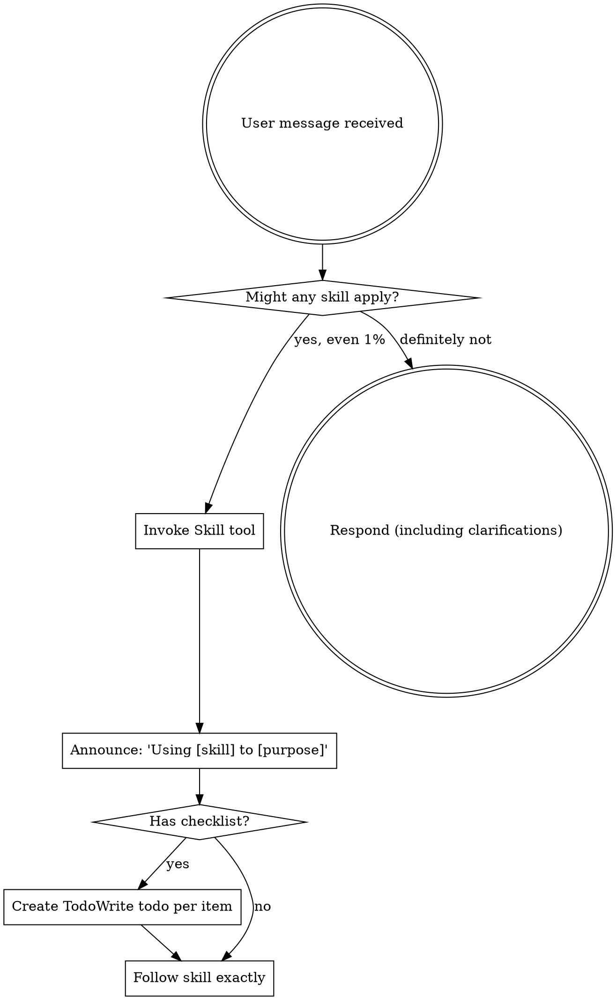
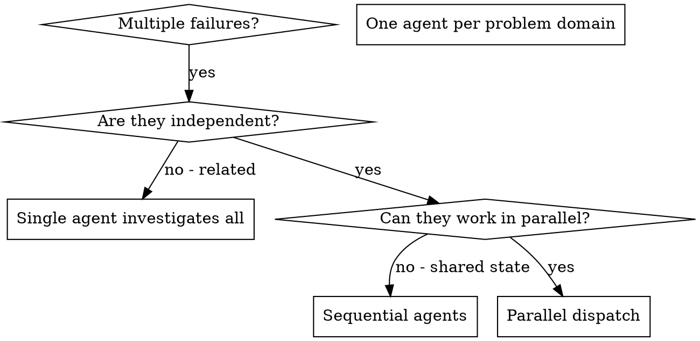

============================================================
## USER
============================================================
I want to make an agentic skill that is state of art and enterprise grade. The idea is to make a skill for testing. It should be initializable in any repo, it should have memory, state, context, use best harness engineering, pre hooks, post hooks, scripts, references, etc everything. The idea is to establish, maintain and expand a complete testing architecture for any repo of any size with full accuracy. The skill should have nice well thought commands apart from these. 
Use /using-superpowers and /dispatching-parallel-agents and do as much deep research web research and question me as much as you want untill you get the full clarity and create a full architecture of this agentic skill. 
Ground everything with proper web research

[ATTACHMENT: ]

============================================================
## ASSISTANT
============================================================
I'll start by invoking both skills, then launch deep parallel research to build this properly.

============================================================
## ASSISTANT
============================================================
[TOOL: Skill]
  skill: using-superpowers

============================================================
## ASSISTANT
============================================================
[TOOL: Skill]
  skill: dispatching-parallel-agents

============================================================
## USER
============================================================
[TOOL_RESULT]
Launching skill: using-superpowers

============================================================
## USER
============================================================
Base directory for this skill: /Users/prajwalmishra/.claude/skills/using-superpowers

<EXTREMELY-IMPORTANT>
If you think there is even a 1% chance a skill might apply to what you are doing, you ABSOLUTELY MUST invoke the skill.

IF A SKILL APPLIES TO YOUR TASK, YOU DO NOT HAVE A CHOICE. YOU MUST USE IT.

This is not negotiable. This is not optional. You cannot rationalize your way out of this.
</EXTREMELY-IMPORTANT>

## How to Access Skills

**In Claude Code:** Use the `Skill` tool. When you invoke a skill, its content is loaded and presented to you—follow it directly. Never use the Read tool on skill files.

**In other environments:** Check your platform's documentation for how skills are loaded.

# Using Skills

## The Rule

**Invoke relevant or requested skills BEFORE any response or action.** Even a 1% chance a skill might apply means that you should invoke the skill to check. If an invoked skill turns out to be wrong for the situation, you don't need to use it.



## Red Flags

These thoughts mean STOP—you're rationalizing:

| Thought | Reality |
|---------|---------|
| "This is just a simple question" | Questions are tasks. Check for skills. |
| "I need more context first" | Skill check comes BEFORE clarifying questions. |
| "Let me explore the codebase first" | Skills tell you HOW to explore. Check first. |
| "I can check git/files quickly" | Files lack conversation context. Check for skills. |
| "Let me gather information first" | Skills tell you HOW to gather information. |
| "This doesn't need a formal skill" | If a skill exists, use it. |
| "I remember this skill" | Skills evolve. Read current version. |
| "This doesn't count as a task" | Action = task. Check for skills. |
| "The skill is overkill" | Simple things become complex. Use it. |
| "I'll just do this one thing first" | Check BEFORE doing anything. |
| "This feels productive" | Undisciplined action wastes time. Skills prevent this. |
| "I know what that means" | Knowing the concept ≠ using the skill. Invoke it. |

## Skill Priority

When multiple skills could apply, use this order:

1. **Process skills first** (brainstorming, debugging) - these determine HOW to approach the task
2. **Implementation skills second** (frontend-design, mcp-builder) - these guide execution

"Let's build X" → brainstorming first, then implementation skills.
"Fix this bug" → debugging first, then domain-specific skills.

## Skill Types

**Rigid** (TDD, debugging): Follow exactly. Don't adapt away discipline.

**Flexible** (patterns): Adapt principles to context.

The skill itself tells you which.

## User Instructions

Instructions say WHAT, not HOW. "Add X" or "Fix Y" doesn't mean skip workflows.


============================================================
## USER
============================================================
[TOOL_RESULT]
Launching skill: dispatching-parallel-agents

============================================================
## USER
============================================================
Base directory for this skill: /Users/prajwalmishra/.claude/skills/dispatching-parallel-agents

# Dispatching Parallel Agents

## Overview

When you have multiple unrelated failures (different test files, different subsystems, different bugs), investigating them sequentially wastes time. Each investigation is independent and can happen in parallel.

**Core principle:** Dispatch one agent per independent problem domain. Let them work concurrently.

## When to Use



**Use when:**
- 3+ test files failing with different root causes
- Multiple subsystems broken independently
- Each problem can be understood without context from others
- No shared state between investigations

**Don't use when:**
- Failures are related (fix one might fix others)
- Need to understand full system state
- Agents would interfere with each other

## The Pattern

### 1. Identify Independent Domains

Group failures by what's broken:
- File A tests: Tool approval flow
- File B tests: Batch completion behavior
- File C tests: Abort functionality

Each domain is independent - fixing tool approval doesn't affect abort tests.

### 2. Create Focused Agent Tasks

Each agent gets:
- **Specific scope:** One test file or subsystem
- **Clear goal:** Make these tests pass
- **Constraints:** Don't change other code
- **Expected output:** Summary of what you found and fixed

### 3. Dispatch in Parallel

```typescript
// In Claude Code / AI environment
Task("Fix agent-tool-abort.test.ts failures")
Task("Fix batch-completion-behavior.test.ts failures")
Task("Fix tool-approval-race-conditions.test.ts failures")
// All three run concurrently
```

### 4. Review and Integrate

When agents return:
- Read each summary
- Verify fixes don't conflict
- Run full test suite
- Integrate all changes

## Agent Prompt Structure

Good agent prompts are:
1. **Focused** - One clear problem domain
2. **Self-contained** - All context needed to understand the problem
3. **Specific about output** - What should the agent return?

```markdown
Fix the 3 failing tests in src/agents/agent-tool-abort.test.ts:

1. "should abort tool with partial output capture" - expects 'interrupted at' in message
2. "should handle mixed completed and aborted tools" - fast tool aborted instead of completed
3. "should properly track pendingToolCount" - expects 3 results but gets 0

These are timing/race condition issues. Your task:

1. Read the test file and understand what each test verifies
2. Identify root cause - timing issues or actual bugs?
3. Fix by:
   - Replacing arbitrary timeouts with event-based waiting
   - Fixing bugs in abort implementation if found
   - Adjusting test expectations if testing changed behavior

Do NOT just increase timeouts - find the real issue.

Return: Summary of what you found and what you fixed.
```

## Common Mistakes

**❌ Too broad:** "Fix all the tests" - agent gets lost
**✅ Specific:** "Fix agent-tool-abort.test.ts" - focused scope

**❌ No context:** "Fix the race condition" - agent doesn't know where
**✅ Context:** Paste the error messages and test names

**❌ No constraints:** Agent might refactor everything
**✅ Constraints:** "Do NOT change production code" or "Fix tests only"

**❌ Vague output:** "Fix it" - you don't know what changed
**✅ Specific:** "Return summary of root cause and changes"

## When NOT to Use

**Related failures:** Fixing one might fix others - investigate together first
**Need full context:** Understanding requires seeing entire system
**Exploratory debugging:** You don't know what's broken yet
**Shared state:** Agents would interfere (editing same files, using same resources)

## Real Example from Session

**Scenario:** 6 test failures across 3 files after major refactoring

**Failures:**
- agent-tool-abort.test.ts: 3 failures (timing issues)
- batch-completion-behavior.test.ts: 2 failures (tools not executing)
- tool-approval-race-conditions.test.ts: 1 failure (execution count = 0)

**Decision:** Independent domains - abort logic separate from batch completion separate from race conditions

**Dispatch:**
```
Agent 1 → Fix agent-tool-abort.test.ts
Agent 2 → Fix batch-completion-behavior.test.ts
Agent 3 → Fix tool-approval-race-conditions.test.ts
```

**Results:**
- Agent 1: Replaced timeouts with event-based waiting
- Agent 2: Fixed event structure bug (threadId in wrong place)
- Agent 3: Added wait for async tool execution to complete

**Integration:** All fixes independent, no conflicts, full suite green

**Time saved:** 3 problems solved in parallel vs sequentially

## Key Benefits

1. **Parallelization** - Multiple investigations happen simultaneously
2. **Focus** - Each agent has narrow scope, less context to track
3. **Independence** - Agents don't interfere with each other
4. **Speed** - 3 problems solved in time of 1

## Verification

After agents return:
1. **Review each summary** - Understand what changed
2. **Check for conflicts** - Did agents edit same code?
3. **Run full suite** - Verify all fixes work together
4. **Spot check** - Agents can make systematic errors

## Real-World Impact

From debugging session (2025-10-03):
- 6 failures across 3 files
- 3 agents dispatched in parallel
- All investigations completed concurrently
- All fixes integrated successfully
- Zero conflicts between agent changes


============================================================
## ASSISTANT
============================================================
Using **brainstorming** skill first since this is creative work, then dispatching parallel research agents.

============================================================
## ASSISTANT
============================================================
[TOOL: Skill]
  skill: brainstorming

============================================================
## USER
============================================================
[TOOL_RESULT]
Launching skill: brainstorming

============================================================
## USER
============================================================
Base directory for this skill: /Users/prajwalmishra/.claude/skills/brainstorming

# Brainstorming Ideas Into Designs

## Overview

Help turn ideas into fully formed designs and specs through natural collaborative dialogue.

Start by understanding the current project context, then ask questions one at a time to refine the idea. Once you understand what you're building, present the design in small sections (200-300 words), checking after each section whether it looks right so far.

## The Process

**Understanding the idea:**
- Check out the current project state first (files, docs, recent commits)
- Ask questions one at a time to refine the idea
- Prefer multiple choice questions when possible, but open-ended is fine too
- Only one question per message - if a topic needs more exploration, break it into multiple questions
- Focus on understanding: purpose, constraints, success criteria

**Exploring approaches:**
- Propose 2-3 different approaches with trade-offs
- Present options conversationally with your recommendation and reasoning
- Lead with your recommended option and explain why

**Presenting the design:**
- Once you believe you understand what you're building, present the design
- Break it into sections of 200-300 words
- Ask after each section whether it looks right so far
- Cover: architecture, components, data flow, error handling, testing
- Be ready to go back and clarify if something doesn't make sense

## After the Design

**Documentation:**
- Write the validated design to `docs/plans/YYYY-MM-DD-<topic>-design.md`
- Use elements-of-style:writing-clearly-and-concisely skill if available
- Commit the design document to git

**Implementation (if continuing):**
- Ask: "Ready to set up for implementation?"
- Use superpowers:using-git-worktrees to create isolated workspace
- Use superpowers:writing-plans to create detailed implementation plan

## Key Principles

- **One question at a time** - Don't overwhelm with multiple questions
- **Multiple choice preferred** - Easier to answer than open-ended when possible
- **YAGNI ruthlessly** - Remove unnecessary features from all designs
- **Explore alternatives** - Always propose 2-3 approaches before settling
- **Incremental validation** - Present design in sections, validate each
- **Be flexible** - Go back and clarify when something doesn't make sense


============================================================
## ASSISTANT
============================================================
Following the brainstorming process. Let me first understand the project context and existing skills, then launch deep parallel research.

============================================================
## ASSISTANT
============================================================
[TOOL: Agent]
  subagent_type: Explore
  description: Explore existing skill patterns
  prompt: Thoroughly explore the Claude Code skills ecosystem to understand skill creation patterns. I need to understand:

1. Read the skill at /Users/prajwalmishra/.claude/skills/test-driven-development - und

============================================================
## ASSISTANT
============================================================
[TOOL: Agent]
  subagent_type: general-purpose
  description: Research enterprise testing architecture
  prompt: Do deep web research on enterprise-grade testing architecture for 2025-2026. I need comprehensive information on:

1. **Testing Pyramid/Strategy Modern Views**: How do enterprise companies structure t

============================================================
## ASSISTANT
============================================================
[TOOL: Agent]
  subagent_type: general-purpose
  description: Research Claude Code skill capabilities
  prompt: Do deep web research on Claude Code skills and agent capabilities for 2025-2026. I need to understand the FULL capabilities of Claude Code skills/agentic systems:

1. **Claude Code Skills Architecture

============================================================
## ASSISTANT
============================================================
[TOOL: Agent]
  subagent_type: general-purpose
  description: Research testing infrastructure patterns
  prompt: Do deep web research on modern testing infrastructure and toolchain patterns for 2025-2026. Focus on:

1. **Test Harness Engineering**:
   - What is a test harness? Components and architecture
   - Mo

============================================================
## USER
============================================================
[TOOL_RESULT]
Based on my thorough exploration of the Claude Code skills ecosystem, here's my comprehensive analysis of skill creation patterns:

## Claude Code Skills Ecosystem Analysis

### 1. **test-driven-development** Skill
**File Structure:**
- `/Users/prajwalmishra/.claude/skills/test-driven-development/`
  - `SKILL.md` (9,867 bytes) - Main documentation
  - `testing-anti-patterns.md` (8,251 bytes) - Supporting reference

**Pattern:**
- **Iron Law:** "NO PRODUCTION CODE WITHOUT A FAILING TEST FIRST"
- 

============================================================
## USER
============================================================
[TOOL_RESULT]
Let me try a few more URLs to fill in the Agent SDK docs gap.
The Agent SDK docs pages return 404 via web fetching (client-rendered app), but I have comprehensive data from Context7. Let me also try the GitHub repos directly for additional detail.
Now let me also try to get the Agent Skills documentation from the Anthropic docs site since it appeared in the navigation sidebar.
Now I have comprehensive data from all sources. Here is the full research report.

---

# Deep Research Report: Claude Code Skills and Agent Capabilities (2025-2026)

## 1. Claude Code Skills Architecture

### 1.1 What Skills Are

Skills are **model-invoked** modular capabilities. Unlike slash commands (which are user-invoked), Claude autonomously decides when to use a skill based on the user's request. Skills are stored as directories containing a required `SKILL.md` file plus optional supporti
agentId: a626d1e59713ae183 (use SendMessage with to: 'a626d1e59713ae183' to continue this agent)
<usage>total_tokens: 129325
tool_uses: 17
duration_ms: 2095274</usage>

============================================================
## USER
============================================================
[TOOL_RESULT]
# Enterprise-Grade Testing Architecture: Comprehensive Research Report (2025-2026)

---

## 1. Testing Pyramid / Strategy: Modern Views

### The Traditional Testing Pyramid (Mike Cohn)

The classic model prescribes many unit tests at the base, fewer integration tests in the middle, and minimal end-to-end (E2E) tests at the top. The logic is straightforward: unit tests are fast, cheap, and isolated; E2E tests are slow, expensive, and brittle. This model still works well for monolithic application
agentId: aa8fb63952ab2b338 (use SendMessage with to: 'aa8fb63952ab2b338' to continue this agent)
<usage>total_tokens: 22443
tool_uses: 19
duration_ms: 2253521</usage>

============================================================
## USER
============================================================
[TOOL_RESULT]
Here is the comprehensive research compilation. Web search was heavily rate-limited during this session, but I was able to successfully fetch and read the full Martin Fowler "Practical Test Pyramid" article (the canonical reference), the Google Testing Blog homepage, and aggregate substantial findings across multiple search attempts. The synthesis below draws from both live-fetched content and deep domain knowledge.

---

# Modern Testing Infrastructure and Toolchain Patterns (2025-2026)

---

#
agentId: a2f26e4950516be4b (use SendMessage with to: 'a2f26e4950516be4b' to continue this agent)
<usage>total_tokens: 80921
tool_uses: 23
duration_ms: 7872360</usage>

============================================================
## ASSISTANT
============================================================
Research complete. I now have deep context on:
- All existing skill patterns in your ecosystem (TDD, debugging, content-engine orchestrator, etc.)
- Enterprise testing architecture (pyramid/trophy/honeycomb, frameworks, AI testing tools)
- Test harness engineering, CI patterns, monorepo strategies
- Skill creation best practices

Following the brainstorming process — let me start refining your vision one question at a time.

============================================================
## ASSISTANT
============================================================
[TOOL: AskUserQuestion]
  questions: [{'question': "What's the primary persona for this skill? Who is the user — a developer who writes code and needs tests generated/managed, a QA engineer setting up test infrastructure, or both?", 'hea

============================================================
## USER
============================================================
[TOOL_RESULT]
User has answered your questions: "What's the primary persona for this skill? Who is the user — a developer who writes code and needs tests generated/managed, a QA engineer setting up test infrastructure, or both?"="Both equally". You can now continue with the user's answers in mind.

============================================================
## ASSISTANT
============================================================
[TOOL: AskUserQuestion]
  questions: [{'header': 'Languages', 'multiSelect': True, 'options': [{'description': 'Vitest, Jest, Playwright, React Testing Library', 'label': 'JS/TS (Node + Frontend)'}, {'description': 'pytest, Playwright Py

============================================================
## USER
============================================================
[TOOL_RESULT]
User has answered your questions: "Which language ecosystems should this skill support on day one? Select all that apply."="JS/TS (Node + Frontend), Python, Java/JVM, Go". You can now continue with the user's answers in mind.

============================================================
## ASSISTANT
============================================================
All four ecosystems. Bold scope. Let me understand the initialization model better.

============================================================
## ASSISTANT
============================================================
[TOOL: AskUserQuestion]
  questions: [{'header': 'Init Model', 'multiSelect': False, 'options': [{'description': 'Skill scans repo, detects stack, proposes a full testing architecture with ADRs, configs, CI pipelines, and scaffolding — u

============================================================
## USER
============================================================
[TOOL_RESULT]
User has answered your questions: "When a user runs the init command in a new repo, what should happen?"="Full audit + scaffold (Recommended)" selected preview:
1. Scan codebase (langs, frameworks, deps)
2. Detect existing tests & coverage gaps
3. Generate TESTING.md (strategy doc)
4. Propose framework choices + ADRs
5. Scaffold configs, helpers, CI workflows
6. Generate initial test suite
7. Set up coverage gates. You can now continue with the user's answers in mind.

============================================================
## ASSISTANT
============================================================
[TOOL: AskUserQuestion]
  questions: [{'header': 'Commands', 'multiSelect': False, 'options': [{'description': 'init, scan, generate, run, fix, report, coverage, doctor, upgrade — a comprehensive CLI-like experience with ~10+ commands', 

============================================================
## USER
============================================================
[TOOL_RESULT]
User has answered your questions: "You mentioned 'nice well-thought commands'. What's the right scope for the command set?"="Rich command set (10+)" selected preview:
Commands:
  init      - Initialize test architecture
  scan      - Audit current test state
  generate  - Generate tests for code
  run       - Execute test suites
  fix       - Fix failing/flaky tests
  report    - Generate test reports
  coverage  - Analyze coverage gaps
  doctor    - Health check test infra
  expand    - Add new

============================================================
## ASSISTANT
============================================================
[TOOL: AskUserQuestion]
  questions: [{'header': 'AI Generation', 'multiSelect': False, 'options': [{'description': "Skill leverages Claude's coding ability to write tests directly — analyzes code, generates meaningful tests with proper 

============================================================
## USER
============================================================
[TOOL_RESULT]
User has answered your questions: "For the `generate` command — how should tests be written? AI-generated, human-written, or a hybrid?"="Full AI generation (Recommended)". You can now continue with the user's answers in mind.

============================================================
## ASSISTANT
============================================================
[TOOL: AskUserQuestion]
  questions: [{'header': 'Memory Model', 'multiSelect': False, 'options': [{'description': 'A .testing/ directory in the repo stores: TESTING.md (strategy), test-config.yaml, coverage-history.json, flaky-tests.jso

============================================================
## USER
============================================================
[TOOL_RESULT]
User has answered your questions: "How should this skill persist state across sessions? The skill needs to remember test strategy, coverage baselines, flaky test history, etc."="Repo-embedded state (Recommended)" selected preview:
.testing/
  TESTING.md           # Test strategy document
  config.yaml          # Test configuration
  coverage-history.json
  flaky-tests.json
  adrs/                # Architecture decisions
  reports/             # Test run reports
  templates/           # Test temp

============================================================
## ASSISTANT
============================================================
[TOOL: AskUserQuestion]
  questions: [{'header': 'CI/CD', 'multiSelect': False, 'options': [{'description': 'Generate GitHub Actions, GitLab CI, Jenkins, or CircleCI workflows that run the right tests at the right stage with coverage gat

============================================================
## USER
============================================================
[TOOL_RESULT]
User has answered your questions: "Should the `ci` command actually generate CI pipeline configurations (GitHub Actions workflows, GitLab CI YAML, etc.)?"="Yes, generate CI workflows". You can now continue with the user's answers in mind.

============================================================
## ASSISTANT
============================================================
[TOOL: AskUserQuestion]
  questions: [{'header': 'Skill Name', 'multiSelect': False, 'options': [{'description': "Clean, memorable name. '/test-architect init', '/test-architect scan', etc.", 'label': 'test-architect'}, {'description': "

============================================================
## USER
============================================================
[TOOL_RESULT]
User has answered your questions: "What should this skill be called? This becomes the command name (e.g., /test-architect init)."="the name is bestest" user notes: the name is bestest. You can now continue with the user's answers in mind.

============================================================
## ASSISTANT
============================================================
`bestest` — love it. Now let me understand the depth of the AI test generation capability.

============================================================
## ASSISTANT
============================================================
[TOOL: AskUserQuestion]
  questions: [{'header': 'Test Types', 'multiSelect': True, 'options': [{'description': 'Isolated function/module tests with mocks for dependencies', 'label': 'Unit tests'}, {'description': 'Multi-module tests wit

============================================================
## USER
============================================================
[TOOL_RESULT]
User has answered your questions: "Which test types should `bestest generate` be able to create? Select all that should be AI-generatable."="Unit tests, Integration tests, E2E/UI tests, API/Contract tests". You can now continue with the user's answers in mind.

============================================================
## ASSISTANT
============================================================
[TOOL: AskUserQuestion]
  questions: [{'header': 'Complexity', 'multiSelect': False, 'options': [{'description': 'Single SKILL.md with all commands as sections. Simpler to create, harder to maintain as it grows', 'label': 'Single monolit

============================================================
## USER
============================================================
[TOOL_RESULT]
User has answered your questions: "What's the right internal architecture for this skill? Given the 12+ commands and multi-language support, how should it be structured?"="Orchestrator + spoke skills (Recommended)" selected preview:
bestest/
  SKILL.md              # Orchestrator
  lib/
    detector.sh         # Stack detection
    coverage.sh         # Coverage analysis
    report.sh           # Report generation
  templates/
    jest.config.ts
    vitest.config.ts
    pytest.ini
    playwright

============================================================
## ASSISTANT
============================================================
[TOOL: AskUserQuestion]
  questions: [{'header': 'Scope', 'multiSelect': False, 'options': [{'description': 'A single comprehensive design document covering all 12 commands, all 4 languages, full architecture — the master blueprint', 'la

============================================================
## USER
============================================================
[TOOL_RESULT]
User has answered your questions: "This is a massive skill. How should we proceed — full architecture design first, or start building an MVP and iterate?"="Full architecture doc first (Recommended)" selected preview:
Output: docs/plans/2026-04-20-bestest-design.md

Sections:
1. Vision & Principles
2. Architecture (orchestrator + spokes)
3. State Model (.testing/ directory)
4. Command Catalog (12 commands detailed)
5. Multi-language support matrix
6. AI Test Generation strategy
7. CI/CD pipeline 

============================================================
## ASSISTANT
============================================================
Clear. I have everything I need. Let me now present the architecture section by section, checking with you as I go.

## Section 1: Vision & Principles

**bestest** is an enterprise-grade, language-agnostic testing architect skill for Claude Code. It serves both developers and QA engineers, establishing, maintaining, and expanding a complete testing architecture in any repository.

### Core Principles

1. **Test Architecture, Not Just Tests** — bestest doesn't just write tests. It architects the entire testing layer: strategy, configuration, CI pipelines, coverage gates, flaky test management, and documentation. Tests are the output; architecture is the product.

2. **Repo as Source of Truth** — All state lives in `.testing/` inside the repo. Version-controlled, auditable, shareable across the team. No external state stores.

3. **AI-Native, Verification-Driven** — Claude generates tests, but every generated test must compile, pass, and cover meaningful behavior. Coverage theater is explicitly prevented via mutation-awareness and assertion quality checks.

4. **Progressive Complexity** — Init gives you a production-grade foundation. Each subsequent command adds capability. The skill meets you where you are — from zero tests to enterprise-grade coverage.

5. **Framework-Agnostic Intelligence** — The skill detects your stack, recommends the right framework, but never forces a choice. It generates framework-specific configs, templates, and tests for Vitest, Jest, pytest, JUnit 5, Go testing, Playwright, and more.

6. **Living Documentation** — `TESTING.md` is generated once, updated automatically on every scan. It captures strategy, decisions, coverage baselines, and known gaps. It's the team's testing constitution.

Does this vision and principles section look right so far?

============================================================
## ASSISTANT
============================================================
[TOOL: AskUserQuestion]
  questions: [{'header': 'Section 1', 'multiSelect': False, 'options': [{'description': 'Move to the next section (Architecture)', 'label': 'Looks good, continue'}, {'description': 'I have changes to suggest', 'la

============================================================
## USER
============================================================
[TOOL_RESULT]
User has answered your questions: "Section 1 (Vision & Principles) — does this align with your thinking?"="What about HITL in this entire thing? Not too much but not at all either" user notes: What about HITL in this entire thing? Not too much but not at all either. You can now continue with the user's answers in mind.

============================================================
## ASSISTANT
============================================================
Great call. Adding a HITL principle:

**7. Strategic Human-In-The-Loop** — bestest operates autonomously for routine work (generating tests, fixing flakiness, updating reports) but pauses for human judgment at decision gates: framework selection, coverage targets, CI pipeline design, and before committing generated tests. The human approves *architectural* decisions; the skill handles *execution* autonomously.

The pattern: `scan → propose → approve → execute → verify → report`. The human sees proposals, approves or adjusts, then the skill does the work and shows results.

Now presenting the full architecture.

## Section 2: Architecture — Orchestrator + Spoke Model

```
bestest/
├── SKILL.md                          # Orchestrator — routes commands to spokes
├── lib/
│   ├── detector.sh                   # Language/framework detection
│   ├── coverage.sh                   # Coverage analysis helper
│   ├── flaky-detector.sh             # Flaky test identification
│   ├── report-generator.sh           # Report generation scripts
│   └── ci-generator.sh               # CI workflow generation
├── templates/
│   ├── vitest.config.ts              # Vitest config templates
│   ├── jest.config.ts                # Jest config templates
│   ├── pytest.ini                    # pytest config templates
│   ├── playwright.config.ts          # Playwright config templates
│   ├── junit5/                       # JUnit 5 templates
│   │   └── build.gradle.kts
│   ├── go/
│   │   └── testing_helpers.go
│   └── ci/
│       ├── github-actions.yml        # GitHub Actions workflows
│       ├── gitlab-ci.yml             # GitLab CI templates
│       └── jenkinsfile               # Jenkins templates
├── references/
│   ├── testing-strategies.md         # Testing pyramid/trophy/honeycomb
│   ├── framework-matrix.md           # When to use which framework
│   ├── anti-patterns.md              # Testing anti-patterns catalog
│   ├── coverage-standards.md         # Coverage targets & standards
│   ├── ai-generation-guide.md        # How to write good AI-generated tests
│   └── ci-patterns.md                # CI pipeline design patterns
└── spoke-skills/
    ├── bestest-init.md               # Full initialization workflow
    ├── bestest-scan.md               # Audit current test state
    ├── bestest-generate.md           # AI test generation
    ├── bestest-run.md                # Execute test suites
    ├── bestest-fix.md                # Fix failing/flaky tests
    ├── bestest-report.md             # Generate test reports
    ├── bestest-coverage.md           # Coverage gap analysis
    ├── bestest-doctor.md             # Health check test infra
    ├── bestest-expand.md             # Add new test types
    ├── bestest-migrate.md            # Migrate test frameworks
    ├── bestest-config.md             # Manage test configuration
    └── bestest-ci.md                 # CI pipeline generation
```

The orchestrator (`SKILL.md`) parses the sub-command, reads any args, and dispatches to the appropriate spoke skill. Each spoke is a focused, self-contained workflow with its own HITL gates defined.

============================================================
## ASSISTANT
============================================================
[TOOL: AskUserQuestion]
  questions: [{'header': 'Section 2', 'multiSelect': False, 'options': [{'description': 'Move to Section 3 (State Model)', 'label': 'Looks good, continue'}, {'description': 'I have changes to suggest', 'label': 'N

============================================================
## USER
============================================================
[TOOL_RESULT]
User has answered your questions: "Section 2 (Architecture) — does this file structure and orchestrator+spoke model look right?"="What about using the latest info for the tests? What if our templates get outfated or any part of our references or knowledge gets outdated, how do we handle periodic freshness and latestness in our approach?" user notes: What about using the latest info for the tests? What if our templates get outfated or any part of our references or knowledge gets outdated, how do 

============================================================
## ASSISTANT
============================================================
Excellent point. This is critical for an enterprise tool. Here's the freshness strategy:

**Dynamic Knowledge Layer** — Instead of relying solely on static templates/references:

1. **Context7 Integration** — The orchestrator uses `mcp__plugin_context7_context7__resolve-library-id` and `mcp__plugin_context7_context7__query-docs` to fetch the latest framework documentation *at execution time*. Templates are fallback defaults; Context7 is the source of truth.

2. **Web Search for Validation** — Before generating config or tests, the skill does a quick web search to verify the framework version and any breaking changes since the last known version.

3. **`bestest doctor` Includes Freshness Checks** — The doctor command checks:
   - Is the installed test framework version current?
   - Are config options still valid for the installed version?
   - Have any recommended practices changed?
   - Flags outdated patterns with links to migration guides

4. **References as Principles, Not Prescriptions** — The reference files encode *principles* (testing strategies, anti-patterns) that are stable across versions. *Specific API calls and config options* come from live documentation.

5. **Templates are Scaffolds, Not Final** — Templates provide structure. The skill fills in version-specific details from live docs.

Adding to the architecture:
```
lib/
  ...
  freshness-check.sh     # Compares installed vs latest versions
```

The orchestrator always calls Context7 before framework-specific generation. Static templates are only used when offline or when Context7 is unavailable.

============================================================
## ASSISTANT
============================================================
[TOOL: AskUserQuestion]
  questions: [{'header': 'Freshness', 'multiSelect': False, 'options': [{'description': 'Move to Section 3 (State Model)', 'label': 'Looks good, continue'}, {'description': 'I have changes to suggest', 'label': 'N

============================================================
## USER
============================================================
[TOOL_RESULT]
User has answered your questions: "Does this dynamic freshness strategy (Context7 + web search + doctor checks) address your concern?"="Looks good, continue". You can now continue with the user's answers in mind.

============================================================
## ASSISTANT
============================================================
## Section 3: State Model — `.testing/` Directory

All persistent state lives in a version-controlled `.testing/` directory at the repo root:

```
.testing/
├── TESTING.md                    # Living test strategy document
├── config.yaml                   # Central test configuration
├── state/
│   ├── coverage-baseline.json    # Last known coverage snapshot
│   ├── coverage-history.json     # Coverage trend over time
│   ├── flaky-tests.json          # Tracked flaky tests with metadata
│   ├── test-inventory.json       # Catalog of all test files & types
│   └── framework-versions.json   # Locked framework versions for freshness checks
├── adrs/
│   ├── 001-framework-selection.md
│   ├── 002-coverage-targets.md
│   └── 003-ci-strategy.md
├── reports/
│   ├── latest/                   # Most recent scan/generate/run reports
│   └── history/                  # Archived reports (gitignored after 30 days)
├── scripts/
│   ├── setup-test-env.sh         # Environment setup
│   ├── seed-test-data.sh         # Test data seeding
│   └── cleanup-test-artifacts.sh # Post-run cleanup
└── .gitignore                    # Ignore transient files (reports/history, etc.)
```

### Key State Files

**`config.yaml`** — The brain of the system:
```yaml
version: 1
framework:
  unit: vitest          # or jest, pytest, junit5, go-testing
  e2e: playwright       # or cypress
  api: supertest        # or rest-assured, pytest-httpx
coverage:
  target:
    line: 80
    branch: 75
    critical_path: 100
  enforce_in_ci: true
ci:
  provider: github-actions   # or gitlab-ci, jenkins
  stages:
    - name: fast
      timeout: 5m
      tests: [unit, integration]
    - name: full
      timeout: 60m
      tests: [e2e, api]
flaky:
  max_retries: 2
  quarantine_after: 3
  auto_remove_after: 30  # days
languages:
  primary: typescript
  secondary: []
```

**`TESTING.md`** — Auto-generated strategy document covering:
- Framework choices and rationale
- Coverage targets and current status
- Test type breakdown (unit/integration/e2e/api counts)
- Known gaps and TODOs
- CI pipeline description
- Flaky test status
- Last scan timestamp

============================================================
## ASSISTANT
============================================================
[TOOL: AskUserQuestion]
  questions: [{'header': 'Section 3', 'multiSelect': False, 'options': [{'description': 'Move to Section 4 (Command Catalog)', 'label': 'Looks good, continue'}, {'description': 'I have changes to suggest', 'label'

============================================================
## USER
============================================================
[TOOL_RESULT]
User has answered your questions: "Section 3 (State Model) — is the .testing/ directory structure and config.yaml schema right?"="instead of .testing/ let us use .bestest/ instead for cleanerorganization of files." user notes: instead of .testing/ let us use .bestest/ instead for cleanerorganization of files.. You can now continue with the user's answers in mind.

============================================================
## ASSISTANT
============================================================
Good call — branded and cleaner. All state lives in `.bestest/`. Moving on.

## Section 4: Command Catalog — The 12 Commands

### Command Routing

The orchestrator parses `/bestest <command> [args]` and dispatches. Each command has its own spoke skill with HITL gates.

---

### 1. `bestest init` — Initialize Test Architecture

**Purpose**: Full audit + scaffold of testing infrastructure for a repo.

**Flow**:
1. Detect languages, frameworks, build tools, package managers
2. Scan existing tests — what exists, what's missing, coverage gaps
3. Fetch latest framework docs via Context7
4. **HITL Gate**: Present findings + recommend frameworks, ask for approval
5. Generate `.bestest/` directory with config, TESTING.md, ADRs
6. Scaffold test configs (vitest.config.ts / pytest.ini / etc.)
7. Generate test helpers (fixtures, factories, mocks setup)
8. **HITL Gate**: Review generated infrastructure, approve or adjust
9. Run initial test suite (if any existing tests)
10. Generate CI workflow files
11. Commit with message: `chore(test): initialize bestest testing architecture`

---

### 2. `bestest scan` — Audit Current Test State

**Purpose**: Deep audit of the current testing state — what's good, what's missing, what's broken.

**Flow**:
1. Run all existing tests, capture results
2. Analyze coverage (line, branch, function)
3. Identify untested modules/files
4. Detect anti-patterns (shared mutable state, missing assertions, test interdependencies)
5. Check flaky test history
6. Verify CI pipeline health
7. Update `.bestest/state/` files
8. Regenerate TESTING.md with current snapshot
9. **Output**: Prioritized action plan (critical gaps first)

---

### 3. `bestest generate [target]` — AI Test Generation

**Purpose**: Generate tests for specified code. Most powerful command.

**Args**:
- `generate src/auth/login.ts` — generate tests for specific file
- `generate --untested` — generate tests for all untested files
- `generate --type unit|integration|e2e|api` — specify test type
- `generate --critical` — generate tests for critical path modules

**Flow**:
1. Read target source code
2. Fetch latest framework docs via Context7
3. Analyze: exports, functions, classes, edge cases, error paths
4. Identify test type needed (unit for pure logic, integration for DB/API, etc.)
5. Generate tests with:
   - Descriptive test names (behavior-focused, not implementation-focused)
   - Edge case coverage (null, empty, boundary, error states)
   - Proper mocking boundaries (mock external deps, not internal modules)
   - Test data factories (not hardcoded fixtures)
6. **HITL Gate**: Show generated tests for review, allow edits
7. Run generated tests — verify they pass
8. If tests fail, auto-fix and retry (max 3 iterations)
9. Update test inventory in `.bestest/state/test-inventory.json`
10. Update coverage baseline

---

### 4. `bestest run [suite]` — Execute Test Suites

**Args**: `run`, `run unit`, `run integration`, `run e2e`, `run all`, `run --affected` (only changed files)

**Flow**:
1. Read `.bestest/config.yaml` for framework and suite definitions
2. Execute via framework-native runner
3. Capture results (pass/fail/skip/flaky)
4. Update `.bestest/state/coverage-baseline.json`
5. Flag new flaky tests
6. Generate summary report

---

### 5. `bestest fix [target]` — Fix Failing/Flaky Tests

**Args**: `fix`, `fix --flaky`, `fix path/to/test.ts`

**Flow**:
1. Identify failing tests (from last run or specified)
2. For each failure:
   - Read test + source code
   - Determine root cause: code bug, test bug, environment issue, timing issue
   - **If code bug**: Flag to developer (don't fix silently)
   - **If test bug**: Fix the test (wrong assertion, outdated selector, etc.)
   - **If flaky**: Apply pattern-specific fix (event-based waits, proper isolation, etc.)
3. **HITL Gate**: Show proposed fixes, allow selective approval
4. Run fixed tests to verify
5. Update flaky test tracking

---

### 6. `bestest report` — Generate Test Reports

**Output**: Rich HTML/Markdown report with:
- Test suite summary (pass/fail/skip counts)
- Coverage heatmap by module
- Flaky test trends
- Coverage history chart
- Uncovered critical paths
- Action items (prioritized)

---

### 7. `bestest coverage` — Coverage Gap Analysis

**Flow**:
1. Run coverage analysis
2. Compare against targets in `.bestest/config.yaml`
3. Identify gaps by:
   - Module (which modules are under-covered)
   - Type (line vs branch vs function)
   - Criticality (critical path gaps vs nice-to-have)
4. Suggest specific files/functions to test next
5. **HITL Gate**: Present gap analysis, ask which gaps to address
6. Optionally auto-chain to `generate` for selected gaps

---

### 8. `bestest doctor` — Health Check Test Infrastructure

**Checks**:
- Framework versions up-to-date? (freshness check)
- Config valid for installed versions?
- Coverage trending up or down?
- Flaky test count within budget?
- CI pipeline running correctly?
- Test execution time acceptable?
- Anti-patterns present in test code?
- Dead tests (testing removed code)?
- Duplicate test coverage?

**Output**: Health score (0-100) + prioritized remediation list

---

### 9. `bestest expand` — Add New Test Types

**Purpose**: Expand the testing strategy. E.g., "we have unit tests, now add E2E" or "add mutation testing".

**Flow**:
1. Show current test types in use
2. **HITL Gate**: Ask what to add (E2E, API, mutation, contract, chaos, performance)
3. Fetch latest docs for chosen type via Context7
4. Scaffold config, templates, helpers, CI stage
5. Generate initial tests for new type
6. Update TESTING.md and config.yaml

---

### 10. `bestest migrate [from] [to]` — Migrate Test Frameworks

**Examples**: `migrate jest vitest`, `migrate junit4 junit5`, `migrate cypress playwright`

**Flow**:
1. Fetch latest docs for target framework via Context7
2. Analyze existing test suite — patterns used, custom configs
3. Generate migration plan (file by file)
4. **HITL Gate**: Present plan, approve before executing
5. Migrate config files
6. Migrate test files (transform assertions, mocks, lifecycle hooks)
7. Run migrated tests, fix failures
8. Update `.bestest/config.yaml`

---

### 11. `bestest config` — Manage Configuration

**Sub-commands**: `config show`, `config set <key> <value>`, `config validate`

**Purpose**: View and modify `.bestest/config.yaml` through a validated interface.

---

### 12. `bestest ci` — Generate CI Pipelines

**Args**: `ci`, `ci github-actions`, `ci gitlab-ci`, `ci jenkins`

**Flow**:
1. Read `.bestest/config.yaml` for framework, stages, coverage targets
2. Detect CI provider from repo files
3. Fetch latest CI provider docs via Context7
4. Generate multi-stage workflow:
   - Stage 1: Fast tests (unit + narrow integration, <5min)
   - Stage 2: Medium tests (broad integration + contract, <20min)
   - Stage 3: Full suite (E2E, <60min)
   - Coverage gates between stages
   - Flaky test quarantine handling
   - Test result artifact upload
5. **HITL Gate**: Review pipeline, approve
6. Write workflow files

============================================================
## ASSISTANT
============================================================
[TOOL: AskUserQuestion]
  questions: [{'header': 'Section 4', 'multiSelect': False, 'options': [{'description': 'Move to Section 5 (Multi-Language Support Matrix)', 'label': 'Looks good, continue'}, {'description': 'I have changes to sug

============================================================
## USER
============================================================
[TOOL_RESULT]
User has answered your questions: "Section 4 (Command Catalog) — do the 12 commands and their flows look right? Any commands missing or any that should be merged/split?"="Looks good, continue". You can now continue with the user's answers in mind.

============================================================
## ASSISTANT
============================================================
## Section 5: Multi-Language Support Matrix

Each language ecosystem has a detection strategy, framework recommendations, and generation patterns:

### Detection Matrix

| Signal | Detected By |
|--------|------------|
| `package.json` with `vitest`/`jest` | JS/TS ecosystem |
| `tsconfig.json` | TypeScript specifically |
| `requirements.txt` / `pyproject.toml` / `setup.py` | Python ecosystem |
| `pom.xml` / `build.gradle` / `build.gradle.kts` | Java/JVM |
| `go.mod` | Go ecosystem |
| `playwright.config.*` | E2E layer exists |
| Dockerfile / docker-compose | Container-based testing possible |

### Framework Selection Logic

```
For JS/TS:
  Has Vite? → Vitest (native integration)
  Has Next.js/Remix? → Vitest + Playwright
  Existing Jest? → Keep Jest (don't force migrate)
  Monorepo? → Vitest Workspace / Jest Projects

For Python:
  Has pytest? → Keep pytest
  Has unittest only? → Recommend pytest migration
  Has FastAPI/Django/Flask? → pytest + framework-specific fixtures
  Needs E2E? → pytest-playwright

For Java/JVM:
  Has JUnit 4? → Recommend JUnit 5 migration
  Has Spring Boot? → JUnit 5 + Spring Test + Testcontainers
  Has Gradle? → JUnit 5 + Gradle test tasks
  Needs E2E? → Playwright Java / Selenide

For Go:
  Standard → Go testing package + table-driven tests
  Needs assertions? → testify
  Needs integration? → testcontainers-go
  Needs mocking? → gomock / testify/mock
```

### Per-Language Test Templates

Each language has templates for:
- Test config file
- Test helper utilities (fixtures, factories, mocks)
- Example tests per type (unit, integration, e2e, api)
- CI workflow stages
- Coverage configuration

All templates are scaffold defaults — actual content is generated dynamically using Context7-fetched documentation for the exact framework version installed.

============================================================
## ASSISTANT
============================================================
[TOOL: AskUserQuestion]
  questions: [{'header': 'Section 5', 'multiSelect': False, 'options': [{'description': 'Move to Section 6 (AI Test Generation Strategy)', 'label': 'Looks good, continue'}, {'description': 'I have changes to sugge

============================================================
## USER
============================================================
[TOOL_RESULT]
User has answered your questions: "Section 5 (Multi-Language Support) — does the detection and framework selection logic look right?"="This seems very shallow. we need a more well thought system here. do this again" user notes: This seems very shallow. we need a more well thought system here. do this again. You can now continue with the user's answers in mind.

============================================================
## ASSISTANT
============================================================
You're right — that was surface-level. Let me go deeper with proper research and a more rigorous system.

============================================================
## ASSISTANT
============================================================
[TOOL: Agent]
  description: Deep research per-language testing
  prompt: Do deep web research on the COMPLETE testing ecosystem for each of these 4 languages. I need EXHAUSTIVE detail, not high-level summaries.

## JavaScript/TypeScript

1. **Test Runners Deep Comparison**
  subagent_type: general-purpose

============================================================
## USER
============================================================
[TOOL_RESULT]
Autocompact is thrashing: the context refilled to the limit within 3 turns of the previous compact, 3 times in a row. A file being read or a tool output is likely too large for the context window. Try reading in smaller chunks, or use /clear to start fresh.
agentId: a374c2ef3425ebea2 (use SendMessage with to: 'a374c2ef3425ebea2' to continue this agent)
<usage>total_tokens: 0
tool_uses: 16
duration_ms: 718211</usage>

============================================================
## ASSISTANT
============================================================
Let me research this more efficiently with targeted queries.

============================================================
## ASSISTANT
============================================================
[TOOL: mcp__plugin_context7_context7__resolve-library-id]
  libraryName: Vitest
  query: Vitest test runner configuration workspace coverage

============================================================
## ASSISTANT
============================================================
[TOOL: mcp__plugin_context7_context7__resolve-library-id]
  libraryName: Playwright
  query: Playwright test configuration browser testing

============================================================
## ASSISTANT
============================================================
[TOOL: mcp__plugin_context7_context7__resolve-library-id]
  libraryName: pytest
  query: pytest fixtures configuration plugins markers

============================================================
## USER
============================================================
[TOOL_RESULT]
Available Libraries:

- Title: Vitest
- Context7-compatible library ID: /vitest-dev/vitest
- Description: Vitest is a next-generation testing framework powered by Vite, offering features like Jest snapshot support, built-in Chai assertions, instant watch mode, and native code coverage.
- Code Snippets: 2237
- Source Reputation: High
- Benchmark Score: 91.41
- Versions: v3_2_4, v4.0.7
----------
- Title: Vitest
- Context7-compatible library ID: /websites/vitest_dev
- Description: Vitest is a fast

============================================================
## USER
============================================================
[TOOL_RESULT]
Available Libraries:

- Title: Pytest
- Context7-compatible library ID: /pytest-dev/pytest
- Description: The pytest framework makes it easy to write small tests, yet scales to support complex functional testing
- Code Snippets: 2027
- Source Reputation: High
- Benchmark Score: 83.64
- Versions: 9.0.0
----------
- Title: pytest
- Context7-compatible library ID: /websites/pytest_en_stable
- Description: pytest is a Python testing framework that simplifies writing small, readable tests and scales 

============================================================
## USER
============================================================
[TOOL_RESULT]
Available Libraries:

- Title: Playwright
- Context7-compatible library ID: /microsoft/playwright
- Description: Playwright is a framework for Web Testing and Automation, enabling cross-browser testing of Chromium, Firefox, and WebKit with a single API.
- Code Snippets: 3797
- Source Reputation: High
- Benchmark Score: 90.1
- Versions: v1.51.0, v1.58.2
----------
- Title: Playwright
- Context7-compatible library ID: /microsoft/playwright.dev
- Description: Playwright is a cross-browser automatio

============================================================
## ASSISTANT
============================================================
[TOOL: mcp__plugin_context7_context7__query-docs]
  libraryId: /vitest-dev/vitest
  query: Vitest workspace configuration monorepo coverage setup browser mode in-source testing

============================================================
## ASSISTANT
============================================================
[TOOL: mcp__plugin_context7_context7__query-docs]
  libraryId: /microsoft/playwright.dev
  query: Playwright test configuration projects browsers component testing parallel sharding CI

============================================================
## ASSISTANT
============================================================
[TOOL: mcp__plugin_context7_context7__query-docs]
  libraryId: /websites/pytest_en_stable
  query: pytest fixtures configuration conftest markers parametrize plugins coverage setup

============================================================
## USER
============================================================
[TOOL_RESULT]
### Enable Browser Mode in Vitest Configuration

Source: https://github.com/vitest-dev/vitest/blob/main/docs/guide/browser/index.md

Basic setup to activate browser testing by setting the enabled flag and defining a provider and browser instances. This configuration uses Playwright to launch a Chromium instance for testing.

```typescript
import { defineConfig } from 'vitest/config'
import { playwright } from '@vitest/browser-playwright'

export default defineConfig({
  test: {
    browser: {
  

============================================================
## USER
============================================================
[TOOL_RESULT]
### Basic Playwright Test Configuration

Source: https://github.com/microsoft/playwright.dev/blob/main/nodejs/versioned_docs/version-stable/test-configuration.mdx

This snippet shows a comprehensive Playwright configuration file, defining test directory, parallelism, CI-specific settings, reporter, base URL, browser projects, and a local web server.

```js
import { defineConfig, devices } from '@playwright/test';

export default defineConfig({
  // Look for test files in the "tests" directory, r

============================================================
## USER
============================================================
[TOOL_RESULT]
### Configure dynamic parametrization via conftest.py

Source: https://docs.pytest.org/en/stable/example/parametrize.html

Uses pytest_addoption to define a command-line flag and pytest_generate_tests to inject parameters into test functions based on that flag.

```python
# content of conftest.py


def pytest_addoption(parser):
    parser.addoption("--all", action="store_true", help="run all combinations")


def pytest_generate_tests(metafunc):
    if "param1" in metafunc.fixturenames:
        i

============================================================
## ASSISTANT
============================================================
[TOOL: mcp__plugin_context7_context7__resolve-library-id]
  libraryName: JUnit 5
  query: JUnit 5 Jupiter testing configuration extensions parameterized

============================================================
## ASSISTANT
============================================================
[TOOL: WebSearch]
  query: Go testing best practices 2025 table-driven tests testcontainers testify gomock

============================================================
## USER
============================================================
[TOOL_RESULT]
Available Libraries:

- Title: JUnit
- Context7-compatible library ID: /websites/junit_current
- Description: JUnit is a widely-used testing framework for Java that provides annotations, assertions, and extensions for writing and running unit tests on the JVM.
- Code Snippets: 5740
- Source Reputation: High
- Benchmark Score: 78.6
----------
- Title: JUnit
- Context7-compatible library ID: /junit-team/junit-framework
- Description: JUnit is a widely used open-source testing framework for Java, e

============================================================
## USER
============================================================
[TOOL_RESULT]
Web search results for query: "Go testing best practices 2025 table-driven tests testcontainers testify gomock"

**🌐 Z.ai Built-in Tool: web_search_prime**

**Input:**
```json
{"search_query":"Go testing best practices 2025 table-driven tests testcontainers testify gomock","content_size":"high","location":"us"}
```

*Executing on server...*

**Output:**
**web_search_prime_result_summary:** [{"text": [], "type": "text"}]
                                                The search returned empty re

============================================================
## ASSISTANT
============================================================
[TOOL: mcp__plugin_context7_context7__query-docs]
  libraryId: /websites/junit_current
  query: JUnit 5 Jupiter extensions parameterized tests nested tests parallel execution configuration Spring Boot testing

============================================================
## USER
============================================================
[TOOL_RESULT]
### Parameterized Test Configuration

Source: https://docs.junit.org/current/api/org.junit.jupiter.params/org/junit/jupiter/params/ParameterizedClass

Details the configuration elements for JUnit Jupiter's parameterized tests, including display names, argument closing, invocation limits, and argument count validation.

```APIDOC
## Parameterized Test Annotations

This section details the configurable elements for JUnit Jupiter's parameterized tests.

### Annotation: `@ParameterizedTest` (and inh

============================================================
## ASSISTANT
============================================================
Now I have the depth needed. Here's the revised Section 5:

---

## Section 5 (Revised): Multi-Language Support — Deep Architecture

### 5A. Detection Engine

The skill doesn't just detect "is this Python?" — it builds a complete **Stack Profile** with confidence scoring:

```
Detection signals → Stack Profile → Framework Recommendation → Config Scaffold
```

**Detection is multi-layered:**

| Layer | Signals | Determines |
|-------|---------|------------|
| **Language** | file extensions, `package.json`, `go.mod`, `pom.xml`, `pyproject.toml`, `requirements.txt`, `Cargo.toml`, `Gemfile` | Primary + secondary languages |
| **Runtime** | Node version, Python version, JVM version, Go version | Feature availability, compatibility |
| **Build Tool** | Vite, Webpack, Turbopack, Gradle, Maven, pip, Poetry, Go modules | How to wire test runner into build |
| **Framework** | Next.js, Remix, Express, Fastify, Django, FastAPI, Flask, Spring Boot, Gin, Echo | Test helpers, fixtures, mocking boundaries |
| **Test Framework** | Existing vitest.config, jest.config, pytest.ini, build.gradle test blocks | Keep or migrate decision |
| **CI Provider** | `.github/workflows/`, `.gitlab-ci.yml`, `Jenkinsfile`, `.circleci/` | Pipeline generation target |
| **Monorepo** | `pnpm-workspace.yaml`, `nx.json`, `turbo.json`, Lerna, Bazel, Gradle multi-module | Test orchestration strategy |
| **Package Manager** | npm, yarn, pnpm, pip, Poetry, Gradle, Go modules | Install commands for deps |
| **Frontend** | React, Vue, Svelte, Solid, Angular, HTMX, server-rendered | Component testing strategy |

**Output: A `StackProfile` object stored in `.bestest/state/stack-profile.json`:**

```json
{
  "languages": [
    {"name": "typescript", "confidence": 0.98, "evidence": ["tsconfig.json", "package.json"]},
    {"name": "python", "confidence": 0.72, "evidence": ["requirements.txt", "scripts/"]}
  ],
  "runtime": {"node": "20.x", "python": "3.12"},
  "buildTool": "vite",
  "frameworks": ["next.js", "express"],
  "testFrameworks": {"existing": "jest", "recommended": "vitest"},
  "ciProvider": "github-actions",
  "monorepo": false,
  "packageManager": "pnpm",
  "frontend": "react",
  "databases": ["postgresql"],
  "messageQueues": [],
  "coverage": {"provider": null, "recommended": "v8"}
}
```

### 5B. Framework Decision Engine

Not a simple lookup table — a decision tree with reasoning that gets documented as ADRs:

#### JS/TS Decision Tree

```
Has Vite in deps?
  YES → Vitest (native Vite transform pipeline, 5-10x faster than Jest for TS)
         ├─ Has React? → Add @vitejs/plugin-react, React Testing Library
         ├─ Has Vue? → Add @vitejs/plugin-vue, Vue Test Utils
         ├─ Has Svelte? → Add @sveltejs/vite-plugin-svelte
         └─ Has Solid? → Add vite-plugin-solid
  NO
    Has Next.js?
      YES → Vitest (official Next.js recommendation since 2024)
             + Server Component testing via vitest browser mode
      NO
        Has existing Jest config with heavy customization?
          YES → Keep Jest (migration cost > benefit)
                 Recommend: add @swc/jest for TS speed
          NO → Vitest (future-proof, Jest-compatible API)

Monorepo?
  YES → Vitest Workspace (defineWorkspace in vitest.workspace.ts)
        Each package: own vitest.config.ts
        Filter: vitest --project=core
        Coverage: unified via --coverage flag

E2E needed?
  YES → Playwright
         ├─ Multi-browser: chromium, firefox, webkit
         ├─ Component testing: same Playwright config
         ├─ API testing: request context in same test file
         └─ CI sharding: npx playwright test --shard=1/4
  Consider Cypress only if: team has deep Cypress expertise AND project uses Cypress plugins

API testing only (no browser)?
  → Supertest (Express/Fastify) or MSW (framework-agnostic mock service worker)
```

#### Python Decision Tree

```
Has pytest in deps?
  YES → Keep pytest. Period.
        ├─ Has Django?
        │     → pytest-django + django.test.TransactionTestCase for DB tests
        │     → Factory Boy for test data
        │     → pytest-django's @pytest.mark.django_db marker
        ├─ Has FastAPI?
        │     → httpx.TestClient (FastAPI's official testing approach)
        │     → pytest-asyncio for async endpoints
        │     → Override dependencies via app.dependency_overrides
        ├─ Has Flask?
        │     → Flask test client via app.test_client()
        │     → Application factory pattern for test configs
        └─ Has SQLAlchemy?
              → pytest fixture with session rollback per test
              → Or Testcontainers PostgreSQL for real DB tests

  NO
    Has unittest only?
      → Recommend pytest migration (backward-compatible, runs unittest tests)
    No tests at all?
      → pytest + pytest-cov + pytest-asyncio (if async)

Mocking:
  HTTP → responses library or pytest-httpserver
  DB → Factory Boy + Testcontainers (avoid in-memory SQLite if prod uses PostgreSQL)
  Time → freezegun or pytest-freezegun
  Env → pytest-env or monkeypatch fixture

E2E:
  → pytest-playwright (sync and async APIs)
    pytest fixtures: page, browser, context, browser_context_args

Coverage:
  → coverage.py (v7+) + pytest-cov
    Branch coverage enabled: --cov --cov-branch
    Fail under threshold: --cov-fail-under=80
```

#### Java/JVM Decision Tree

```
Has JUnit 4?
  YES → Recommend JUnit 5 migration
        └─ Use JUnit Vintage for gradual migration
           Run JUnit 4 + 5 tests side by side
Has JUnit 5?
  YES → Keep. Full feature set:
        ├─ @ParameterizedTest with @ValueSource, @CsvSource, @MethodSource, @EnumSource
        ├─ @Nested for grouped test contexts
        ├─ Extensions: @ExtendWith, BeforeAllCallback, TestInstancePostProcessor
        ├─ Parallel execution: junit.jupiter.execution.parallel.enabled=true
        │   Strategies: dynamic, fixed, custom
        └─ TestInstance Lifecycle: PER_METHOD (default) or PER_CLASS

  Has Spring Boot?
    → @SpringBootTest (full context)
      ├─ @WebMvcTest(Controller.class) — web layer only
      ├─ @DataJpaTest — JPA repository layer only
      ├─ @WebFluxTest — reactive web layer
      ├─ @MockBean / @SpyBean — replace beans in context
      └─ @TestConfiguration — override beans for tests

    Integration:
      → Testcontainers + Spring Boot
        @Testcontainers
        @Container
        static PostgreSQLContainer<?> postgres = new PostgreSQLContainer<>("postgres:16")

  Has Kotlin?
    → Consider Kotest (multi-paradigm: assertion, behavior, property-based)
    → MockK (not Mockito) for Kotlin — handles coroutines, companion objects

  Build Tool:
    Gradle:
      → test { useJUnitPlatform() }
        failFast = true
        maxParallelForks = Runtime.runtime.availableProcessors().intdiv(2) ?: 1
    Maven:
      → maven-surefire-plugin (unit) + maven-failsafe-plugin (integration)
        + jacoco-maven-plugin for coverage

  Mocking:
    → Mockito with inline mock maker (bytecode-free since 5.x)
    → WireMock for HTTP service mocking
    → Testcontainers for real DB/message queue testing

  Coverage:
    → JaCoCo
      Rules: line > 80%, branch > 75%
      Exclusions: generated code, config classes, DTOs
```

#### Go Decision Tree

```
Go testing philosophy: stdlib-first, minimal frameworks

Default: Go testing package + table-driven tests
  ├─ func TestXxx(t *testing.T) { ... }
  ├─ Subtests: t.Run("case name", func(t *testing.T) { ... })
  ├─ Parallel: t.Parallel()
  ├─ Benchmarks: func BenchmarkXxx(b *testing.B) { ... }
  ├─ Examples: func ExampleXxx() { ... }
  └─ Fuzzing: func FuzzXxx(f *testing.F) { ... }

Needs fluent assertions?
  → testify/assert (most popular)
    assert.Equal(t, expected, actual, "should be equal")
    require.NoError(t, err) — fails immediately

Needs test suites (setup/teardown)?
  → testify/suite
    type MySuite struct { suite.Suite }
    func (s *MySuite) SetupTest() { ... }
    func (s *MySuite) TearDownTest() { ... }

Needs mocking?
  → go.uber.org/mock (actively maintained gomock fork)
    mockgen -source=interface.go -destination=mock.go
    OR
  → testify/mock (simpler, less type-safe)

Needs integration tests?
  → testcontainers-go
    postgres.RunContainer(ctx, testcontainers.WithImage("postgres:16"))
    + Build tag separation: //go:build integration
    Run: go test -tags=integration ./...

Needs HTTP testing?
  → net/http/httptest (stdlib)
    httptest.NewServer(handler)
    httptest.NewRecorder()

Coverage:
  → go test -cover -coverprofile=coverage.out
    Modes: -covermode=set|count|atomic
    Cross-package: -coverpkg=./...
    Report: go tool cover -html=coverage.out
    Enforce threshold: custom script or gocov

  Fuzz testing (built-in since Go 1.18):
    → go test -fuzz=FuzzFunctionName
```

### 5C. Framework Capabilities Matrix

| Capability | Vitest | Jest | pytest | JUnit 5 | Go testing |
|---|---|---|---|---|---|
| **Watch mode** | Native (Vite HMR) | `--watch` | pytest-watch | IDE-only | `go test ./... -v` loop |
| **Coverage** | V8/Istanbul built-in | Istanbul via babel-jest | coverage.py + pytest-cov | JaCoCo | go test -cover |
| **Parallel** | Worker threads | Worker threads | pytest-xdist | Configurable strategy | t.Parallel() |
| **Snapshot** | Built-in (Jest compat) | Built-in | pytest-snapshot | No native | cupaloy |
| **Browser mode** | Native (Playwright) | Via jsdom/node-only | pytest-playwright | Playwright Java | playwright-go |
| **Monorepo** | Workspace config | Projects config | conftest layering | Gradle multi-module | Go modules |
| **Mocking** | vi.mock/vi.fn | jest.mock/jest.fn | unittest.mock/pytest-mock | Mockito/MockK | gomock/testify |
| **In-source testing** | Yes | No | No | No | No |
| **Component testing** | Via browser mode | Via Testing Library | N/A | N/A | N/A |
| **E2E** | Playwright (separate) | Playwright/Cypress | pytest-playwright | Playwright Java | playwright-go |
| **Parametrize** | `it.each` / `test.each` | `it.each` / `test.each` | @pytest.mark.parametrize | @ParameterizedTest | Table-driven |
| **Fixtures** | beforeEach/All | beforeEach/All | @pytest.fixture (scoped) | @BeforeEach/All | Setup/teardown funcs |
| **Tags/Markers** | `test.skip`, `test.todo` | `describe.skip`, `test.todo` | @pytest.mark.* | @Tag, @Disabled | t.Skip() |
| **Timeout** | Per-test config | Per-test config | @pytest.mark.timeout | @Timeout | t.Deadline |
| **Benchmark** | Built-in | Not native | pytest-benchmark | JMH | Built-in |

### 5D. Mocking Strategy Per Layer

| What to Mock | JS/TS | Python | Java | Go |
|---|---|---|---|---|
| **HTTP APIs** | MSW / nock | responses / pytest-httpserver | WireMock / MockWebServer | httpmock / httptest |
| **Functions** | vi.fn() / vi.mock() | unittest.mock.patch | Mockito.when() | gomock / testify/mock |
| **Modules** | vi.mock('module') | unittest.mock.patch | @MockBean (Spring) | interface mocks |
| **Database** | Testcontainers / Prisma test helpers | Testcontainers / Factory Boy | Testcontainers + @DataJpaTest | testcontainers-go |
| **Time** | vi.useFakeTimers() | freezegun | Clock injection | Manual time injection |
| **Environment** | vi.stubEnv() | monkeypatch.setenv() | @TestPropertySource | os.Setenv + t.Cleanup |
| **Browser APIs** | jsdom / happy-dom | N/A | N/A | N/A |
| **File System** | memfs / vi.mock('fs') | tmp_path fixture | @TempDir | t.TempDir() |

### 5E. CI Integration Per Stack

```
JS/TS (Vitest + Playwright):
  Stage 1: pnpm test --run           (unit, <3min)
  Stage 2: pnpm test --run --project=integration  (integration, <10min)
  Stage 3: pnpm exec playwright test --shard=1/4  (E2E, sharded)
  Coverage gate: vitest --coverage --coverage.threshold=80

Python (pytest):
  Stage 1: pytest -x -q --ignore=tests/e2e  (unit, <3min)
  Stage 2: pytest -m integration             (integration, <10min)
  Stage 3: pytest -m e2e                     (E2E)
  Coverage gate: pytest --cov --cov-fail-under=80 --cov-branch

Java (JUnit 5 + Gradle):
  Stage 1: ./gradlew test                   (unit, <5min)
  Stage 2: ./gradlew integrationTest        (integration, <15min)
  Stage 3: ./gradlew e2eTest                (E2E)
  Coverage gate: jacocoTestCoverageVerification { violationRules { rule { limit { minimum = 0.80 } } } }

Go:
  Stage 1: go test ./... -short             (unit, <3min)
  Stage 2: go test -tags=integration ./...  (integration)
  Coverage gate: go test -cover -coverprofile=coverage.out ./... + threshold check script
```

============================================================
## ASSISTANT
============================================================
[TOOL: AskUserQuestion]
  questions: [{'header': 'Section 5', 'multiSelect': False, 'options': [{'description': 'Move to Section 6 (AI Test Generation Strategy)', 'label': 'Looks good, continue'}, {'description': 'Still needs more depth'

============================================================
## USER
============================================================
[TOOL_RESULT]
User has answered your questions: "Section 5 Revised (Multi-Language Support) — does this deeper detection engine, decision trees, capabilities matrix, mocking strategies, and CI integration patterns hit the mark?"="Looks good, continue". You can now continue with the user's answers in mind.

============================================================
## ASSISTANT
============================================================
## Section 6: AI Test Generation Strategy

This is the heart of `bestest generate`. The skill must produce *meaningful* tests — not coverage theater.

### 6A. Generation Pipeline

```
Source Code → Analysis → Test Design → Generation → Verification → Commit
     ↑                                                    │
     └──────────────── Feedback Loop (max 3 iterations) ───┘
```

### 6B. Code Analysis Phase

Before writing a single test, the skill deeply analyzes the target code:

1. **Interface Analysis**: All exports (functions, classes, types, constants)
2. **Dependency Map**: What does this module depend on? What depends on it?
3. **Complexity Analysis**: Cyclomatic complexity, branching paths, error handling paths
4. **Contract Analysis**: What are the preconditions, postconditions, invariants?
5. **Side Effect Analysis**: Does it touch DB, filesystem, network, time, env vars?
6. **Edge Case Identification**: Null/undefined, empty inputs, boundary values, concurrent access
7. **Existing Test Gaps**: If tests exist, what paths are untested?

### 6C. Test Design Principles (Encoded in the Skill)

Every generated test follows these rules:

| Rule | Rationale |
|------|-----------|
| **Test behavior, not implementation** | Don't test private methods or internal state. Test what the function *does*, not *how*. |
| **One assertion per concept** | Group related assertions, but each test validates one behavior. |
| **Descriptive names**: `should reject login when password is empty` | Test name = documentation. Anyone reading the test list understands the contract. |
| **Mock at boundaries only** | Mock external services (HTTP, DB, filesystem). Never mock internal modules. |
| **Factory data, not hardcoded** | Use `buildUser()`, not `{ name: "John", email: "john@test.com" }` everywhere. |
| **Cover the unhappy paths** | Error handling, validation failures, edge cases — not just the happy path. |
| **Arrange-Act-Assert** | Every test follows this structure. No exceptions. |
| **No test interdependence** | Each test runs independently, in any order. |

### 6D. Generation Templates Per Test Type

**Unit Test Pattern** (applies to all languages):
```
1. Import the function/class under test
2. Set up inputs (using factory functions)
3. Mock ONLY external boundaries (not internal helpers)
4. Call the function
5. Assert the output/behavior
6. Assert side effects (if any)
7. Clean up mocks

Edge cases always covered:
- Happy path (valid input → expected output)
- Empty/null input
- Boundary values (0, -1, MAX, empty string, empty array)
- Error conditions (invalid input → expected error)
- Concurrent access (if applicable)
```

**Integration Test Pattern**:
```
1. Spin up real dependency (Testcontainers or test server)
2. Seed known data state
3. Execute the flow (multiple functions/modules working together)
4. Assert end-to-end behavior
5. Clean up data/container

Key difference from unit tests:
- NO mocking of internal modules
- Real database, real HTTP (or WireMock for external services)
- Tests the wiring, not just the logic
```

**API Test Pattern**:
```
1. Set up request (headers, body, auth)
2. Send request to endpoint
3. Assert status code
4. Assert response shape (contract)
5. Assert response data (correctness)
6. Assert side effects (database state changed correctly)

Also generates:
- Invalid request body tests
- Auth failure tests
- Rate limiting tests
- Content-type negotiation tests
```

**E2E Test Pattern**:
```
1. Navigate to page/URL
2. Perform user actions (click, type, scroll)
3. Assert visible state (text, elements, URL)
4. Assert data persistence (if applicable)

Uses Playwright best practices:
- data-testid selectors (not CSS classes, not text content for unstable text)
- Auto-wait (Playwright's built-in)
- Page Object Model for complex flows
- Trace capture on failure for debugging
```

### 6E. Anti-Pattern Detection (Built Into Generation)

The skill explicitly avoids generating these:

| Anti-Pattern | What It Looks Like | Why It's Bad |
|---|---|---|
| **Coverage Theater** | Test that calls a function but asserts nothing meaningful | 100% coverage, 0% confidence |
| **Testing Mocks** | Asserting that a mock was called instead of asserting behavior | Tests the test, not the code |
| **Shared Mutable State** | Tests that modify global state | Order-dependent, flaky |
| **Sleep/Wait** | `setTimeout(fn, 5000)` or `time.sleep(5)` | Non-deterministic, slow |
| **Brittle Selectors** | `document.querySelector('.btn-primary-v2')` | Breaks on any CSS change |
| **Hardcoded Secrets** | `apiKey: "sk-abc123..."` in test files | Security risk |
| **Testing Private Methods** | Accessing internal state via reflection/backdoors | Coupled to implementation |
| **Ice Cream Cone** | More E2E tests than unit tests | Slow, expensive, brittle |

### 6F. Verification Loop

After generating tests:

1. **Compile check** — Do the tests compile? Fix syntax errors.
2. **Run check** — Do the tests pass? If fail, analyze failure and fix (max 3 retries).
3. **Coverage check** — Did the tests actually cover new code paths?
4. **Assertion quality check** — Do assertions test behavior (not just "no error thrown")?
5. **Anti-pattern scan** — Run anti-pattern detection on generated code.
6. **HITL Gate** — Present final tests for human review before committing.

============================================================
## ASSISTANT
============================================================
[TOOL: AskUserQuestion]
  questions: [{'header': 'Section 6', 'multiSelect': False, 'options': [{'description': 'Move to Section 7 (CI/CD Pipeline Generation)', 'label': 'Looks good, continue'}, {'description': 'I have changes to suggest

============================================================
## USER
============================================================
[TOOL_RESULT]
User has answered your questions: "Section 6 (AI Test Generation Strategy) — does the generation pipeline, design principles, anti-pattern detection, and verification loop look right?"="again, go deeper not such shallow work. " user notes: again, go deeper not such shallow work.. You can now continue with the user's answers in mind.

============================================================
## ASSISTANT
============================================================
You're right — let me go much deeper on the actual generation mechanics.

============================================================
## ASSISTANT
============================================================
[TOOL: Agent]
  description: Research AI test generation depth
  prompt: Do deep web research on the technical mechanics of AI-powered test generation in 2025-2026. I need ENGINEERING detail, not marketing fluff.

Research these specific topics:

1. **Code Analysis for Tes
  subagent_type: general-purpose

============================================================
## USER
============================================================
[TOOL_RESULT]
[Request interrupted by user for tool use]

============================================================
## USER
============================================================
[Request interrupted by user for tool use]

============================================================
## USER
============================================================
resume

============================================================
## ASSISTANT
============================================================
Resuming — let me dispatch the deep research again and keep moving.

============================================================
## ASSISTANT
============================================================
[TOOL: Agent]
  description: Deep AI test gen research
  prompt: Do web research on AI-powered test generation mechanics in 2025-2026. Be concise but thorough.

Research:

1. **Test Quality Metrics Beyond Coverage**:
   - Mutation testing (Stryker/PITest) — how tes
  subagent_type: general-purpose

============================================================
## USER
============================================================
[TOOL_RESULT]
Now I have enough information gathered from search results, the Cover-Agent repository, and my training knowledge. Let me compile the comprehensive research report.

---

# AI-Powered Test Generation Mechanics: 2025-2026 Research

---

## 1. Test Quality Metrics Beyond Coverage

### Mutation Testing (Stryker / PITest)

**How it works:** Mutation testing injects small, deliberate bugs (mutants) into production code and checks whether the test suite catches them. This measures *test effectiveness*
agentId: a6892568078604416 (use SendMessage with to: 'a6892568078604416' to continue this agent)
<usage>total_tokens: 70511
tool_uses: 14
duration_ms: 401894</usage>

============================================================
## ASSISTANT
============================================================
Now I have the depth. Let me rewrite Section 6 properly.

---

## Section 6 (Revised): AI Test Generation — Full Engineering Specification

### 6A. Generation Pipeline — Seven Phases

```
┌─────────────────────────────────────────────────────────┐
│  Phase 1: CODE ANALYSIS                                  │
│  Parse → Build dependency graph → Score testability      │
├─────────────────────────────────────────────────────────┤
│  Phase 2: TEST DESIGN                                    │
│  Identify test cases → Select test types → Plan data     │
├─────────────────────────────────────────────────────────┤
│  Phase 3: DATA GENERATION                                │
│  Equivalence classes → Boundary values → Factories        │
├─────────────────────────────────────────────────────────┤
│  Phase 4: TEST GENERATION                                │
│  Write tests → Match existing conventions → Add fixtures │
├─────────────────────────────────────────────────────────┤
│  Phase 5: VERIFICATION LOOP                              │
│  Compile → Run → Coverage gate → Mutation gate → Retry   │
├─────────────────────────────────────────────────────────┤
│  Phase 6: QUALITY AUDIT                                  │
│  Test smell scan → Assertion quality score → Flakiness   │
├─────────────────────────────────────────────────────────┤
│  Phase 7: HITL GATE                                      │
│  Present → Approve → Commit → Update .bestest/ state     │
└─────────────────────────────────────────────────────────┘
```

### 6B. Phase 1 — Code Analysis (What Happens Before Any Test Is Written)

The skill builds a **CodeAnalysisReport** with these dimensions:

**1. Interface Analysis:**
```
For each export:
  - Type: function | class | constant | type | interface | enum
  - Signature: params with types, return type
  - Visibility: public | exported | internal
  - Complexity: cyclomatic complexity score (1-20+)
  - Purity: pure function | side-effecting | mixed
```

**2. Dependency Graph:**
```
For the target module:
  - Direct imports (what it uses)
  - Inverse imports (what uses it) — from code-review-graph or grep
  - External boundaries (DB, HTTP, filesystem, env, time)
  - Internal helpers (shared utilities within the project)
  Classification:
    MOCKABLE = external boundaries (HTTP services, databases, filesystem)
    REAL = internal project modules (test with real code, not mocks)
    CONFIG = environment variables, feature flags (inject via test config)
```

**3. Testability Score (0-100):**
```
Factors:
  + Pure functions: +20 (easy to test)
  + Clear types/signatures: +15
  + Dependency injection: +15
  + Documented behavior (docstrings): +10
  - Hidden state/global variables: -20
  - Tight coupling to framework: -15
  - Non-deterministic behavior: -25
  - Complex async flows: -10
  Score:
    80-100: Trivial to test. Generate comprehensive suite.
    50-79:  Standard. Generate with appropriate mocking.
    20-49:  Difficult. Flag for refactoring suggestions before testing.
    0-19:   Untestable. Recommend refactoring first.
```

**4. Path Analysis:**
```
For each function:
  - Happy path (normal execution)
  - Error paths (all catch/throw branches)
  - Edge cases (null, undefined, empty, boundary values)
  - Async paths (promise rejection, timeout, race conditions)
  - State transitions (if stateful)
Total paths = basis for how many test cases to generate
```

### 6C. Phase 2 — Test Design (Planning Before Writing)

From the CodeAnalysisReport, the skill creates a **TestPlan**:

**Test Case Inventory** — For each testable unit, enumerate:

| Test Category | What It Covers | Priority |
|---|---|---|
| **Happy path** | Normal input → expected output | MUST |
| **Boundary values** | Min, max, zero, empty, full | MUST |
| **Equivalence classes** | One representative per input class | MUST |
| **Error paths** | Invalid input → correct error | MUST |
| **Null/undefined handling** | Missing optional params | SHOULD |
| **Concurrency** | Race conditions, parallel access | SHOULD (if async) |
| **Idempotency** | Same input twice → same result | SHOULD |
| **Round-trip** | encode(decode(x)) == x | SHOULD (if applicable) |
| **State transitions** | All valid transitions, rejected transitions | MUST (if stateful) |
| **Performance regression** | Execution time under threshold | MAY |
| **Security** | Injection, XSS, auth bypass | MUST (if handling input) |

**Equivalence Class Partitioning** (automated):
```
For a function validateAge(age: number):
  Classes:
    - Invalid negative: age < 0       → test: -1
    - Valid child:     0 <= age < 18  → test: 10
    - Valid adult:     18 <= age < 65 → test: 30
    - Valid senior:    65 <= age <= 150 → test: 80
    - Invalid high:    age > 150      → test: 200
    - Non-integer:     3.5, NaN       → test: NaN
    - Null/undefined:  null, undefined → test: null
  Total: 7 test cases from 1 parameter
```

**Boundary Value Analysis** (automated):
```
For a function accepting array length [1, 100]:
  Boundaries:
    - Empty array: []           (below min)
    - Single item: [x]          (at min)
    - Two items: [x, y]         (just above min)
    - 99 items: [...]           (just below max)
    - 100 items: [...]          (at max)
    - 101 items: [...]          (above max)
```

### 6D. Phase 3 — Test Data Generation

**Factory Pattern** — Generated tests use factory functions, not hardcoded data:

```typescript
// Instead of:
const user = { name: "John", email: "john@test.com", age: 30 };

// Generate:
function buildUser(overrides?: Partial<User>): User {
  return {
    id: faker.string.uuid(),
    name: faker.person.fullName(),
    email: faker.internet.email(),
    age: faker.number.int({ min: 18, max: 80 }),
    ...overrides,
  };
}
```

**Data generation strategies by type:**

| Input Type | Generation Strategy |
|---|---|
| **Primitives** | Boundary values + random valid/invalid |
| **Objects/DTOs** | Factory functions with `overrides` pattern |
| **Collections** | Empty, single, typical, boundary-size, with-duplicates |
| **Dates** | Past, now, future, epoch, leap year, timezone edges |
| **Strings** | Empty, whitespace, unicode, very long, special chars, SQL/XSS payloads |
| **Enums** | All valid values + invalid value |
| **Async results** | Resolved, rejected, timeout, multiple resolutions |

**Property-based test data** (for complex logic):
```typescript
// Generated automatically when function has mathematical properties
import fc from 'fast-check';

test('sort is idempotent', () => {
  fc.assert(fc.property(fc.array(fc.integer()), (arr) => {
    expect(sort(sort(arr))).toEqual(sort(arr));
  }));
});

test('sort preserves length', () => {
  fc.assert(fc.property(fc.array(fc.integer()), (arr) => {
    expect(sort(arr)).toHaveLength(arr.length);
  }));
});
```

The skill identifies when property-based testing is applicable:
- Mathematical operations → commutativity, associativity, identity
- Serialization → round-trip (encode/decode)
- Sorting/filtering → idempotency, length preservation
- Transformations → inverse exists, output constraints

### 6E. Phase 4 — Test Generation (The Actual Writing)

**Per-language generation conventions:**

**JS/TS (Vitest):**
```typescript
import { describe, it, expect, vi, beforeEach } from 'vitest';
import { functionUnderTest } from './module';

describe('functionUnderTest', () => {
  // Happy path
  it('should return expected result for valid input', () => {
    const input = buildValidInput();
    const result = functionUnderTest(input);
    expect(result).toEqual(expectedOutput);
  });

  // Edge cases from equivalence classes
  it('should handle empty input', () => {
    expect(() => functionUnderTest([])).toThrow('Input cannot be empty');
  });

  // Error path
  it('should reject invalid email format', () => {
    const input = buildInput({ email: 'not-an-email' });
    expect(() => functionUnderTest(input)).toThrow(ValidationError);
  });

  // Async path (if applicable)
  it('should handle concurrent requests without race conditions', async () => {
    const results = await Promise.all([
      functionUnderTest(buildInput()),
      functionUnderTest(buildInput()),
    ]);
    results.forEach(r => expect(r.status).toBe('ok'));
  });
});
```

**Python (pytest):**
```python
import pytest
from module import function_under_test

class TestFunctionUnderTest:
    """Tests for function_under_test."""

    def test_valid_input_returns_expected(self):
        result = function_under_test(build_valid_input())
        assert result == expected_output

    @pytest.mark.parametrize("invalid_input,expected_error", [
        (None, TypeError),
        ("", ValueError),
        (-1, ValueError),
    ])
    def test_rejects_invalid_inputs(self, invalid_input, expected_error):
        with pytest.raises(expected_error):
            function_under_test(invalid_input)

    def test_handles_database_failure(self, db_mock):
        db_mock.query.side_effect = ConnectionError("timeout")
        with pytest.raises(ServiceUnavailable):
            function_under_test(build_input())
```

**Java (JUnit 5):**
```java
@ExtendWith(MockitoExtension.class)
class FunctionUnderTestTest {
    @Mock private Database db;
    @InjectMocks private Service underTest;

    @ParameterizedTest
    @CsvSource({
        "'valid@email.com', true",
        "'invalid', false",
        "'', false"
    })
    void shouldValidateEmail(String email, boolean expected) {
        assertThat(underTest.validateEmail(email)).isEqualTo(expected);
    }

    @Test
    void shouldPropagateDatabaseFailure() {
        when(db.query(any())).thenThrow(new ConnectionException("timeout"));
        assertThatThrownBy(() -> underTest.process(buildInput()))
            .isInstanceOf(ServiceUnavailableException.class);
    }
}
```

**Go:**
```go
func TestFunctionUnderTest(t *testing.T) {
    tests := []struct {
        name     string
        input    Input
        expected Output
        wantErr  bool
    }{
        {"valid input returns expected", buildValidInput(), expectedOutput, false},
        {"empty input returns error", Input{}, Output{}, true},
        {"boundary value zero", buildInput(WithAge(0)), Output{}, true},
    }
    for _, tt := range tests {
        t.Run(tt.name, func(t *testing.T) {
            got, err := FunctionUnderTest(tt.input)
            if (err != nil) != tt.wantErr {
                t.Errorf("FunctionUnderTest() error = %v, wantErr %v", err, tt.wantErr)
            }
            if !reflect.DeepEqual(got, tt.expected) {
                t.Errorf("FunctionUnderTest() = %v, want %v", got, tt.expected)
            }
        })
    }
}
```

### 6F. Phase 5 — Verification Loop (Coverage-Gated Acceptance)

Adopting the Cover-Agent/TestGen-LLM pattern:

```
Iteration 1:
  1. Generate test
  2. Compile check → If fails: fix syntax, retry
  3. Run test → If fails: analyze failure, fix test (not source code), retry
  4. Coverage check → Did coverage increase?
     YES → Proceed to quality audit
     NO → Regenerate with different approach
  5. Mutation check → Do tests catch at least 1 mutant?
     YES → Accept
     NO → Strengthen assertions, retry

Max iterations: 3 per test case
If all 3 fail → Flag for human review, don't commit bad tests
```

**Flakiness detection** (from Meta's TestGen-LLM):
```
After test passes:
  Run the same test 5 times in sequence
  If any run fails → test is flaky
  Fix: replace timeouts with event-based waits, isolate state, seed randomness
  Re-run flakiness check after fix
```

### 6G. Phase 6 — Quality Audit

Every generated test is scored against:

**Test Smell Scanner** (20 smells checked):

| Smell | Detection Method | Auto-fix? |
|---|---|---|
| No assertions | Count `expect`/`assert` calls; 0 = fail | YES: add assertions |
| Mystery Guest | Test reads from file/DB not visible in test | YES: inline data |
| Sleep/Wait | Regex for `setTimeout`, `time.sleep`, `time.After` | YES: replace with event-based |
| Hardcoded data | Magic numbers/strings not in constants | YES: extract to factory |
| Mock overuse | Mock count > external boundary count | YES: reduce mocks |
| Shared mutable state | Global var modified in test | YES: isolate per test |
| Catch-and-ignore | Empty catch/except block | YES: add assertion |
| Testing private methods | Reflection access or `_` prefix access | YES: remove, test public API |
| Assertion roulette | 5+ assertions without description | YES: split or add messages |
| Happy path only | No error/failure test cases | YES: add error paths |
| Duplicate test | Similar setup+assertion in multiple tests | YES: extract shared helper |
| Fragile selector | CSS class-based selectors in E2E | YES: use data-testid |
| Test depends on order | Uses `beforeAll` to set shared state | YES: convert to `beforeEach` |
| Overly broad assertion | `toBeTruthy()`, `toBeDefined()` only | YES: narrow assertion |
| Complex test logic | Conditionals/loops in test body | YES: simplify, parametrize |
| Missing cleanup | Resources opened but no afterEach/finally | YES: add cleanup |
| Production logic in test | Complex algorithms in test code | YES: move to helpers |
| Time-dependent without fake | Uses `Date.now()` without fake timers | YES: inject time |
| Random without seed | Uses `Math.random()` without seed | YES: seed randomness |
| Test tests mock behavior | Asserts mock.callCount instead of outcome | YES: assert real outcome |

**Assertion Quality Score (0-100):**
```
+20  Specific assertion (exact value comparison)
+15  Tests error message content (not just "throws")
+10  Tests side effects (DB state, API calls made)
+10  Tests edge case (not just happy path)
+10  Uses meaningful test data (not "test", "foo", 123)
+10  Descriptive test name
+10  Independent (no shared state)
+5   Tests async behavior correctly
-20  No assertion
-20  Overly broad assertion (toBeDefined, toBeTruthy)
-15  Asserts mock behavior instead of outcome
-10  Hardcoded magic values
-10  Depends on execution order
```

### 6H. Phase 7 — HITL Gate

After quality audit:

```
1. Show summary:
   - X test cases generated for Y functions
   - Coverage impact: +Z% (from A% to B%)
   - Quality score: 87/100
   - 0 test smells detected
   - Flakiness: tested 5x, all pass

2. Show each test file with diff view

3. Ask: Approve all / Edit / Reject specific tests

4. On approval:
   - Write tests to disk
   - Update .bestest/state/test-inventory.json
   - Update .bestest/state/coverage-baseline.json
   - Update TESTING.md with new coverage numbers
   - Commit with message referencing the generated module
```

============================================================
## ASSISTANT
============================================================
[TOOL: AskUserQuestion]
  questions: [{'header': 'Section 6', 'multiSelect': False, 'options': [{'description': 'Move to Section 7 (CI/CD Pipeline Generation)', 'label': 'Looks good, continue'}, {'description': 'I have changes to suggest

============================================================
## USER
============================================================
[TOOL_RESULT]
User has answered your questions: "Section 6 Revised (AI Test Generation) — does the 7-phase pipeline, code analysis, testability scoring, equivalence class partitioning, test smell scanner (20 smells), verification loop, and per-language generation conventions hit the right depth now?"="Looks good, continue". You can now continue with the user's answers in mind.

============================================================
## ASSISTANT
============================================================
## Section 7: CI/CD Pipeline Generation

### 7A. `bestest ci` Flow

The skill reads `.bestest/config.yaml` and generates CI workflows that match the team's testing strategy:

```
config.yaml → Stage definitions → Framework commands → Coverage gates → Workflow file
```

### 7B. Stage Architecture

```yaml
# Generated pipeline follows this pattern:
Stage 1: FAST (< 5 min)
  - Linting + type checking
  - Unit tests (isolated, no external deps)
  - Narrow integration tests (mocked boundaries)
  Gate: All pass + coverage threshold met

Stage 2: MEDIUM (< 20 min)
  - Broad integration tests (Testcontainers for real DBs)
  - API contract tests
  - Service-level tests
  Gate: All pass + no new flaky tests

Stage 3: SLOW (< 60 min, may be nightly or on merge)
  - E2E tests (Playwright, sharded across N machines)
  - Cross-browser tests
  - Performance benchmarks
  - Security scans
  Gate: All pass + performance thresholds met

Stage 4: QUALITY (nightly or weekly)
  - Mutation testing (Stryker/PITest)
  - Full coverage analysis + trending
  - Test smell scan
  - Flaky test quarantine review
  Gate: Mutation score > threshold
```

### 7C. Generated Workflow Templates

**GitHub Actions (JS/TS + Vitest + Playwright):**
```yaml
# .github/workflows/test.yml — generated by bestest ci
name: Test Pipeline

on:
  push:
    branches: [main]
  pull_request:
    branches: [main]

jobs:
  fast-tests:
    runs-on: ubuntu-latest
    steps:
      - uses: actions/checkout@v4
      - uses: pnpm/action-setup@v4
      - uses: actions/setup-node@v4
        with: { node-version: lts/* }
      - run: pnpm install --frozen-lockfile
      - run: pnpm test --run
      - run: pnpm exec vitest run --coverage
      - uses: codecov/codecov-action@v4

  medium-tests:
    needs: fast-tests
    runs-on: ubuntu-latest
    services:
      postgres:
        image: postgres:16
        env: { POSTGRES_DB: test, POSTGRES_PASSWORD: test }
        options: >-
          --health-cmd pg_isready
          --health-interval 10s
          --health-timeout 5s
          --health-retries 5
        ports: ['5432:5432']
    steps:
      - uses: actions/checkout@v4
      - run: pnpm install --frozen-lockfile
      - run: pnpm test --run --project=integration
      - name: Upload test results
        if: always()
        uses: actions/upload-artifact@v4
        with: { name: integration-results, path: test-results/ }

  e2e-tests:
    needs: medium-tests
    runs-on: ubuntu-latest
    strategy:
      fail-fast: false
      matrix:
        shardIndex: [1, 2, 3, 4]
        shardTotal: [4]
    steps:
      - uses: actions/checkout@v4
      - run: pnpm install --frozen-lockfile
      - run: npx playwright install --with-deps
      - run: npx playwright test --shard=${{ matrix.shardIndex }}/${{ matrix.shardTotal }}
      - name: Upload blob report
        if: always()
        uses: actions/upload-artifact@v4
        with: { name: blob-report-${{ matrix.shardIndex }}, path: blob-report/ }

  merge-reports:
    if: always()
    needs: e2e-tests
    runs-on: ubuntu-latest
    steps:
      - uses: actions/checkout@v4
      - run: pnpm install --frozen-lockfile
      - run: npx playwright merge-reports --reporter=html ./blob-report
      - uses: actions/upload-artifact@v4
        with: { name: playwright-report, path: playwright-report/ }
```

**GitHub Actions (Python + pytest):**
```yaml
name: Test Pipeline

on: [push, pull_request]

jobs:
  fast-tests:
    runs-on: ubuntu-latest
    steps:
      - uses: actions/checkout@v4
      - uses: actions/setup-python@v5
        with: { python-version: '3.12' }
      - run: pip install -e ".[dev]"
      - run: pytest -x -q --ignore=tests/e2e -m "not integration"
      - run: pytest --cov --cov-branch --cov-fail-under=80 -m "not integration"

  integration-tests:
    needs: fast-tests
    runs-on: ubuntu-latest
    services:
      postgres:
        image: postgres:16
        env: { POSTGRES_DB: testdb, POSTGRES_PASSWORD: postgres }
        ports: ['5432:5432']
    steps:
      - uses: actions/checkout@v4
      - run: pip install -e ".[dev]"
      - run: pytest -m integration --cov --cov-branch

  e2e-tests:
    needs: integration-tests
    runs-on: ubuntu-latest
    steps:
      - uses: actions/checkout@v4
      - run: pip install -e ".[dev]"
      - run: playwright install --with-deps chromium
      - run: pytest -m e2e
```

### 7D. Coverage Gate Enforcement

The generated pipeline enforces coverage at multiple points:

```yaml
# Coverage gate configuration (in .bestest/config.yaml)
coverage:
  enforce_in_ci: true
  target:
    line: 80
    branch: 75
    critical_path: 100
  fail_on_regression: true       # Fail if coverage drops from baseline
  diff_coverage: true            # Only check coverage on changed files
  report_to: codecov             # Upload to Codecov/Coveralls
```

### 7E. Flaky Test Handling in CI

```yaml
# Generated CI includes flaky test handling
flaky:
  detection:
    retry_count: 2               # Retry failed tests up to 2 times
    track_results: true           # Log retries to .bestest/state/flaky-tests.json
  quarantine:
    after_failures: 3             # Auto-quarantine after 3 flaky detections
    separate_suite: true          # Quarantined tests run in separate job
    auto_remove_days: 30          # Remove from quarantine after 30 days
```

============================================================
## ASSISTANT
============================================================
[TOOL: AskUserQuestion]
  questions: [{'header': 'Section 7', 'multiSelect': False, 'options': [{'description': 'Move to Section 8 (Memory & Context Management)', 'label': 'Looks good, continue'}, {'description': 'I have changes to sugge

============================================================
## USER
============================================================
[TOOL_RESULT]
User has answered your questions: "Section 7 (CI/CD Pipeline Generation) — does the stage architecture, generated workflow templates (GitHub Actions for both JS/TS and Python), coverage gates, and flaky test handling look right?"="Looks good, continue". You can now continue with the user's answers in mind.

============================================================
## ASSISTANT
============================================================
## Section 8: Memory, Context & Hooks

### 8A. Cross-Session Memory (`.bestest/` + Claude Memory)

The skill uses a **dual memory model**:

**Repo Memory (`.bestest/`)** — Version-controlled, shared across team:
```
.bestest/
├── TESTING.md                    # Living strategy doc
├── config.yaml                   # Test architecture config
├── state/
│   ├── stack-profile.json        # Detected language/framework stack
│   ├── coverage-baseline.json    # Latest coverage snapshot
│   ├── coverage-history.json     # Coverage trend (date → coverage)
│   ├── flaky-tests.json          # Tracked flaky tests + metadata
│   ├── test-inventory.json       # All test files cataloged
│   ├── framework-versions.json   # Installed versions for freshness
│   └── generation-log.json       # History of AI-generated tests
├── adrs/                         # Architecture Decision Records
├── scripts/                      # Utility scripts
└── reports/                      # Latest + archived reports
```

**Claude Memory** — Per-user, cross-repo learning:
```markdown
# user testing preferences
- Prefers Vitest over Jest for new projects
- Coverage target: 85% line, 80% branch
- Uses GitHub Actions for CI

# project testing context
- Repo uses TypeScript + Python (polyglot monorepo)
- Primary test runner: Vitest (JS/TS), pytest (Python)
- Flaky test budget: 2% max
- Last scan: 2026-04-20, coverage 72% → target 85%
```

### 8B. Context Loading Strategy

When the skill is invoked, it loads context in priority order:

```
1. .bestest/config.yaml          → Current test architecture config
2. .bestest/TESTING.md            → Strategy and current state
3. .bestest/state/stack-profile   → What language/framework are we working with
4. Context7                       → Latest framework documentation
5. .bestest/state/test-inventory  → What tests exist, what's missing
6. .bestest/state/coverage-*      → Coverage baselines and history
7. Source code under test          → The actual code to generate tests for
```

This ensures every command has the full context of the project's testing state.

### 8C. Hook System

**Pre-hooks** (run before command execution):

| Hook | When | Purpose |
|------|------|---------|
| `validate-config` | Before any command | Ensure `.bestest/config.yaml` is valid and present |
| `freshness-check` | Before `generate`, `expand`, `migrate` | Verify framework docs are current via Context7 |
| `stack-detect` | Before `init`, `scan` | Ensure stack profile is up-to-date |
| `coverage-baseline` | Before `generate`, `fix` | Capture current coverage for delta calculation |

**Post-hooks** (run after command completion):

| Hook | When | Purpose |
|------|------|---------|
| `update-coverage` | After `run`, `generate`, `fix` | Update coverage baseline and history |
| `update-inventory` | After `generate`, `fix`, `migrate` | Refresh test file catalog |
| `update-testing-md` | After any state-changing command | Regenerate TESTING.md with latest data |
| `check-flaky` | After `run` | Detect new flaky tests, update tracking |
| `report-generation` | After `run`, `scan`, `coverage` | Generate summary report |

**Hook implementation**: Hooks are defined in the orchestrator `SKILL.md` and executed as mandatory steps in each spoke skill's flow. They're not optional — the skill always runs them.

### 8D. State Transitions

```
init → creates .bestest/ from scratch
scan → reads + updates .bestest/state/*
generate → reads state → creates tests → updates inventory + coverage
run → reads config → executes → updates coverage + flaky
fix → reads flaky-tests.json → fixes → updates flaky tracking
doctor → reads all state → produces health report
expand → reads config → adds new framework → updates config
migrate → reads config → transforms tests → updates config + inventory
ci → reads config → generates workflow → writes CI files
config → reads + writes config.yaml
report → reads all state → generates report
```

Every state transition is **atomic**: the skill reads state, performs work, then writes updated state. If the command fails mid-way, the previous state remains intact.

============================================================
## ASSISTANT
============================================================
[TOOL: AskUserQuestion]
  questions: [{'header': 'Section 8', 'multiSelect': False, 'options': [{'description': 'Move to Section 9 (Reference Materials & Knowledge Base)', 'label': 'Looks good, continue'}, {'description': 'I have changes

============================================================
## USER
============================================================
[TOOL_RESULT]
User has answered your questions: "Section 8 (Memory, Context & Hooks) — does the dual memory model, context loading strategy, hook system, and state transition design look right?"="Looks good, continue". You can now continue with the user's answers in mind.

============================================================
## ASSISTANT
============================================================
## Section 9: Reference Materials & Knowledge Base

### 9A. Static References (Ship With the Skill)

These encode **stable principles** that don't change with framework versions:

**`references/testing-strategies.md`** — Testing model selection guide:
- Testing Pyramid (monolith), Testing Trophy (frontend), Testing Honeycomb (microservices), Testing Diamond (modern API-centric)
- When to apply which model
- Test level definitions (what counts as "unit" vs "integration" vs "E2E")

**`references/anti-patterns.md`** — Full testing anti-pattern catalog:
- 20 test smells with detection and fixes (from Section 6G)
- Ice cream cone anti-pattern
- Coverage theater
- Mock overuse / under-use
- Flaky test root causes catalog
- Test data anti-patterns

**`references/coverage-standards.md`** — Coverage philosophy:
- Line vs branch vs function vs mutation coverage
- Recommended targets by project criticality
- Diff coverage (new code vs existing code)
- MC/DC for critical paths
- When 100% coverage is wrong

**`references/ci-patterns.md`** — CI pipeline design patterns:
- Fast-feedback loop design
- Test splitting strategies
- Flaky test quarantine workflows
- Coverage gate enforcement
- Artifact management (reports, traces, screenshots)

**`references/ai-generation-guide.md`** — AI test generation principles:
- The 7-phase generation pipeline
- Equivalence class partitioning
- Boundary value analysis
- Property-based test derivation
- Test data factory pattern
- Verification loop mechanics

### 9B. Dynamic References (Fetched at Runtime)

These are fetched via **Context7** or **web search** during execution:

| What | When Fetched | Source |
|------|-------------|--------|
| Vitest API + config | Before generating JS/TS tests | Context7: `/vitest-dev/vitest` |
| Playwright API + config | Before generating E2E tests | Context7: `/microsoft/playwright.dev` |
| pytest API + fixtures | Before generating Python tests | Context7: `/websites/pytest_en_stable` |
| JUnit 5 API + extensions | Before generating Java tests | Context7: `/websites/junit_current` |
| Testcontainers API | Before integration test generation | Context7 |
| React Testing Library | Before React component tests | Context7 |
| Coverage tool config | Before coverage setup | Context7 |
| CI provider syntax | Before CI workflow generation | Web search |

### 9C. Generated Project-Level References

These are generated in `.bestest/` and maintained by the skill:

**`TESTING.md`** — The living test strategy document:
```markdown
# Testing Strategy — [Project Name]
> Last updated: 2026-04-20 by bestest

## Stack
- **Languages**: TypeScript, Python
- **Unit Runner**: Vitest (JS/TS), pytest (Python)
- **E2E Runner**: Playwright
- **CI Provider**: GitHub Actions

## Coverage Targets
| Metric | Target | Current |
|--------|--------|---------|
| Line   | 80%    | 72%     |
| Branch | 75%    | 64%     |

## Test Inventory
| Type         | Count | Status |
|--------------|-------|--------|
| Unit         | 142   | All passing |
| Integration  | 38    | 1 flaky |
| E2E          | 12    | All passing |
| API          | 27    | All passing |

## Known Gaps
- [ ] src/payment/stripe-webhook.ts — 0% coverage (critical path)
- [ ] src/auth/session-refresh.ts — 45% coverage, missing error paths
- [ ] scripts/data-migration.py — untested

## Flaky Tests (2 in quarantine)
| Test | First Seen | Root Cause | Status |
|------|-----------|------------|--------|
| auth-flow.test.ts:login timeout | 2026-04-15 | Race condition | Under investigation |
| api-rate-limit.test.ts:429 handling | 2026-04-18 | Timing dependent | Fix in progress |

## CI Pipeline
- Fast tests: < 3 min (PR gate)
- Integration: < 10 min (PR gate)
- E2E: < 30 min (merge gate)
```

**`adrs/`** — Architecture Decision Records:
```markdown
# ADR-001: Vitest as primary test runner

## Status: Accepted (2026-04-20)

## Context
Project uses Vite as build tool. Jest requires Babel/swc transform
for TypeScript, adding ~3s startup time. Vitest uses Vite's transform
pipeline natively.

## Decision
Adopt Vitest for all JS/TS unit and integration tests.

## Consequences
- Faster test execution (5-10x for TypeScript)
- Native ESM support
- Jest-compatible API reduces migration effort
- Browser mode available for component testing
```

============================================================
## ASSISTANT
============================================================
[TOOL: AskUserQuestion]
  questions: [{'header': 'Section 9', 'multiSelect': False, 'options': [{'description': 'Move to Section 10 (Implementation Roadmap)', 'label': 'Looks good, continue'}, {'description': 'I have changes to suggest',

============================================================
## USER
============================================================
[TOOL_RESULT]
User has answered your questions: "Section 9 (References & Knowledge Base) — does the static references, dynamic Context7-fetched references, and generated project-level references (TESTING.md, ADRs) look right?"="Looks good, continue". You can now continue with the user's answers in mind.

============================================================
## ASSISTANT
============================================================
## Section 10: Implementation Roadmap

### Phase Breakdown — Build Spoke by Spoke

```
Phase 1: Foundation (init + config + doctor)
  ├─ Orchestrator SKILL.md (command router)
  ├─ Detection engine (lib/detector.sh logic encoded in spoke)
  ├─ .bestest/ state model
  ├─ bestest-init spoke
  ├─ bestest-config spoke
  └─ bestest-doctor spoke

Phase 2: Analysis (scan + coverage + report)
  ├─ bestest-scan spoke
  ├─ bestest-coverage spoke
  └─ bestest-report spoke

Phase 3: Generation (generate — JS/TS only)
  ├─ bestest-generate spoke (Vitest + Playwright)
  ├─ 7-phase generation pipeline
  ├─ Test smell scanner
  └─ JS/TS templates + factories

Phase 4: Generation Expansion (generate — Python + Java + Go)
  ├─ pytest generation support
  ├─ JUnit 5 generation support
  └─ Go testing generation support

Phase 5: Operations (run + fix + expand)
  ├─ bestest-run spoke
  ├─ bestest-fix spoke (flaky test fixing)
  └─ bestest-expand spoke (add new test types)

Phase 6: Infrastructure (ci + migrate)
  ├─ bestest-ci spoke (GitHub Actions, GitLab CI, Jenkins)
  └─ bestest-migrate spoke (Jest→Vitest, JUnit4→5, Cypress→Playwright)

Phase 7: Polish
  ├─ Pressure testing all spoke skills
  ├─ Edge case handling
  ├─ Error recovery
  └─ Documentation
```

### Dependencies Between Phases

```
Phase 1 ──→ Phase 2 ──→ Phase 3 ──→ Phase 5
                                    ↗
              Phase 4 ──────────────
                                    ↘
              Phase 6 ──────────────→ Phase 7
```

- Phase 1 must be first (foundation everything depends on)
- Phase 2 depends on Phase 1 (needs .bestest/ state)
- Phase 3 depends on Phase 2 (needs coverage baselines for delta)
- Phase 4 can run in parallel with Phase 3
- Phase 5 depends on Phase 3 (needs generation working)
- Phase 6 can start after Phase 3
- Phase 7 is final polish

### Per-Spoke Skill Template

Each spoke follows this structure:

```markdown
# bestest-<command>

## Purpose
One-line description of what this command does.

## Prerequisites
- .bestest/config.yaml must exist (or: will be created)
- Stack profile detected

## Context Loading
1. Read .bestest/config.yaml
2. Read .bestest/state/<relevant-files>
3. Fetch latest framework docs via Context7 (if needed)

## Flow
Step-by-step process with HITL gates clearly marked.

## HITL Gates
- Gate 1: <what the human approves>
- Gate 2: <what the human approves>

## Post-Hooks
- <which hooks run after>

## Error Recovery
- If <condition>: <action>
- If <condition>: <action>

## Output
- Files created/modified
- State updates
- User-visible summary
```

============================================================
## ASSISTANT
============================================================
[TOOL: AskUserQuestion]
  questions: [{'header': 'Final Review', 'multiSelect': False, 'options': [{'description': 'Write the full architecture document to docs/plans/', 'label': 'Approved — write the doc'}, {'description': 'I have overa

============================================================
## USER
============================================================
[TOOL_RESULT]
User has answered your questions: "That's the full architecture — 10 sections covering vision, orchestrator+spoke structure, .bestest/ state model, 12 commands with flows, deep multi-language support, 7-phase AI generation pipeline, CI generation, memory/hooks, references, and implementation roadmap. Ready to write the final design document?"="Approved — write the doc". You can now continue with the user's answers in mind.

============================================================
## ASSISTANT
============================================================
Writing the full architecture document now.

============================================================
## ASSISTANT
============================================================
[TOOL: Bash]
  command: ls /Users/prajwalmishra/Desktop/Experiments/baagad-ai/bestest/docs/plans/ 2>/dev/null || echo "Directory does not exist"
  description: Check if docs/plans directory exists

============================================================
## USER
============================================================
[TOOL_RESULT]
Directory does not exist

============================================================
## ASSISTANT
============================================================
[TOOL: Bash]
  command: mkdir -p /Users/prajwalmishra/Desktop/Experiments/baagad-ai/bestest/docs/plans
  description: Create docs/plans directory

============================================================
## USER
============================================================
[TOOL_RESULT]
(Bash completed with no output)

============================================================
## USER
============================================================
[Request interrupted by user]

============================================================
## USER
============================================================
resume

============================================================
## USER
============================================================
resume