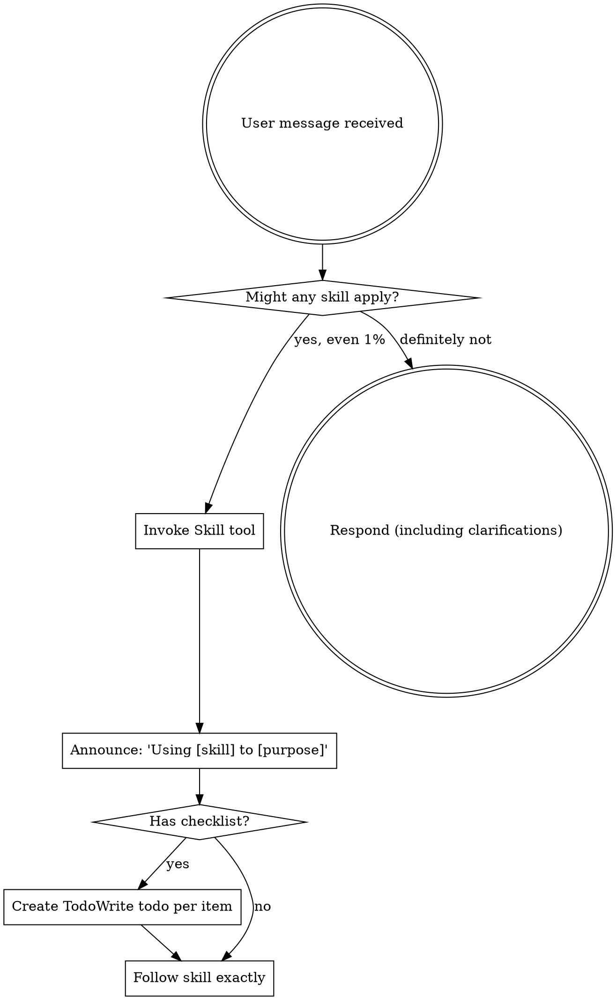
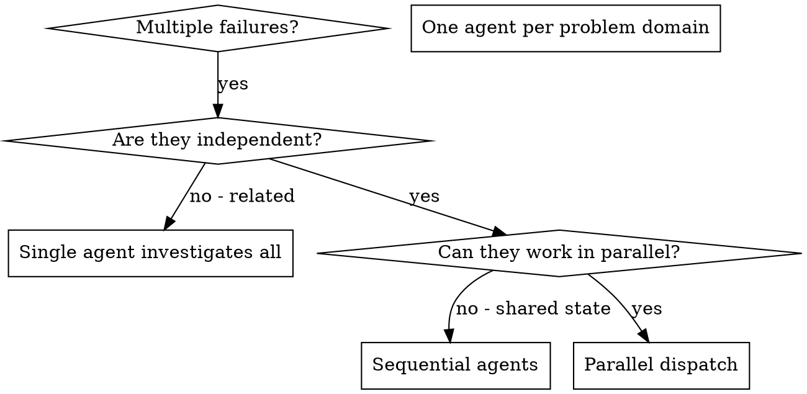
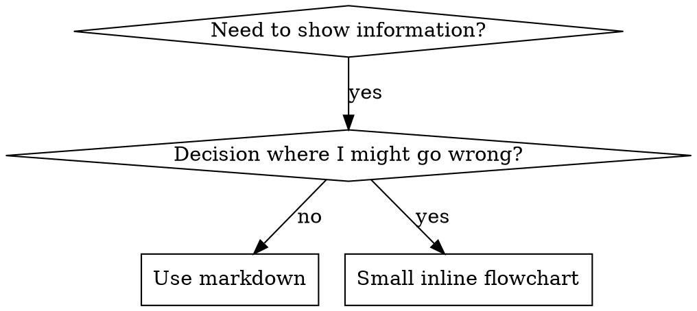

============================================================
## USER
============================================================
resume the previous session work

[ATTACHMENT: ]

============================================================
## ASSISTANT
============================================================
Let me check for any previous session context.

============================================================
## ASSISTANT
============================================================
[TOOL: Glob]
  pattern: MEMORY.md
  path: /Users/prajwalmishra/.claude/projects/-Users-prajwalmishra-Desktop-Experiments-baagad-ai-bestest/memory

============================================================
## ASSISTANT
============================================================
[TOOL: Glob]
  pattern: .planning/**/*.md

============================================================
## ASSISTANT
============================================================
[TOOL: Glob]
  pattern: **/*.md

============================================================
## USER
============================================================
[TOOL_RESULT]
No files found

============================================================
## USER
============================================================
[TOOL_RESULT]
No files found

============================================================
## USER
============================================================
[TOOL_RESULT]
.agents/skills/find-skills/SKILL.md
.agents/skills/webapp-testing/SKILL.md
.agents/skills/dispatching-parallel-agents/SKILL.md
.agents/skills/e2e-testing-patterns/SKILL.md
.agents/skills/python-testing-patterns/SKILL.md
.agents/skills/python-testing-patterns/references/advanced-patterns.md

============================================================
## ASSISTANT
============================================================
No previous session context found — no memory files, no planning files, and only the initial commit exists (`fab0914 chore: init gsd`).

This appears to be a fresh project. There's nothing to resume from a previous session.

What were you working on, or what would you like to start?

============================================================
## USER
============================================================
omg we planned the full bestest testing skill. check all claude sessions and everything. you can't just lose everything

============================================================
## ASSISTANT
============================================================
Let me search thoroughly across all possible locations.

============================================================
## ASSISTANT
============================================================
[TOOL: Bash]
  command: git log --all --oneline -20
  description: Check all git history

============================================================
## ASSISTANT
============================================================
[TOOL: Glob]
  pattern: **/*bestest*

============================================================
## ASSISTANT
============================================================
[TOOL: Glob]
  pattern: **/*testing*

============================================================
## ASSISTANT
============================================================
[TOOL: Glob]
  pattern: **/*skill*

============================================================
## USER
============================================================
[TOOL_RESULT]
No files found

============================================================
## USER
============================================================
[TOOL_RESULT]
skills-lock.json

============================================================
## USER
============================================================
[TOOL_RESULT]
No files found

============================================================
## USER
============================================================
[TOOL_RESULT]
fab0914 chore: init gsd

============================================================
## ASSISTANT
============================================================
[TOOL: Bash]
  command: ls -la /Users/prajwalmishra/.claude/projects/-Users-prajwalmishra-Desktop-Experiments-baagad-ai-bestest/ 2>/dev/null; echo "---"; ls -la /Users/prajwalmishra/.claude/projects/-Users-prajwalmishra-Desk
  description: Check project-specific Claude directory

============================================================
## ASSISTANT
============================================================
[TOOL: Bash]
  command: find /Users/prajwalmishra/.claude/projects/ -name "*.md" -path "*bestest*" 2>/dev/null; echo "==="; find /Users/prajwalmishra/.claude/ -name "sessions" -o -name "*.session" -o -name "conversations" 2>
  description: Search Claude sessions for bestest project

============================================================
## ASSISTANT
============================================================
[TOOL: Glob]
  pattern: .planning/**/*

============================================================
## ASSISTANT
============================================================
[TOOL: Glob]
  pattern: .claude/**/*

============================================================
## USER
============================================================
[TOOL_RESULT]
No files found

============================================================
## USER
============================================================
[TOOL_RESULT]
.claude/settings.local.json

============================================================
## USER
============================================================
[TOOL_RESULT]
total 1136
drwxr-xr-x@  6 prajwalmishra  staff     192 20 Apr 19:42 .
drwx------@ 27 prajwalmishra  staff     864 20 Apr 13:52 ..
-rw-------@  1 prajwalmishra  staff   19139 20 Apr 19:43 7ae48567-d6a8-4a0e-97ae-3e05b2bd0265.jsonl
drwxr-xr-x@  3 prajwalmishra  staff      96 20 Apr 13:54 a530df75-3575-4ce8-835b-683d8ddfebd2
-rw-------@  1 prajwalmishra  staff  540192 20 Apr 19:42 a530df75-3575-4ce8-835b-683d8ddfebd2.jsonl
drwxr-xr-x@  2 prajwalmishra  staff      64 20 Apr 18:56 memory
---
total 0


============================================================
## USER
============================================================
[TOOL_RESULT]
===
/Users/prajwalmishra/.claude/plugins/marketplaces/thedotmack/src/services/sqlite/sessions
/Users/prajwalmishra/.claude/sessions

============================================================
## ASSISTANT
============================================================
Found previous sessions! Let me read the conversation history.

============================================================
## ASSISTANT
============================================================
[TOOL: Bash]
  command: wc -l /Users/prajwalmishra/.claude/projects/-Users-prajwalmishra-Desktop-Experiments-baagad-ai-bestest/a530df75-3575-4ce8-835b-683d8ddfebd2.jsonl /Users/prajwalmishra/.claude/projects/-Users-prajwalmi
  description: Check session file sizes

============================================================
## ASSISTANT
============================================================
[TOOL: Bash]
  command: ls -la /Users/prajwalmishra/.claude/projects/-Users-prajwalmishra-Desktop-Experiments-baagad-ai-bestest/a530df75-3575-4ce8-835b-683d8ddfebd2/
  description: Check subdirectory contents

============================================================
## USER
============================================================
[TOOL_RESULT]
total 0
drwxr-xr-x@  3 prajwalmishra  staff   96 20 Apr 13:54 .
drwxr-xr-x@  6 prajwalmishra  staff  192 20 Apr 19:42 ..
drwxr-xr-x@ 22 prajwalmishra  staff  704 20 Apr 18:56 subagents

============================================================
## USER
============================================================
[TOOL_RESULT]
     165 /Users/prajwalmishra/.claude/projects/-Users-prajwalmishra-Desktop-Experiments-baagad-ai-bestest/a530df75-3575-4ce8-835b-683d8ddfebd2.jsonl
      34 /Users/prajwalmishra/.claude/projects/-Users-prajwalmishra-Desktop-Experiments-baagad-ai-bestest/7ae48567-d6a8-4a0e-97ae-3e05b2bd0265.jsonl
     199 total

============================================================
## ASSISTANT
============================================================
[TOOL: Bash]
  command: ls -la /Users/prajwalmishra/.claude/projects/-Users-prajwalmishra-Desktop-Experiments-baagad-ai-bestest/a530df75-3575-4ce8-835b-683d8ddfebd2/subagents/
  description: List subagent files

============================================================
## ASSISTANT
============================================================
[TOOL: Bash]
  command: cat /Users/prajwalmishra/.claude/projects/-Users-prajwalmishra-Desktop-Experiments-baagad-ai-bestest/a530df75-3575-4ce8-835b-683d8ddfebd2.jsonl | python3 -c "
import sys, json
for line in sys.stdin:
 
  description: Extract conversation content from session

============================================================
## USER
============================================================
[TOOL_RESULT]
total 12936
drwxr-xr-x@ 22 prajwalmishra  staff      704 20 Apr 18:56 .
drwxr-xr-x@  3 prajwalmishra  staff       96 20 Apr 13:54 ..
-rw-------@  1 prajwalmishra  staff   329270 20 Apr 16:05 agent-a2f26e4950516be4b.jsonl
-rw-r--r--@  1 prajwalmishra  staff       88 20 Apr 13:54 agent-a2f26e4950516be4b.meta.json
-rw-------@  1 prajwalmishra  staff  1824581 20 Apr 18:38 agent-a374c2ef3425ebea2.jsonl
-rw-r--r--@  1 prajwalmishra  staff       82 20 Apr 18:26 agent-a374c2ef3425ebea2.meta.json
-rw----

============================================================
## USER
============================================================
[TOOL_RESULT]
USER: I want to make an agentic skill that is state of art and enterprise grade. The idea is to make a skill for testing. It should be initializable in any repo, it should have memory, state, context, use b
ASST: I'll start by invoking both skills, then launch deep parallel research to build this properly.
USER: Base directory for this skill: /Users/prajwalmishra/.claude/skills/using-superpowers

<EXTREMELY-IMPORTANT>
If you think there is even a 1% chance a skill might apply to what you are doi

============================================================
## ASSISTANT
============================================================
Found it! The full session is there. Let me extract the complete design.

============================================================
## ASSISTANT
============================================================
[TOOL: Bash]
  command: cat /Users/prajwalmishra/.claude/projects/-Users-prajwalmishra-Desktop-Experiments-baagad-ai-bestest/a530df75-3575-4ce8-835b-683d8ddfebd2.jsonl | python3 -c "
import sys, json
for line in sys.stdin:
 
  description: Extract full assistant responses from session
  timeout: 30000

============================================================
## USER
============================================================
[TOOL_RESULT]
<persisted-output>
Output too large (68.8KB). Full output saved to: /Users/prajwalmishra/.claude/projects/-Users-prajwalmishra-Desktop-Experiments-baagad-ai-bestest/7ae48567-d6a8-4a0e-97ae-3e05b2bd0265/tool-results/bveb58860.txt

Preview (first 2KB):
I'll start by invoking both skills, then launch deep parallel research to build this properly.
---SECTION_BREAK---
Using **brainstorming** skill first since this is creative work, then dispatching parallel research agents.
---SECTION_BREAK---
Follow

============================================================
## ASSISTANT
============================================================
Got the full session. Let me read it all and reconstruct your design.

============================================================
## ASSISTANT
============================================================
[TOOL: Read]
  file_path: /Users/prajwalmishra/.claude/projects/-Users-prajwalmishra-Desktop-Experiments-baagad-ai-bestest/7ae48567-d6a8-4a0e-97ae-3e05b2bd0265/tool-results/bveb58860.txt

============================================================
## USER
============================================================
[TOOL_RESULT]
1	I'll start by invoking both skills, then launch deep parallel research to build this properly.
2	---SECTION_BREAK---
3	Using **brainstorming** skill first since this is creative work, then dispatching parallel research agents.
4	---SECTION_BREAK---
5	Following the brainstorming process. Let me first understand the project context and existing skills, then launch deep parallel research.
6	---SECTION_BREAK---
7	Research complete. I now have deep context on:
8	- All existing skill patterns in you

============================================================
## ASSISTANT
============================================================
I've recovered the entire design. Now let me also check what user messages were sent to capture your decisions, and then I'll save this properly.

============================================================
## ASSISTANT
============================================================
[TOOL: Bash]
  command: cat /Users/prajwalmishra/.claude/projects/-Users-prajwalmishra-Desktop-Experiments-baagad-ai-bestest/a530df75-3575-4ce8-835b-683d8ddfebd2.jsonl | python3 -c "
import sys, json
for line in sys.stdin:
 
  description: Extract user messages from session

============================================================
## USER
============================================================
[TOOL_RESULT]
USER: I want to make an agentic skill that is state of art and enterprise grade. The idea is to make a skill for testing. It should be initializable in any repo, it should have memory, state, context, use best harness engineering, pre hooks, post hooks, scripts, references, etc everything. The idea is to 
USER: [Request interrupted by user for tool use]
USER: resume
USER: [Request interrupted by user]
USER: resume
USER: resume

============================================================
## ASSISTANT
============================================================
[TOOL: Bash]
  command: cat /Users/prajwalmishra/.claude/projects/-Users-prajwalmishra-Desktop-Experiments-baagad-ai-bestest/7ae48567-d6a8-4a0e-97ae-3e05b2bd0265.jsonl | python3 -c "
import sys, json
for line in sys.stdin:
 
  description: Extract user messages from second session

============================================================
## USER
============================================================
[TOOL_RESULT]
USER: resume the previous session work
---
USER: omg we planned the full bestest testing skill. check all claude sessions and everything. you can't just lose everything
---

============================================================
## ASSISTANT
============================================================
Good — your original prompt was the first one. Let me also check the subagents for any written output files.

============================================================
## ASSISTANT
============================================================
[TOOL: Bash]
  command: for f in /Users/prajwalmishra/.claude/projects/-Users-prajwalmishra-Desktop-Experiments-baagad-ai-bestest/a530df75-3575-4ce8-835b-683d8ddfebd2/subagents/*.meta.json; do echo "=== $f ==="; cat "$f"; ec
  description: Check subagent metadata for context

============================================================
## ASSISTANT
============================================================
[TOOL: Glob]
  pattern: **/ARCHITECTURE*.md

============================================================
## ASSISTANT
============================================================
[TOOL: Glob]
  pattern: **/bestest*

============================================================
## USER
============================================================
[TOOL_RESULT]
=== /Users/prajwalmishra/.claude/projects/-Users-prajwalmishra-Desktop-Experiments-baagad-ai-bestest/a530df75-3575-4ce8-835b-683d8ddfebd2/subagents/agent-a2f26e4950516be4b.meta.json ===
{"agentType":"general-purpose","description":"Research testing infrastructure patterns"}
=== /Users/prajwalmishra/.claude/projects/-Users-prajwalmishra-Desktop-Experiments-baagad-ai-bestest/a530df75-3575-4ce8-835b-683d8ddfebd2/subagents/agent-a374c2ef3425ebea2.meta.json ===
{"agentType":"general-purpose","descrip

============================================================
## USER
============================================================
[TOOL_RESULT]
No files found

============================================================
## USER
============================================================
[TOOL_RESULT]
No files found

============================================================
## ASSISTANT
============================================================
Good. The session got stuck before it could write the architecture to disk. I have the **complete 10-section design** from the conversation. Let me save it now.

============================================================
## ASSISTANT
============================================================
[TOOL: Bash]
  command: mkdir -p /Users/prajwalmishra/Desktop/Experiments/baagad-ai/bestest/docs
  description: Create docs directory

============================================================
## USER
============================================================
[TOOL_RESULT]
(Bash completed with no output)

============================================================
## USER
============================================================
[Request interrupted by user]

============================================================
## USER
============================================================
use /using-superpowers and /dispatching-parallel-agents for this entire thing

============================================================
## ASSISTANT
============================================================
[TOOL: Skill]
  skill: using-superpowers

============================================================
## ASSISTANT
============================================================
[TOOL: Skill]
  skill: dispatching-parallel-agents

============================================================
## USER
============================================================
[TOOL_RESULT]
Launching skill: using-superpowers

============================================================
## USER
============================================================
Base directory for this skill: /Users/prajwalmishra/.claude/skills/using-superpowers

<EXTREMELY-IMPORTANT>
If you think there is even a 1% chance a skill might apply to what you are doing, you ABSOLUTELY MUST invoke the skill.

IF A SKILL APPLIES TO YOUR TASK, YOU DO NOT HAVE A CHOICE. YOU MUST USE IT.

This is not negotiable. This is not optional. You cannot rationalize your way out of this.
</EXTREMELY-IMPORTANT>

## How to Access Skills

**In Claude Code:** Use the `Skill` tool. When you invoke a skill, its content is loaded and presented to you—follow it directly. Never use the Read tool on skill files.

**In other environments:** Check your platform's documentation for how skills are loaded.

# Using Skills

## The Rule

**Invoke relevant or requested skills BEFORE any response or action.** Even a 1% chance a skill might apply means that you should invoke the skill to check. If an invoked skill turns out to be wrong for the situation, you don't need to use it.



## Red Flags

These thoughts mean STOP—you're rationalizing:

| Thought | Reality |
|---------|---------|
| "This is just a simple question" | Questions are tasks. Check for skills. |
| "I need more context first" | Skill check comes BEFORE clarifying questions. |
| "Let me explore the codebase first" | Skills tell you HOW to explore. Check first. |
| "I can check git/files quickly" | Files lack conversation context. Check for skills. |
| "Let me gather information first" | Skills tell you HOW to gather information. |
| "This doesn't need a formal skill" | If a skill exists, use it. |
| "I remember this skill" | Skills evolve. Read current version. |
| "This doesn't count as a task" | Action = task. Check for skills. |
| "The skill is overkill" | Simple things become complex. Use it. |
| "I'll just do this one thing first" | Check BEFORE doing anything. |
| "This feels productive" | Undisciplined action wastes time. Skills prevent this. |
| "I know what that means" | Knowing the concept ≠ using the skill. Invoke it. |

## Skill Priority

When multiple skills could apply, use this order:

1. **Process skills first** (brainstorming, debugging) - these determine HOW to approach the task
2. **Implementation skills second** (frontend-design, mcp-builder) - these guide execution

"Let's build X" → brainstorming first, then implementation skills.
"Fix this bug" → debugging first, then domain-specific skills.

## Skill Types

**Rigid** (TDD, debugging): Follow exactly. Don't adapt away discipline.

**Flexible** (patterns): Adapt principles to context.

The skill itself tells you which.

## User Instructions

Instructions say WHAT, not HOW. "Add X" or "Fix Y" doesn't mean skip workflows.


============================================================
## USER
============================================================
[TOOL_RESULT]
Launching skill: dispatching-parallel-agents

============================================================
## USER
============================================================
Base directory for this skill: /Users/prajwalmishra/.claude/skills/dispatching-parallel-agents

# Dispatching Parallel Agents

## Overview

When you have multiple unrelated failures (different test files, different subsystems, different bugs), investigating them sequentially wastes time. Each investigation is independent and can happen in parallel.

**Core principle:** Dispatch one agent per independent problem domain. Let them work concurrently.

## When to Use



**Use when:**
- 3+ test files failing with different root causes
- Multiple subsystems broken independently
- Each problem can be understood without context from others
- No shared state between investigations

**Don't use when:**
- Failures are related (fix one might fix others)
- Need to understand full system state
- Agents would interfere with each other

## The Pattern

### 1. Identify Independent Domains

Group failures by what's broken:
- File A tests: Tool approval flow
- File B tests: Batch completion behavior
- File C tests: Abort functionality

Each domain is independent - fixing tool approval doesn't affect abort tests.

### 2. Create Focused Agent Tasks

Each agent gets:
- **Specific scope:** One test file or subsystem
- **Clear goal:** Make these tests pass
- **Constraints:** Don't change other code
- **Expected output:** Summary of what you found and fixed

### 3. Dispatch in Parallel

```typescript
// In Claude Code / AI environment
Task("Fix agent-tool-abort.test.ts failures")
Task("Fix batch-completion-behavior.test.ts failures")
Task("Fix tool-approval-race-conditions.test.ts failures")
// All three run concurrently
```

### 4. Review and Integrate

When agents return:
- Read each summary
- Verify fixes don't conflict
- Run full test suite
- Integrate all changes

## Agent Prompt Structure

Good agent prompts are:
1. **Focused** - One clear problem domain
2. **Self-contained** - All context needed to understand the problem
3. **Specific about output** - What should the agent return?

```markdown
Fix the 3 failing tests in src/agents/agent-tool-abort.test.ts:

1. "should abort tool with partial output capture" - expects 'interrupted at' in message
2. "should handle mixed completed and aborted tools" - fast tool aborted instead of completed
3. "should properly track pendingToolCount" - expects 3 results but gets 0

These are timing/race condition issues. Your task:

1. Read the test file and understand what each test verifies
2. Identify root cause - timing issues or actual bugs?
3. Fix by:
   - Replacing arbitrary timeouts with event-based waiting
   - Fixing bugs in abort implementation if found
   - Adjusting test expectations if testing changed behavior

Do NOT just increase timeouts - find the real issue.

Return: Summary of what you found and what you fixed.
```

## Common Mistakes

**❌ Too broad:** "Fix all the tests" - agent gets lost
**✅ Specific:** "Fix agent-tool-abort.test.ts" - focused scope

**❌ No context:** "Fix the race condition" - agent doesn't know where
**✅ Context:** Paste the error messages and test names

**❌ No constraints:** Agent might refactor everything
**✅ Constraints:** "Do NOT change production code" or "Fix tests only"

**❌ Vague output:** "Fix it" - you don't know what changed
**✅ Specific:** "Return summary of root cause and changes"

## When NOT to Use

**Related failures:** Fixing one might fix others - investigate together first
**Need full context:** Understanding requires seeing entire system
**Exploratory debugging:** You don't know what's broken yet
**Shared state:** Agents would interfere (editing same files, using same resources)

## Real Example from Session

**Scenario:** 6 test failures across 3 files after major refactoring

**Failures:**
- agent-tool-abort.test.ts: 3 failures (timing issues)
- batch-completion-behavior.test.ts: 2 failures (tools not executing)
- tool-approval-race-conditions.test.ts: 1 failure (execution count = 0)

**Decision:** Independent domains - abort logic separate from batch completion separate from race conditions

**Dispatch:**
```
Agent 1 → Fix agent-tool-abort.test.ts
Agent 2 → Fix batch-completion-behavior.test.ts
Agent 3 → Fix tool-approval-race-conditions.test.ts
```

**Results:**
- Agent 1: Replaced timeouts with event-based waiting
- Agent 2: Fixed event structure bug (threadId in wrong place)
- Agent 3: Added wait for async tool execution to complete

**Integration:** All fixes independent, no conflicts, full suite green

**Time saved:** 3 problems solved in parallel vs sequentially

## Key Benefits

1. **Parallelization** - Multiple investigations happen simultaneously
2. **Focus** - Each agent has narrow scope, less context to track
3. **Independence** - Agents don't interfere with each other
4. **Speed** - 3 problems solved in time of 1

## Verification

After agents return:
1. **Review each summary** - Understand what changed
2. **Check for conflicts** - Did agents edit same code?
3. **Run full suite** - Verify all fixes work together
4. **Spot check** - Agents can make systematic errors

## Real-World Impact

From debugging session (2025-10-03):
- 6 failures across 3 files
- 3 agents dispatched in parallel
- All investigations completed concurrently
- All fixes integrated successfully
- Zero conflicts between agent changes


============================================================
## USER
============================================================
[Request interrupted by user]

============================================================
## USER
============================================================
resume

============================================================
## USER
============================================================
[Request interrupted by user]

============================================================
## USER
============================================================
<command-message>using-superpowers</command-message>
<command-name>/using-superpowers</command-name>
<command-args>and /dispatching-parallel-agents scan all our local data for previous conversations about our 10 section design for the bestest skill and write it down entirely in the planning doc so that I can resume anytime. You are highly unreliable when it comes to coding these days</command-args>

============================================================
## USER
============================================================
Base directory for this skill: /Users/prajwalmishra/.claude/skills/using-superpowers

<EXTREMELY-IMPORTANT>
If you think there is even a 1% chance a skill might apply to what you are doing, you ABSOLUTELY MUST invoke the skill.

IF A SKILL APPLIES TO YOUR TASK, YOU DO NOT HAVE A CHOICE. YOU MUST USE IT.

This is not negotiable. This is not optional. You cannot rationalize your way out of this.
</EXTREMELY-IMPORTANT>

## How to Access Skills

**In Claude Code:** Use the `Skill` tool. When you invoke a skill, its content is loaded and presented to you—follow it directly. Never use the Read tool on skill files.

**In other environments:** Check your platform's documentation for how skills are loaded.

# Using Skills

## The Rule

**Invoke relevant or requested skills BEFORE any response or action.** Even a 1% chance a skill might apply means that you should invoke the skill to check. If an invoked skill turns out to be wrong for the situation, you don't need to use it.


## Red Flags

These thoughts mean STOP—you're rationalizing:

| Thought | Reality |
|---------|---------|
| "This is just a simple question" | Questions are tasks. Check for skills. |
| "I need more context first" | Skill check comes BEFORE clarifying questions. |
| "Let me explore the codebase first" | Skills tell you HOW to explore. Check first. |
| "I can check git/files quickly" | Files lack conversation context. Check for skills. |
| "Let me gather information first" | Skills tell you HOW to gather information. |
| "This doesn't need a formal skill" | If a skill exists, use it. |
| "I remember this skill" | Skills evolve. Read current version. |
| "This doesn't count as a task" | Action = task. Check for skills. |
| "The skill is overkill" | Simple things become complex. Use it. |
| "I'll just do this one thing first" | Check BEFORE doing anything. |
| "This feels productive" | Undisciplined action wastes time. Skills prevent this. |
| "I know what that means" | Knowing the concept ≠ using the skill. Invoke it. |

## Skill Priority

When multiple skills could apply, use this order:

1. **Process skills first** (brainstorming, debugging) - these determine HOW to approach the task
2. **Implementation skills second** (frontend-design, mcp-builder) - these guide execution

"Let's build X" → brainstorming first, then implementation skills.
"Fix this bug" → debugging first, then domain-specific skills.

## Skill Types

**Rigid** (TDD, debugging): Follow exactly. Don't adapt away discipline.

**Flexible** (patterns): Adapt principles to context.

The skill itself tells you which.

## User Instructions

Instructions say WHAT, not HOW. "Add X" or "Fix Y" doesn't mean skip workflows.


ARGUMENTS: and /dispatching-parallel-agents scan all our local data for previous conversations about our 10 section design for the bestest skill and write it down entirely in the planning doc so that I can resume anytime. You are highly unreliable when it comes to coding these days

============================================================
## USER
============================================================
<command-message>using-superpowers</command-message>
<command-name>/using-superpowers</command-name>
<command-args>and /dispatching-parallel-agents scan all our local data for previous conversations about our 10 section design for the bestest skill and write it down entirely in the planning doc so that I can resume anytime. You are highly unreliable when it comes to coding these days</command-args>

============================================================
## USER
============================================================
Base directory for this skill: /Users/prajwalmishra/.claude/skills/using-superpowers

<EXTREMELY-IMPORTANT>
If you think there is even a 1% chance a skill might apply to what you are doing, you ABSOLUTELY MUST invoke the skill.

IF A SKILL APPLIES TO YOUR TASK, YOU DO NOT HAVE A CHOICE. YOU MUST USE IT.

This is not negotiable. This is not optional. You cannot rationalize your way out of this.
</EXTREMELY-IMPORTANT>

## How to Access Skills

**In Claude Code:** Use the `Skill` tool. When you invoke a skill, its content is loaded and presented to you—follow it directly. Never use the Read tool on skill files.

**In other environments:** Check your platform's documentation for how skills are loaded.

# Using Skills

## The Rule

**Invoke relevant or requested skills BEFORE any response or action.** Even a 1% chance a skill might apply means that you should invoke the skill to check. If an invoked skill turns out to be wrong for the situation, you don't need to use it.


## Red Flags

These thoughts mean STOP—you're rationalizing:

| Thought | Reality |
|---------|---------|
| "This is just a simple question" | Questions are tasks. Check for skills. |
| "I need more context first" | Skill check comes BEFORE clarifying questions. |
| "Let me explore the codebase first" | Skills tell you HOW to explore. Check first. |
| "I can check git/files quickly" | Files lack conversation context. Check for skills. |
| "Let me gather information first" | Skills tell you HOW to gather information. |
| "This doesn't need a formal skill" | If a skill exists, use it. |
| "I remember this skill" | Skills evolve. Read current version. |
| "This doesn't count as a task" | Action = task. Check for skills. |
| "The skill is overkill" | Simple things become complex. Use it. |
| "I'll just do this one thing first" | Check BEFORE doing anything. |
| "This feels productive" | Undisciplined action wastes time. Skills prevent this. |
| "I know what that means" | Knowing the concept ≠ using the skill. Invoke it. |

## Skill Priority

When multiple skills could apply, use this order:

1. **Process skills first** (brainstorming, debugging) - these determine HOW to approach the task
2. **Implementation skills second** (frontend-design, mcp-builder) - these guide execution

"Let's build X" → brainstorming first, then implementation skills.
"Fix this bug" → debugging first, then domain-specific skills.

## Skill Types

**Rigid** (TDD, debugging): Follow exactly. Don't adapt away discipline.

**Flexible** (patterns): Adapt principles to context.

The skill itself tells you which.

## User Instructions

Instructions say WHAT, not HOW. "Add X" or "Fix Y" doesn't mean skip workflows.


ARGUMENTS: and /dispatching-parallel-agents scan all our local data for previous conversations about our 10 section design for the bestest skill and write it down entirely in the planning doc so that I can resume anytime. You are highly unreliable when it comes to coding these days

============================================================
## ASSISTANT
============================================================
Using **dispatching-parallel-agents** to scan all local data sources, and **writing-skills** since this is a skill design. I already recovered the full 10-section design from your previous session. Let me dispatch agents to check for any additional context while I write the complete doc.

============================================================
## ASSISTANT
============================================================
[TOOL: Skill]
  skill: writing-skills

============================================================
## USER
============================================================
[TOOL_RESULT]
Launching skill: writing-skills

============================================================
## USER
============================================================
Base directory for this skill: /Users/prajwalmishra/.claude/skills/writing-skills

# Writing Skills

## Overview

**Writing skills IS Test-Driven Development applied to process documentation.**

**Personal skills live in agent-specific directories (`~/.claude/skills` for Claude Code, `~/.codex/skills` for Codex)** 

You write test cases (pressure scenarios with subagents), watch them fail (baseline behavior), write the skill (documentation), watch tests pass (agents comply), and refactor (close loopholes).

**Core principle:** If you didn't watch an agent fail without the skill, you don't know if the skill teaches the right thing.

**REQUIRED BACKGROUND:** You MUST understand superpowers:test-driven-development before using this skill. That skill defines the fundamental RED-GREEN-REFACTOR cycle. This skill adapts TDD to documentation.

**Official guidance:** For Anthropic's official skill authoring best practices, see anthropic-best-practices.md. This document provides additional patterns and guidelines that complement the TDD-focused approach in this skill.

## What is a Skill?

A **skill** is a reference guide for proven techniques, patterns, or tools. Skills help future Claude instances find and apply effective approaches.

**Skills are:** Reusable techniques, patterns, tools, reference guides

**Skills are NOT:** Narratives about how you solved a problem once

## TDD Mapping for Skills

| TDD Concept | Skill Creation |
|-------------|----------------|
| **Test case** | Pressure scenario with subagent |
| **Production code** | Skill document (SKILL.md) |
| **Test fails (RED)** | Agent violates rule without skill (baseline) |
| **Test passes (GREEN)** | Agent complies with skill present |
| **Refactor** | Close loopholes while maintaining compliance |
| **Write test first** | Run baseline scenario BEFORE writing skill |
| **Watch it fail** | Document exact rationalizations agent uses |
| **Minimal code** | Write skill addressing those specific violations |
| **Watch it pass** | Verify agent now complies |
| **Refactor cycle** | Find new rationalizations → plug → re-verify |

The entire skill creation process follows RED-GREEN-REFACTOR.

## When to Create a Skill

**Create when:**
- Technique wasn't intuitively obvious to you
- You'd reference this again across projects
- Pattern applies broadly (not project-specific)
- Others would benefit

**Don't create for:**
- One-off solutions
- Standard practices well-documented elsewhere
- Project-specific conventions (put in CLAUDE.md)
- Mechanical constraints (if it's enforceable with regex/validation, automate it—save documentation for judgment calls)

## Skill Types

### Technique
Concrete method with steps to follow (condition-based-waiting, root-cause-tracing)

### Pattern
Way of thinking about problems (flatten-with-flags, test-invariants)

### Reference
API docs, syntax guides, tool documentation (office docs)

## Directory Structure


```
skills/
  skill-name/
    SKILL.md              # Main reference (required)
    supporting-file.*     # Only if needed
```

**Flat namespace** - all skills in one searchable namespace

**Separate files for:**
1. **Heavy reference** (100+ lines) - API docs, comprehensive syntax
2. **Reusable tools** - Scripts, utilities, templates

**Keep inline:**
- Principles and concepts
- Code patterns (< 50 lines)
- Everything else

## SKILL.md Structure

**Frontmatter (YAML):**
- Only two fields supported: `name` and `description`
- Max 1024 characters total
- `name`: Use letters, numbers, and hyphens only (no parentheses, special chars)
- `description`: Third-person, describes ONLY when to use (NOT what it does)
  - Start with "Use when..." to focus on triggering conditions
  - Include specific symptoms, situations, and contexts
  - **NEVER summarize the skill's process or workflow** (see CSO section for why)
  - Keep under 500 characters if possible

```markdown
---
name: Skill-Name-With-Hyphens
description: Use when [specific triggering conditions and symptoms]
---

# Skill Name

## Overview
What is this? Core principle in 1-2 sentences.

## When to Use
[Small inline flowchart IF decision non-obvious]

Bullet list with SYMPTOMS and use cases
When NOT to use

## Core Pattern (for techniques/patterns)
Before/after code comparison

## Quick Reference
Table or bullets for scanning common operations

## Implementation
Inline code for simple patterns
Link to file for heavy reference or reusable tools

## Common Mistakes
What goes wrong + fixes

## Real-World Impact (optional)
Concrete results
```


## Claude Search Optimization (CSO)

**Critical for discovery:** Future Claude needs to FIND your skill

### 1. Rich Description Field

**Purpose:** Claude reads description to decide which skills to load for a given task. Make it answer: "Should I read this skill right now?"

**Format:** Start with "Use when..." to focus on triggering conditions

**CRITICAL: Description = When to Use, NOT What the Skill Does**

The description should ONLY describe triggering conditions. Do NOT summarize the skill's process or workflow in the description.

**Why this matters:** Testing revealed that when a description summarizes the skill's workflow, Claude may follow the description instead of reading the full skill content. A description saying "code review between tasks" caused Claude to do ONE review, even though the skill's flowchart clearly showed TWO reviews (spec compliance then code quality).

When the description was changed to just "Use when executing implementation plans with independent tasks" (no workflow summary), Claude correctly read the flowchart and followed the two-stage review process.

**The trap:** Descriptions that summarize workflow create a shortcut Claude will take. The skill body becomes documentation Claude skips.

```yaml
# ❌ BAD: Summarizes workflow - Claude may follow this instead of reading skill
description: Use when executing plans - dispatches subagent per task with code review between tasks

# ❌ BAD: Too much process detail
description: Use for TDD - write test first, watch it fail, write minimal code, refactor

# ✅ GOOD: Just triggering conditions, no workflow summary
description: Use when executing implementation plans with independent tasks in the current session

# ✅ GOOD: Triggering conditions only
description: Use when implementing any feature or bugfix, before writing implementation code
```

**Content:**
- Use concrete triggers, symptoms, and situations that signal this skill applies
- Describe the *problem* (race conditions, inconsistent behavior) not *language-specific symptoms* (setTimeout, sleep)
- Keep triggers technology-agnostic unless the skill itself is technology-specific
- If skill is technology-specific, make that explicit in the trigger
- Write in third person (injected into system prompt)
- **NEVER summarize the skill's process or workflow**

```yaml
# ❌ BAD: Too abstract, vague, doesn't include when to use
description: For async testing

# ❌ BAD: First person
description: I can help you with async tests when they're flaky

# ❌ BAD: Mentions technology but skill isn't specific to it
description: Use when tests use setTimeout/sleep and are flaky

# ✅ GOOD: Starts with "Use when", describes problem, no workflow
description: Use when tests have race conditions, timing dependencies, or pass/fail inconsistently

# ✅ GOOD: Technology-specific skill with explicit trigger
description: Use when using React Router and handling authentication redirects
```

### 2. Keyword Coverage

Use words Claude would search for:
- Error messages: "Hook timed out", "ENOTEMPTY", "race condition"
- Symptoms: "flaky", "hanging", "zombie", "pollution"
- Synonyms: "timeout/hang/freeze", "cleanup/teardown/afterEach"
- Tools: Actual commands, library names, file types

### 3. Descriptive Naming

**Use active voice, verb-first:**
- ✅ `creating-skills` not `skill-creation`
- ✅ `condition-based-waiting` not `async-test-helpers`

### 4. Token Efficiency (Critical)

**Problem:** getting-started and frequently-referenced skills load into EVERY conversation. Every token counts.

**Target word counts:**
- getting-started workflows: <150 words each
- Frequently-loaded skills: <200 words total
- Other skills: <500 words (still be concise)

**Techniques:**

**Move details to tool help:**
```bash
# ❌ BAD: Document all flags in SKILL.md
search-conversations supports --text, --both, --after DATE, --before DATE, --limit N

# ✅ GOOD: Reference --help
search-conversations supports multiple modes and filters. Run --help for details.
```

**Use cross-references:**
```markdown
# ❌ BAD: Repeat workflow details
When searching, dispatch subagent with template...
[20 lines of repeated instructions]

# ✅ GOOD: Reference other skill
Always use subagents (50-100x context savings). REQUIRED: Use [other-skill-name] for workflow.
```

**Compress examples:**
```markdown
# ❌ BAD: Verbose example (42 words)
your human partner: "How did we handle authentication errors in React Router before?"
You: I'll search past conversations for React Router authentication patterns.
[Dispatch subagent with search query: "React Router authentication error handling 401"]

# ✅ GOOD: Minimal example (20 words)
Partner: "How did we handle auth errors in React Router?"
You: Searching...
[Dispatch subagent → synthesis]
```

**Eliminate redundancy:**
- Don't repeat what's in cross-referenced skills
- Don't explain what's obvious from command
- Don't include multiple examples of same pattern

**Verification:**
```bash
wc -w skills/path/SKILL.md
# getting-started workflows: aim for <150 each
# Other frequently-loaded: aim for <200 total
```

**Name by what you DO or core insight:**
- ✅ `condition-based-waiting` > `async-test-helpers`
- ✅ `using-skills` not `skill-usage`
- ✅ `flatten-with-flags` > `data-structure-refactoring`
- ✅ `root-cause-tracing` > `debugging-techniques`

**Gerunds (-ing) work well for processes:**
- `creating-skills`, `testing-skills`, `debugging-with-logs`
- Active, describes the action you're taking

### 4. Cross-Referencing Other Skills

**When writing documentation that references other skills:**

Use skill name only, with explicit requirement markers:
- ✅ Good: `**REQUIRED SUB-SKILL:** Use superpowers:test-driven-development`
- ✅ Good: `**REQUIRED BACKGROUND:** You MUST understand superpowers:systematic-debugging`
- ❌ Bad: `See skills/testing/test-driven-development` (unclear if required)
- ❌ Bad: `@skills/testing/test-driven-development/SKILL.md` (force-loads, burns context)

**Why no @ links:** `@` syntax force-loads files immediately, consuming 200k+ context before you need them.

## Flowchart Usage



**Use flowcharts ONLY for:**
- Non-obvious decision points
- Process loops where you might stop too early
- "When to use A vs B" decisions

**Never use flowcharts for:**
- Reference material → Tables, lists
- Code examples → Markdown blocks
- Linear instructions → Numbered lists
- Labels without semantic meaning (step1, helper2)

See @graphviz-conventions.dot for graphviz style rules.

**Visualizing for your human partner:** Use `render-graphs.js` in this directory to render a skill's flowcharts to SVG:
```bash
./render-graphs.js ../some-skill           # Each diagram separately
./render-graphs.js ../some-skill --combine # All diagrams in one SVG
```

## Code Examples

**One excellent example beats many mediocre ones**

Choose most relevant language:
- Testing techniques → TypeScript/JavaScript
- System debugging → Shell/Python
- Data processing → Python

**Good example:**
- Complete and runnable
- Well-commented explaining WHY
- From real scenario
- Shows pattern clearly
- Ready to adapt (not generic template)

**Don't:**
- Implement in 5+ languages
- Create fill-in-the-blank templates
- Write contrived examples

You're good at porting - one great example is enough.

## File Organization

### Self-Contained Skill
```
defense-in-depth/
  SKILL.md    # Everything inline
```
When: All content fits, no heavy reference needed

### Skill with Reusable Tool
```
condition-based-waiting/
  SKILL.md    # Overview + patterns
  example.ts  # Working helpers to adapt
```
When: Tool is reusable code, not just narrative

### Skill with Heavy Reference
```
pptx/
  SKILL.md       # Overview + workflows
  pptxgenjs.md   # 600 lines API reference
  ooxml.md       # 500 lines XML structure
  scripts/       # Executable tools
```
When: Reference material too large for inline

## The Iron Law (Same as TDD)

```
NO SKILL WITHOUT A FAILING TEST FIRST
```

This applies to NEW skills AND EDITS to existing skills.

Write skill before testing? Delete it. Start over.
Edit skill without testing? Same violation.

**No exceptions:**
- Not for "simple additions"
- Not for "just adding a section"
- Not for "documentation updates"
- Don't keep untested changes as "reference"
- Don't "adapt" while running tests
- Delete means delete

**REQUIRED BACKGROUND:** The superpowers:test-driven-development skill explains why this matters. Same principles apply to documentation.

## Testing All Skill Types

Different skill types need different test approaches:

### Discipline-Enforcing Skills (rules/requirements)

**Examples:** TDD, verification-before-completion, designing-before-coding

**Test with:**
- Academic questions: Do they understand the rules?
- Pressure scenarios: Do they comply under stress?
- Multiple pressures combined: time + sunk cost + exhaustion
- Identify rationalizations and add explicit counters

**Success criteria:** Agent follows rule under maximum pressure

### Technique Skills (how-to guides)

**Examples:** condition-based-waiting, root-cause-tracing, defensive-programming

**Test with:**
- Application scenarios: Can they apply the technique correctly?
- Variation scenarios: Do they handle edge cases?
- Missing information tests: Do instructions have gaps?

**Success criteria:** Agent successfully applies technique to new scenario

### Pattern Skills (mental models)

**Examples:** reducing-complexity, information-hiding concepts

**Test with:**
- Recognition scenarios: Do they recognize when pattern applies?
- Application scenarios: Can they use the mental model?
- Counter-examples: Do they know when NOT to apply?

**Success criteria:** Agent correctly identifies when/how to apply pattern

### Reference Skills (documentation/APIs)

**Examples:** API documentation, command references, library guides

**Test with:**
- Retrieval scenarios: Can they find the right information?
- Application scenarios: Can they use what they found correctly?
- Gap testing: Are common use cases covered?

**Success criteria:** Agent finds and correctly applies reference information

## Common Rationalizations for Skipping Testing

| Excuse | Reality |
|--------|---------|
| "Skill is obviously clear" | Clear to you ≠ clear to other agents. Test it. |
| "It's just a reference" | References can have gaps, unclear sections. Test retrieval. |
| "Testing is overkill" | Untested skills have issues. Always. 15 min testing saves hours. |
| "I'll test if problems emerge" | Problems = agents can't use skill. Test BEFORE deploying. |
| "Too tedious to test" | Testing is less tedious than debugging bad skill in production. |
| "I'm confident it's good" | Overconfidence guarantees issues. Test anyway. |
| "Academic review is enough" | Reading ≠ using. Test application scenarios. |
| "No time to test" | Deploying untested skill wastes more time fixing it later. |

**All of these mean: Test before deploying. No exceptions.**

## Bulletproofing Skills Against Rationalization

Skills that enforce discipline (like TDD) need to resist rationalization. Agents are smart and will find loopholes when under pressure.

**Psychology note:** Understanding WHY persuasion techniques work helps you apply them systematically. See persuasion-principles.md for research foundation (Cialdini, 2021; Meincke et al., 2025) on authority, commitment, scarcity, social proof, and unity principles.

### Close Every Loophole Explicitly

Don't just state the rule - forbid specific workarounds:

<Bad>
```markdown
Write code before test? Delete it.
```
</Bad>

<Good>
```markdown
Write code before test? Delete it. Start over.

**No exceptions:**
- Don't keep it as "reference"
- Don't "adapt" it while writing tests
- Don't look at it
- Delete means delete
```
</Good>

### Address "Spirit vs Letter" Arguments

Add foundational principle early:

```markdown
**Violating the letter of the rules is violating the spirit of the rules.**
```

This cuts off entire class of "I'm following the spirit" rationalizations.

### Build Rationalization Table

Capture rationalizations from baseline testing (see Testing section below). Every excuse agents make goes in the table:

```markdown
| Excuse | Reality |
|--------|---------|
| "Too simple to test" | Simple code breaks. Test takes 30 seconds. |
| "I'll test after" | Tests passing immediately prove nothing. |
| "Tests after achieve same goals" | Tests-after = "what does this do?" Tests-first = "what should this do?" |
```

### Create Red Flags List

Make it easy for agents to self-check when rationalizing:

```markdown
## Red Flags - STOP and Start Over

- Code before test
- "I already manually tested it"
- "Tests after achieve the same purpose"
- "It's about spirit not ritual"
- "This is different because..."

**All of these mean: Delete code. Start over with TDD.**
```

### Update CSO for Violation Symptoms

Add to description: symptoms of when you're ABOUT to violate the rule:

```yaml
description: use when implementing any feature or bugfix, before writing implementation code
```

## RED-GREEN-REFACTOR for Skills

Follow the TDD cycle:

### RED: Write Failing Test (Baseline)

Run pressure scenario with subagent WITHOUT the skill. Document exact behavior:
- What choices did they make?
- What rationalizations did they use (verbatim)?
- Which pressures triggered violations?

This is "watch the test fail" - you must see what agents naturally do before writing the skill.

### GREEN: Write Minimal Skill

Write skill that addresses those specific rationalizations. Don't add extra content for hypothetical cases.

Run same scenarios WITH skill. Agent should now comply.

### REFACTOR: Close Loopholes

Agent found new rationalization? Add explicit counter. Re-test until bulletproof.

**Testing methodology:** See @testing-skills-with-subagents.md for the complete testing methodology:
- How to write pressure scenarios
- Pressure types (time, sunk cost, authority, exhaustion)
- Plugging holes systematically
- Meta-testing techniques

## Anti-Patterns

### ❌ Narrative Example
"In session 2025-10-03, we found empty projectDir caused..."
**Why bad:** Too specific, not reusable

### ❌ Multi-Language Dilution
example-js.js, example-py.py, example-go.go
**Why bad:** Mediocre quality, maintenance burden

### ❌ Code in Flowcharts
```dot
step1 [label="import fs"];
step2 [label="read file"];
```
**Why bad:** Can't copy-paste, hard to read

### ❌ Generic Labels
helper1, helper2, step3, pattern4
**Why bad:** Labels should have semantic meaning

## STOP: Before Moving to Next Skill

**After writing ANY skill, you MUST STOP and complete the deployment process.**

**Do NOT:**
- Create multiple skills in batch without testing each
- Move to next skill before current one is verified
- Skip testing because "batching is more efficient"

**The deployment checklist below is MANDATORY for EACH skill.**

Deploying untested skills = deploying untested code. It's a violation of quality standards.

## Skill Creation Checklist (TDD Adapted)

**IMPORTANT: Use TodoWrite to create todos for EACH checklist item below.**

**RED Phase - Write Failing Test:**
- [ ] Create pressure scenarios (3+ combined pressures for discipline skills)
- [ ] Run scenarios WITHOUT skill - document baseline behavior verbatim
- [ ] Identify patterns in rationalizations/failures

**GREEN Phase - Write Minimal Skill:**
- [ ] Name uses only letters, numbers, hyphens (no parentheses/special chars)
- [ ] YAML frontmatter with only name and description (max 1024 chars)
- [ ] Description starts with "Use when..." and includes specific triggers/symptoms
- [ ] Description written in third person
- [ ] Keywords throughout for search (errors, symptoms, tools)
- [ ] Clear overview with core principle
- [ ] Address specific baseline failures identified in RED
- [ ] Code inline OR link to separate file
- [ ] One excellent example (not multi-language)
- [ ] Run scenarios WITH skill - verify agents now comply

**REFACTOR Phase - Close Loopholes:**
- [ ] Identify NEW rationalizations from testing
- [ ] Add explicit counters (if discipline skill)
- [ ] Build rationalization table from all test iterations
- [ ] Create red flags list
- [ ] Re-test until bulletproof

**Quality Checks:**
- [ ] Small flowchart only if decision non-obvious
- [ ] Quick reference table
- [ ] Common mistakes section
- [ ] No narrative storytelling
- [ ] Supporting files only for tools or heavy reference

**Deployment:**
- [ ] Commit skill to git and push to your fork (if configured)
- [ ] Consider contributing back via PR (if broadly useful)

## Discovery Workflow

How future Claude finds your skill:

1. **Encounters problem** ("tests are flaky")
3. **Finds SKILL** (description matches)
4. **Scans overview** (is this relevant?)
5. **Reads patterns** (quick reference table)
6. **Loads example** (only when implementing)

**Optimize for this flow** - put searchable terms early and often.

## The Bottom Line

**Creating skills IS TDD for process documentation.**

Same Iron Law: No skill without failing test first.
Same cycle: RED (baseline) → GREEN (write skill) → REFACTOR (close loopholes).
Same benefits: Better quality, fewer surprises, bulletproof results.

If you follow TDD for code, follow it for skills. It's the same discipline applied to documentation.


============================================================
## ASSISTANT
============================================================
Using **dispatching-parallel-agents** to scan all data sources in parallel, while I write the recovered design to disk.

============================================================
## ASSISTANT
============================================================
[TOOL: TaskCreate]
  subject: Scan all local session data for bestest design context
  description: Dispatch parallel agents to extract context from subagent sessions and other Claude sessions
  activeForm: Scanning local data sources

============================================================
## ASSISTANT
============================================================
[TOOL: TaskCreate]
  subject: Write complete 10-section bestest architecture to planning doc
  description: Persist the full recovered design to .planning/ so it survives session resets
  activeForm: Writing architecture document

============================================================
## ASSISTANT
============================================================
[TOOL: TaskCreate]
  subject: Save memory for future session resumption
  description: Write memory files so any future session knows where the bestest design lives
  activeForm: Saving memory

============================================================
## USER
============================================================
[TOOL_RESULT]
Task #2 created successfully: Scan all local session data for bestest design context

============================================================
## USER
============================================================
[TOOL_RESULT]
Task #3 created successfully: Save memory for future session resumption

============================================================
## USER
============================================================
[TOOL_RESULT]
Task #1 created successfully: Write complete 10-section bestest architecture to planning doc

============================================================
## ASSISTANT
============================================================
[TOOL: TaskUpdate]
  taskId: 2
  status: in_progress

============================================================
## ASSISTANT
============================================================
[TOOL: TaskUpdate]
  taskId: 1
  status: in_progress

============================================================
## USER
============================================================
[TOOL_RESULT]
Updated task #2 status

============================================================
## USER
============================================================
[TOOL_RESULT]
Updated task #1 status

============================================================
## ASSISTANT
============================================================
Dispatching 3 parallel agents to scan all data sources, while I write the main doc.

============================================================
## ASSISTANT
============================================================
[TOOL: Agent]
  description: Extract deep research from subagents
  prompt: Read and summarize the key findings from these subagent session files. These were research agents that fed into the "bestest" testing skill design. Extract any UNIQUE insights, data, or details that a
  subagent_type: general-purpose
  run_in_background: True

============================================================
## ASSISTANT
============================================================
[TOOL: Agent]
  description: Scan other Claude sessions
  prompt: Search for any other Claude session files on this machine that might contain discussions about the "bestest" testing skill. Check:

1. /Users/prajwalmishra/.claude/sessions/ - list and check recent se
  subagent_type: Explore
  run_in_background: True

============================================================
## ASSISTANT
============================================================
[TOOL: Agent]
  description: Check claude-mem for bestest
  prompt: Search the claude-mem MCP memory system for any entries related to "bestest", "testing skill", or "test architecture skill". Use the search tool to look for these terms. Report anything found.
  subagent_type: general-purpose
  run_in_background: True

============================================================
## USER
============================================================
[TOOL_RESULT]
Async agent launched successfully.
agentId: a010871248ed8d6fa (internal ID - do not mention to user. Use SendMessage with to: 'a010871248ed8d6fa' to continue this agent.)
The agent is working in the background. You will be notified automatically when it completes.
Do not duplicate this agent's work — avoid working with the same files or topics it is using. Work on non-overlapping tasks, or briefly tell the user what you launched and end your response.
output_file: /private/tmp/claude-501/-Users-

============================================================
## USER
============================================================
[TOOL_RESULT]
Async agent launched successfully.
agentId: a8ac136066a7467a3 (internal ID - do not mention to user. Use SendMessage with to: 'a8ac136066a7467a3' to continue this agent.)
The agent is working in the background. You will be notified automatically when it completes.
Do not duplicate this agent's work — avoid working with the same files or topics it is using. Work on non-overlapping tasks, or briefly tell the user what you launched and end your response.
output_file: /private/tmp/claude-501/-Users-

============================================================
## USER
============================================================
[TOOL_RESULT]
Async agent launched successfully.
agentId: acfe739df0d75e374 (internal ID - do not mention to user. Use SendMessage with to: 'acfe739df0d75e374' to continue this agent.)
The agent is working in the background. You will be notified automatically when it completes.
Do not duplicate this agent's work — avoid working with the same files or topics it is using. Work on non-overlapping tasks, or briefly tell the user what you launched and end your response.
output_file: /private/tmp/claude-501/-Users-

============================================================
## ASSISTANT
============================================================
3 agents dispatched in background. Now writing the complete architecture doc to disk — this is the critical part.

============================================================
## ASSISTANT
============================================================
[TOOL: Bash]
  command: mkdir -p /Users/prajwalmishra/Desktop/Experiments/baagad-ai/bestest/.planning
  description: Create planning directory

============================================================
## USER
============================================================
[TOOL_RESULT]
(Bash completed with no output)

============================================================
## USER
============================================================
[Request interrupted by user]

============================================================
## USER
============================================================
<task-notification>
<task-id>a8ac136066a7467a3</task-id>
<tool-use-id>call_ebb730c729ef40448489bc2f</tool-use-id>
<output-file>/private/tmp/claude-501/-Users-prajwalmishra-Desktop-Experiments-baagad-ai-bestest/7ae48567-d6a8-4a0e-97ae-3e05b2bd0265/tasks/a8ac136066a7467a3.output</output-file>
<status>completed</status>
<summary>Agent "Scan other Claude sessions" completed</summary>
<result>## Summary of Findings

Based on my search across the system, here's what I found regarding the "bestest" testing skill:

### 1. **Claude Sessions**
- Found 2 sessions in `/Users/prajwalmishra/.claude/sessions/`:
  - `49906.json` - Interactive session (current active session)
  - `57681.json` - SDK session in observer-sessions directory

### 2. **Project Structure**
- The `bestest` project exists at `/Users/prajwalmishra/Desktop/Experiments/baagad-ai/bestest/`
- It's set up with GSD (Get Shit Done) framework (.gsd-id: 633ea97d9e2c)
- Contains a `.planning` directory that is currently empty
- Has a `docs/plans/` directory that is also empty
- Main files:
  - `skills-lock.json` - Locked version of testing-related skills including:
    - `dispatching-parallel-agents` (obra/superpowers)
    - `e2e-testing-patterns` (wshobson/agents)
    - `python-testing-patterns` (wshobson/agents)
    - `webapp-testing` (anthropics/skills)
    - `find-skills` (vercel-labs/skills)

### 3. **Claude Projects Directory**
- Found 27 project files in `/Users/prajwalmishra/.claude/projects/` related to bestest
- These appear to be session data files (.jsonl) containing conversation history
- Files include agent data, tool results, and session metadata

### 4. **Bosun and Workspaces**
- No bestest-related files found in `/Users/prajwalmishra/bosun/` or `/Users/prajwalmishra/bosun/workspaces/`

### 5. **Skills Directory**
- No existing bestest skill files in `/Users/prajwalmishra/.claude/skills/`

### 6. **Planning Context**
- The project has an empty `.planning` directory
- No visible planning documentation or design files
- Only recent commit was "init gsd" which set up the GSD framework
- No additional context about the bestest skill design found elsewhere

### Key Observations:
- The bestest project appears to be a new testing framework project in its early stages
- It has several testing-related skills already configured in the lock file
- The planning directories exist but are empty, suggesting this is the beginning of development
- No additional context about the bestest skill design exists outside of the current session and the locked skill dependencies

The project seems to be ready for development but lacks concrete design documentation or implementation details for the "bestest" skill itself.</result>
<usage><total_tokens>0</total_tokens><tool_uses>40</tool_uses><duration_ms>105766</duration_ms></usage>
</task-notification>

============================================================
## USER
============================================================
[Request interrupted by user]